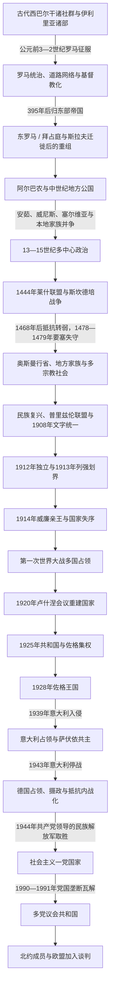

# 阿尔巴尼亚

## 范围与概括

阿尔巴尼亚位于亚得里亚海与爱奥尼亚海东岸，处在意大利半岛、希腊世界、多瑙河—巴尔干内陆和奥斯曼交通线的交汇处。其历史不能压缩为“伊利里亚人直接变成现代阿尔巴尼亚人”的单线，也不能只从奥斯曼统治或20世纪民族国家开始：古代西巴尔干人口、罗马化与基督教化、斯拉夫迁徙后的区域重组、中世纪拜占庭—拉丁—塞尔维亚竞争、本地领主网络、奥斯曼制度和跨宗教社会，都参与了阿尔巴尼亚语人群与现代国家的形成。

“阿尔巴尼亚”在不同阶段所指范围并不相同。中世纪的阿尔巴农、1272年的“阿尔巴尼亚王国”、斯坎德培联盟、奥斯曼时代的阿尔巴尼亚语分布区和1913年划界后的阿尔巴尼亚国家，疆域与政体均不重合。现代国家在1912年宣布独立，但直到1920年代才逐步形成可持续的中央机构；此后又经历佐格个人统治、意德占领、劳动党一党制和多党共和国。人口、语言、宗教与国家边界始终并非同一条线。

## 历史演进图

## 历史主线

| 顺序 | 阶段 | 时间 | 核心变化 |
|---|---|---|---|
| 1 | 古代西巴尔干 | 史前—公元前168年左右 | 伊利里亚等多种社群、希腊殖民城市和马其顿势力交错；不存在覆盖现代国土的单一“古代阿尔巴尼亚国家”。 |
| 2 | 罗马与早期拜占庭 | 公元前2世纪—约11世纪 | 罗马征服、道路和城市网络、基督教化；395年后归东部帝国，6—7世纪斯拉夫迁徙改变人口与政治环境。 |
| 3 | 中世纪地方政权 | 约11世纪—1443年 | 阿尔巴农、安茹“阿尔巴尼亚王国”、塞尔维亚帝国、威尼斯海岸据点和本地家族并立。 |
| 4 | 斯坎德培与莱什联盟 | 1443—1479年 | 本地领主在斯坎德培领导下长期抗击奥斯曼；联盟并非现代中央集权国家。 |
| 5 | 奥斯曼时期 | 15世纪末—1912年 | 行省、蒂玛尔、宗教共同体、山区习惯法与地方豪强共同作用；18—19世纪地方帕夏和中央集权化相继兴衰。 |
| 6 | 民族复兴与独立 | 1878—1913年 | 普里兹伦联盟、文字与教育运动、奥斯曼末期起义推动民族政治；1912年独立，1913年边界由列强主导决定。 |
| 7 | 亲王国、占领与重建 | 1914—1924年 | 威廉亲王迅速离境，一战多国占领；1920年卢什涅会议、发罗拉战争和国际承认重建中央国家。 |
| 8 | 佐格共和国与王国 | 1925—1939年 | 阿赫迈特·佐格集中军政权力、推行法律和行政现代化，同时压制反对派并在财政、安全上依赖意大利。 |
| 9 | 意大利与德国占领 | 1939—1944年 | 意大利吞并式共主、德国控制下的名义摄政、合作政府与多支抵抗力量竞争，战争逐步内战化。 |
| 10 | 社会主义一党国家 | 1944—1991年 | 劳动党建立党国体制，工业化、扫盲和公共服务扩张与集体化、政治迫害、宗教压制和长期孤立并存。 |
| 11 | 多党共和国 | 1991年至今 | 市场转型、移民与制度建设并行；1997年国家危机后逐步恢复，2009年加入北约，持续推进欧盟加入谈判。 |

## 古代西巴尔干与族群连续性问题

### 古代政治与社会

现代阿尔巴尼亚国土在古典时代属于古代作者所称“伊利里亚”世界的南部，但“伊利里亚人”本身是对许多部族和政治共同体的统称，不是稳定统一的民族国家。陶兰提人、帕尔蒂尼人、拉贝亚泰人等群体在沿海、河谷与山地活动；都拉斯的前身埃庇丹努斯／狄拉奇乌姆、阿波罗尼亚等希腊殖民城市则把当地接入亚得里亚海和地中海贸易。伊利里亚王权在公元前4—3世纪一度整合部分地区，阿尔迪安王国及女王泰乌塔与罗马的冲突引发伊利里亚战争。罗马在公元前229—168年的多次战争中逐步取得优势，国王根提乌斯被击败后，区域进入长期罗马统治。

罗马并未一次性抹去地方社会，而是通过军政行省、城市自治、税收、道路和征兵逐步整合。连接狄拉奇乌姆与塞萨洛尼基、继而通往君士坦丁堡方向的埃格纳提亚大道，使阿尔巴尼亚沿海成为亚得里亚海通往东地中海的重要门户。拉丁语在行政、军队和部分城市中扩散，希腊语在南部和教会文化中持续有影响；基督教从罗马帝国时期传播，后来北部更多受罗马教会影响，南部更多处于君士坦丁堡教会体系内。

### 现代阿尔巴尼亚人与古代人口的关系

阿尔巴尼亚语是印欧语系的独立分支，保留了早期拉丁语借词，也受到希腊语、南斯拉夫诸语言、土耳其语和意大利语长期影响。古代伊利里亚语留下的材料极少，主要是人名、地名和少量词汇，无法像有大量文献的古典语言那样与现代阿尔巴尼亚语进行完整比较。因此较稳妥的表述是：

- 阿尔巴尼亚语人群具有西巴尔干古代人口连续性的成分，伊利里亚联系是重要解释之一。
- 具体由哪些古巴尔干语群、何种比例和何种迁徙过程构成，语言学、考古学和人口史仍有争论。
- “Albanoi”一名见于古代地理著作，而中世纪史料从11世纪起较明确记载“Arbanitai／Albanoi”等人群；名称相似是线索，却不能单独证明两千年不变的族群和国家连续性。
- 现代民族形成还包含罗马化、基督教化、斯拉夫迁徙、山地—城市互动、奥斯曼制度以及19世纪民族政治，不能只用血缘解释。

## 罗马之后：拜占庭、迁徙与区域竞争

395年罗马帝国东西分治后，今阿尔巴尼亚大部在行政上属于东罗马帝国。西罗马崩溃并未立即终结东部帝国在亚得里亚海东岸的控制，但哥特、阿瓦尔和斯拉夫等群体的入侵与迁徙使内陆城市网络和税收体系遭受冲击。6—7世纪以后，斯拉夫语人群在巴尔干多地定居；沿海城市、山地共同体与帝国据点之间形成新的混合格局。都拉斯长期是拜占庭重要军港和军区中心，也先后遭保加利亚、诺曼和十字军势力争夺。

11世纪史料开始更清楚地记载阿尔巴尼亚语人群。1054年东西教会分裂后，今阿尔巴尼亚大致处在天主教和东正教影响交界地带，但边界并不固定。拜占庭皇权、奥赫里德总主教区、罗马教廷、沿海拉丁势力和本地贵族彼此交错，后来奥斯曼时期的宗教多样性由此具有更早的历史基础。关于帝国共同线可与[东罗马帝国与拜占庭帝国](/%E4%BA%BA%E6%96%87%E7%A7%91%E5%AD%A6/%E5%8E%86%E5%8F%B2/%E6%AC%A7%E6%B4%B2/_%E9%80%9A%E5%8F%B2/%E5%8F%A4%E7%BD%97%E9%A9%AC/%E4%B8%9C%E7%BD%97%E9%A9%AC%E5%B8%9D%E5%9B%BD%E4%B8%8E%E6%8B%9C%E5%8D%A0%E5%BA%AD%E5%B8%9D%E5%9B%BD.md)对照阅读。

## 中世纪诸公国与多方竞争

### 阿尔巴农与安茹王国

约1190年，普罗贡在克鲁亚附近建立阿尔巴农公国；其子金和迪米特尔先后统治。它是史料中第一个较明确由本地阿尔巴尼亚贵族领导的政权，但范围主要在中部内陆，不等于现代阿尔巴尼亚。第四次十字军东征后，威尼斯、伊庇鲁斯专制国、尼西亚帝国和保加利亚等势力争夺原拜占庭西部领地，阿尔巴农也在宗主关系和贵族联姻中分化。

1272年，安茹王朝的那不勒斯国王查理一世占据都拉斯，以“阿尔巴尼亚国王”名义建立阿尔巴尼亚王国。该王国主要依靠沿海据点、拉丁教会和与本地贵族的封建契约，实际疆域反复伸缩；它既不是本地民族王朝，也没有统一全部阿尔巴尼亚语地区。14世纪中叶斯特凡·杜尚的塞尔维亚帝国控制大部分内陆和南部，安茹势力仍在都拉斯等地保持名义或局部影响。杜尚死后帝国迅速分裂，本地贵族家族得以扩张。

### 主要本地家族与政权

| 家族 / 政权 | 主要区域与时期 | 作用与结局 |
|---|---|---|
| 普罗贡家族与阿尔巴农 | 克鲁亚及中部内陆，约1190—13世纪中叶 | 普罗贡、金、迪米特尔形成早期公国；后受伊庇鲁斯、尼西亚等势力挤压并分化。 |
| 托皮亚家族 | 中部与都拉斯周边，14世纪 | 卡尔·托皮亚一度夺取都拉斯并与安茹、巴尔沙和威尼斯竞争；1392年都拉斯转入威尼斯控制。 |
| 穆扎卡家族 | 培拉特、米泽凯平原及南中部，13—15世纪 | 在拜占庭、塞尔维亚和奥斯曼之间调整宗主关系，部分成员后来流亡意大利。 |
| 巴尔沙家族 | 泽塔、斯库台及北部，14世纪后半 | 势力跨越今黑山和阿尔巴尼亚北部；1385年萨夫拉战役中奥斯曼军介入本地战争，显示奥斯曼影响上升。 |
| 阿里亚尼蒂家族 | 中部山地与东部交通线，14—15世纪 | 吉尔吉·阿里亚尼蒂在1430年代多次反奥斯曼，后与卡斯特里奥蒂家族联姻并参加莱什联盟。 |
| 杜卡吉尼家族 | 莱什、北部山地和科索沃西部部分地区，14—15世纪 | 与威尼斯、奥斯曼及其他领主竞争；莱克·杜卡吉尼后来在民族记忆中与北部习惯法相联系。 |
| 卡斯特里奥蒂家族 | 马特、迪布拉、克鲁亚一带，14—15世纪 | 约翰·卡斯特里奥蒂在威尼斯、奥斯曼之间周旋；其子吉尔吉·卡斯特里奥蒂即斯坎德培。 |

### 威尼斯、塞尔维亚与奥斯曼因素

威尼斯把都拉斯、莱什、斯库台等港口视为亚得里亚海海上体系的一部分，常通过购买、条约和驻防控制城市，而非统治全部内陆。塞尔维亚帝国和其后继领主在14世纪控制或影响内陆及南部；本地贵族的身份和忠诚往往随领地、婚姻和军事压力而变化。奥斯曼军队最初常以盟军、仲裁者或宗主身份进入本地冲突，1385年萨夫拉战役后逐步建立附庸和驻军体系。部分贵族子弟被送入奥斯曼宫廷或军队，既是人质也是进入帝国精英体系的渠道。

## 斯坎德培、莱什联盟与抗奥斯曼战争

吉尔吉·卡斯特里奥蒂早年在奥斯曼体系中服役，获称“伊斯坎德尔贝伊”，即斯坎德培。1443年奥斯曼军在尼什附近作战失利之际，他脱离军队、返回克鲁亚并夺取城堡。1444年3月，多支本地领主在威尼斯控制的莱什集会，组成莱什联盟，推举斯坎德培为军事统帅。联盟成员保留各自领地、财政和继承权，因此它是战争联盟，而不是拥有统一官僚与税制的现代国家。

战争大致经历以下阶段：

1. **1444—1450年建立防线**：斯坎德培在托尔维奥尔战役等作战中利用山地、快速机动和堡垒网络击退奥斯曼军；同时一度与威尼斯开战，说明本地利益并不总与“基督教联盟”一致。
2. **1450年第一次克鲁亚大围攻**：穆拉德二世亲征未能攻陷克鲁亚，斯坎德培声望上升，但联盟内部资源紧张。
3. **1451—1463年寻求外援**：斯坎德培通过加埃塔条约承认那不勒斯王国的保护性宗主关系，换取军资；他还援助那不勒斯的费迪南一世。教皇、匈牙利和威尼斯的支持时有时无。
4. **1463—1467年大战再起**：与威尼斯合作后，穆罕默德二世多次进军；1466、1467年克鲁亚再遭围攻，奥斯曼并修建埃尔巴桑要塞以控制交通。
5. **1468—1479年联盟瓦解与要塞失守**：斯坎德培1468年病逝后，缺乏同等权威整合贵族，抵抗仍延续但日渐依赖威尼斯。克鲁亚1478年失守，斯库台在1478—1479年围城后随威尼斯—奥斯曼和约转交奥斯曼。

斯坎德培抵抗能够长期维持，源于山地地形、堡垒、熟悉本地交通的轻装部队、领主联盟和跨亚得里亚海援助；其失败则源于联盟财政和人口有限、领主利益不一、外援不稳定，以及奥斯曼可持续投入更大军队和围城资源。斯坎德培后来成为民族国家的核心象征，但15世纪的战争同时包含家族领地、宗主关系、宗教政治和亚得里亚海外交，不能完全套用19世纪民族战争概念。

## 奥斯曼统治：制度、社会与地方权力

### 统治机制

奥斯曼在15世纪末完成对主要城镇和要塞的控制，将区域划入斯库台、奥赫里德、埃尔巴桑、发罗拉、约阿尼纳等桑贾克；行政边界多次变化，也没有一个长期覆盖全部阿尔巴尼亚语人口的单一“阿尔巴尼亚省”。统治主要通过以下机制运作：

- **土地与军役**：国家把部分税收权编入蒂玛尔体系，骑兵和地方军政人员以服役换取收入；17世纪以后包税和地方豪强势力上升。
- **城市与交通**：培拉特、吉诺卡斯特、埃尔巴桑、斯库台等成为行政、手工业和贸易中心，港口与内陆商路连接意大利、希腊和巴尔干腹地。
- **宗教共同体**：东正教、天主教、逊尼派穆斯林和贝克塔什社群长期并存。皈依伊斯兰在不同地区、阶层和世纪速度不一，既与税制、城市职业和军政机会有关，也受地方安全、教会网络和家族选择影响，不能概括为一次强制改宗。
- **精英吸纳**：一些阿尔巴尼亚出身者进入军队、宫廷和行政体系，产生多位帕夏和大维齐尔；这显示帝国整合，也不意味着所有阿尔巴尼亚语人群共享同一政治立场。
- **山区自治**：北部及其他难以直接控制的山地共同体通过氏族、长老会议、武装义务和习惯法维持较强地方自治。所谓“卡努恩”是多地长期形成的习惯规范，不能简单说成由莱克·杜卡吉尼一人创制。
- **征兵与税收**：德夫希尔梅、常规征兵、税赋和战争动员在不同时期影响地方社会；19世纪坦齐马特改革试图以普遍征兵和直接征税取代旧安排，引发新的冲突。

### 地方家族与帕夏权力

| 地方权力 | 主要时期 | 崛起机制 | 衰落与结局 |
|---|---|---|---|
| 布沙蒂家族与斯库台帕夏辖区 | 约1757—1831年 | 控制北部税收、贸易和地方武装，在帝国边疆战争中取得议价能力；卡拉·马哈茂德·布沙蒂一度扩张到邻近地区。 | 家族扩张与中央集权冲突；穆斯塔法·布沙蒂在1831年被奥斯曼军击败，北部重新纳入直接行政。 |
| 阿里·帕夏与约阿尼纳帕夏辖区 | 约1788—1822年 | 以约阿尼纳为中心整合南阿尔巴尼亚、伊庇鲁斯及希腊西部部分地区，经营军队、税收和外交。 | 个人化统治威胁中央，又在希腊革命前夕失去盟友；苏丹军围攻约阿尼纳，阿里1822年被杀。 |
| 北部山地氏族与米尔迪塔首领 | 奥斯曼中后期 | 地形、武装组织、天主教网络及与奥斯曼和欧洲势力的谈判维持自治。 | 中央改革、边界划定和现代国家军政机构逐步压缩其独立性，但地方认同长期保留。 |

布沙蒂和阿里·帕夏的政权是奥斯曼地方化的产物，而不是已经完成的阿尔巴尼亚民族国家。它们可以动员阿尔巴尼亚语武装，也统治希腊语、斯拉夫语、弗拉赫语等不同人群，并常以家族利益和帝国官职为合法性来源。

### 中央集权与民族复兴

1820—1830年代奥斯曼摧毁主要半自治帕夏势力，1830年比托拉针对阿尔巴尼亚贝伊的杀戮进一步削弱旧精英。坦齐马特时期直接征税、征兵和行政重划导致1830年代、1844年和1847年等多次起义。与此同时，巴尔干邻国独立和领土扩张使“如何保护阿尔巴尼亚语人口地区”逐渐成为跨宗教政治问题。

1878年俄土战争后的圣斯特凡诺条约和柏林会议拟把部分奥斯曼领土划给黑山、塞尔维亚、保加利亚和希腊。阿尔巴尼亚代表于6月成立普里兹伦联盟。联盟早期包含维护奥斯曼完整、反对领土割让的保守力量，随后在阿卜杜勒·弗拉舍里、伊梅尔·普里兹雷尼、苏莱曼·沃克希等人的推动下提出合并阿尔巴尼亚人居住的若干维拉耶、扩大自治和发展本民族教育。联盟组织武装阻止部分割地，1881年被奥斯曼军镇压。其意义在于首次较持续地把领土、行政自治和跨宗教阿尔巴尼亚认同结合起来。

此后的民族复兴包括：

- 弗拉舍里兄弟等知识人推动阿尔巴尼亚语教育、出版和共同历史叙事。
- 1899年佩亚联盟再次尝试组织区域政治，但内部与外部压力使其短命。
- 1908年莫纳斯提尔会议在多种字母方案间作出协调，以拉丁字母为基础的书写体系逐渐成为共同标准。
- 青年土耳其革命后中央政府推进征税、缴械与征兵，引发1910、1911和1912年阿尔巴尼亚起义；1912年起义者一度控制斯科普里并迫使政府承诺改革。
- 第一次巴尔干战争爆发后，塞尔维亚、黑山、希腊等军队进入奥斯曼在欧洲的领地，独立由长期目标变成避免被邻国分割的紧迫选择。

奥斯曼共同史可与[奥斯曼帝国](/%E4%BA%BA%E6%96%87%E7%A7%91%E5%AD%A6/%E5%8E%86%E5%8F%B2/%E8%A5%BF%E4%BA%9A/%E5%9C%9F%E8%80%B3%E5%85%B6/%E5%A5%A5%E6%96%AF%E6%9B%BC%E5%B8%9D%E5%9B%BD/README.md)对照阅读。

## 1912年独立、列强划界与威廉亲王

### 独立与边界

1912年11月28日，伊斯梅尔·捷马利在发罗拉召集代表大会，宣布脱离奥斯曼帝国，并于12月组成临时政府。该政府控制范围有限，斯库台、科索沃、南部等地正处于战争或外国军队控制中。1913年伦敦列强会议承认一个独立的阿尔巴尼亚亲王国，同时由国际边界委员会划界。列强试图在奥匈支持阿尔巴尼亚出海与俄国支持塞尔维亚、黑山之间折中；结果是科索沃大部划入塞尔维亚，部分北部地区归黑山，南部边界与希腊争议尖锐，许多阿尔巴尼亚语人口留在新国家之外。

边界既保证了一个阿尔巴尼亚国家存在，也造成财政、交通和人口网络被切断。南部希腊军撤离后，当地希腊语及亲希腊精英发动“北伊庇鲁斯”运动；北部和中部也存在地方首领、农民武装及亲奥斯曼力量。国际监察委员会制定组织法并监管财政、宪兵和行政，显示新国家主权从一开始就受列强安排约束。

### 威廉亲王与1914年崩解

列强选择德国维德家族的威廉为阿尔巴尼亚亲王。他于1914年3月7日抵达都拉斯，任命图尔汉·帕夏组阁。亲王没有本地军政基础，财政依赖外援；埃萨德·帕夏·托普塔尼、南部自治派、地方贵族和中部农民起义彼此竞争。哈吉·卡米利等人领导的中部起义既反对新税和地方失序，也带有亲奥斯曼、伊斯兰和反西方色彩，不能简单当作统一的“民族反叛”。

第一次世界大战爆发后，国际宪兵和财政支持瓦解。威廉于1914年9月3日离境，未正式宣布退位；1920年卢什涅体制名义上仍以摄政代行缺席君主权力，直到1925年共和国成立才在法理上终结亲王制。1914年的失败原因包括中央机构和财政几乎从零开始、地方武装与社会裂痕、边界争议、列强相互牵制，以及世界大战直接切断保护体系。

## 第一次世界大战占领与1920年国家重建

威廉离境后，埃萨德·帕夏在都拉斯建立政府，但其控制有限。1915—1918年，塞尔维亚和黑山军队、奥匈帝国、意大利、法国及希腊先后占领不同地区：奥匈主要控制北部和中部，意大利控制发罗拉及南部，法国在科尔察建立受其军事保护的地方行政。各占领者修建道路、征用资源、招募部队，也扶植不同地方集团；阿尔巴尼亚在国际文件中仍存在，实际却被分区治理。

1918年底都拉斯会议产生图尔汉·帕夏政府，倾向依赖意大利。巴黎和会期间，意大利、希腊与南斯拉夫的领土安排再次威胁1913年边界。1920年1月21—31日，来自多地的代表在卢什涅开会，拒绝外部保护和分割方案，建立四人最高委员会代行国家元首权力，另设参议性质的国民委员会和苏莱曼·德尔维纳政府。政府迁往地拉那，地拉那由此成为首都。

1920年夏，阿尔巴尼亚武装在发罗拉战争中迫使意大利撤出大陆据点；意大利保留萨赞岛，但承认阿尔巴尼亚主权。阿尔巴尼亚同年12月加入国际联盟。1921年国际会议大体重申1913年边界，国际联盟介入米尔迪塔分离和南斯拉夫军队越界等危机。卢什涅会议的重要性不只是一次“再独立”，而是把代表会议、摄政、政府和首都结合成持续国家机器。

## 1912—1939年的法定元首、亲王与摄政

### 国家元首序列

| 顺序 | 人物 / 机构 | 身份 | 任期 | 前后关系与说明 |
|---|---|---|---|---|
| 1 | 伊斯梅尔·捷马利 | 临时政府主席、实际国家代表 | 1912-11-28—1914-01-22 | 发罗拉独立会议推举；因国际监察安排和内部压力辞职。 |
| 2 | 费伊齐·阿利佐蒂与国际监察下的中央行政 | 临时中央行政主席 | 1914-01-22—1914-03-07 | 在亲王抵达前维持有限行政，实际受国际监察委员会约束。 |
| 3 | 威廉一世·维德 | 阿尔巴尼亚亲王 | 1914-03-07—1914-09-03实际在国；法理争议延续至1925年 | 由列强选择；内乱和一战使其离境，未正式退位。 |
| 4 | 埃萨德·帕夏·托普塔尼 | 都拉斯政府主席、有限范围实际元首 | 1914-10-05—1916-01 | 在多政权并存中掌握中部部分地区；随奥匈推进而流亡。 |
| 5 | 多国占领当局 | 分区军事统治 | 1916—1918年 | 无统一国内元首；阿尔巴尼亚主权名义与实际控制分离。 |
| 6 | 图尔汉·帕夏·佩尔梅蒂 | 都拉斯国民政府主席 | 1918-12—1920-01 | 依赖意大利支持，后被卢什涅会议取代。 |
| 7 | 四人最高委员会及其继任成员 | 集体摄政、代行缺席亲王权力 | 1920-01-30—1925-01-31 | 卢什涅会议建立；成员按主要宗教共同体平衡，内阁与议会政治频繁更替。 |
| 8 | 凡·诺利 | 最高委员会缺席期间的代理国家元首兼政府首脑 | 1924-07—1924-12 | 六月革命后代理；佐格反攻成功后流亡。 |
| 9 | 阿赫迈特·佐古 | 阿尔巴尼亚共和国总统 | 1925-01-31—1928-09-01 | 废除亲王制与集体摄政，建立强总统制。 |
| 10 | 佐格一世 | “阿尔巴尼亚人之王” | 1928-09-01—1939-04-07实际统治 | 佐古改称国王；意大利入侵后携王室流亡。 |

### 1920—1925年最高委员会成员更替

最高委员会始终按“四席”设计，下表列出先后任职者；同一时段的空缺、离境和代理使实际运作并非始终四人齐备。

| 轮次 / 任期 | 成员 | 代表性与备注 |
|---|---|---|
| 1920-01-31—1921-12-22 | 阿基夫·帕夏·比恰克丘、卢伊吉·布姆奇、米哈尔·图尔图利、阿卜迪·托普塔尼 | 首届四人，分别体现贝克塔什、天主教、东正教和逊尼派平衡；托普塔尼于1921年5月离任。 |
| 1921-12-22—1922-12-02 | 奥梅尔·弗里奥尼、恩多茨·皮斯图利、雷菲克·托普塔尼、索蒂尔·佩奇 | 1921年政治危机后重组；前两人于1922年12月离任。 |
| 1922-12-02—1925-01-31 | 雷菲克·托普塔尼、索蒂尔·佩奇、扎费尔·伊皮、乔恩·乔巴 | 伊皮与乔巴补入；乔巴1924年5月后不再任职，诺利在部分成员离境时代理元首。 |
| 1924-07—1924-12 | 凡·诺利代理 | 六月革命后的非常安排，不是新王朝；1924年12月佐格回国后结束。 |

## 共和国、佐格王国与意大利依赖

### 1921—1924年的议会竞争

1921年以后，人民党、进步党等松散集团围绕地方利益、改革速度和对外关系竞争，内阁更替极快。1922年内政部长阿赫迈特·佐古挫败政变并出任总理，以宪兵、地方盟友和行政任命集中权力。1924年反对派人物阿夫尼·鲁斯泰米遇刺成为直接导火索，反佐格力量发动六月革命；佐格流亡，东正教主教、外交家凡·诺利组阁。

诺利提出土地、行政和财政改革，但其联盟内部差异大，缺少稳定军队、税收和国际贷款，也未迅速举行制度化选举。1924年12月，佐格在南斯拉夫支持及白俄流亡军人参与下反攻回国，诺利政府瓦解。这场冲突同时包含改革派与保守地主、地区网络、个人权力和邻国干预，不能只归为左右党派轮替。

### 佐格总统与国王

1925年制宪会议宣布共和国，佐古改姓形式为“佐格”，当选任期七年的总统，同时掌握政府、军队和行政任命。1928年制宪会议又把国家改为世袭王国，佐格称“阿尔巴尼亚人之王”。他推动刑法、民法和商法改革，以欧洲大陆法替代部分奥斯曼制度；扩充学校、道路、行政区和宪兵，限制部族私战与地方武装，并尝试建立不受单一宗教支配的世俗国家。

这些改革的基础并不稳固：

- 国土贫困、识字率低、税源和工业有限，国家必须借助外国贷款和顾问。
- 佐格依靠亲族、地主、宪兵和政治庇护，议会与政党空间受到压缩，流亡反对派和暗杀活动持续。
- 1925年意大利资本参与的经济开发机构和贷款推动道路、公共建筑与农业项目，也把财政抵押给意大利。
- 1926、1927年《地拉那条约》把安全关系进一步绑定意大利。佐格在1930年代试图削弱意大利顾问、扩大其他贸易关系，却无力偿还贷款或建立独立防务。
- 1939年4月，佐格拒绝墨索里尼要求进一步控制阿尔巴尼亚的最后通牒；4月7日意军登陆，规模有限的抵抗未能阻止占领，国王携家人和国库部分储备出走。

佐格王国的崛起来自结束长期内阁危机、控制宪兵和争取外国资金；衰落的结构原因是个人化统治、狭窄财政和军事能力，外部压力是法西斯意大利的亚得里亚海扩张，直接灭亡过程则是1939年最后通牒与军事入侵。

## 1939—1944年意德占领、合作行政与抵抗竞争

### 意大利占领

意大利没有把阿尔巴尼亚作为普通殖民地正式并入本土，而是迫使阿尔巴尼亚议会把王冠献给意大利国王维托里奥·埃马努埃莱三世，形成萨伏依王朝共主和意大利副王控制的占领体制。阿尔巴尼亚军队、外交、关税和法西斯党体系被并入意大利安排，本地内阁负责日常行政。1940年10月意大利以阿尔巴尼亚为基地进攻希腊，战败后希腊军一度进入阿尔巴尼亚南部；1941年德国进攻南斯拉夫和希腊后，意大利占领区扩展，科索沃大部及西马其顿部分地区被接入名义上的“大阿尔巴尼亚”行政。这一边界扩大依靠轴心国征服，不能等同于国际承认的民族统一。

### 意大利占领时期权力表

| 层级 | 人物 / 机构 | 任期 | 实际作用 |
|---|---|---|---|
| 临时行政 | 扎费尔·伊皮、谢夫盖特·维尔拉齐先后主持临时委员会 | 1939-04-09—1939-04-16 | 在意军控制下完成废黜佐格和献冠程序。 |
| 名义君主 | 维托里奥·埃马努埃莱三世 | 1939-04-16—1943-09-08 | 兼任“阿尔巴尼亚国王”，从未成为独立阿尔巴尼亚政治的自主君主。 |
| 意大利驻阿尔巴尼亚最高代表 | 弗朗切斯科·雅科莫尼 | 1939-04—1943-03 | 以国王中将／副王身份监督政府、法西斯党、军警和对外事务。 |
| 意大利驻阿尔巴尼亚最高代表 | 阿尔贝托·帕里亚尼 | 1943-03—1943-09 | 在意大利战局恶化时接任，意大利停战后体制崩溃。 |
| 本地政府首脑 | 谢夫盖特·维尔拉齐 | 1939-04—1941-12 | 合作政府与阿尔巴尼亚法西斯党体制的重要人物。 |
| 本地政府首脑 | 穆斯塔法·梅尔利卡—克鲁亚 | 1941-12—1943-01 | 在扩大的占领区行政与反抵抗行动中任职。 |
| 本地政府首脑 | 埃克雷姆·利博霍瓦 | 1943-01—1943-02；1943-05—1943-09 | 两度组阁，处于意大利政权末期。 |
| 本地政府首脑 | 马利奇·布沙蒂 | 1943-02—1943-04 | 短期合作内阁，未能稳定局势。 |

### 德国占领与名义摄政

1943年9月意大利宣布停战，德国军队迅速接管阿尔巴尼亚。德国宣传恢复“独立”和1928年宪制，允许本地议会、四人摄政委员会和政府存在，并保留轴心国时期扩大的部分边界；实际对外、军事、交通和安全决策仍受德国军政机关及特使体系制约。德国主要目标是控制亚得里亚海交通、撤退路线和资源，而非建设独立国家。

| 层级 | 人物 / 机构 | 任期 | 说明 |
|---|---|---|---|
| 过渡行政 | 易卜拉欣·比恰克丘主持临时执行委员会 | 1943-09—1943-10 | 在意大利体制崩溃后组织过渡，依赖德国认可。 |
| 四人摄政 | 梅赫迪·弗拉舍里、莱夫·诺西、福阿德·迪布拉、安东·哈拉皮 | 1943-10—1944-10 | 按主要宗教共同体设计；弗拉舍里最具主席作用，哈拉皮于1944年1月正式宣誓。 |
| 摄政补缺 | 查福·贝格·乌尔奇尼 | 1944-07—1944-10 | 在摄政成员无法继续完整履职后补入。 |
| 政府首脑 | 雷杰普·米特罗维察 | 1943-11—1944-06 | 民族阵线背景，政府在德国保护下运作。 |
| 政府首脑 | 菲奇里·迪内 | 1944-07—1944-08 | 试图联合反共力量，任期短暂。 |
| 政府首脑 | 易卜拉欣·比恰克丘 | 1944-08—1944-10 | 德军撤退前最后一届合作政府。 |
| 实际占领权力 | 德国国防军、警察与党卫队机关，配合德国东南欧特使体系 | 1943-09—1944-11 | 掌握战略交通、军事行动和反游击政策；名义“独立”不等于主权。 |

### 抵抗组织、合作与内战化

共产党人在南斯拉夫共产党员协助下于1941年组建阿尔巴尼亚共产党，恩维尔·霍查逐步成为第一书记。1942年佩扎会议建立民族解放阵线，吸收共产党人及部分非共产党抵抗者；其武装后来发展为民族解放军。民族阵线同年形成，以民族主义、反意大利和反共为主要纲领；拥护佐格的阿巴兹·库皮则在1943年建立合法性运动。

1943年8月穆克耶会议一度促成民族解放阵线与民族阵线合作，但双方在科索沃归属、战后政体、共产党领导权和对德策略上迅速决裂。意大利停战后武器和行政真空扩大竞争，部分民族阵线力量与德国或摄政政府合作以反共，战事由反占领战争进一步转为阿尔巴尼亚政治力量之间的内战。盟军联络团向多方提供过有限帮助，后因共产党军队组织和作战能力上升而更多支持民族解放军。

1944年5月佩尔梅特会议建立反法西斯民族解放委员会并排除佐格复辟，10月培拉特会议组成霍查领导的民主政府。苏军没有直接占领阿尔巴尼亚；民族解放军在德军因巴尔干战局撤退时进攻，11月17日控制地拉那，11月29日前后控制斯库台等最后主要城市。战争结束后，共产党凭武装、行政网络和对对手的清洗垄断政权。

阿尔巴尼亚境内许多家庭和部分官员曾庇护本地与外来犹太人，意大利占领区一度也使部分邻区犹太人获得避难；但德国占领后仍有逮捕和从科索沃等轴心扩展区遣送的案例，不能把复杂经验写成“所有人均获救”的绝对叙事。

## 1944—1991年社会主义建政、发展与崩溃

### 建政与制度

共产党领导的民族解放运动以战时委员会和民主政府接管国家，1945年通过特别法庭和政治清洗排除合作派、民族主义者、旧官僚、宗教人士及潜在反对者。土地改革没收大地产，银行、工业、贸易和运输逐步国有化。1945年选举只允许民族阵线主导的候选体系；1946年1月制宪会议宣布人民共和国，君主制正式废除。1948年阿尔巴尼亚共产党改名劳动党。

国家形式上由人民议会、议会主席团和部长会议构成，实际决定权集中在劳动党中央政治局、第一书记及安全机关。国家安全局“西古里米”负责监控、逮捕和镇压，政治案件、处决、监禁、强迫劳动和家庭株连贯穿整个时期。宗教组织的财产、教育和对外联系先被限制，1967年群众运动与国家命令关闭或改用大量宗教场所，公开宗教活动被禁止；1976年宪法把无神论国家路线制度化。

### 经济与社会改造

政权在极低的战前工业和教育基础上推进扫盲、普及学校、医疗、妇女就业、道路、电气化、矿业和轻重工业，婴儿死亡率下降，识字率和平均寿命上升。与此同时，农业在1950年代后完成集体化，国家通过计划价格和配给把资源转向工业。快速动员取得基础设施成果，却造成农业激励不足、商品短缺、技术依赖和地区差距；禁止自由迁徙与私人经营又限制了调整能力。

妇女在教育、就业和政治组织中的参与显著增加，传统父权规范受到国家挑战；但这些变化在一党组织控制下推进，个人权利、结社和言论并未得到保障。山区习惯、宗教传统和家族网络没有消失，而是转入私人生活或在政权松动后重新显现。

### 外交决裂与日益孤立

1. **依赖南斯拉夫与1948年决裂**：战后初期经济、安全和党务深受南斯拉夫影响，一度讨论更紧密联邦关系。苏南决裂后霍查站到斯大林一边，清洗亲南斯拉夫的科奇·佐泽等人，转向苏联援助。
2. **苏联时期与1961年决裂**：阿尔巴尼亚加入经互会和华沙条约组织，接受工业与军事援助。赫鲁晓夫去斯大林化、对南斯拉夫缓和及经济路线分歧威胁霍查权力，阿尔巴尼亚在中苏论战中支持中国，1961年与苏联关系断裂。
3. **依靠中国与1978年决裂**：中国提供工厂、贷款和政治支持；阿尔巴尼亚1968年因华约入侵捷克斯洛伐克正式退出华沙条约组织。毛泽东去世后中国外交和经济政策变化，双方矛盾加深，1978年中国停止援助。
4. **自力更生与堡垒化**：1976年宪法排斥外国贷款和资本，国家修建大量小型碉堡、强调全民防御。失去外援后设备老化、能源和消费品短缺加剧，欧洲最封闭的边境与旅行制度也阻断知识和资本流动。

1981年总理穆罕默德·谢胡死亡，官方称自杀，随后其家人和关联干部遭清洗；事件反映高层权力的不安全。霍查1985年去世后，拉米兹·阿利雅接任，逐步改善与部分国家关系并作有限经济松动，但没有及时改变党国垄断。

### 社会主义时期法定国家元首

| 顺序 | 人物 / 机构 | 法定身份 | 任期 | 实际权力说明 |
|---|---|---|---|---|
| 1 | 奥梅尔·尼沙尼 | 反法西斯民族解放委员会主席团主席 | 1944-05-26—1946-01 | 战时及建国过渡的集体元首代表；实际重大决策由共产党领导层和霍查掌握。 |
| 2 | 奥梅尔·尼沙尼 | 制宪会议、后人民议会主席团主席 | 1946-01—1953-08-01 | 共和国法定集体元首的主席，不是党内最高领导人。 |
| 3 | 哈吉·列希 | 人民议会主席团主席 | 1953-08-01—1982-11-22 | 长期礼仪性法定元首，劳动党第一书记掌握路线与干部权。 |
| 4 | 拉米兹·阿利雅 | 人民议会主席团主席 | 1982-11-22—1991-02-22 | 霍查在世时仍由霍查主导；1985年后兼具党内最高权力。 |
| 5 | 拉米兹·阿利雅 | 总统委员会主席 | 1991-02-22—1991-04-30 | 多党选举前后的过渡集体元首；4月30日转任共和国总统。 |

### 社会主义时期政府首脑

| 顺序 | 姓名 | 职务 | 任期 | 关键事项 |
|---|---|---|---|---|
| 1 | 恩维尔·霍查 | 民主政府总理、后部长会议主席 | 1944-10—1954-07-19 | 建立一党体制、土地改革和国有化；同时兼任党内最高领导。 |
| 2 | 穆罕默德·谢胡 | 部长会议主席 | 1954-07-19—1981-12-17 | 执行工业化、集体化和安全政策，历经苏联、中国结盟与决裂；死亡后被定为“敌对集团”。 |
| 3 | 阿迪尔·查尔查尼 | 部长会议主席 | 1981-12-18—1991-02-22 | 在经济停滞与霍查晚年、阿利雅初期维持计划体制；1991年由多党过渡政府取代。 |

### 党内实际最高领导

| 顺序 | 姓名 | 党内职务 | 任期 | 与法定机构的关系 |
|---|---|---|---|---|
| 1 | 恩维尔·霍查 | 共产党／劳动党第一书记 | 1941-11—1985-04-11 | 1944年掌权后成为实际最高领导；即使1954年不再任总理，仍控制党、军队、安全与意识形态。 |
| 2 | 拉米兹·阿利雅 | 劳动党第一书记 | 1985-04-13—1991-06-13 | 兼任或影响法定元首机构；1990年底允许多党后，劳动党垄断逐步瓦解，1991年党改组为社会党。 |

### 崩溃过程

1980年代后期，长期封闭造成的技术落后、外汇短缺、低效率计划经济和人口增长压力累积。1989年东欧政权更替削弱一党制的外部环境；1990年斯库台等地抗议、数千人进入外国使馆寻求出境，政府被迫恢复宗教活动、放宽旅行并调整经济。12月地拉那学生抗议促使当局承认反对党，民主党成立。

1991年3月第一次多党选举中，劳动党凭农村组织仍获胜，但城市罢工、粮食和财政危机使政府迅速改组。4月通过临时宪制建立“阿尔巴尼亚共和国”，阿利雅当选总统；劳动党6月改组为社会党。1992年3月民主党赢得大选，阿利雅辞职，首次实现反对党取代共产党继承党的全国政权交接。社会主义体制的结构性衰落来自封闭计划经济和高压统治失去动员能力，外部压力来自东欧剧变及援助体系早已消失，直接触发则是使馆危机、学生运动、罢工与1991—1992年选举结果。

## 1991—2026年多党共和国

### 政体与发展阶段

1991年临时宪制结束党国法定垄断，1998年全民公决通过新宪法，确立议会共和国。总统由议会选举，承担国家代表、任命和宪法程序职能；总理由议会多数支持并领导部长会议，是日常行政和政策的实际核心。总统、议长短期代理总统与总理必须分表理解，不能把礼仪元首和政府首脑混为一谈。

- **1991—1992年制度断裂**：国营经济、配给和集体农业迅速解体，大量人口前往意大利、希腊等地，土地私有化与价格放开在制度薄弱条件下推进。
- **1992—1996年民主党执政**：萨利·贝里沙任总统、亚历山大·梅克西任总理，市场改革和对外开放加快；同时行政权集中、媒体和选举争议加深政治对立。
- **1997年国家危机**：缺乏监管的高收益集资与金字塔骗局吸收大量家庭资产，骗局崩溃后抗议、军火库失控和地方武装化使政府权威瓦解。巴什基姆·菲诺领导全国和解政府，意大利主导多国“阿尔巴行动”保障人道援助和选举，社会党在提前选举后执政。
- **1998—2005年宪制巩固**：1998年宪法通过；科索沃战争期间阿尔巴尼亚接纳大量难民并支持北约。社会党内部权力更替使纳诺、马伊科、梅塔多次轮替总理。
- **2005—2013年民主党政府**：贝里沙转任总理；阿尔巴尼亚2009年加入北约，同年申请加入欧盟。格尔代茨军火库爆炸、腐败争议和2011年抗议枪击等事件显示法治与政治极化问题。
- **2013年至今社会党政府**：埃迪·拉马连续领导政府，推进行政、基础设施和司法改革；2016年宪法性司法改革、法官检察官审查及后续特别反腐机构成为欧盟进程的重要部分。批评者则持续关注执政资源、媒体环境、腐败、人口外流和权力集中。
- **欧洲—大西洋整合**：阿尔巴尼亚2014年取得欧盟候选国地位，2022年正式开始加入谈判；到2026年中，全部33个谈判章节已经开启，谈判进入逐步关闭章节的阶段，但阿尔巴尼亚仍是候选国而非欧盟成员。
- **2025—2026年**：2025年议会选举后社会党继续执政，拉马开始第四个总理任期。自然灾害恢复、旅游和基础设施增长与地区不平衡、住房、青年外流、司法公信及反腐败仍是并行议题。

1997年危机不能仅归因于“民众贪婪”：其结构因素是金融监管、银行体系和国家公信力薄弱，外部背景是剧烈市场化、跨境资金与移民收入快速进入，直接触发是多家集资机构相继停止兑付；国家失序又因军火库开放和党派冲突被放大。

### 共和国总统完整序列

| 顺序 | 姓名 | 身份 | 任期 | 交接与关键事项 |
|---|---|---|---|---|
| 1 | 拉米兹·阿利雅 | 共和国总统 | 1991-04-30—1992-04-03 | 由劳动党时代法定元首转为首任多党时期总统；民主党胜选后辞职。 |
| 代理 | 卡斯特里奥特·伊斯拉米 | 议长代理总统 | 1992-04-03—1992-04-06 | 阿利雅辞职后的短期宪制代理。 |
| 代理 | 彼得·阿尔布诺里 | 议长代理总统 | 1992-04-06—1992-04-09 | 新议会选出正式总统前代理。 |
| 2 | 萨利·贝里沙 | 总统 | 1992-04-09—1997-07 | 民主党执政核心；1997年危机后辞职。不同名录按辞职、继任宣誓和手续完成分别记至7月24或29日，此处以1997年7月交接表示。 |
| 代理 | 斯肯德尔·吉努希 | 议长代理总统 | 1997-07-24 | 在贝里沙与新总统同日交接之间短暂代行。 |
| 3 | 雷杰普·梅达尼 | 总统 | 1997-07-24—2002-07-24 | 危机后恢复机构、1998年宪法和科索沃战争时期的国家元首。 |
| 4 | 阿尔弗雷德·莫伊休 | 总统 | 2002-07-24—2007-07-24 | 跨党派妥协候选人，曾任军官。 |
| 5 | 巴米尔·托皮 | 总统 | 2007-07-24—2012-07-24 | 任内阿尔巴尼亚加入北约。 |
| 6 | 布亚尔·尼沙尼 | 总统 | 2012-07-24—2017-07-24 | 民主党背景，任内发生2013年政党轮替和欧盟候选进程。 |
| 7 | 伊利尔·梅塔 | 总统 | 2017-07-24—2022-07-24 | 与拉马政府多次发生宪政和政治冲突。 |
| 8 | 巴伊拉姆·贝加伊 | 总统 | 2022-07-24—至今 | 前武装力量总参谋长；截至2026-07-14在任。 |

### 共和国总理完整序列

| 顺序 | 姓名 | 任期 | 政治背景与关键事项 |
|---|---|---|---|
| 1 | 法托斯·纳诺 | 1991-02-22—1991-06-04 | 劳动党末期、共和国初期政府首脑；罢工和经济危机中辞职。 |
| 2 | 伊利·布菲 | 1991-06—1991-12 | 社会党与民主党参与的“稳定政府”，多党过渡联盟破裂后结束。 |
| 3 | 维尔松·阿赫梅蒂 | 1991-12-18—1992-04-13 | 技术政府，组织1992年大选和权力交接。 |
| 4 | 亚历山大·梅克西 | 1992-04-13—1997-03-11 | 民主党首届长期政府，市场化与对外开放并行；金字塔骗局危机中下台。 |
| 5 | 巴什基姆·菲诺 | 1997-03-11—1997-07-25 | 全国和解政府总理，处理武装失序、国际援助与提前选举。 |
| 6 | 法托斯·纳诺 | 1997-07-25—1998-10-02 | 社会党重新执政；1998年政治危机后辞职。 |
| 7 | 潘代利·马伊科 | 1998-10-02—1999-10-29 | 科索沃战争和难民危机时期领导政府。 |
| 8 | 伊利尔·梅塔 | 1999-10-29—2002-01-29 | 推进稳定和区域合作，因社会党内部冲突辞职。 |
| 9 | 潘代利·马伊科 | 2002-02-07—2002-07-24 | 第二次短期任职，完成社会党内部过渡。 |
| 10 | 法托斯·纳诺 | 2002-07-24—2005-09-08 | 第三阶段任总理；2005年选举失败后向民主党交权。 |
| 11 | 萨利·贝里沙 | 2005-09-08—2013-09-11 | 由前总统转任总理，任内加入北约、申请加入欧盟；同时面对腐败和抗议争议。 |
| 12 | 埃迪·拉马 | 2013-09-11—至今 | 社会党；2013、2017、2021、2025年选举后连续组阁，2025年开始第四任期；截至2026-07-14在任。 |

表中短期交接以总理实际任职和新内阁形成的通行日期为主；辞职、代理和宣誓有时相隔数日，不另把没有独立组阁的临时代理列为一届总理。

## 主要政权兴衰与因果分层

| 政权 / 阶段 | 崛起或维持的结构条件 | 外部压力 | 直接转折 / 终结过程 |
|---|---|---|---|
| 莱什联盟与斯坎德培抵抗 | 山地与堡垒、领主军队、斯坎德培个人协调和跨海补给 | 奥斯曼可持续投入大军与围城技术；威尼斯、那不勒斯援助不稳定 | 斯坎德培1468年去世削弱联盟，克鲁亚1478年与斯库台1479年失守。 |
| 1914年威廉亲王国 | 列强承认、国际监察和新国家象征 | 邻国领土诉求、列强竞争与第一次世界大战 | 中部起义、南部危机和财政断裂后，威廉于1914-09-03离境。 |
| 1920年重建国家 | 卢什涅代表共识、地方武装支持、独立外交和地拉那中央机构 | 意大利占领与南斯拉夫、希腊边界压力 | 发罗拉战争迫使意大利撤退，加入国际联盟并获边界重申，使国家得以延续。 |
| 佐格共和国与王国 | 宪兵、地方庇护网络、集中行政与意大利贷款 | 法西斯意大利要求控制亚得里亚海东岸 | 经济和安全依赖使抵抗能力不足；1939-04-07意军入侵，佐格流亡。 |
| 意德占领与合作政权 | 外国军队、共主／摄政名义、本地官僚和反共力量 | 盟军推进、意大利停战、德国巴尔干退却 | 1943年意大利体制崩溃；1944年德军撤退和民族解放军进攻终结摄政政府。 |
| 劳动党一党国家 | 战时武装胜利、党组织、土地和工业国有化、安全机关 | 先后与南斯拉夫、苏联、中国决裂，失去援助；东欧剧变 | 经济短缺、使馆危机、学生抗议和罢工迫使多党化；1992年选举完成政权更替。 |
| 1997年国家秩序危机 | 转型初期弱监管、贫困与对高收益集资的广泛依赖 | 跨境资本、移民收入和国际金融规范尚未内化 | 金字塔骗局停止兑付，引发抗议、军火库失控；和解政府、国际行动与选举重建秩序。 |

## 重要事件与时间节点

| 时间 | 事件 | 长期意义 |
|---|---|---|
| 公元前229—168年 | 罗马逐步征服伊利里亚诸政权 | 区域被纳入罗马行政、道路、城市和语言文化网络。 |
| 约1190年 | 阿尔巴农公国形成 | 本地贵族政权首次较清晰进入中世纪文献。 |
| 1272年 | 安茹建立阿尔巴尼亚王国 | 亚得里亚海拉丁势力以沿海据点介入，但未统一全境。 |
| 1385年 | 萨夫拉战役 | 奥斯曼作为本地冲突参与者取得决定性影响，附庸化加深。 |
| 1444年 | 莱什联盟成立 | 多家领主联合抗奥斯曼，斯坎德培成为共同军事领袖。 |
| 1478—1479年 | 克鲁亚、斯库台相继失守 | 中世纪大规模有组织抵抗终结，奥斯曼统治基本确立。 |
| 1822、1831年 | 阿里·帕夏与布沙蒂政权先后被摧毁 | 奥斯曼重新中央集权，旧地方帕夏体系衰落。 |
| 1878—1881年 | 普里兹伦联盟 | 领土防卫、行政自治与阿尔巴尼亚民族政治开始结合。 |
| 1908年 | 莫纳斯提尔字母会议 | 促进阿尔巴尼亚语书写、教育和跨宗教文化整合。 |
| 1912-11-28 | 发罗拉宣布独立 | 现代阿尔巴尼亚国家诞生。 |
| 1913年 | 伦敦会议承认国家并划界 | 保住独立国家，却把大量阿尔巴尼亚语人口留在境外。 |
| 1914年 | 威廉亲王抵达后离境 | 显示国际设计的亲王制缺少财政、军队与国内联盟基础。 |
| 1920年 | 卢什涅会议与发罗拉战争 | 重建集体元首、政府和首都，迫使意大利撤出大陆。 |
| 1924年 | 六月革命与佐格复归 | 改革联盟失败，佐格由政党竞争转向个人集权。 |
| 1928年 | 佐格称王 | 共和国改为世袭王国，现代化与威权化同时推进。 |
| 1939-04-07 | 意大利入侵 | 独立王国灭亡，阿尔巴尼亚卷入轴心国战争体系。 |
| 1943年 | 意大利停战、德国接管、穆克耶合作破裂 | 占领转换，抵抗力量竞争内战化。 |
| 1944年11月 | 民族解放军掌权 | 外国占领结束，共产党凭武装优势建立一党国家。 |
| 1946年 | 人民共和国成立 | 君主制被正式废除，党国和计划经济制度化。 |
| 1948、1961、1978年 | 先后与南斯拉夫、苏联、中国决裂 | 对外路线不断收缩，最终走向自力更生和极端孤立。 |
| 1967年 | 全面反宗教运动 | 宗教机构和公开实践被压制，国家无神论达到高峰。 |
| 1990—1992年 | 学生运动、多党选举与政党轮替 | 劳动党垄断瓦解，多党共和国形成。 |
| 1997年 | 金字塔骗局崩溃与全国失序 | 暴露转型国家监管和安全机构脆弱，促成和解政府与新宪制。 |
| 1998年 | 新宪法通过 | 议会共和国的权力与程序框架基本定型。 |
| 2009年 | 加入北约、申请加入欧盟 | 安全政策和制度改革明确转向欧洲—大西洋体系。 |
| 2014、2022年 | 获欧盟候选国地位、正式开启加入谈判 | 欧洲一体化成为跨政府长期议程。 |
| 2025—2026年 | 拉马第四次组阁，谈判章节全部开启 | 社会党长期执政延续；欧盟谈判进入章节关闭准备阶段。 |

## 关键辨析

- **伊利里亚不等于现代民族国家**：古代伊利里亚诸部与现代阿尔巴尼亚人存在区域和人口连续性线索，但语言材料不足，不能写成无争议的单一血缘世系。
- **中世纪“阿尔巴尼亚王国”不是现代国家前身的简单同名延续**：1272年政权是安茹王朝依托沿海据点建立的封建王号；阿尔巴农、本地公国和斯坎德培联盟也各有不同范围与制度。
- **莱什联盟不是统一王朝**：成员领主保留财政、军队和领地，斯坎德培的首要身份是共同军事统帅和最强领主。
- **奥斯曼时代不是单一宗教或单一政治阵营**：阿尔巴尼亚语人群横跨逊尼派、贝克塔什、东正教、天主教社群，也同时出现在帝国官僚、地方自治、反税起义和民族运动中。
- **1912年独立与1920年国家重建是两个不同转折**：1912年创造国际诉求和临时政府，1913年取得承认；1914年国家崩解后，1920年才重建能持续运作的中央机构。
- **意大利时期是占领下的共主，不是正常王朝继承**：维托里奥·埃马努埃莱三世的阿尔巴尼亚王冠来自军事入侵和受控议会献冠；副王与意军掌握关键权力。
- **德国时期的“恢复独立”是名义安排**：四人摄政和本地政府存在，但战略、安全与交通受德国占领机关控制。
- **二战抵抗不能只写成全国一致抗敌**：共产党、民族阵线和保王派既抗击占领者，也围绕科索沃、战后政体和武装控制相互冲突。
- **社会主义法定元首不等于实际最高领导**：尼沙尼、列希和早期阿利雅担任国家主席团首脑，霍查长期以劳动党第一书记身份控制实际权力。
- **1991年后的总统与总理权力不同**：阿尔巴尼亚是议会共和国，总统是国家元首，总理和议会多数主导政府。
- **科索沃史与阿尔巴尼亚国家史有关但不重合**：1913年后科索沃主要处于塞尔维亚／南斯拉夫政治框架，其阿尔巴尼亚人历史应与阿尔巴尼亚国家线并读，不能合并成一个政权世系。

## 上级与相关主线

- [东南欧与巴尔干历史](/%E4%BA%BA%E6%96%87%E7%A7%91%E5%AD%A6/%E5%8E%86%E5%8F%B2/%E6%AC%A7%E6%B4%B2/%E4%B8%9C%E5%8D%97%E6%AC%A7%E4%B8%8E%E5%B7%B4%E5%B0%94%E5%B9%B2/README.md)
- [古罗马](/%E4%BA%BA%E6%96%87%E7%A7%91%E5%AD%A6/%E5%8E%86%E5%8F%B2/%E6%AC%A7%E6%B4%B2/_%E9%80%9A%E5%8F%B2/%E5%8F%A4%E7%BD%97%E9%A9%AC/README.md)
- [东罗马帝国与拜占庭帝国](/%E4%BA%BA%E6%96%87%E7%A7%91%E5%AD%A6/%E5%8E%86%E5%8F%B2/%E6%AC%A7%E6%B4%B2/_%E9%80%9A%E5%8F%B2/%E5%8F%A4%E7%BD%97%E9%A9%AC/%E4%B8%9C%E7%BD%97%E9%A9%AC%E5%B8%9D%E5%9B%BD%E4%B8%8E%E6%8B%9C%E5%8D%A0%E5%BA%AD%E5%B8%9D%E5%9B%BD.md)
- [奥斯曼帝国](/%E4%BA%BA%E6%96%87%E7%A7%91%E5%AD%A6/%E5%8E%86%E5%8F%B2/%E8%A5%BF%E4%BA%9A/%E5%9C%9F%E8%80%B3%E5%85%B6/%E5%A5%A5%E6%96%AF%E6%9B%BC%E5%B8%9D%E5%9B%BD/README.md)
