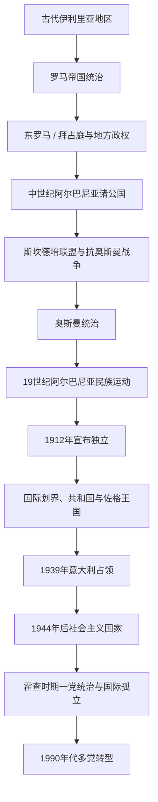

# 阿尔巴尼亚

## 概括

阿尔巴尼亚位于亚得里亚海东岸和巴尔干西部。古代伊利里亚、罗马和拜占庭遗产，中世纪地方公国、威尼斯与奥斯曼竞争、斯坎德培抵抗、19世纪民族运动、1912年独立、两次世界大战以及战后社会主义体制共同塑造现代国家。

## 演变关系

## 统治结构与政治阶段

| 阶段 | 时间 | 统治结构 |
|---|---|---|
| 中世纪地方政权 | 中世纪—15世纪 | 拜占庭、塞尔维亚、威尼斯、那不勒斯势力与本地贵族公国交错。 |
| 奥斯曼时期 | 15世纪末—1912年 | 纳入奥斯曼行政与军事体系，山区、宗教社群和地方家族保留不同程度自主。 |
| 独立与战间期 | 1912—1939年 | 国际承认和边界形成后经历亲王国、共和国和佐格王国。 |
| 战时占领 | 1939—1944年 | 先受意大利占领，后受德国占领，抵抗组织竞争。 |
| 社会主义时期 | 1944—1991年 | 劳动党一党统治，推进工业化、集体化和世俗化，并逐步与苏联、中国决裂而走向孤立。 |
| 多党共和国 | 1991年至今 | 市场转型、多党竞争、人口迁移与欧洲—大西洋一体化。 |

## 重要事件

- 斯坎德培自1440年代起组织部分阿尔巴尼亚领主抵抗奥斯曼，后来成为民族记忆的重要象征。
- 1878年普里兹伦联盟推动阿尔巴尼亚政治与文化诉求。
- 1912年宣布独立，但边界由列强会议决定，许多阿尔巴尼亚人居住区留在邻国。
- 1928年佐格建立王国，1939年意大利占领阿尔巴尼亚。
- 1944年共产党领导的力量建立政权，霍查时期实行高度集中的一党体制。
- 1967年政府宣布推进国家无神论，宗教机构遭大规模压制。
- 1990年代转型伴随经济危机、外迁和1997年金融崩溃引发的动荡。

## 关键辨析

- 古代伊利里亚人与现代阿尔巴尼亚人的关系涉及语言、考古和历史连续性讨论，不能写成完全确定的单线血缘。
- 奥斯曼时期阿尔巴尼亚人具有多种宗教与地方身份，并非统一政治集团。
- 科索沃的阿尔巴尼亚人历史与阿尔巴尼亚国家史密切相关，但应在相应区域和国家笔记中分别处理。

## 上级

- [东南欧与巴尔干](/%E4%BA%BA%E6%96%87%E7%A7%91%E5%AD%A6/%E5%8E%86%E5%8F%B2/%E6%AC%A7%E6%B4%B2/%E4%B8%9C%E5%8D%97%E6%AC%A7%E4%B8%8E%E5%B7%B4%E5%B0%94%E5%B9%B2/README.md)
