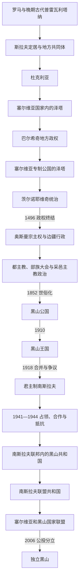

# 黑山历史

[返回东南欧与巴尔干历史](/%E4%BA%BA%E6%96%87%E7%A7%91%E5%AD%A6/%E5%8E%86%E5%8F%B2/%E6%AC%A7%E6%B4%B2/%E4%B8%9C%E5%8D%97%E6%AC%A7%E4%B8%8E%E5%B7%B4%E5%B0%94%E5%B9%B2/README.md)

## 范围与主线

黑山史不能写成一条从杜克利亚直达现代共和国的单线国史。现代国土由旧黑山高地、布尔达诸部、泽塔平原、桑扎克边缘和科托尔湾沿海等不同空间逐步拼合：内陆长期处在拜占庭、塞尔维亚诸国和奥斯曼的宗主权或行政主张之下，山地部族又保有程度不一的自治；沿海城市则先后进入威尼斯、法国和哈布斯堡体系。1918年以后黑山失去独立王国地位，1945年才以南斯拉夫联邦共和国的形式重新取得制度性领土单位，2006年经公投成为当代独立国家。

全史主线可概括为：斯拉夫定居与杜克利亚王权兴起，泽塔进入中世纪塞尔维亚国家并在帝国瓦解后地方化，奥斯曼边疆中形成部族—都主教—大会的复合政治，彼得罗维奇—涅戈什家族推动中央国家建设，世俗公国获国际承认并升为王国，1918年合并与两代南斯拉夫国家，1990年代塞黑关系松动，最后经2006年公投独立。

## 历史阶段导航

| 顺序 | 阶段 | 时间 | 主线与阅读重点 |
|---:|---|---|---|
| 1 | [中世纪杜克利亚与泽塔](/%E4%BA%BA%E6%96%87%E7%A7%91%E5%AD%A6/%E5%8E%86%E5%8F%B2/%E6%AC%A7%E6%B4%B2/%E4%B8%9C%E5%8D%97%E6%AC%A7%E4%B8%8E%E5%B7%B4%E5%B0%94%E5%B9%B2/%E9%BB%91%E5%B1%B1/%E4%B8%AD%E4%B8%96%E7%BA%AA%E6%9D%9C%E5%85%8B%E5%88%A9%E4%BA%9A%E4%B8%8E%E6%B3%BD%E5%A1%94.md) | 6世纪—1496年 | 杜克利亚崛起、泽塔封地化、巴尔希奇与茨尔诺耶维奇政权，以及威尼斯、奥斯曼和塞尔维亚诸政权的交错。 |
| 2 | [奥斯曼边疆、采邑主教与自治](/%E4%BA%BA%E6%96%87%E7%A7%91%E5%AD%A6/%E5%8E%86%E5%8F%B2/%E6%AC%A7%E6%B4%B2/%E4%B8%9C%E5%8D%97%E6%AC%A7%E4%B8%8E%E5%B7%B4%E5%B0%94%E5%B9%B2/%E9%BB%91%E5%B1%B1/%E5%A5%A5%E6%96%AF%E6%9B%BC%E8%BE%B9%E7%96%86%E3%80%81%E9%87%87%E9%82%91%E4%B8%BB%E6%95%99%E4%B8%8E%E8%87%AA%E6%B2%BB.md) | 1496年—1852年 | 区分奥斯曼宗主权、实际征税与驻军、部族自治、都主教权威、世俗“总督”和沿海外部统治。 |
| 3 | [黑山公国与王国](/%E4%BA%BA%E6%96%87%E7%A7%91%E5%AD%A6/%E5%8E%86%E5%8F%B2/%E6%AC%A7%E6%B4%B2/%E4%B8%9C%E5%8D%97%E6%AC%A7%E4%B8%8E%E5%B7%B4%E5%B0%94%E5%B9%B2/%E9%BB%91%E5%B1%B1/%E9%BB%91%E5%B1%B1%E5%85%AC%E5%9B%BD%E4%B8%8E%E7%8E%8B%E5%9B%BD.md) | 1852年—1918年 | 世俗化、中央机构、战争扩张、1878年国际承认、1905年宪政、一战占领与1918年王朝终结。 |
| 4 | [南斯拉夫时期的黑山](/%E4%BA%BA%E6%96%87%E7%A7%91%E5%AD%A6/%E5%8E%86%E5%8F%B2/%E6%AC%A7%E6%B4%B2/%E4%B8%9C%E5%8D%97%E6%AC%A7%E4%B8%8E%E5%B7%B4%E5%B0%94%E5%B9%B2/%E9%BB%91%E5%B1%B1/%E5%8D%97%E6%96%AF%E6%8B%89%E5%A4%AB%E6%97%B6%E6%9C%9F%E7%9A%84%E9%BB%91%E5%B1%B1.md) | 1918年—1992年 | 合并争议、王国行政、二战多重权力、社会主义共和国建制及1989年前后的政治转向。 |
| 5 | [塞尔维亚和黑山及独立建国](/%E4%BA%BA%E6%96%87%E7%A7%91%E5%AD%A6/%E5%8E%86%E5%8F%B2/%E6%AC%A7%E6%B4%B2/%E4%B8%9C%E5%8D%97%E6%AC%A7%E4%B8%8E%E5%B7%B4%E5%B0%94%E5%B9%B2/%E9%BB%91%E5%B1%B1/%E5%A1%9E%E5%B0%94%E7%BB%B4%E4%BA%9A%E5%92%8C%E9%BB%91%E5%B1%B1%E5%8F%8A%E7%8B%AC%E7%AB%8B%E5%BB%BA%E5%9B%BD.md) | 1992年—2006年 | 联盟共和国的名义联邦与实际权力、黑山制度脱钩、2003年国家联盟和2006年公投。 |
| 6 | [独立后的黑山](/%E4%BA%BA%E6%96%87%E7%A7%91%E5%AD%A6/%E5%8E%86%E5%8F%B2/%E6%AC%A7%E6%B4%B2/%E4%B8%9C%E5%8D%97%E6%AC%A7%E4%B8%8E%E5%B7%B4%E5%B0%94%E5%B9%B2/%E9%BB%91%E5%B1%B1/%E7%8B%AC%E7%AB%8B%E5%90%8E%E7%9A%84%E9%BB%91%E5%B1%B1.md) | 2006年至今 | 议会共和制、国家认同、政党轮替、北约与欧盟进程，以及旅游型经济的机会和风险。 |

## 世系与统治结构专表

| 专表 | 覆盖范围 | 使用说明 |
|---|---|---|
| [黑山中世纪统治者世系表](/%E4%BA%BA%E6%96%87%E7%A7%91%E5%AD%A6/%E5%8E%86%E5%8F%B2/%E6%AC%A7%E6%B4%B2/%E4%B8%9C%E5%8D%97%E6%AC%A7%E4%B8%8E%E5%B7%B4%E5%B0%94%E5%B9%B2/%E9%BB%91%E5%B1%B1/%E9%BB%91%E5%B1%B1%E4%B8%AD%E4%B8%96%E7%BA%AA%E7%BB%9F%E6%B2%BB%E8%80%85%E4%B8%96%E7%B3%BB%E8%A1%A8.md) | 约10世纪—1516年 | 分开列杜克利亚君主、泽塔封地掌有者、巴尔希奇共治者、专制公国宗主和茨尔诺耶维奇实际或名义继承人；争议年代不伪造精确性。 |
| [黑山采邑主教与彼得罗维奇王朝世系表](/%E4%BA%BA%E6%96%87%E7%A7%91%E5%AD%A6/%E5%8E%86%E5%8F%B2/%E6%AC%A7%E6%B4%B2/%E4%B8%9C%E5%8D%97%E6%AC%A7%E4%B8%8E%E5%B7%B4%E5%B0%94%E5%B9%B2/%E9%BB%91%E5%B1%B1/%E9%BB%91%E5%B1%B1%E9%87%87%E9%82%91%E4%B8%BB%E6%95%99%E4%B8%8E%E5%BD%BC%E5%BE%97%E7%BD%97%E7%BB%B4%E5%A5%87%E7%8E%8B%E6%9C%9D%E4%B8%96%E7%B3%BB%E8%A1%A8.md) | 1516年—1918年，附流亡王位主张 | 列全都主教、共治者、世俗实际统治者、总督、彼得罗维奇家族继承和1918年后的无实权主张。 |
| [黑山近现代国家元首与政府首脑表](/%E4%BA%BA%E6%96%87%E7%A7%91%E5%AD%A6/%E5%8E%86%E5%8F%B2/%E6%AC%A7%E6%B4%B2/%E4%B8%9C%E5%8D%97%E6%AC%A7%E4%B8%8E%E5%B7%B4%E5%B0%94%E5%B9%B2/%E9%BB%91%E5%B1%B1/%E9%BB%91%E5%B1%B1%E8%BF%91%E7%8E%B0%E4%BB%A3%E5%9B%BD%E5%AE%B6%E5%85%83%E9%A6%96%E4%B8%8E%E6%94%BF%E5%BA%9C%E9%A6%96%E8%84%91%E8%A1%A8.md) | 1879年至2026年7月14日 | 君主制首相、占领与合作行政、社会主义法定元首和政府首脑、党领导、共和国总统及总理分表整理。 |

## 历史主线中的关键机制

| 机制 | 具体表现 | 不能怎样简化 |
|---|---|---|
| 山地与沿海分轨 | 采蒂涅高地依靠部族动员和东正教网络；科托尔、布德瓦等港口受亚得里亚海贸易与威尼斯—哈布斯堡法律影响。 | 不能把采邑主教的控制范围等同于现代黑山全部国土。 |
| 宗主权与实际控制分离 | 奥斯曼拥有法理和行政主张，却难以持续征税、驻军和裁判所有高地部族；地方也会纳贡、谈判或接受册封。 | 不能写成“从未被征服”，也不能写成“全境持续直接统治”。 |
| 部族政治与中央化 | 兄弟会、部族大会、首领和复仇规则长期组织社会；都主教与彼得罗维奇家族通过法典、税收、卫队和参议院逐步集中权力。 | 不能倒推一个自16世纪即完备的现代国家机器。 |
| 外援与小国生存 | 威尼斯、俄国、奥地利、法国、塞尔维亚和列强会议均影响黑山边界与政权资源。 | 外援不是单向“保护”，常伴随依赖、干预和政策约束。 |
| 身份的历史可变性 | 黑山、塞尔维亚、南斯拉夫、公民国家等认同在不同时期相互重叠或竞争。 | 不能用当代族群选择直接给中世纪人物划定现代民族国籍。 |

## 重要转折与时间节点

| 时间 | 转折 | 因果与意义 |
|---|---|---|
| 1042年 | 图杰米利战役 | 斯特凡·沃伊斯拉夫击败拜占庭军，杜克利亚取得稳定自主，是王权崛起的军事基础。 |
| 1077—1078年前后 | 米哈伊洛获“斯拉夫人之王”称号 | 与罗马教廷建立王号外交，提高杜克利亚地位；具体加冕形式仍有争议。 |
| 1180年代末 | 尼曼雅征服杜克利亚 | 杜克利亚王朝瓦解，泽塔成为中世纪塞尔维亚国家的地区和封地。 |
| 1360年前后 | 巴尔希奇家族掌握泽塔 | 塞尔维亚帝国分解使地方贵族自主化，泽塔重新成为独立行动的地区政权。 |
| 1421年 | 巴尔沙三世把领地遗赠塞尔维亚专制公国 | 巴尔希奇线终结；此后威尼斯、专制公国、茨尔诺耶维奇和奥斯曼竞逐。 |
| 1482—1485年 | 伊万·茨尔诺耶维奇转移中心至采蒂涅 | 奥斯曼夺取低地迫使政治—宗教中心上山，形成后来黑山核心地理。 |
| 1496—1499年 | 茨尔诺耶维奇政权终结并纳入奥斯曼体系 | 独立宫廷消失，但帝国行政能力与山地地方自治并不同步。 |
| 1697年 | 达尼洛·彼得罗维奇当选都主教 | 彼得罗维奇家族长期掌握都主教职位，宗教权威、外交和部族协调趋于连续。 |
| 1796—1798年 | 马尔蒂尼奇、克鲁西胜利与法典建设 | 军事胜利削弱斯库台帕夏威胁，《共同誓约》和总法典把部族联盟向公共秩序推进。 |
| 1852年 | 达尼洛二世改为世俗亲王 | 终止主教必须独身造成的叔侄传承，使国家权力转为世俗王朝继承。 |
| 1878年 | 柏林会议承认独立 | 国际法地位、领土和出海口获得列强确认，但边界落实仍经历冲突与交换。 |
| 1905年 | 颁布宪法 | 议会与政党出现，但尼古拉一世仍控制军政和官僚体系。 |
| 1916—1918年 | 奥匈占领、王室流亡与波德戈里察议会 | 军事崩溃和盟国政治使王朝失去国内权力；合并程序及代表性长期有争议。 |
| 1941—1945年 | 轴心占领、七月十三日起义与游击战争 | 占领当局、合作力量、切特尼克和共产党游击队并立；后者最终建立联邦共和国。 |
| 1989—1992年 | 反官僚革命与南斯拉夫解体 | 新领导层与米洛舍维奇路线接近，黑山选择同塞尔维亚留在新的两共和国联邦。 |
| 1997—2000年 | 黑山领导层与贝尔格莱德决裂 | 货币、海关、安全和对外关系逐渐分离，为松散国家联盟与独立公投奠定制度基础。 |
| 2006年 | 独立公投与建国 | 独立票55.5%越过预设55%门槛；黑山成为独立国家，塞尔维亚承接共同国家的国际连续性。 |
| 2017年 | 加入北约 | 安全政策完成西向制度整合，但并不等同于加入欧盟。 |
| 2020年 | 独立后首次中央执政联盟轮替 | 民主社会主义者党失去长期政府控制，多党联合与身份政治进入新阶段。 |
| 2026年7月14日 | 欧盟谈判累计临时关闭18章 | 竞争政策与关税规则两章当日推进；入盟仍取决于余下改革、成员国一致同意和条约批准。 |

## 与塞尔维亚和南斯拉夫主线的关系

黑山中世纪与塞尔维亚诸国有统治、王朝和教会联系，但不能据此把所有时期都视为同一个国家。1918—2006年的共同国家过程应与[南斯拉夫历史](/%E4%BA%BA%E6%96%87%E7%A7%91%E5%AD%A6/%E5%8E%86%E5%8F%B2/%E6%AC%A7%E6%B4%B2/%E4%B8%9C%E5%8D%97%E6%AC%A7%E4%B8%8E%E5%B7%B4%E5%B0%94%E5%B9%B2/%E5%8D%97%E6%96%AF%E6%8B%89%E5%A4%AB%E5%8E%86%E5%8F%B2/README.md)和[塞尔维亚历史](/%E4%BA%BA%E6%96%87%E7%A7%91%E5%AD%A6/%E5%8E%86%E5%8F%B2/%E6%AC%A7%E6%B4%B2/%E4%B8%9C%E5%8D%97%E6%AC%A7%E4%B8%8E%E5%B7%B4%E5%B0%94%E5%B9%B2/%E5%A1%9E%E5%B0%94%E7%BB%B4%E4%BA%9A/README.md)互相参照：黑山页说明本地制度、社会与立场分化，共同线维护联邦层面的君主、总统、战争和解体过程，避免两处重复一套正文。
