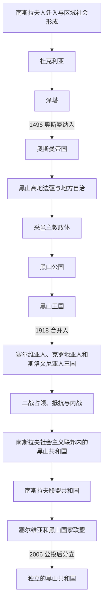

# 黑山历史

[返回东南欧与巴尔干历史](/%E4%BA%BA%E6%96%87%E7%A7%91%E5%AD%A6/%E5%8E%86%E5%8F%B2/%E6%AC%A7%E6%B4%B2/%E4%B8%9C%E5%8D%97%E6%AC%A7%E4%B8%8E%E5%B7%B4%E5%B0%94%E5%B9%B2/README.md)

## 概括

黑山历史可按“中世纪杜克利亚与泽塔 → 奥斯曼边疆和采邑主教政体 → 黑山公国与王国 → 南斯拉夫时期 → 塞尔维亚和黑山共同国家 → 2006年后独立共和国”来理解。其高地、沿海和边疆长期处于不同政治网络：中世纪本地政权、奥斯曼宗主权、威尼斯与哈布斯堡的沿海影响以及南斯拉夫国家框架先后交叠，不能把现代国界机械投射到更早时期。

## 历史阶段导航

| 顺序 | 阶段 | 时间 | 历史走向 |
|---:|---|---|---|
| 1 | [中世纪杜克利亚与泽塔](/%E4%BA%BA%E6%96%87%E7%A7%91%E5%AD%A6/%E5%8E%86%E5%8F%B2/%E6%AC%A7%E6%B4%B2/%E4%B8%9C%E5%8D%97%E6%AC%A7%E4%B8%8E%E5%B7%B4%E5%B0%94%E5%B9%B2/%E9%BB%91%E5%B1%B1/%E4%B8%AD%E4%B8%96%E7%BA%AA%E6%9D%9C%E5%85%8B%E5%88%A9%E4%BA%9A%E4%B8%8E%E6%B3%BD%E5%A1%94.md) | 6世纪—1496年 | 斯拉夫人迁入后形成杜克利亚、泽塔等政权，继而处于拜占庭、塞尔维亚和亚得里亚海力量之间。 |
| 2 | [奥斯曼边疆、采邑主教与自治](/%E4%BA%BA%E6%96%87%E7%A7%91%E5%AD%A6/%E5%8E%86%E5%8F%B2/%E6%AC%A7%E6%B4%B2/%E4%B8%9C%E5%8D%97%E6%AC%A7%E4%B8%8E%E5%B7%B4%E5%B0%94%E5%B9%B2/%E9%BB%91%E5%B1%B1/%E5%A5%A5%E6%96%AF%E6%9B%BC%E8%BE%B9%E7%96%86%E3%80%81%E9%87%87%E9%82%91%E4%B8%BB%E6%95%99%E4%B8%8E%E8%87%AA%E6%B2%BB.md) | 1496年—1852年 | 奥斯曼宗主权、高地部族自治、东正教都主教权威以及沿海威尼斯—哈布斯堡影响并存。 |
| 3 | [黑山公国与王国](/%E4%BA%BA%E6%96%87%E7%A7%91%E5%AD%A6/%E5%8E%86%E5%8F%B2/%E6%AC%A7%E6%B4%B2/%E4%B8%9C%E5%8D%97%E6%AC%A7%E4%B8%8E%E5%B7%B4%E5%B0%94%E5%B9%B2/%E9%BB%91%E5%B1%B1/%E9%BB%91%E5%B1%B1%E5%85%AC%E5%9B%BD%E4%B8%8E%E7%8E%8B%E5%9B%BD.md) | 1852年—1918年 | 政教合一终结，公国走向国际承认和领土扩张，1910年升为王国，一战后被并入新的南斯拉夫国家。 |
| 4 | [南斯拉夫时期的黑山](/%E4%BA%BA%E6%96%87%E7%A7%91%E5%AD%A6/%E5%8E%86%E5%8F%B2/%E6%AC%A7%E6%B4%B2/%E4%B8%9C%E5%8D%97%E6%AC%A7%E4%B8%8E%E5%B7%B4%E5%B0%94%E5%B9%B2/%E9%BB%91%E5%B1%B1/%E5%8D%97%E6%96%AF%E6%8B%89%E5%A4%AB%E6%97%B6%E6%9C%9F%E7%9A%84%E9%BB%91%E5%B1%B1.md) | 1918年—1992年 | 经历王国统治、二战占领与内战，随后成为社会主义联邦的组成共和国。 |
| 5 | [塞尔维亚和黑山及独立建国](/%E4%BA%BA%E6%96%87%E7%A7%91%E5%AD%A6/%E5%8E%86%E5%8F%B2/%E6%AC%A7%E6%B4%B2/%E4%B8%9C%E5%8D%97%E6%AC%A7%E4%B8%8E%E5%B7%B4%E5%B0%94%E5%B9%B2/%E9%BB%91%E5%B1%B1/%E5%A1%9E%E5%B0%94%E7%BB%B4%E4%BA%9A%E5%92%8C%E9%BB%91%E5%B1%B1%E5%8F%8A%E7%8B%AC%E7%AB%8B%E5%BB%BA%E5%9B%BD.md) | 1992年—2006年 | 与塞尔维亚留在共同国家中，由联盟共和国转为松散国家联盟，最终通过公投分立。 |
| 6 | [独立后的黑山](/%E4%BA%BA%E6%96%87%E7%A7%91%E5%AD%A6/%E5%8E%86%E5%8F%B2/%E6%AC%A7%E6%B4%B2/%E4%B8%9C%E5%8D%97%E6%AC%A7%E4%B8%8E%E5%B7%B4%E5%B0%94%E5%B9%B2/%E9%BB%91%E5%B1%B1/%E7%8B%AC%E7%AB%8B%E5%90%8E%E7%9A%84%E9%BB%91%E5%B1%B1.md) | 2006年至今 | 建立独立共和国，推进欧洲—大西洋整合，同时处理身份、教会、语言和政党竞争。 |

## 与南斯拉夫共同主线的关系

黑山的本地阶段页只整理黑山视角；共同国家的完整过程由[南斯拉夫历史](/%E4%BA%BA%E6%96%87%E7%A7%91%E5%AD%A6/%E5%8E%86%E5%8F%B2/%E6%AC%A7%E6%B4%B2/%E4%B8%9C%E5%8D%97%E6%AC%A7%E4%B8%8E%E5%B7%B4%E5%B0%94%E5%B9%B2/%E5%8D%97%E6%96%AF%E6%8B%89%E5%A4%AB%E5%8E%86%E5%8F%B2/README.md)维护，尤其参见[南斯拉夫王国](/%E4%BA%BA%E6%96%87%E7%A7%91%E5%AD%A6/%E5%8E%86%E5%8F%B2/%E6%AC%A7%E6%B4%B2/%E4%B8%9C%E5%8D%97%E6%AC%A7%E4%B8%8E%E5%B7%B4%E5%B0%94%E5%B9%B2/%E5%8D%97%E6%96%AF%E6%8B%89%E5%A4%AB%E5%8E%86%E5%8F%B2/%E5%8D%97%E6%96%AF%E6%8B%89%E5%A4%AB%E7%8E%8B%E5%9B%BD.md)、[第二次世界大战时期的南斯拉夫](/%E4%BA%BA%E6%96%87%E7%A7%91%E5%AD%A6/%E5%8E%86%E5%8F%B2/%E6%AC%A7%E6%B4%B2/%E4%B8%9C%E5%8D%97%E6%AC%A7%E4%B8%8E%E5%B7%B4%E5%B0%94%E5%B9%B2/%E5%8D%97%E6%96%AF%E6%8B%89%E5%A4%AB%E5%8E%86%E5%8F%B2/%E7%AC%AC%E4%BA%8C%E6%AC%A1%E4%B8%96%E7%95%8C%E5%A4%A7%E6%88%98%E6%97%B6%E6%9C%9F%E7%9A%84%E5%8D%97%E6%96%AF%E6%8B%89%E5%A4%AB.md)、[南斯拉夫社会主义联邦共和国](/%E4%BA%BA%E6%96%87%E7%A7%91%E5%AD%A6/%E5%8E%86%E5%8F%B2/%E6%AC%A7%E6%B4%B2/%E4%B8%9C%E5%8D%97%E6%AC%A7%E4%B8%8E%E5%B7%B4%E5%B0%94%E5%B9%B2/%E5%8D%97%E6%96%AF%E6%8B%89%E5%A4%AB%E5%8E%86%E5%8F%B2/%E5%8D%97%E6%96%AF%E6%8B%89%E5%A4%AB%E7%A4%BE%E4%BC%9A%E4%B8%BB%E4%B9%89%E8%81%94%E9%82%A6%E5%85%B1%E5%92%8C%E5%9B%BD.md)、[南斯拉夫联盟共和国与塞尔维亚和黑山](/%E4%BA%BA%E6%96%87%E7%A7%91%E5%AD%A6/%E5%8E%86%E5%8F%B2/%E6%AC%A7%E6%B4%B2/%E4%B8%9C%E5%8D%97%E6%AC%A7%E4%B8%8E%E5%B7%B4%E5%B0%94%E5%B9%B2/%E5%8D%97%E6%96%AF%E6%8B%89%E5%A4%AB%E5%8E%86%E5%8F%B2/%E5%8D%97%E6%96%AF%E6%8B%89%E5%A4%AB%E8%81%94%E7%9B%9F%E5%85%B1%E5%92%8C%E5%9B%BD%E4%B8%8E%E5%A1%9E%E5%B0%94%E7%BB%B4%E4%BA%9A%E5%92%8C%E9%BB%91%E5%B1%B1.md)和[南斯拉夫解体](/%E4%BA%BA%E6%96%87%E7%A7%91%E5%AD%A6/%E5%8E%86%E5%8F%B2/%E6%AC%A7%E6%B4%B2/%E4%B8%9C%E5%8D%97%E6%AC%A7%E4%B8%8E%E5%B7%B4%E5%B0%94%E5%B9%B2/%E5%8D%97%E6%96%AF%E6%8B%89%E5%A4%AB%E5%8E%86%E5%8F%B2/%E5%8D%97%E6%96%AF%E6%8B%89%E5%A4%AB%E8%A7%A3%E4%BD%93.md)。

## 重要转折与时间节点

| 时间 | 转折 | 意义 |
|---|---|---|
| 1077年前后 | 米哈伊洛被称为国王 | 杜克利亚王权达到高峰，但不等同于现代黑山国家的直接成立。 |
| 1496年 | 泽塔纳入奥斯曼体系 | 内陆政治进入奥斯曼边疆阶段，沿海地区仍有不同统治轨迹。 |
| 1697年 | 彼得罗维奇—涅戈什家族掌握采邑主教职位 | 采邑主教政体趋于稳定，并逐步推动高地政治整合。 |
| 1852年 | 政教合一终结 | 世俗的黑山公国形成。 |
| 1878年 | 柏林会议承认独立 | 黑山获得广泛国际承认及出海口。 |
| 1918年 | 波德戈里察议会决议 | 王朝被废黜并与塞尔维亚合并；程序与代表性长期存在争议。 |
| 1945年 | 成为南斯拉夫联邦共和国之一 | 黑山获得联邦单位和共和国制度框架。 |
| 2006年 | 独立公投 | 黑山与塞尔维亚的共同国家解体。 |

## 关键辨析

- “黑山”在不同时期可能指高地核心区、采邑主教控制范围、19世纪扩张后的国家或2006年后的共和国，空间范围并不相同。
- 奥斯曼时期并非“始终完全独立”，也不是中央政府对所有高地持续直接统治；宗主权、征税能力、部族自治和军事对抗随时期与地区变化。
- 科托尔湾等沿海地区曾长期处于威尼斯、哈布斯堡等政权之下，不能用内陆采邑主教线覆盖整个现代国土。
- 1918年的合并既是南斯拉夫建国节点，也是黑山王朝终结与国内“联合派—主权派”冲突的起点；不能只写成无争议的统一。
- 黑山是南斯拉夫历史的重要组成部分，但黑山国家史还有独立的中世纪、边疆和王国传统；两条主线应互链而不互相取代。
