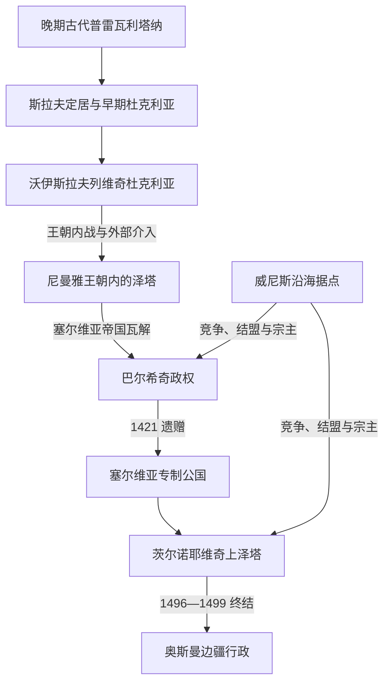

# 中世纪杜克利亚与泽塔

[返回黑山历史](/%E4%BA%BA%E6%96%87%E7%A7%91%E5%AD%A6/%E5%8E%86%E5%8F%B2/%E6%AC%A7%E6%B4%B2/%E4%B8%9C%E5%8D%97%E6%AC%A7%E4%B8%8E%E5%B7%B4%E5%B0%94%E5%B9%B2/%E9%BB%91%E5%B1%B1/README.md)

## 时间

6世纪—1496年；1496—1516年的茨尔诺耶维奇名义继承另作余波说明。

## 概括

晚期古代的罗马城市、沿海拉丁文化与内陆山地社会，在6—7世纪斯拉夫迁入后重新组合。约10世纪出现有文献可证的杜克利亚首领；11世纪斯特凡·沃伊斯拉夫摆脱拜占庭强控制，米哈伊洛和康斯坦丁·博丁建立跨西巴尔干的王权网络。博丁死后，家族内战、拜占庭干预与拉什卡势力上升使杜克利亚解体。12世纪末以后，“泽塔”成为主要地区名称并进入尼曼雅王朝的塞尔维亚国家。14世纪帝国瓦解后，巴尔希奇家族独立行动；1421年其领地转入塞尔维亚专制公国，继而被威尼斯、奥斯曼和茨尔诺耶维奇争夺。1496年茨尔诺耶维奇实际政权终结，是本阶段的直接终点。

完整而带争议标注的统治顺序见[黑山中世纪统治者世系表](/%E4%BA%BA%E6%96%87%E7%A7%91%E5%AD%A6/%E5%8E%86%E5%8F%B2/%E6%AC%A7%E6%B4%B2/%E4%B8%9C%E5%8D%97%E6%AC%A7%E4%B8%8E%E5%B7%B4%E5%B0%94%E5%B9%B2/%E9%BB%91%E5%B1%B1/%E9%BB%91%E5%B1%B1%E4%B8%AD%E4%B8%96%E7%BA%AA%E7%BB%9F%E6%B2%BB%E8%80%85%E4%B8%96%E7%B3%BB%E8%A1%A8.md)。

## 建立背景与崛起机制

- **地理条件**：斯库台湖—泽塔河谷连接内陆与亚得里亚海，巴尔、乌尔齐尼、科托尔等港口提供贸易、外交和教会通道；山地则利于地方武装保存。
- **帝国边缘**：拜占庭常以册封、宗教和军事远征维持影响，却难以稳定直辖全部内陆，地方首领可在帝国战争和保加利亚、拉什卡竞争间扩大空间。
- **王权资源**：沃伊斯拉夫列维奇依靠亲属分封、沿海城市收入、军队与罗马教廷关系建立权威；米哈伊洛获王号、巴尔教会地位提升，是其对外合法化的一部分。
- **地方贵族化**：14世纪塞尔维亚中央权力崩解后，巴尔希奇和茨尔诺耶维奇的力量来自城堡、家族军队、婚姻、贸易口岸及在威尼斯与奥斯曼间转换联盟。

## 分阶段发展

### 斯拉夫定居与早期杜克利亚

6—9世纪的资料有限，不能把后世编年叙事全当同时代记录。斯拉夫共同体在原罗马省普雷瓦利塔纳及周边定居，与仍在沿海城市生活的罗马化人口、阿尔巴尼亚语群体和拜占庭行政文化互动。约10世纪的彼得印玺证明本地存在被拜占庭承认的“执政官”；约万·弗拉基米尔在保加利亚沙皇萨穆伊尔扩张中成为附庸，1016年被杀，后来被尊为圣人。

### 沃伊斯拉夫列维奇王国的形成与鼎盛

斯特凡·沃伊斯拉夫先后在1030年代和1040年代反抗拜占庭。1042年拜占庭军深入山地后在图杰米利附近遭伏击，杜克利亚的自主由此稳定。米哈伊洛较少直接挑战拜占庭，而通过教廷、南意大利和婚姻外交提高地位；1077—1078年前后的教廷文书称他为“斯拉夫人之王”。其子博丁曾在1072年保加利亚起义中被拥为“彼得三世”，失败被俘后获释；1081年继位后利用拜占庭与诺曼战争，把亲族安置到拉什卡、波斯尼亚等地，杜克利亚影响达到高峰。

鼎盛依赖的是个人与亲族网络，不是稳定官僚国家。博丁死后，王室支系争位，邻近拉什卡统治者、拜占庭军队和地方贵族反复拥立候选人。政变、复位与短期共治使王权萎缩，沿海城市和腹地的控制也分离。12世纪中叶以后，统治者多只能维持局部权威。

### 尼曼雅王朝体系内的泽塔

斯特凡·尼曼雅在1180年代末征服杜克利亚地区，旧王朝退出。泽塔不再是独立王国，而成为塞尔维亚国家的王族封地、王后领地或继承人治理区；东正教采蒂涅之前的泽塔教区、沿海天主教城市和巴尔总主教区继续并存。尼曼雅王朝和后来塞尔维亚帝国把泽塔纳入更大的税收、修道院与军事体系，地方贵族仍保持强大。

1331年杜尚夺位及1346年称帝把塞尔维亚国家推向顶峰，但扩张国家依赖贵族分权。1355年杜尚死后，乌罗什五世无法压制区域领主，泽塔的巴尔希奇兄弟逐步取得斯库台湖周围据点并独立处理战争、婚姻和外交。

### 巴尔希奇政权的扩张与收缩

巴尔沙一世及其诸子最初共同掌权。家族一度控制斯库台、巴尔、布德瓦和普里兹伦等地，却同时面对阿尔巴尼亚领主、波斯尼亚、塞尔维亚诸侯、威尼斯和奥斯曼。1385年巴尔沙二世在萨夫拉战役中战死，说明向南扩张已超过动员能力。继任者久拉季二世在奥斯曼压力下曾被俘，又以领土和外交妥协求存；巴尔沙三世则长期同威尼斯争夺沿海城市。

1421年巴尔沙三世无子而死，把领地遗赠舅父、塞尔维亚专制公斯特凡·拉扎列维奇。其母叶莲娜在他年幼时实际摄政并参与对威尼斯战争。巴尔希奇政权的衰落由继承断绝、沿海战争、财政资源有限和奥斯曼扩张共同造成，不是单一战役的结果。

### 专制公国、威尼斯与茨尔诺耶维奇

1421年后泽塔名义归塞尔维亚专制公国，但专制公、威尼斯城镇、地方茨尔诺耶维奇家族和奥斯曼军政力量控制范围相互穿插。1439年奥斯曼首次灭塞尔维亚专制公国后，部分地区又受科萨查家族影响；1444年专制公国恢复，仍难重建稳定直辖。

斯特凡·茨尔诺耶维奇在1450年代借助威尼斯取得上泽塔主导权，同时保持自身行动空间。其子伊万在奥斯曼进攻中丢失扎布利亚克低地，1479年一度流亡，1481年返回后把政治中心由河谷转向奥博德和采蒂涅，1484年建立采蒂涅修道院。久拉季统治时设置印刷所，1493—1496年印制南斯拉夫早期西里尔字母印本。文化成就并未扭转军事劣势：1496年奥斯曼迫使久拉季离境，斯特凡二世只能以受制身份短暂存在，1499年黑山并入斯库台桑贾克。

## 统治结构与社会

| 层次 | 运行方式 | 历史变化 |
|---|---|---|
| 君主与王族 | 依靠亲属分封、婚姻、教会称号和个人军队统治。 | 杜克利亚鼎盛后因支系争位而碎片化；泽塔时期更多表现为封地和区域领主权。 |
| 地方贵族与共同体 | 掌握城堡、村社、牧场、军役和地方裁判。 | 中央衰弱时成为巴尔希奇、茨尔诺耶维奇等新王朝基础。 |
| 沿海城市 | 保有罗马法、天主教机构、贸易自治和对意大利城市的联系。 | 在威尼斯、地方领主和内陆王国之间多次转换服属。 |
| 教会 | 巴尔天主教总主教区、沿海教区和东正教泽塔教区并存。 | 王权借教会争取合法性；宗派边界不等同现代民族边界。 |
| 外部宗主 | 拜占庭、塞尔维亚王权、威尼斯、奥斯曼以册封、驻军、贡赋或条约主张权力。 | 名义服属与实际控制常不一致，必须逐时段判断。 |

## 重要事件

1. **1016年约万·弗拉基米尔遇害**：显示杜克利亚处在保加利亚—拜占庭权力更替中，也形成重要圣人崇拜。
2. **1042年图杰米利战役**：沃伊斯拉夫利用山地伏击击败拜占庭军，奠定独立行动能力。
3. **1072年保加利亚起义**：博丁被拥立为彼得三世，说明杜克利亚能向内陆投射力量，也暴露其面对拜占庭反攻的局限。
4. **1077—1078年前后米哈伊洛获王号**：把罗马教廷纳入外交平衡，提升王权合法性。
5. **1089年前后巴尔教会地位提升**：服务于王权摆脱周边教会控制的努力；具体管辖范围和文书问题仍有争论。
6. **约1186—1189年尼曼雅征服**：旧杜克利亚王朝终结，泽塔进入中世纪塞尔维亚国家。
7. **1360年前后巴尔希奇取得泽塔**：塞尔维亚帝国瓦解转化为区域政权独立。
8. **1385年萨夫拉战役**：巴尔沙二世战死，南向扩张受挫，奥斯曼成为不可回避的军事力量。
9. **1421年巴尔沙三世遗赠领地**：王朝断嗣使泽塔并入塞尔维亚专制公国，随即引发与威尼斯的再争夺。
10. **1479—1485年伊万流亡、返回与建都采蒂涅**：低地丧失推动权力中心上山，影响此后黑山地理核心。
11. **1493—1496年茨尔诺耶维奇印刷所活动**：在军事危机中形成重要宗教文字文化成果。
12. **1496—1499年政权终结**：奥斯曼通过迫使统治者离境、保留短暂名义首领再改设行政，完成对内陆泽塔的制度吸收。

## 衰落与终结原因

- **结构因素**：山地、河谷与沿海城市资源分散，统治长期依靠王族和贵族私人网络，继承冲突容易造成领土脱落。
- **内部政治**：杜克利亚后期多次废立；巴尔希奇无稳定男性继承；茨尔诺耶维奇家族内部和地方首领之间也难形成持续集中。
- **外部压力**：拜占庭、拉什卡—塞尔维亚王权、威尼斯与奥斯曼轮番介入，沿海贸易城市尤其成为竞争焦点。
- **经济与军事限制**：小规模人口和财政难以维持常备军，面对奥斯曼连续攻势只能依赖险地、外交转换和外援。
- **直接触发**：1496年久拉季被迫离境，斯特凡二世处于奥斯曼严密控制；1499年取消其残余地位并并入桑贾克，独立宫廷遂告终结。

## 演变关系

- 前一背景：[早期南斯拉夫人](/%E4%BA%BA%E6%96%87%E7%A7%91%E5%AD%A6/%E5%8E%86%E5%8F%B2/%E6%AC%A7%E6%B4%B2/%E4%B8%9C%E5%8D%97%E6%AC%A7%E4%B8%8E%E5%B7%B4%E5%B0%94%E5%B9%B2/%E5%8D%97%E6%96%AF%E6%8B%89%E5%A4%AB%E5%8E%86%E5%8F%B2/%E6%97%A9%E6%9C%9F%E5%8D%97%E6%96%AF%E6%8B%89%E5%A4%AB%E4%BA%BA.md)。
- 后一阶段：[奥斯曼边疆、采邑主教与自治](/%E4%BA%BA%E6%96%87%E7%A7%91%E5%AD%A6/%E5%8E%86%E5%8F%B2/%E6%AC%A7%E6%B4%B2/%E4%B8%9C%E5%8D%97%E6%AC%A7%E4%B8%8E%E5%B7%B4%E5%B0%94%E5%B9%B2/%E9%BB%91%E5%B1%B1/%E5%A5%A5%E6%96%AF%E6%9B%BC%E8%BE%B9%E7%96%86%E3%80%81%E9%87%87%E9%82%91%E4%B8%BB%E6%95%99%E4%B8%8E%E8%87%AA%E6%B2%BB.md)。
