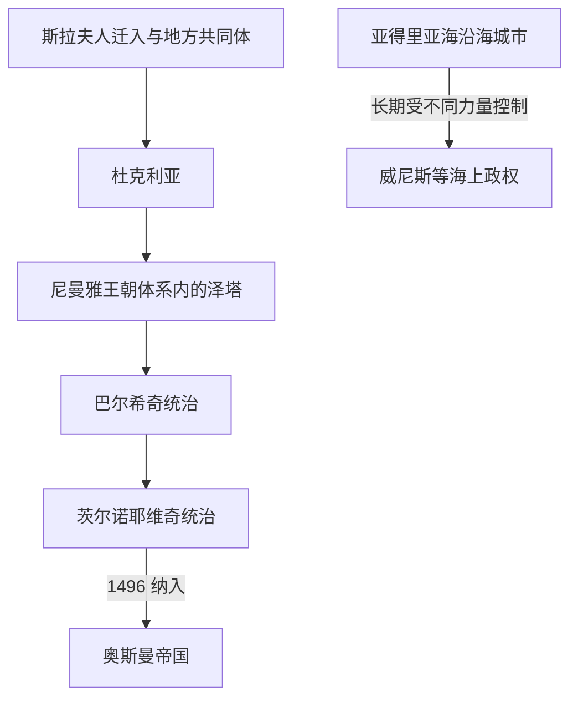

# 中世纪杜克利亚与泽塔

## 时间

6世纪—1496年

## 概括

现代黑山所在地区在晚期古代之后经历斯拉夫人迁入和地方社会重组，先后出现杜克利亚（Dioclea / Duklja）与泽塔等名称和政权。杜克利亚、泽塔及其各王朝是黑山历史的重要中世纪背景，但其疆域、人口构成和政治认同与现代黑山并不相同。

## 政权与统治结构

| 阶段 | 主要政治力量 | 概括 |
|---|---|---|
| 6—10世纪 | 拜占庭帝国、地方斯拉夫共同体 | 亚得里亚海腹地形成斯拉夫聚落与地方首领网络，拜占庭影响时强时弱。 |
| 11—12世纪 | 沃伊斯拉夫列维奇家族的杜克利亚 | 斯特凡·沃伊斯拉夫摆脱更强的拜占庭控制；米哈伊洛和博丁时期王权扩张并参与西巴尔干竞争。 |
| 12世纪末—14世纪中叶 | 尼曼雅王朝下的泽塔 | 该地区进入中世纪塞尔维亚国家体系，“泽塔”逐渐成为主要地区名称。 |
| 14—15世纪 | 巴尔希奇、茨尔诺耶维奇等地方王朝 | 塞尔维亚帝国瓦解后地方权力独立化，同时面对威尼斯与奥斯曼扩张。 |
| 1496年前后 | 奥斯曼帝国 | 内陆泽塔被纳入奥斯曼行政和军事体系；沿海城镇的轨迹并不完全相同。 |

## 重要事件

- 11世纪中叶，斯特凡·沃伊斯拉夫在与拜占庭的战争中巩固杜克利亚的自主地位。
- 1077年前后，教廷文书称米哈伊洛为国王；这表明杜克利亚王权的国际活动，却不能直接等同于现代主权承认。
- 博丁时期杜克利亚参与更广泛的巴尔干权力竞争，其后王朝冲突和外部压力使政权衰落。
- 12世纪末，尼曼雅王朝将泽塔纳入塞尔维亚国家；泽塔既是地区名，也在不同时期成为王族封地或地方政治中心。
- 14世纪后期至15世纪，巴尔希奇与茨尔诺耶维奇家族在泽塔掌权；伊万·茨尔诺耶维奇把政治和宗教中心转向采蒂涅。
- 15世纪末的茨尔诺耶维奇印刷活动是南斯拉夫东正教文字文化的重要节点。
- 奥斯曼在1496年前后结束茨尔诺耶维奇的独立统治，但高地地方社会并未因此被完全同质化。

## 演变关系

- 前一背景：[早期南斯拉夫人](/%E4%BA%BA%E6%96%87%E7%A7%91%E5%AD%A6/%E5%8E%86%E5%8F%B2/%E6%AC%A7%E6%B4%B2/%E4%B8%9C%E5%8D%97%E6%AC%A7%E4%B8%8E%E5%B7%B4%E5%B0%94%E5%B9%B2/%E5%8D%97%E6%96%AF%E6%8B%89%E5%A4%AB%E5%8E%86%E5%8F%B2/%E6%97%A9%E6%9C%9F%E5%8D%97%E6%96%AF%E6%8B%89%E5%A4%AB%E4%BA%BA.md)。
- 后一阶段：[奥斯曼边疆、采邑主教与自治](/%E4%BA%BA%E6%96%87%E7%A7%91%E5%AD%A6/%E5%8E%86%E5%8F%B2/%E6%AC%A7%E6%B4%B2/%E4%B8%9C%E5%8D%97%E6%AC%A7%E4%B8%8E%E5%B7%B4%E5%B0%94%E5%B9%B2/%E9%BB%91%E5%B1%B1/%E5%A5%A5%E6%96%AF%E6%9B%BC%E8%BE%B9%E7%96%86%E3%80%81%E9%87%87%E9%82%91%E4%B8%BB%E6%95%99%E4%B8%8E%E8%87%AA%E6%B2%BB.md)。
