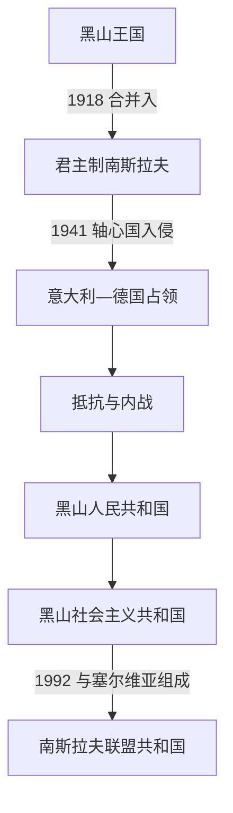

# 南斯拉夫时期的黑山

## 时间

1918年—1992年

## 概括

1918年后，黑山先被纳入君主制南斯拉夫，二战中经历意大利和德国占领、武装抵抗及内部战争，战后则以联邦共和国身份加入社会主义南斯拉夫。共和国制度、工业化、城市化和联邦认同重塑了黑山，同时黑山人与塞尔维亚人的身份关系仍保持开放和争议。

## 政治阶段

| 阶段 | 黑山的地位 | 主要变化 |
|---|---|---|
| 1918年—1941年 | 塞尔维亚人、克罗地亚人和斯洛文尼亚人王国，1929年后为南斯拉夫王国的一部分 | 旧王国行政和王朝被取消；部分地区编入泽塔省，支持合并与维护黑山主体性的立场持续竞争。 |
| 1941年—1945年 | 意大利、德国占领及地方合作政权、抵抗力量并存 | 1941年“七月十三日起义”后，游击队、切特尼克及占领当局之间形成复杂战争。 |
| 1945年—1963年 | 黑山人民共和国 | 作为南斯拉夫联邦共和国之一恢复制度性主体地位。 |
| 1963年—1992年 | 黑山社会主义共和国 | 在联邦体制内经历工业化、旅游业发展、城市扩张和1974年宪法后的共和国权力扩大。 |

## 重要事件

- 1918年的合并消灭了独立王国制度，并引发“绿色派”和“白色派”围绕主权与统一的冲突。
- 二战时期，意大利试图建立受控制的黑山政治安排；大规模起义、镇压以及游击队与切特尼克冲突使战争兼有反占领和内战性质。
- 战后黑山被确立为六个联邦共和国之一，首府波德戈里察改名铁托格勒，教育、工业和基础设施快速扩张。
- 黑山共和国在联邦机构中拥有代表权，黑山民族认同获得官方制度空间；同时不少居民继续认同塞尔维亚身份或复合身份。
- 1980年代末的政治变动使黑山领导层与塞尔维亚领导层趋同。斯洛文尼亚、克罗地亚、波斯尼亚和黑塞哥维那、马其顿陆续离开联邦后，黑山选择与塞尔维亚组成新的联盟共和国。

## 区域视角与共同主线

本页只说明黑山在共同国家中的地位。完整过程参见[南斯拉夫王国](/%E4%BA%BA%E6%96%87%E7%A7%91%E5%AD%A6/%E5%8E%86%E5%8F%B2/%E6%AC%A7%E6%B4%B2/%E4%B8%9C%E5%8D%97%E6%AC%A7%E4%B8%8E%E5%B7%B4%E5%B0%94%E5%B9%B2/%E5%8D%97%E6%96%AF%E6%8B%89%E5%A4%AB%E5%8E%86%E5%8F%B2/%E5%8D%97%E6%96%AF%E6%8B%89%E5%A4%AB%E7%8E%8B%E5%9B%BD.md)、[第二次世界大战时期的南斯拉夫](/%E4%BA%BA%E6%96%87%E7%A7%91%E5%AD%A6/%E5%8E%86%E5%8F%B2/%E6%AC%A7%E6%B4%B2/%E4%B8%9C%E5%8D%97%E6%AC%A7%E4%B8%8E%E5%B7%B4%E5%B0%94%E5%B9%B2/%E5%8D%97%E6%96%AF%E6%8B%89%E5%A4%AB%E5%8E%86%E5%8F%B2/%E7%AC%AC%E4%BA%8C%E6%AC%A1%E4%B8%96%E7%95%8C%E5%A4%A7%E6%88%98%E6%97%B6%E6%9C%9F%E7%9A%84%E5%8D%97%E6%96%AF%E6%8B%89%E5%A4%AB.md)和[南斯拉夫社会主义联邦共和国](/%E4%BA%BA%E6%96%87%E7%A7%91%E5%AD%A6/%E5%8E%86%E5%8F%B2/%E6%AC%A7%E6%B4%B2/%E4%B8%9C%E5%8D%97%E6%AC%A7%E4%B8%8E%E5%B7%B4%E5%B0%94%E5%B9%B2/%E5%8D%97%E6%96%AF%E6%8B%89%E5%A4%AB%E5%8E%86%E5%8F%B2/%E5%8D%97%E6%96%AF%E6%8B%89%E5%A4%AB%E7%A4%BE%E4%BC%9A%E4%B8%BB%E4%B9%89%E8%81%94%E9%82%A6%E5%85%B1%E5%92%8C%E5%9B%BD.md)。

## 演变关系

- 前一阶段：[黑山公国与王国](/%E4%BA%BA%E6%96%87%E7%A7%91%E5%AD%A6/%E5%8E%86%E5%8F%B2/%E6%AC%A7%E6%B4%B2/%E4%B8%9C%E5%8D%97%E6%AC%A7%E4%B8%8E%E5%B7%B4%E5%B0%94%E5%B9%B2/%E9%BB%91%E5%B1%B1/%E9%BB%91%E5%B1%B1%E5%85%AC%E5%9B%BD%E4%B8%8E%E7%8E%8B%E5%9B%BD.md)。
- 后一阶段：[塞尔维亚和黑山及独立建国](/%E4%BA%BA%E6%96%87%E7%A7%91%E5%AD%A6/%E5%8E%86%E5%8F%B2/%E6%AC%A7%E6%B4%B2/%E4%B8%9C%E5%8D%97%E6%AC%A7%E4%B8%8E%E5%B7%B4%E5%B0%94%E5%B9%B2/%E9%BB%91%E5%B1%B1/%E5%A1%9E%E5%B0%94%E7%BB%B4%E4%BA%9A%E5%92%8C%E9%BB%91%E5%B1%B1%E5%8F%8A%E7%8B%AC%E7%AB%8B%E5%BB%BA%E5%9B%BD.md)。
