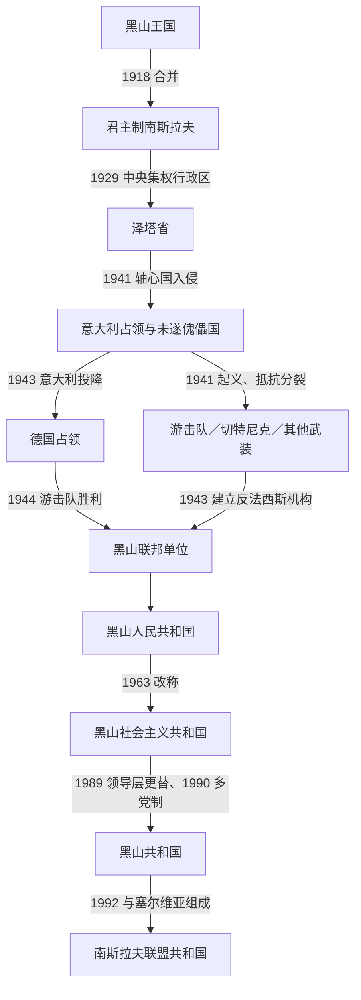

# 南斯拉夫时期的黑山

## 时间

1918年—1992年

## 概括

1918年黑山王国的国家机关被并入塞尔维亚及新成立的南斯拉夫王国，黑山不再是独立政治单位。两次世界大战之间，统一派与主权派的冲突由圣诞起义、游击抵抗转入党派和身份政治；1929年设立的泽塔省疆域远超今日黑山，也不是黑山民族自治实体。1941—1944年，意大利和德国占领、失败的傀儡建国方案、游击队、切特尼克和地方合作力量并存，法律名义、占领行政与实际控制频繁分离。战后黑山以联邦共和国身份恢复制度性主体，经历社会主义改造、工业化和共和国权力扩张。1989年领导层被“反官僚革命”更换，新精英与塞尔维亚的米洛舍维奇路线结盟；南斯拉夫解体后，黑山于1992年与塞尔维亚组成新的联盟共和国。

## 阶段与国家地位

| 阶段 | 法律地位 | 黑山境内的实际权力 |
|---|---|---|
| 1918年—1929年 | 塞尔维亚人、克罗地亚人和斯洛文尼亚人王国的一部分；旧黑山王国的王朝、政府和军队被取消。 | 贝尔格莱德中央政府、军政机关和统一派掌权；绿色派在1919年起义失败后以“科米塔”游击或流亡政治继续活动。 |
| 1929年—1941年 | 南斯拉夫王国泽塔省的一部分；省界还包括今日塞尔维亚、波黑和克罗地亚的部分地区。 | 国王任命的省长执行中央集权政策，黑山没有单独共和国或自治政府。 |
| 1941年4月—1943年9月 | 南斯拉夫王国在国际法上仍有流亡政府；黑山境内由意大利军事占领。 | 意大利高级专员和总督控制行政；1941年拟建傀儡王国未能稳定成立，七月十三日起义后军事管制加强。 |
| 1943年9月—1944年12月 | 德国占领区；王国流亡政府和共产党领导的解放机构竞争战后合法性。 | 德军司令、地方行政委员会、切特尼克残部及游击队分区控制；游击队逐步取得优势。 |
| 1944年—1946年 | 民主联邦南斯拉夫中的黑山联邦单位，随后成为人民共和国。 | 共产党领导的反法西斯机构接管，清除占领行政并建立一党体制。 |
| 1946年—1963年 | 南斯拉夫联邦人民共和国的黑山人民共和国。 | 联邦党国、黑山党组织和共和国政府共同治理；联邦领袖铁托及军队、安全机关拥有跨共和国权力。 |
| 1963年—1990年 | 南斯拉夫社会主义联邦共和国的黑山社会主义共和国。 | 共和国机构与自治管理经济扩大；1974年后权力更分散，但共产党联盟仍垄断政治。 |
| 1990年—1992年 | 多党制的黑山共和国，仍为社会主义联邦成员，1991年取消“社会主义”称号。 | 民主社会主义者党控制总统、政府和议会；米洛舍维奇影响下的联邦军政体系深度介入战争。 |

## 1918年合并及其后果

波德戈里察议会在塞尔维亚军队已进入黑山、统一派掌握组织权的条件下决定废黜尼古拉一世并无条件与塞尔维亚统一。支持者把它理解为塞尔维亚民族统一和南斯拉夫建国的步骤；反对者质疑代表选举、程序和黑山国家权利被绕过。1919年1月，主张恢复国家地位或平等联邦统一的绿色派发动圣诞起义，遭白色派和新王国军队镇压。起义失败没有立即消除抵抗，科米塔活动延续到1920年代中期，部分流亡者更晚才和解或返回。

1922年行政区划设置采蒂涅州，1929年改为泽塔省。泽塔省以河流命名，省会采蒂涅，包含的领土大于历史黑山；它是王国的中央行政单位，而非承认黑山主权的共和国。土地改革、退伍军人安置、道路和教育扩张带来社会变化，但山区贫困、外迁与地方政治矛盾持续存在。

## 第二次世界大战：占领、合作与抵抗

1941年4月轴心国击败南斯拉夫后，意大利把黑山从共同国家中切出，试图借塞库拉·德尔列维奇等主权派建立受保护的“独立黑山”。由于王位人选拒绝、边界被意大利盟友分割、社会反对和7月13日大起义，傀儡王国未能形成稳定国家机器。意大利转为总督军事统治，并以扫荡、拘禁和地方武装合作镇压。

反占领阵营很快分裂。共产党领导的游击队主张联邦南斯拉夫和社会革命；切特尼克以保王和塞尔维亚民族主义为核心，部分部队先抵抗后与意大利或德国达成不同程度合作；绿色派内部也有独立主义、合作或抵抗等不同路线。因此黑山战场兼有反占领战争、革命和内战性质，不能把所有武装简化成单一民族阵营。

1943年意大利投降后，德军接管主要城市和交通线。游击队于同年11月建立黑山和博卡反法西斯民族解放委员会，后改为反法西斯民族解放大会，为共和国合法性建立革命来源。1944年末德军撤退和游击队胜利后，旧王国的流亡主权名义、占领行政及合作机构均被新联邦体制取代。

具体的王国元首、泽塔省长、占领总督、合作机关和反法西斯机构负责人，见[黑山近现代国家元首与政府首脑表](/%E4%BA%BA%E6%96%87%E7%A7%91%E5%AD%A6/%E5%8E%86%E5%8F%B2/%E6%AC%A7%E6%B4%B2/%E4%B8%9C%E5%8D%97%E6%AC%A7%E4%B8%8E%E5%B7%B4%E5%B0%94%E5%B9%B2/%E9%BB%91%E5%B1%B1/%E9%BB%91%E5%B1%B1%E8%BF%91%E7%8E%B0%E4%BB%A3%E5%9B%BD%E5%AE%B6%E5%85%83%E9%A6%96%E4%B8%8E%E6%94%BF%E5%BA%9C%E9%A6%96%E8%84%91%E8%A1%A8.md)。这些人物不能并列理解为同一层级的“黑山总统”。

## 社会主义共和国的建立与运行

### 建国和一党体制

1945—1946年，黑山成为六个联邦单位之一，制度上重新拥有议会、政府和边界。采蒂涅不再适合作为扩张后的行政和工业中心，波德戈里察成为首府并于1946年改名铁托格勒。共产党对王党、切特尼克、独立主义者和其他反对力量进行清洗，土地、银行与工业国有化，一党政治取代战前竞争。

1948年苏南决裂后，黑山因对俄传统和党内结构而出现相对较高比例的亲苏或被指为亲苏者；部分人员遭开除、监禁并被送往戈利奥托克等地。此后南斯拉夫以工人自治、对外不结盟和较开放的人员流动区别于苏联模式，但政治警察和党组织仍限制反对活动。

### 工业化、城市化与社会转型

- 铁托格勒铝业联合企业、尼克希奇钢铁厂、普列夫利亚能源工业和巴尔港成为工业化支柱。
- 1976年通车的贝尔格莱德—巴尔铁路把山区、塞尔维亚市场与亚得里亚海连接起来，是联邦投资和共和国现代化的标志。
- 沿海旅游业、公共教育、医疗和住房扩展，农村人口向铁托格勒、尼克希奇和海岸迁移，传统部族社会进一步转为城市社会。
- 投资依赖联邦发展基金、外债和跨共和国市场；重工业污染、效率偏低、北部与海岸发展不均等问题在1980年代集中暴露。
- 1979年地震重创海岸和历史城镇，联邦及国际援助推动重建，也加重财政负担。

### 1974年以后权力结构

1974年宪法扩大共和国的立法、经济和人事权限，黑山通过共和国主席团、政府和联邦代表参与集体决策。法律上的国家元首为共和国议会主席、后来的主席团主席；日常行政由执行委员会主席负责；实际政治还受黑山共产党联盟主席、南共联盟联邦机关、铁托及人民军影响。1980年铁托去世后，轮值集体领导和共和国否决权加强，却也使经济危机与民族争议更难协调。

## 重要事件

1. **1918年合并与旧国家机关消失**：黑山军政和外交机构被共同王国吸收，流亡政府没有恢复本土控制。
2. **1919年圣诞起义**：绿色派反对无条件合并，白色派支持新秩序；镇压与后续科米塔冲突塑造了长期记忆政治。
3. **1929年泽塔省设立**：王国取消历史省名，强化中央集权；泽塔省不是今日黑山的同义词。
4. **1941年4月轴心国占领**：意大利占领黑山，博卡等地直接并入意大利，科索沃和桑贾克部分地区另受轴心盟友控制。
5. **1941年7月13日起义**：共产党人、前军官、农民和不同政治倾向者参加大规模起义；意军反攻后，抵抗阵营逐渐分裂。
6. **1942—1943年内战化**：意大利利用地方合作武装，游击队与切特尼克互相争夺；平民遭报复、驱逐和杀害。
7. **1943年反法西斯委员会成立**：革命机构宣告黑山将作为平等联邦单位进入新南斯拉夫。
8. **1944年解放与权力更替**：游击队控制主要城市，合作机关瓦解；战后审判和未经充分程序的报复同样构成历史责任问题。
9. **1946年共和国和新首府**：人民共和国宪制确立，波德戈里察改名铁托格勒，象征与旧王朝中心采蒂涅的制度断裂。
10. **1948年苏南决裂**：党内清洗和戈利奥托克关押在黑山影响突出，对亲俄传统和社会主义忠诚造成长期创伤。
11. **1963年改称社会主义共和国、1974年扩权**：共和国制度从高度集中逐步转向较强自治与集体主席团。
12. **1976年铁路通车与1979年地震**：前者代表工业和交通整合，后者暴露沿海城市与遗产保护的脆弱性。
13. **1988—1989年反官僚革命**：大规模集会迫使共和国领导层辞职，莫米尔·布拉托维奇、米洛·久卡诺维奇和斯韦托扎尔·马罗维奇等年轻干部上升，并与米洛舍维奇结盟。
14. **1990年多党选举**：黑山共产党联盟改组为民主社会主义者党并赢得选举，一党制形式终结，但旧党组织、资产和干部网络延续。
15. **1991年杜布罗夫尼克方向战争**：黑山动员人员和境内人民军部队参与行动，造成克罗地亚平民与文化遗产损失；后来成为司法、道歉和社会记忆议题。
16. **1992年共同国家选择**：在反对党和少数族群抵制的公投后，执政者推动与塞尔维亚组成南斯拉夫联盟共和国。

## 联邦时期的成就条件与危机根源

### 制度与发展条件

- 联邦承认黑山共和国边界、民族名称和在中央机关中的代表权，使人口较少的黑山获得超出规模的制度声音。
- 联邦转移支付、共同市场、军队投资和海外劳务汇款支撑工业、教育、医疗与交通现代化。
- 反法西斯胜利和共产党组织提供新的合法性，黑山人身份在统计、教育和文化机构中得到正式表达。

### 结构性危机

- 经济规模小、重工业耗能且依赖补贴；1980年代外债、通胀、失业和联邦基金减少使发展模式难以维持。
- 黑山人、塞尔维亚人和复合南斯拉夫身份长期重叠。政治危机把开放身份转化为国家归属和战争立场的竞争。
- 1974年制度把权力分散给共和国，却没有建立能有效解决债务、宪法和民族冲突的联邦民主机制。
- 党内晋升和行政资源高度相连。1989年领导层更替虽以反特权为号召，实际由新的党内集团接管，并把黑山带入米洛舍维奇阵营。

### 直接转入下一阶段

1991—1992年斯洛文尼亚、克罗地亚、马其顿和波黑离开联邦，原南斯拉夫联邦事实上瓦解。黑山执政层控制媒体、国家机关与安全体系，反对派及相当一部分穆斯林、阿尔巴尼亚人等抵制1992年公投。在这种不对称参与下，与塞尔维亚保留共同国家的选项获胜；4月27日两共和国成立南斯拉夫联盟共和国。它是新国家，未获联合国自动承认继承旧联邦席位。

## 演变关系

- 前一阶段：[黑山公国与王国](/%E4%BA%BA%E6%96%87%E7%A7%91%E5%AD%A6/%E5%8E%86%E5%8F%B2/%E6%AC%A7%E6%B4%B2/%E4%B8%9C%E5%8D%97%E6%AC%A7%E4%B8%8E%E5%B7%B4%E5%B0%94%E5%B9%B2/%E9%BB%91%E5%B1%B1/%E9%BB%91%E5%B1%B1%E5%85%AC%E5%9B%BD%E4%B8%8E%E7%8E%8B%E5%9B%BD.md)。
- 后一阶段：[塞尔维亚和黑山及独立建国](/%E4%BA%BA%E6%96%87%E7%A7%91%E5%AD%A6/%E5%8E%86%E5%8F%B2/%E6%AC%A7%E6%B4%B2/%E4%B8%9C%E5%8D%97%E6%AC%A7%E4%B8%8E%E5%B7%B4%E5%B0%94%E5%B9%B2/%E9%BB%91%E5%B1%B1/%E5%A1%9E%E5%B0%94%E7%BB%B4%E4%BA%9A%E5%92%8C%E9%BB%91%E5%B1%B1%E5%8F%8A%E7%8B%AC%E7%AB%8B%E5%BB%BA%E5%9B%BD.md)。
- 共同国家主线：[南斯拉夫王国](/%E4%BA%BA%E6%96%87%E7%A7%91%E5%AD%A6/%E5%8E%86%E5%8F%B2/%E6%AC%A7%E6%B4%B2/%E4%B8%9C%E5%8D%97%E6%AC%A7%E4%B8%8E%E5%B7%B4%E5%B0%94%E5%B9%B2/%E5%8D%97%E6%96%AF%E6%8B%89%E5%A4%AB%E5%8E%86%E5%8F%B2/%E5%8D%97%E6%96%AF%E6%8B%89%E5%A4%AB%E7%8E%8B%E5%9B%BD.md)、[第二次世界大战时期的南斯拉夫](/%E4%BA%BA%E6%96%87%E7%A7%91%E5%AD%A6/%E5%8E%86%E5%8F%B2/%E6%AC%A7%E6%B4%B2/%E4%B8%9C%E5%8D%97%E6%AC%A7%E4%B8%8E%E5%B7%B4%E5%B0%94%E5%B9%B2/%E5%8D%97%E6%96%AF%E6%8B%89%E5%A4%AB%E5%8E%86%E5%8F%B2/%E7%AC%AC%E4%BA%8C%E6%AC%A1%E4%B8%96%E7%95%8C%E5%A4%A7%E6%88%98%E6%97%B6%E6%9C%9F%E7%9A%84%E5%8D%97%E6%96%AF%E6%8B%89%E5%A4%AB.md)、[南斯拉夫社会主义联邦共和国](/%E4%BA%BA%E6%96%87%E7%A7%91%E5%AD%A6/%E5%8E%86%E5%8F%B2/%E6%AC%A7%E6%B4%B2/%E4%B8%9C%E5%8D%97%E6%AC%A7%E4%B8%8E%E5%B7%B4%E5%B0%94%E5%B9%B2/%E5%8D%97%E6%96%AF%E6%8B%89%E5%A4%AB%E5%8E%86%E5%8F%B2/%E5%8D%97%E6%96%AF%E6%8B%89%E5%A4%AB%E7%A4%BE%E4%BC%9A%E4%B8%BB%E4%B9%89%E8%81%94%E9%82%A6%E5%85%B1%E5%92%8C%E5%9B%BD.md)。
