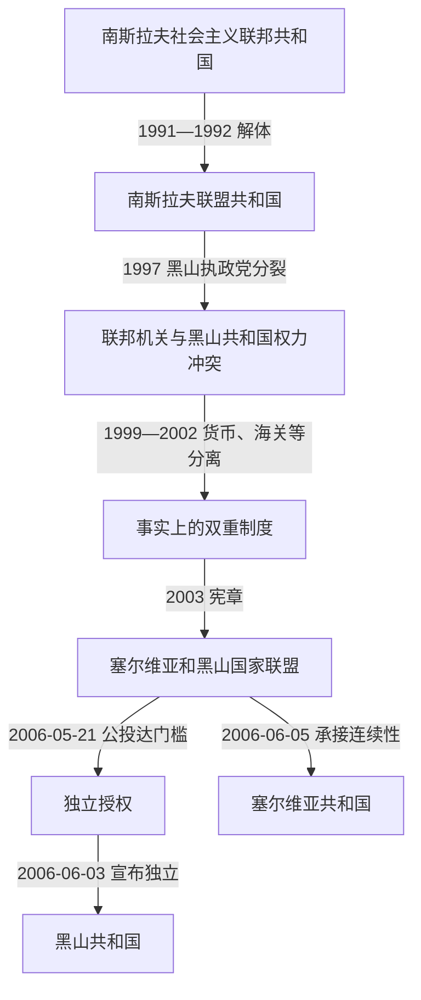

# 塞尔维亚和黑山及独立建国

## 时间

1992年—2006年

## 概括

1992年，黑山与塞尔维亚组成南斯拉夫联盟共和国。宪法上两者是拥有本国总统、议会和政府的成员共和国，共同层面另设联邦总统、议会、政府、军队与外交机构；实际权力因人口、经济和军力不对称而明显偏向塞尔维亚，1990年代又深受斯洛博丹·米洛舍维奇的党政、安全和媒体网络支配。黑山民主社会主义者党早期是其盟友，1997年分裂后，米洛·久卡诺维奇领导的共和国政府逐步建立独立货币、海关、警察和对外关系。2003年欧盟斡旋建立更松散的“塞尔维亚和黑山”国家联盟，并约定三年后可公投。2006年黑山在国际监督下以55.5%的赞成票越过55%门槛，随后恢复独立。

## 建立背景

- 1991—1992年原南斯拉夫社会主义联邦的多数共和国离开，黑山执政层仍与塞尔维亚领导层结盟，并把共同国家视为安全、市场和民族统一的延续。
- 1992年3月公投在战争、强烈官方宣传和反对派及不少穆斯林、阿尔巴尼亚族选民抵制下举行。投票者中绝大多数赞成留在共同国家，但约三分之一登记选民未投票，因此不能解释为全社会无分歧授权。
- 4月27日塞尔维亚和黑山通过南斯拉夫联盟共和国宪法。新联邦主张自动继承旧南斯拉夫国际人格，但联合国没有接受其自动保留席位，直到2000年才以新会员身份加入。
- 共同国家成立时波黑与克罗地亚战争仍在继续，联邦军、塞尔维亚安全机构和共和国机关的边界模糊，使纸面联邦主义与实际战争权力不一致。

## 国家结构与实际权力

| 层级或角色 | 法律权限 | 1990年代至2000年代的实际变化 |
|---|---|---|
| 南斯拉夫联盟共和国联邦机构 | 联邦总统、两院议会和政府负责共同外交、国防、货币等事务。 | 塞尔维亚规模占绝对多数；米洛舍维奇即使担任塞尔维亚总统，也通过执政党、军警和联邦盟友影响共同机关。 |
| 黑山共和国总统 | 代表共和国、提名政府并具有宪法职权。 | 莫米尔·布拉托维奇早期支持米洛舍维奇；久卡诺维奇1998年就任后成为反对贝尔格莱德路线的权力中心。 |
| 黑山共和国政府 | 管理经济、内务、行政和地方事务。 | 1997年后掌握共和国警察、海关、财政与媒体，逐步脱离联邦经济体系。 |
| 南斯拉夫军队 | 名义上保卫两个共和国，受联邦最高国防委员会与军方指挥。 | 领导层长期与贝尔格莱德接近；1999年黑山警察与军队间出现紧张，形成同一领土内的双重武装权力。 |
| 2003年国家联盟 | 设一院议会、部长会议和国家联盟总统，只保留少量共同事务。 | 两成员国拥有几乎分立的货币、海关和经济制度；联盟主要是过渡框架。 |

共同国家领导人与黑山共和国领导人不是同一职位。黑山本地总统、代理总统和政府首脑完整顺序见[黑山近现代国家元首与政府首脑表](/%E4%BA%BA%E6%96%87%E7%A7%91%E5%AD%A6/%E5%8E%86%E5%8F%B2/%E6%AC%A7%E6%B4%B2/%E4%B8%9C%E5%8D%97%E6%AC%A7%E4%B8%8E%E5%B7%B4%E5%B0%94%E5%B9%B2/%E9%BB%91%E5%B1%B1/%E9%BB%91%E5%B1%B1%E8%BF%91%E7%8E%B0%E4%BB%A3%E5%9B%BD%E5%AE%B6%E5%85%83%E9%A6%96%E4%B8%8E%E6%94%BF%E5%BA%9C%E9%A6%96%E8%84%91%E8%A1%A8.md)。

## 分阶段发展

### 1992年—1995年：战争、制裁与共同路线

联合国制裁、地区战争和贸易中断使旅游与工业崩溃，恶性通货膨胀摧毁第纳尔收入。走私燃油、香烟和消费品成为制裁经济的重要组成部分，也强化政党、安全机关、商人及跨境网络。黑山部队与人员在1991年杜布罗夫尼克战役中的参与，以及1992年波黑难民被拘押、遣返等事件，后来成为刑事责任、赔偿和公共记忆问题。

1995年《代顿协定》终结波黑战争，却未解决科索沃、联邦民主和黑山地位。民主社会主义者党在共和国继续执政，布拉托维奇与久卡诺维奇的路线分歧逐渐公开化。

### 1997年—2000年：执政党分裂与制度脱离

1997年民主社会主义者党分裂。久卡诺维奇在争议激烈的总统选举中以微弱优势击败布拉托维奇；后者组建社会主义人民党并继续得到米洛舍维奇支持。1998年，布拉托维奇在黑山共和国政府反对下出任联邦总理，凸显两个合法性中心。

1999年科索沃战争期间，北约轰炸联盟共和国，黑山境内亦有军事目标遭袭。久卡诺维奇政府避免全面卷入、接纳部分难民并与西方保持联系；南斯拉夫军队仍驻境内，军警对峙风险一度上升。黑山1999年引入德国马克与第纳尔并行，2000年停止使用第纳尔，财政和货币主权事实上脱离联邦。

### 2000年—2003年：米洛舍维奇下台与欧盟斡旋

2000年米洛舍维奇下台后，贝尔格莱德的民主政府要求重建可运作的联邦；黑山执政联盟则在“独立”与“重新谈判联盟”之间分裂。直接独立公投可能激化国内近乎均衡的身份阵营，也可能影响科索沃与地区稳定，欧盟因而推动暂缓分立。

2002年《贝尔格莱德协定》确定改组原则，2003年2月4日宪章生效，“塞尔维亚和黑山”取代南斯拉夫联盟共和国。共同体仅保留总统兼部长会议主席、议会、外交和防务等有限机构；两共和国分别拥有经济、货币和海关体系，并可在三年后启动地位公投。

### 2003年—2006年：公投规则与和平分立

欧盟特使与双方协商公投标准：赞成独立票须达到有效票55%，投票率须超过登记选民50%。这一高于简单多数的门槛旨在要求清楚授权，也令任何接近门槛的结果都高度敏感。2006年5月21日，投票率约86.5%，独立选项获55.5%，以约半个百分点越过门槛；国际观察总体认可程序。

黑山议会于6月3日宣布独立。塞尔维亚于6月5日确认自身为国家联盟的法律连续国，继承联合国席位和多数共同机构义务；黑山则作为新国家申请国际组织，6月28日加入联合国。军队财产、外交馆舍、债务和公民身份通过协商分配，分立没有重演1990年代初的大规模战争。

## 重要事件

1. **1992年3月共和国公投**：支持共同国家者在抵制背景下获压倒多数，为执政层提供政治授权，但代表性受到质疑。
2. **1992年4月联盟共和国成立**：新宪法规定联邦制；国际社会拒绝其自动继承旧南斯拉夫联合国席位。
3. **1992—1995年制裁经济**：恶性通胀、失业和物资短缺冲击社会，走私和非正式经济反而成为权力资源。
4. **战争责任问题**：杜布罗夫尼克行动、难民遣返及对少数群体的暴力，说明黑山既受战争外溢影响，也有本地机构参与。
5. **1997年民主社会主义者党分裂**：久卡诺维奇与布拉托维奇分别控制共和国与亲联邦阵营，黑山政治由共同路线转为国家地位竞争。
6. **1998年双重合法性冲突**：布拉托维奇任联邦总理，久卡诺维奇任黑山总统；共同机关与成员共和国对军警、选举和外交的解释相互冲突。
7. **1999年北约战争**：黑山仍受轰炸和联邦军驻扎影响，但共和国政府与贝尔格莱德保持距离，避免成为主要战区。
8. **1999—2002年货币分离**：德国马克先与第纳尔并用后成为唯一流通货币，2002年随德国转换为欧元；黑山并非欧元区或欧洲中央银行成员。
9. **2000年联盟共和国政权更替**：米洛舍维奇下台消除战争时代强制中心，却使“重建联盟还是独立”成为直接议题。
10. **2002年《贝尔格莱德协定》与2003年宪章**：欧盟促成三年过渡期，允许日后依法重新决定国家地位。
11. **2006年5月21日公投**：55.5%的有效票支持独立，恰好越过55%门槛；反对独立者主要支持与塞尔维亚保持共同国家。
12. **2006年6月和平分立**：黑山议会宣布独立，塞尔维亚承接国家联盟连续性，双方建立外交关系并协商资产和义务。

## 国家联盟松动与终结原因

### 结构因素

- 塞尔维亚人口和资源远大于黑山，平等成员的宪法形式难以抵消实际不对称；共同机关经常被视为塞尔维亚政治的延伸。
- 战争、制裁和恶性通胀损害共同国家合法性，黑山沿海旅游、贸易和对西方开放的经济利益与贝尔格莱德政策渐行渐远。
- 黑山社会对民族身份和国家归属近乎对半分裂。认同塞尔维亚民族不必然反对黑山共和国，认同黑山民族也不自动支持立即独立，政党联盟因此反复重组。
- 1997年精英分裂把宪制问题转化为权力与资源竞争；共和国独立的警察、海关、货币和外交网络使分离具备执行能力。

### 外部压力与调节

- 米洛舍维奇时期的国际孤立促使西方援助黑山改革派并容忍其事实脱离，却也担忧立即公投带来新冲突。
- 欧盟用《贝尔格莱德协定》暂时保留共同体，再以明确门槛、观察团和谈判程序降低结果争议。
- 科索沃战争、北约干预和地区国家建构改变安全环境，但黑山独立仍由本地投票与议会程序直接完成。

### 直接终结机制

国家联盟宪章允许三年后重新决定地位。到2006年，共同体只有有限机构，经济系统已分开；公投达到预定双重门槛后，议会宣告独立，塞尔维亚接受连续国身份，国际社会迅速承认。终结不是一方军事征服另一方，也不是共同国家自然“自动解散”，而是宪章授权、公投、议会决定和国家继承协商连续作用的结果。

## 演变关系

- 前一阶段：[南斯拉夫时期的黑山](/%E4%BA%BA%E6%96%87%E7%A7%91%E5%AD%A6/%E5%8E%86%E5%8F%B2/%E6%AC%A7%E6%B4%B2/%E4%B8%9C%E5%8D%97%E6%AC%A7%E4%B8%8E%E5%B7%B4%E5%B0%94%E5%B9%B2/%E9%BB%91%E5%B1%B1/%E5%8D%97%E6%96%AF%E6%8B%89%E5%A4%AB%E6%97%B6%E6%9C%9F%E7%9A%84%E9%BB%91%E5%B1%B1.md)。
- 后一阶段：[独立后的黑山](/%E4%BA%BA%E6%96%87%E7%A7%91%E5%AD%A6/%E5%8E%86%E5%8F%B2/%E6%AC%A7%E6%B4%B2/%E4%B8%9C%E5%8D%97%E6%AC%A7%E4%B8%8E%E5%B7%B4%E5%B0%94%E5%B9%B2/%E9%BB%91%E5%B1%B1/%E7%8B%AC%E7%AB%8B%E5%90%8E%E7%9A%84%E9%BB%91%E5%B1%B1.md)。
- 共同国家与解体背景：[南斯拉夫联盟共和国与塞尔维亚和黑山](/%E4%BA%BA%E6%96%87%E7%A7%91%E5%AD%A6/%E5%8E%86%E5%8F%B2/%E6%AC%A7%E6%B4%B2/%E4%B8%9C%E5%8D%97%E6%AC%A7%E4%B8%8E%E5%B7%B4%E5%B0%94%E5%B9%B2/%E5%8D%97%E6%96%AF%E6%8B%89%E5%A4%AB%E5%8E%86%E5%8F%B2/%E5%8D%97%E6%96%AF%E6%8B%89%E5%A4%AB%E8%81%94%E7%9B%9F%E5%85%B1%E5%92%8C%E5%9B%BD%E4%B8%8E%E5%A1%9E%E5%B0%94%E7%BB%B4%E4%BA%9A%E5%92%8C%E9%BB%91%E5%B1%B1.md)、[南斯拉夫解体](/%E4%BA%BA%E6%96%87%E7%A7%91%E5%AD%A6/%E5%8E%86%E5%8F%B2/%E6%AC%A7%E6%B4%B2/%E4%B8%9C%E5%8D%97%E6%AC%A7%E4%B8%8E%E5%B7%B4%E5%B0%94%E5%B9%B2/%E5%8D%97%E6%96%AF%E6%8B%89%E5%A4%AB%E5%8E%86%E5%8F%B2/%E5%8D%97%E6%96%AF%E6%8B%89%E5%A4%AB%E8%A7%A3%E4%BD%93.md)。
