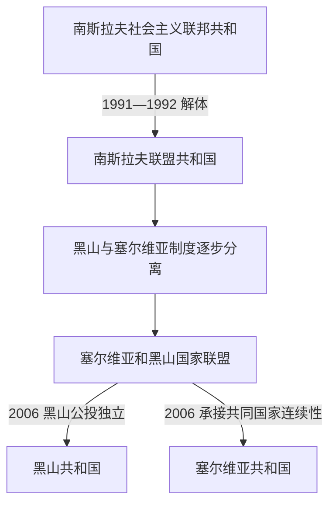

# 塞尔维亚和黑山及独立建国

## 时间

1992年—2006年

## 概括

社会主义南斯拉夫解体后，黑山与塞尔维亚组成南斯拉夫联盟共和国。战争、国际制裁和政治分化改变了双方关系；2003年共同国家改组为更松散的“塞尔维亚和黑山”，黑山最终依照约定举行公投，并在2006年恢复独立国家地位。

## 国家结构与权力变化

| 时段 | 共同国家形式 | 黑山的地位与变化 |
|---|---|---|
| 1992年—1997年前后 | 南斯拉夫联盟共和国 | 黑山是两个成员共和国之一，早期领导层与塞尔维亚及米洛舍维奇政权关系密切。 |
| 1997年前后—2003年 | 名义联邦、实际日益分离 | 黑山领导层转向独立经济和外交路线，逐步脱离联邦货币、海关与部分制度。 |
| 2003年—2006年 | 塞尔维亚和黑山国家联盟 | 两个成员国保留高度自治，并约定三年后可举行地位公投。 |
| 2006年 | 公投与分立 | 独立票越过事先约定的55%门槛；黑山宣布独立，塞尔维亚承接共同国家的国际法律连续性。 |

## 重要事件

- 1992年留在共同国家的公投受到反对派和部分少数族群抵制，不能简单视为黑山社会的一致决定。
- 南斯拉夫战争及制裁波及黑山经济和社会；黑山人员参与杜布罗夫尼克方向战争等事件也成为后续责任与记忆议题。
- 1990年代后期，黑山领导层与贝尔格莱德中央政权决裂，德国马克和后来欧元被用于支付和结算，经济制度逐步分离。
- 2003年《贝尔格莱德协定》建立松散国家联盟，以暂时管理双方分歧。
- 2006年5月21日公投中，独立选项以略高于55%的比例越过门槛；6月黑山宣布独立。
- 分立基本通过协商和公投完成，与1990年代初的暴力解体不同，但身份、财产和国家继承问题仍需制度处理。

## 演变关系

- 前一阶段：[南斯拉夫时期的黑山](/%E4%BA%BA%E6%96%87%E7%A7%91%E5%AD%A6/%E5%8E%86%E5%8F%B2/%E6%AC%A7%E6%B4%B2/%E4%B8%9C%E5%8D%97%E6%AC%A7%E4%B8%8E%E5%B7%B4%E5%B0%94%E5%B9%B2/%E9%BB%91%E5%B1%B1/%E5%8D%97%E6%96%AF%E6%8B%89%E5%A4%AB%E6%97%B6%E6%9C%9F%E7%9A%84%E9%BB%91%E5%B1%B1.md)。
- 后一阶段：[独立后的黑山](/%E4%BA%BA%E6%96%87%E7%A7%91%E5%AD%A6/%E5%8E%86%E5%8F%B2/%E6%AC%A7%E6%B4%B2/%E4%B8%9C%E5%8D%97%E6%AC%A7%E4%B8%8E%E5%B7%B4%E5%B0%94%E5%B9%B2/%E9%BB%91%E5%B1%B1/%E7%8B%AC%E7%AB%8B%E5%90%8E%E7%9A%84%E9%BB%91%E5%B1%B1.md)。
- 共同主笔记：[南斯拉夫联盟共和国与塞尔维亚和黑山](/%E4%BA%BA%E6%96%87%E7%A7%91%E5%AD%A6/%E5%8E%86%E5%8F%B2/%E6%AC%A7%E6%B4%B2/%E4%B8%9C%E5%8D%97%E6%AC%A7%E4%B8%8E%E5%B7%B4%E5%B0%94%E5%B9%B2/%E5%8D%97%E6%96%AF%E6%8B%89%E5%A4%AB%E5%8E%86%E5%8F%B2/%E5%8D%97%E6%96%AF%E6%8B%89%E5%A4%AB%E8%81%94%E7%9B%9F%E5%85%B1%E5%92%8C%E5%9B%BD%E4%B8%8E%E5%A1%9E%E5%B0%94%E7%BB%B4%E4%BA%9A%E5%92%8C%E9%BB%91%E5%B1%B1.md)与[南斯拉夫解体](/%E4%BA%BA%E6%96%87%E7%A7%91%E5%AD%A6/%E5%8E%86%E5%8F%B2/%E6%AC%A7%E6%B4%B2/%E4%B8%9C%E5%8D%97%E6%AC%A7%E4%B8%8E%E5%B7%B4%E5%B0%94%E5%B9%B2/%E5%8D%97%E6%96%AF%E6%8B%89%E5%A4%AB%E5%8E%86%E5%8F%B2/%E5%8D%97%E6%96%AF%E6%8B%89%E5%A4%AB%E8%A7%A3%E4%BD%93.md)。
