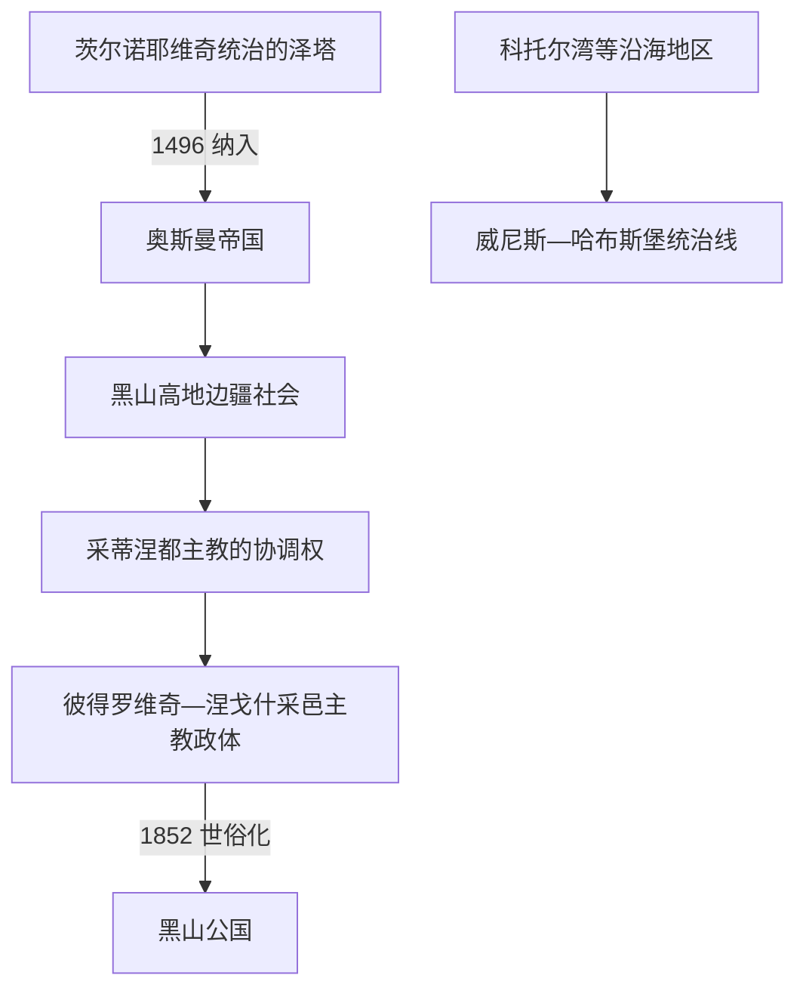

# 奥斯曼边疆、采邑主教与自治

## 时间

1496年—1852年

## 概括

泽塔内陆纳入奥斯曼体系后，现代黑山所在空间形成多层边疆：奥斯曼政府拥有宗主权并设置行政单位，高地部族共同体保有程度不一的自治和武装能力，采蒂涅东正教都主教逐步兼具宗教与世俗协调权；科托尔湾等沿海地区则长期连接威尼斯和后来的哈布斯堡世界。

## 统治结构

| 层次 | 主要主体 | 作用与限制 |
|---|---|---|
| 帝国层面 | 奥斯曼苏丹、斯库台等行政体系 | 主张宗主权、征税和军事控制，但在山地的实际执行力随战争与地方关系变化。 |
| 地方社会 | 部族、兄弟会与地方首领 | 负责土地、复仇调解、动员和防卫；内部并非统一国家机器。 |
| 宗教—政治中心 | 采蒂涅都主教，后由彼得罗维奇—涅戈什家族长期担任 | 借宗教权威、外交和部族大会推进整合；因主教独身，职位常以叔侄方式在家族内传承。 |
| 沿海地区 | 威尼斯、短期法国政权、哈布斯堡 | 科托尔湾等地的行政、法律和贸易轨迹与高地不同。 |

## 重要事件

- 16世纪初，奥斯曼一度设置黑山桑贾克；行政建制变化并未消除山地地方自治。
- 1697年达尼洛·彼得罗维奇成为采蒂涅都主教，彼得罗维奇—涅戈什家族的采邑主教传统由此稳定下来。
- 黑山高地与奥斯曼地方当局反复战争、谈判和纳贡，俄国、威尼斯及哈布斯堡也通过宗教、外交和军事关系介入。
- 1796年的马尔蒂尼奇和克鲁西战役提升彼得一世的声望；其法典和部族协调推动更稳定的政治联合。
- 彼得二世·彼得罗维奇—涅戈什在1830—1851年间发展常设机构、税收和中央权威，同时也是重要诗人和文化人物。
- 1852年，达尼洛放弃主教身份并成为世俗亲王，采邑主教政体转为黑山公国。

## 关键辨析

- 这一时期不能概括为“奥斯曼完全直接统治”或“黑山始终是完全独立国家”；宗主权、自治、征税和军事控制并不重合。
- 采邑主教并非现代意义上的总统或绝对君主，其权力依赖教会威望、家族网络、部族大会和外援。
- 现代黑山国土中的沿海地区与高地长期分属不同制度，19世纪后才逐步整合。

## 演变关系

- 前一阶段：[中世纪杜克利亚与泽塔](/%E4%BA%BA%E6%96%87%E7%A7%91%E5%AD%A6/%E5%8E%86%E5%8F%B2/%E6%AC%A7%E6%B4%B2/%E4%B8%9C%E5%8D%97%E6%AC%A7%E4%B8%8E%E5%B7%B4%E5%B0%94%E5%B9%B2/%E9%BB%91%E5%B1%B1/%E4%B8%AD%E4%B8%96%E7%BA%AA%E6%9D%9C%E5%85%8B%E5%88%A9%E4%BA%9A%E4%B8%8E%E6%B3%BD%E5%A1%94.md)。
- 后一阶段：[黑山公国与王国](/%E4%BA%BA%E6%96%87%E7%A7%91%E5%AD%A6/%E5%8E%86%E5%8F%B2/%E6%AC%A7%E6%B4%B2/%E4%B8%9C%E5%8D%97%E6%AC%A7%E4%B8%8E%E5%B7%B4%E5%B0%94%E5%B9%B2/%E9%BB%91%E5%B1%B1/%E9%BB%91%E5%B1%B1%E5%85%AC%E5%9B%BD%E4%B8%8E%E7%8E%8B%E5%9B%BD.md)。
- 共同背景：[奥斯曼—哈布斯堡分治与民族运动](/%E4%BA%BA%E6%96%87%E7%A7%91%E5%AD%A6/%E5%8E%86%E5%8F%B2/%E6%AC%A7%E6%B4%B2/%E4%B8%9C%E5%8D%97%E6%AC%A7%E4%B8%8E%E5%B7%B4%E5%B0%94%E5%B9%B2/%E5%8D%97%E6%96%AF%E6%8B%89%E5%A4%AB%E5%8E%86%E5%8F%B2/%E5%A5%A5%E6%96%AF%E6%9B%BC%E2%80%94%E5%93%88%E5%B8%83%E6%96%AF%E5%A0%A1%E5%88%86%E6%B2%BB%E4%B8%8E%E6%B0%91%E6%97%8F%E8%BF%90%E5%8A%A8.md)。
