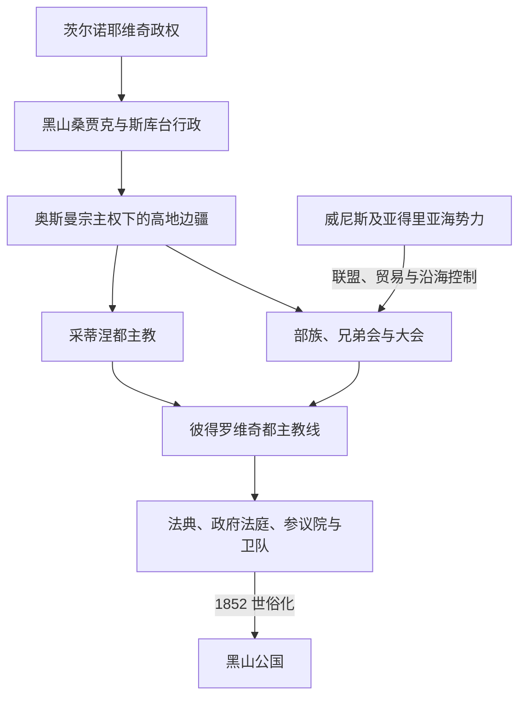

# 奥斯曼边疆、采邑主教与自治

[返回黑山历史](/%E4%BA%BA%E6%96%87%E7%A7%91%E5%AD%A6/%E5%8E%86%E5%8F%B2/%E6%AC%A7%E6%B4%B2/%E4%B8%9C%E5%8D%97%E6%AC%A7%E4%B8%8E%E5%B7%B4%E5%B0%94%E5%B9%B2/%E9%BB%91%E5%B1%B1/README.md)

## 时间

1496年—1852年

## 概括

茨尔诺耶维奇宫廷被清除后，内陆黑山进入奥斯曼帝国的法理和行政体系，却没有变成一块始终由官员、驻军和税吏均匀控制的普通低地行省。旧黑山的岩溶高地、布尔达诸部、泽塔平原和科托尔湾沿海形成多层边疆：奥斯曼在低地城镇、交通线和征税册上力量较强；部族及兄弟会在高地负责土地、复仇、裁判和动员；采蒂涅都主教借宗教声望、部族大会和外交逐步成为共同政治中心；威尼斯及其后的法国、哈布斯堡则控制多数海湾城市。1697年以后彼得罗维奇—涅戈什家族使都主教职位趋于连续，1796年后才通过法典和常设机关明显走向国家化，1852年世俗化是直接制度终点。

完整都主教、共治者、世俗实际统治者、总督与彼得罗维奇继承见[黑山采邑主教与彼得罗维奇王朝世系表](/%E4%BA%BA%E6%96%87%E7%A7%91%E5%AD%A6/%E5%8E%86%E5%8F%B2/%E6%AC%A7%E6%B4%B2/%E4%B8%9C%E5%8D%97%E6%AC%A7%E4%B8%8E%E5%B7%B4%E5%B0%94%E5%B9%B2/%E9%BB%91%E5%B1%B1/%E9%BB%91%E5%B1%B1%E9%87%87%E9%82%91%E4%B8%BB%E6%95%99%E4%B8%8E%E5%BD%BC%E5%BE%97%E7%BD%97%E7%BB%B4%E5%A5%87%E7%8E%8B%E6%9C%9D%E4%B8%96%E7%B3%BB%E8%A1%A8.md)。

## 建立背景与边疆结构

1496年久拉季·茨尔诺耶维奇离境，1499年奥斯曼把黑山并入斯库台桑贾克。伊万·茨尔诺耶维奇之子斯塔尼沙皈依伊斯兰后称“斯肯德尔贝格·茨尔诺耶维奇”，1513年前后受任黑山桑贾克贝伊；约1530年这一单独建制被撤销，再归斯库台系统。这说明早期并非奥斯曼“从不进入”，而是确有税籍、官职、军事远征和地方代理人。

帝国控制受到三个条件限制：山地农业剩余少、道路和补给困难；部族能以武装共同体拒缴或谈判；威尼斯和哈布斯堡边界为逃亡、走私与结盟提供出口。因此纳贡、免税、反抗、赦免和再登记反复出现。同一时期，波德戈里察、斯库台、尼克希奇等低地据点可能有较稳定官军，高地村社却主要由本地首领治理。

## 分阶段发展

### 奥斯曼行政与高地部族重组：1496—1697年

16世纪税籍把村落、家户和特殊赋役纳入帝国财政，一些社群以定额税换取自理。布尔达、库奇、皮佩里、别洛帕夫利奇等部族的政治轨迹各异，不能视作统一服从采蒂涅。佩奇宗主教区1557年恢复后，采蒂涅都主教通常位于其教会体系内；宗教领导、地方调停和对外联络逐渐增加政治意义，但早期都主教不等同于拥有常设国家机器的君主。

17世纪的克里特战争和摩里亚战争使威尼斯动员黑山部族进攻奥斯曼。部族领袖会接受威尼斯军饷、旗帜或称号，也会同奥斯曼议和。1687年黑山武装协助威尼斯夺取新海尔采格；1692年奥斯曼反攻并毁坏旧采蒂涅修道院。战争扩大了都主教协调角色，也暴露对外援和部族合作的不稳定。

### 彼得罗维奇都主教政治的稳定：1697—1784年

1697年部族大会选出达尼洛·彼得罗维奇。由于东正教主教独身，继承不能由父传子，彼得罗维奇家族逐渐形成叔侄或旁系亲属接班。达尼洛寻求俄国援助，1711年响应彼得大帝使者发动反奥斯曼行动；1712、1714年的惩罚性远征迫使人口避入山地并破坏采蒂涅，显示俄援承诺与本地承受成本并不对等。

萨瓦二世作风较谨慎，其堂弟瓦西里耶三世在1750—1766年与他共掌教会和外交，积极赴俄筹款并宣传黑山政治地位。两人不是简单前后相继。1766年奥斯曼废除佩奇宗主教区，改变了采蒂涅都主教的教会环境，但“自动成为完全独立教会”的法律解释后来仍有争议。

1767年冒称已故俄国沙皇彼得三世的什切潘·马利获得部族支持，实际压过萨瓦二世。他建立较集中的裁判，限制私斗并改善道路，证明世俗强人也能在部族政治中形成权威；1773年遇刺后，萨瓦恢复名义主导。1781年萨瓦去世，阿尔塞尼耶·普拉梅纳茨短期继任，彼得罗维奇世袭式连续一度中断。

### 彼得一世与公共秩序的形成：1784—1830年

彼得一世在1782年被推举，1784年完成祝圣。1785年斯库台的马哈茂德帕夏·布沙特里攻入并焚毁采蒂涅，显示都主教权威仍不足以阻止地方帕夏进攻。1796年马尔蒂尼奇和克鲁西两战中，旧黑山与布尔达联军击败马哈茂德帕夏，后者在克鲁西战死。胜利提高彼得一世的声望，使别洛帕夫利奇、皮佩里等与旧黑山的政治联结更稳固；这常被视为事实独立的重要节点，但列强对主权的正式承认仍在1878年。

1796年部族首领订立《共同誓约》，1798年大会通过《黑山与布尔达总法典》并设“黑山与布尔达政府法庭”，1803年又扩充条文。机关经费、执行和覆盖仍有限，却把跨部族裁判、治安与税费变成共同事务。拿破仑战争期间，彼得一世、俄国与海湾居民在1806—1807年和1813年争夺科托尔湾；1813年黑山曾短期参与管理，但1814—1815年列强把海湾交给奥地利。因此军事进入不等于永久并入。

### 彼得二世的中央化：1830—1851年

彼得一世指定年轻侄孙拉德·托莫夫继承，后者成为彼得二世。初期，世俗总督武科拉伊·拉多尼奇和彼得罗维奇家族之间争权。彼得二世在1830年削弱、1832年正式取消总督职并放逐拉多尼奇，把对外联络和世俗权力集中到采蒂涅。

1831年成立黑山与布尔达参议院，另设卫队和近侍卫队；1833年以后尝试征收固定户税，在地方设置队长和法院，并借俄国补助维持机关。改革受到逃税、部族抵制和人员依附家族的限制，中央化不是一次完成。彼得二世还重建印刷、开办学校，1847年出版《山地花环》，把国家建设、东正教文化和南斯拉夫思想结合起来。

对外方面，他两次试图夺取波德戈里察未果，同黑塞哥维那帕夏围绕格拉霍沃冲突，又与奥地利解决部分边界和修道院财产问题。缺乏海港和国际承认继续约束财政。1851年彼得二世病逝，兄长佩罗凭参议院职位争取继承；指定继承人达尼洛在俄国支持下胜出，并决定不受祝圣，1852年改称世俗亲王。

## 复合统治结构

| 权力层次 | 机构 / 人物 | 实际能力 | 限制 |
|---|---|---|---|
| 奥斯曼宗主与行省 | 苏丹、斯库台桑贾克、波德戈里察及周边帕夏 | 册封、征税登记、驻守低地、发动远征、接受名义纳贡。 | 难在所有高地持续驻军和执行裁判；地方帕夏也可能高度自主。 |
| 都主教 | 采蒂涅主教，1697年后主要由彼得罗维奇家族担任 | 宗教权威、外交、调解、召集大会、争取俄国资助。 | 无稳定世袭父子线；依赖部族接受、教会祝圣与外援，早期缺乏常设行政。 |
| 部族大会 | 各部首领、兄弟会和全体性大会 | 战争动员、推举都主教、订立誓约、承认法典。 | 决议执行依靠地方网络，部族利益可压倒共同政策。 |
| 世俗总督 | 18世纪中叶后拉多尼奇家族等 | 对威尼斯外交、军事协调，并可与都主教竞争。 | 职权从未完全标准化；1832年被彼得二世废除。 |
| 共同机关 | 1798年政府法庭；1831年参议院、卫队、近侍卫队 | 跨部族裁判、行政、警务和税收，是中央国家雏形。 | 经费少、覆盖不均，常由彼得罗维奇亲属和首领控制。 |
| 沿海统治 | 威尼斯至1797年；法国1806—1813年间分段控制；奥地利自1814年 | 港口法律、海关、城防与贸易管理。 | 与内陆高地政治分轨；短期军事合作不等于黑山主权。 |

## 重要事件

1. **1513—约1530年黑山桑贾克**：斯肯德尔贝格·茨尔诺耶维奇任桑贾克贝伊，显示奥斯曼通过本地改宗精英整合，而非只靠外来驻军。
2. **1557年佩奇宗主教区恢复**：重建塞尔维亚东正教教会网络，采蒂涅都主教在帝国基督徒制度中活动。
3. **1645—1699年威尼斯—奥斯曼战争周期**：部族与威尼斯合作、反复议和，使黑山成为跨帝国军事边疆。
4. **1687年新海尔采格战役与1692年采蒂涅毁坏**：一进一退说明沿海胜利不能消除奥斯曼反攻能力。
5. **1697年达尼洛当选**：彼得罗维奇长期都主教线开始，政治协调获得家族连续性。
6. **1711年俄国号召及1712、1714年远征**：黑山进入俄国—奥斯曼竞争，外援同时带来报复风险。
7. **1750—1766年萨瓦—瓦西里耶共治**：宗教名义首领与活跃外交者分工并竞争，不能合并为单一统治者。
8. **1767—1773年什切潘·马利实际统治**：非王朝人物压过都主教，以裁判和治安获得服从，终因刺杀而结束。
9. **1785年马哈茂德帕夏焚毁采蒂涅**：暴露部族分散和防御弱点。
10. **1796年马尔蒂尼奇、克鲁西两战**：击败斯库台帕夏，推动旧黑山和布尔达政治结合。
11. **1796—1803年誓约、法典与政府法庭**：以公共法和机关替代纯粹部族调解，是中央化的关键。
12. **1813—1815年科托尔湾归属转折**：黑山短期参与占领，维也纳体系最终把海湾交给奥地利，揭示列强决定边界的力量。
13. **1831—1833年参议院、卫队和户税**：彼得二世建立较常设的行政、警务和财政。
14. **1832年废总督职**：彼得罗维奇排除世俗竞争中心，中央权力进一步集中。
15. **1851—1852年继承危机与世俗化**：佩罗与达尼洛竞争，俄国支持和大会确认使达尼洛胜出；他拒绝祝圣，采邑主教政体直接终结。

## 崛起、局限与终结原因

### 崛起条件

- 部族需要一个能调停复仇、组织对外战争且不直接取代其内部自治的共同中心。
- 都主教拥有跨部族宗教网络，彼得罗维奇又以家族化继承减少职位争夺。
- 俄国资助、威尼斯与奥地利边境贸易提供武器、现金和外交承认。
- 1796年军事胜利及法典使“共同防务”逐步转为“共同司法和财政”。

### 结构局限

- 山地贫瘠、缺少海港和稳定税源，常设机关依赖俄国补助。
- 部族自治、私斗和逃税削弱中央执行，旧黑山和布尔达也非天然一体。
- 沿海不在采蒂涅直接统治下，现代国土尚未形成。
- 奥斯曼和地方帕夏仍能在低地驻军并发动远征，国际上也没有普遍承认黑山主权。

### 直接终结

彼得二世去世暴露“独身主教由亲属继承”的制度矛盾。达尼洛若受祝圣便不能结婚生子，也难建立明确世俗继承；若继续由参议院和部族大会推举，佩罗等家族长辈仍可争位。1852年达尼洛在俄国支持下改称亲王，把宗教职位交还教会人员，以父系王朝、法典和世俗行政取代采邑主教制。

## 演变关系

- 前一阶段：[中世纪杜克利亚与泽塔](/%E4%BA%BA%E6%96%87%E7%A7%91%E5%AD%A6/%E5%8E%86%E5%8F%B2/%E6%AC%A7%E6%B4%B2/%E4%B8%9C%E5%8D%97%E6%AC%A7%E4%B8%8E%E5%B7%B4%E5%B0%94%E5%B9%B2/%E9%BB%91%E5%B1%B1/%E4%B8%AD%E4%B8%96%E7%BA%AA%E6%9D%9C%E5%85%8B%E5%88%A9%E4%BA%9A%E4%B8%8E%E6%B3%BD%E5%A1%94.md)。
- 后一阶段：[黑山公国与王国](/%E4%BA%BA%E6%96%87%E7%A7%91%E5%AD%A6/%E5%8E%86%E5%8F%B2/%E6%AC%A7%E6%B4%B2/%E4%B8%9C%E5%8D%97%E6%AC%A7%E4%B8%8E%E5%B7%B4%E5%B0%94%E5%B9%B2/%E9%BB%91%E5%B1%B1/%E9%BB%91%E5%B1%B1%E5%85%AC%E5%9B%BD%E4%B8%8E%E7%8E%8B%E5%9B%BD.md)。
