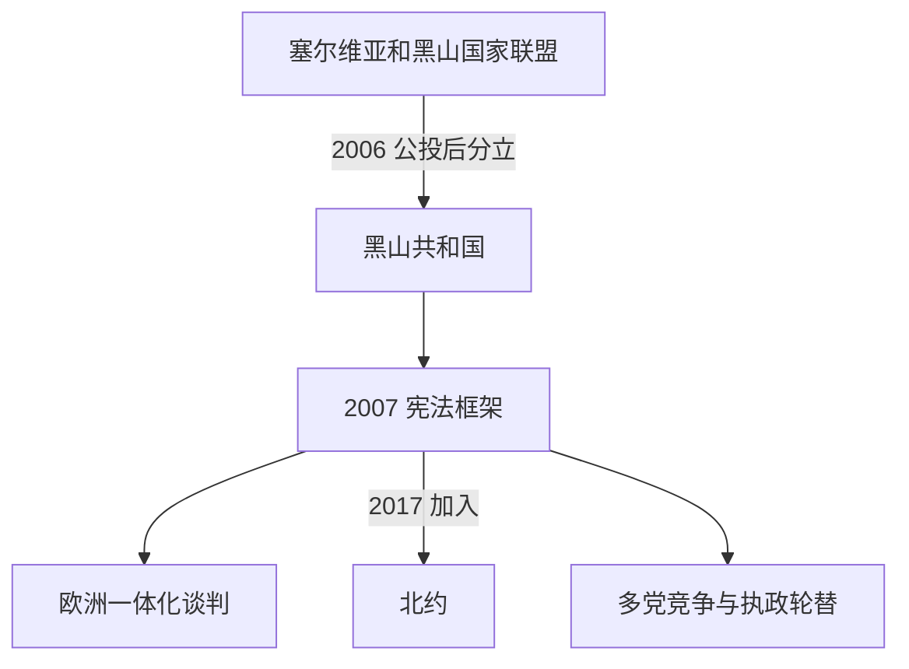

# 独立后的黑山

## 时间

2006年至今

## 概括

2006年独立后，黑山建立议会共和制，持续推进欧洲一体化并于2017年加入北约。国家建设同时围绕黑山人和塞尔维亚人身份、语言名称、东正教组织、政党轮替、法治和经济发展展开；旅游业和外来投资带来增长，也增加地区差异与外部依赖。

## 统治结构

| 角色 | 制度位置 | 说明 |
|---|---|---|
| 总统 | 国家元首 | 由选举产生，承担代表国家及宪法规定的职能。 |
| 总理与政府 | 行政权核心 | 依赖议会多数，联合政府和政党协商对施政稳定性影响显著。 |
| 议会 | 立法机关 | 负责立法、监督政府并体现多党和多族群政治竞争。 |
| 地方政府 | 市镇层级 | 在沿海旅游区、北部山区和多民族地区面对不同发展与治理议题。 |

## 重要事件与走向

- 2007年宪法确立独立共和国制度，并在国家语言、族群平等和公民身份之间建立法律框架。
- 黑山于2010年获得欧盟候选国地位，2012年启动入盟谈判；司法、法治、媒体环境和反腐败改革成为长期议题。
- 2017年加入北约，标志安全政策进一步进入欧洲—大西洋体系。
- 2020年议会选举后出现独立以来首次中央层面的执政联盟轮替，随后多次政府重组显示政党体系仍在调整。
- 围绕塞尔维亚正教会、黑山正教会、宗教财产及历史记忆的争论与族群、语言和国家认同问题交织。
- 黑山人、塞尔维亚人、波斯尼亚克人、阿尔巴尼亚人、克罗地亚人、罗姆人等共同构成国家人口；民族身份和所用语言不能简单相互替代。
- 以旅游、服务业和外来资本为核心的经济促进沿海发展，也带来地区不平衡、债务、生态与基础设施压力。

## 关键辨析

- “黑山人”既可指公民身份，也可指民族身份；黑山国籍、民族认同、宗教归属和语言选择并非一一对应。
- 2006年独立不是“从未有国家到首次建国”，也不是中世纪政权的无缝恢复，而是在南斯拉夫和塞黑国家联盟解体后建立的当代共和国。
- 加入北约与推进欧盟谈判是两条相关但制度不同的进程。

## 演变关系

- 前一阶段：[塞尔维亚和黑山及独立建国](/%E4%BA%BA%E6%96%87%E7%A7%91%E5%AD%A6/%E5%8E%86%E5%8F%B2/%E6%AC%A7%E6%B4%B2/%E4%B8%9C%E5%8D%97%E6%AC%A7%E4%B8%8E%E5%B7%B4%E5%B0%94%E5%B9%B2/%E9%BB%91%E5%B1%B1/%E5%A1%9E%E5%B0%94%E7%BB%B4%E4%BA%9A%E5%92%8C%E9%BB%91%E5%B1%B1%E5%8F%8A%E7%8B%AC%E7%AB%8B%E5%BB%BA%E5%9B%BD.md)。
- 共同国家背景：[南斯拉夫联盟共和国与塞尔维亚和黑山](/%E4%BA%BA%E6%96%87%E7%A7%91%E5%AD%A6/%E5%8E%86%E5%8F%B2/%E6%AC%A7%E6%B4%B2/%E4%B8%9C%E5%8D%97%E6%AC%A7%E4%B8%8E%E5%B7%B4%E5%B0%94%E5%B9%B2/%E5%8D%97%E6%96%AF%E6%8B%89%E5%A4%AB%E5%8E%86%E5%8F%B2/%E5%8D%97%E6%96%AF%E6%8B%89%E5%A4%AB%E8%81%94%E7%9B%9F%E5%85%B1%E5%92%8C%E5%9B%BD%E4%B8%8E%E5%A1%9E%E5%B0%94%E7%BB%B4%E4%BA%9A%E5%92%8C%E9%BB%91%E5%B1%B1.md)。
