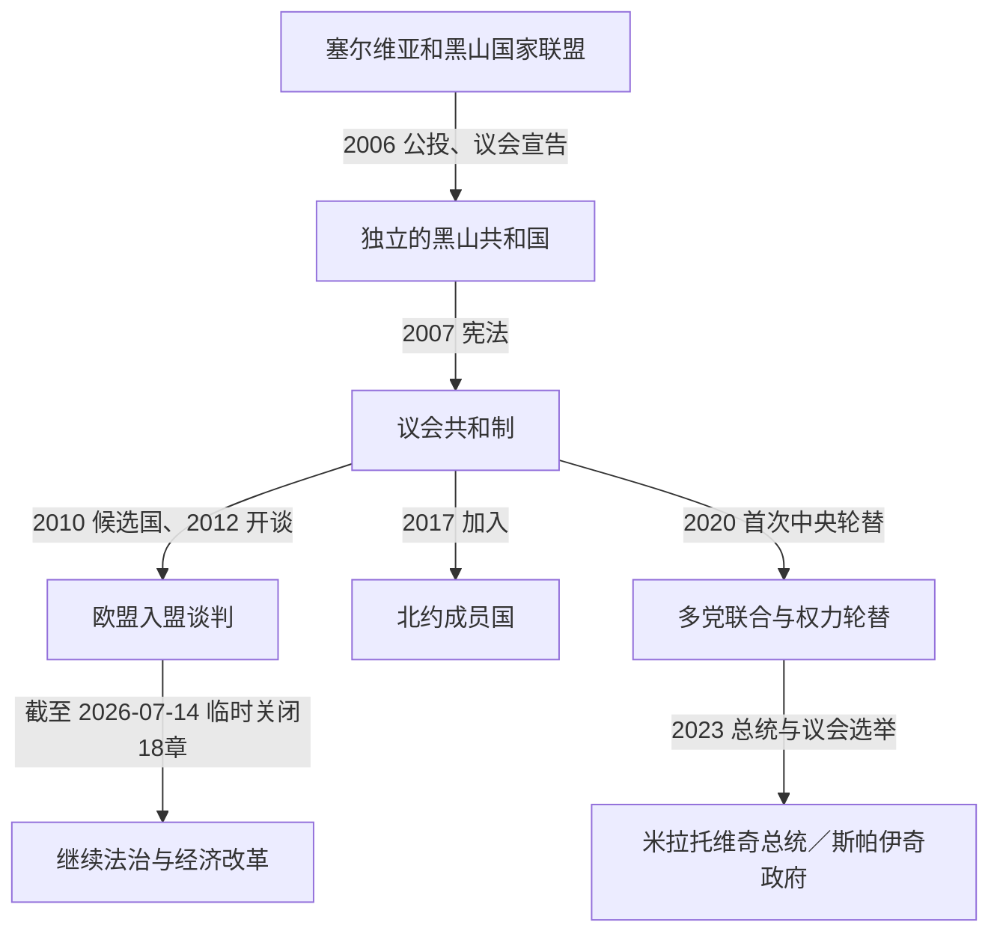

# 独立后的黑山

## 时间

2006年至今；现状核验截止2026年7月14日。

## 概括

2006年恢复独立后，黑山建立议会共和制，沿用欧元，加入联合国、北约并推进欧盟入盟谈判。独立后的前十四年仍由民主社会主义者党及米洛·久卡诺维奇主导；2020年议会选举首次在中央层面实现执政党轮替，此后出现技术官僚政府、少数政府和广泛联合政府。国家政治持续围绕法治改革、塞尔维亚正教会与黑山国家关系、黑山人与塞尔维亚人身份、语言、对俄或欧洲—大西洋取向以及经济发展模式展开。到2026年7月14日，总统为雅科夫·米拉托维奇，总理为米洛伊科·斯帕伊奇，议会议长为安德里亚·曼迪奇；欧盟谈判已有18个章节获临时关闭，但加入日期仍取决于后续改革和成员国一致批准。

## 建国与制度框架

- 2006年6月3日议会依据公投结果宣布独立，6月28日黑山成为联合国会员国。塞尔维亚承接原国家联盟的国际法连续性，黑山则以新国家身份加入国际组织。
- 2007年宪法把黑山规定为公民、民主、生态和社会正义国家，确立总统、议会、政府、法院和地方自治的权限。
- 黑山语为官方语言；塞尔维亚语、波斯尼亚语、阿尔巴尼亚语和克罗地亚语也可正式使用。语言选择与民族、宗教或政治身份相关，却不是一一对应关系。
- 总统由直选产生，承担国家代表、提名总理人选等宪法职责；行政权核心是依赖议会信任的总理和政府。议会是一院制，政党和少数民族名单通过选举组成多数。
- 黑山自独立前已单方面使用欧元，独立后继续沿用。它不因此成为欧元区或欧洲中央银行决策成员，货币安排既降低汇率风险，也使国家没有独立货币政策和最后贷款人工具。

## 政治阶段

| 阶段 | 执政与制度特征 | 主要结果 |
|---|---|---|
| 2006年—2010年 | 民主社会主义者党主导建国、宪法和国际承认；久卡诺维奇在总统、总理及党主席角色间保持核心影响。 | 国家机关和外交体系完成分立，欧盟给予免签并在2010年授予候选国地位。 |
| 2010年—2016年 | 欧盟改革议程与民主社会主义者党连续执政并行；伊戈尔·卢克希奇短暂任总理后久卡诺维奇再度组阁。 | 2012年开启入盟谈判，法治章节成为长期核心；政商关系、媒体安全和腐败问题受持续批评。 |
| 2016年—2020年 | 杜什科·马尔科维奇任总理，久卡诺维奇2018年当选总统；安全政策向北约靠拢。 | 2017年加入北约；2019年宗教自由法引发大规模宗教游行并重组反对阵营。 |
| 2020年—2022年 | 三个反民主社会主义者党联盟组成兹德拉夫科·克里沃卡皮奇政府，执政联盟从亲塞尔维亚政党到公民改革派差异极大。 | 首次中央轮替结束民主社会主义者党长期执政；宗教法修订，但政府因人事、教会、身份和欧洲政策争执失去支持。 |
| 2022年—2023年 | 德里坦·阿巴佐维奇少数政府成立，签署与塞尔维亚正教会的基础协议；政府同年8月失去议会信任后长期看守。 | 宪法法院缺额、总统与议会冲突和迟延选举造成制度危机；2023年选举开启新一轮重组。 |
| 2023年至今 | 米拉托维奇当选总统，斯帕伊奇领导的“欧洲现在”运动成为议会最大党并组建多党政府；2024年扩阁吸纳亲塞尔维亚与少数民族政党。 | 民主社会主义者党首次同时失去总统和政府核心；欧盟谈判加速，但联合政府内部对身份、外交和人事仍有分歧。 |

历任总统、代理总统、总理及其党派和在任转折，见[黑山近现代国家元首与政府首脑表](/%E4%BA%BA%E6%96%87%E7%A7%91%E5%AD%A6/%E5%8E%86%E5%8F%B2/%E6%AC%A7%E6%B4%B2/%E4%B8%9C%E5%8D%97%E6%AC%A7%E4%B8%8E%E5%B7%B4%E5%B0%94%E5%B9%B2/%E9%BB%91%E5%B1%B1/%E9%BB%91%E5%B1%B1%E8%BF%91%E7%8E%B0%E4%BB%A3%E5%9B%BD%E5%AE%B6%E5%85%83%E9%A6%96%E4%B8%8E%E6%94%BF%E5%BA%9C%E9%A6%96%E8%84%91%E8%A1%A8.md)。

## 统治结构与实际权力

| 角色 | 法律位置 | 实际政治特征 |
|---|---|---|
| 总统 | 直选国家元首，公布法律、代表国家并依宪法提出总理人选等。 | 权限小于政府，但直选合法性、外交活动和对议会多数的解释可影响组阁危机。 |
| 总理与政府 | 执行法律、制定政策、管理行政与谈判入盟。 | 多党联盟使副总理、部长和执政党领袖之间的协商成为实际决策核心。 |
| 议会 | 立法、预算、监督、任免政府并选举部分司法和独立机构人员。 | 小党和少数民族党常在组阁中拥有关键票；抵制和程序冲突曾削弱机构运作。 |
| 司法与检察系统 | 宪法上独立，负责审判、宪法审查和有组织犯罪案件。 | 高级任命长期受政治僵局影响；欧盟以司法独立、反腐和最终判决作为谈判衡量重点。 |
| 政党、教会与媒体 | 无国家权力或仅依一般法律活动。 | 民主社会主义者党的长期网络、塞尔维亚正教会的社会动员、商业媒体与外部信息影响均能改变选举和联盟。 |
| 地方政府 | 管理市镇公共事务。 | 波德戈里察、沿海、北部及阿尔巴尼亚族或波斯尼亚克聚居市镇的政治和发展诉求差异明显。 |

## 重要事件

1. **2006年独立与国际承认**：议会落实公投授权，黑山加入联合国并与塞尔维亚协商国家继承、国籍、军产和外交资产。
2. **2007年宪法**：建立当代公民共和国框架，同时把语言、国旗、国歌和教会历史带入新的身份政治。
3. **2010年欧盟候选国与2012年谈判启动**：入盟进程把司法、基本权利、公共采购、竞争、环境和行政能力纳入长期改革。
4. **2014年高速公路贷款与2022年首段通车**：黑山向中国进出口银行融资建设巴尔—博利亚雷高速公路优先段，改善山区交通，也引发债务、成本、环境和合同透明度争论。
5. **2016年选举日政变案争议**：检方指控境外和本地人员策划暴力阻止北约路线，案件经历定罪撤销、重审和持续法律争论，成为安全与司法政治化互相指控的焦点。
6. **2017年加入北约**：黑山进入集体防务体系；支持者强调安全与西方整合，反对者援引1999年轰炸记忆、中立或亲俄立场。
7. **2019—2020年宗教自由法与游行**：有关宗教财产登记的条款引发塞尔维亚正教会领导的大规模“礼拜游行”，政府更替后相关条款被修改。
8. **2020年首次中央执政轮替**：三个立场不同的反对派联盟取得多数，克里沃卡皮奇政府上台，和平轮替提升选举竞争性，也暴露联盟治理困难。
9. **2021年采蒂涅都主教就任冲突**：警察、抗议者和教会活动围绕仪式发生严重对峙，显示教会管辖、历史首都和民族身份仍高度敏感。
10. **2022年两届政府危机**：克里沃卡皮奇政府被不信任案推翻；阿巴佐维奇少数政府成立后也失去信任，却作为看守政府延续到2023年。
11. **2022—2023年宪法法院僵局**：法官缺额一度使法院无法形成裁判多数，选举申诉和权力交接受阻；议会后来完成部分任命。
12. **2023年总统和议会选举**：米拉托维奇击败长期主导政坛的久卡诺维奇；“欧洲现在”运动在议会选举中居首，斯帕伊奇于10月31日组阁。
13. **2024年广泛扩阁**：政府吸纳“为了黑山未来”阵营及波斯尼亚克党等力量，议会支持扩大；同时对历史决议、双重国籍、语言和对邻国政策的分歧加深。
14. **2024—2026年欧盟谈判加速**：法治临时基准取得进展后，多个章节相继临时关闭。到2026年7月14日，竞争政策与关税同盟章节在入盟会议上临时关闭，总数达到18个。
15. **持续的经济与生态议题**：旅游、房地产、能源和外资拉动增长，但季节性就业、住房压力、海岸开发、北部人口外流和气候风险限制均衡发展。

## 国家整合与发展条件

- 2006年公投虽接近门槛，却在国际监督和明确规则下完成，反对独立阵营随后进入议会竞争，避免了国家建立的暴力断裂。
- 亚得里亚海旅游、港口、侨汇和外来投资提供财政与就业，较小人口规模使制度转换和国际谈判能够集中资源。
- 欧盟候选框架提供法律标准、资金和外部监督；北约成员资格提供安全锚点。
- 多民族政党、少数民族保留席位安排和地方自治，使波斯尼亚克、阿尔巴尼亚、克罗地亚等群体能够参与组阁，独立阵营在2006年也因此获得关键支持。

## 长期矛盾与风险

### 政治结构

- 民主社会主义者党长期执政形成政党、行政、国企和商业网络；轮替后新政党众多、组织较弱，反腐与政治报复之间的界线常受争议。
- 议会多数碎片化，身份议题容易推翻政府或延迟司法任命。制度危机并不等同国家崩溃，但会拖慢欧盟改革。
- 有组织犯罪、烟草走私遗产、媒体人遇袭与高级腐败案件削弱公众信任；进展须以独立调查和终局判决衡量。

### 身份与外部关系

- “黑山人”既可指民族，也可指所有公民；民族认同、所用语言、教会归属和对塞尔维亚关系并非固定组合。
- 塞尔维亚是最密切的社会经济伙伴之一，塞尔维亚、俄罗斯、欧盟、美国、土耳其和中国又分别通过媒体、宗教、投资、安全或外交产生影响。
- 承认科索沃、对俄制裁、斯雷布雷尼察记忆和与克罗地亚的海洋及战争遗留问题，会在国内联盟和邻国关系中交叉出现。

### 经济与环境

- 高度依赖旅游和房地产使经济容易受疫情、地缘冲突和外部融资条件影响；单方面欧元化限制宏观调控工具。
- 沿海和首都吸引人口与资本，北部山区持续外流。大型交通和能源项目必须在联通、债务、自然保护与地方收益之间权衡。
- 宪法“生态国家”原则与实际开发冲突明显，海岸城市化、塔拉河流域、空气污染和废物管理均是入盟改革内容。

## 截止2026年7月14日的现状

| 职位或进程 | 现状 | 说明 |
|---|---|---|
| 总统 | 雅科夫·米拉托维奇 | 2023年5月20日就任；2024年退出“欧洲现在”运动后以无党籍身份任职。 |
| 总理 | 米洛伊科·斯帕伊奇 | 2023年10月31日就任，领导多党联合政府。 |
| 议会议长 | 安德里亚·曼迪奇 | 2023年10月就任，来自新塞尔维亚民主党，是执政议会联盟的重要领袖。 |
| 欧盟谈判 | 18个章节已临时关闭 | “临时关闭”仍可在入盟前重新审视；所有章节、入盟条约和成员国批准尚未全部完成。 |
| 北约 | 2017年起为成员国 | 参与集体防务，同时国内仍有反对和历史记忆争议。 |
| 货币 | 欧元 | 单方面使用，不拥有欧洲中央银行欧元区成员权。 |

欧盟方面提出的2028年前后完成加入目标是政治愿景而非既定日期；最终取决于改革绩效、谈判关闭、条约签署和所有成员国批准。

## 演变关系

- 前一阶段：[塞尔维亚和黑山及独立建国](/%E4%BA%BA%E6%96%87%E7%A7%91%E5%AD%A6/%E5%8E%86%E5%8F%B2/%E6%AC%A7%E6%B4%B2/%E4%B8%9C%E5%8D%97%E6%AC%A7%E4%B8%8E%E5%B7%B4%E5%B0%94%E5%B9%B2/%E9%BB%91%E5%B1%B1/%E5%A1%9E%E5%B0%94%E7%BB%B4%E4%BA%9A%E5%92%8C%E9%BB%91%E5%B1%B1%E5%8F%8A%E7%8B%AC%E7%AB%8B%E5%BB%BA%E5%9B%BD.md)。
- 共同国家背景：[南斯拉夫联盟共和国与塞尔维亚和黑山](/%E4%BA%BA%E6%96%87%E7%A7%91%E5%AD%A6/%E5%8E%86%E5%8F%B2/%E6%AC%A7%E6%B4%B2/%E4%B8%9C%E5%8D%97%E6%AC%A7%E4%B8%8E%E5%B7%B4%E5%B0%94%E5%B9%B2/%E5%8D%97%E6%96%AF%E6%8B%89%E5%A4%AB%E5%8E%86%E5%8F%B2/%E5%8D%97%E6%96%AF%E6%8B%89%E5%A4%AB%E8%81%94%E7%9B%9F%E5%85%B1%E5%92%8C%E5%9B%BD%E4%B8%8E%E5%A1%9E%E5%B0%94%E7%BB%B4%E4%BA%9A%E5%92%8C%E9%BB%91%E5%B1%B1.md)。
