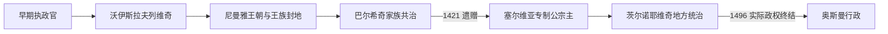

# 黑山中世纪统治者世系表

[返回黑山历史](/%E4%BA%BA%E6%96%87%E7%A7%91%E5%AD%A6/%E5%8E%86%E5%8F%B2/%E6%AC%A7%E6%B4%B2/%E4%B8%9C%E5%8D%97%E6%AC%A7%E4%B8%8E%E5%B7%B4%E5%B0%94%E5%B9%B2/%E9%BB%91%E5%B1%B1/README.md) · [中世纪杜克利亚与泽塔](/%E4%BA%BA%E6%96%87%E7%A7%91%E5%AD%A6/%E5%8E%86%E5%8F%B2/%E6%AC%A7%E6%B4%B2/%E4%B8%9C%E5%8D%97%E6%AC%A7%E4%B8%8E%E5%B7%B4%E5%B0%94%E5%B9%B2/%E9%BB%91%E5%B1%B1/%E4%B8%AD%E4%B8%96%E7%BA%AA%E6%9D%9C%E5%85%8B%E5%88%A9%E4%BA%9A%E4%B8%8E%E6%B3%BD%E5%A1%94.md)

## 使用说明

本表按“在当时政治结构中被承认为统治者、共治者、摄政者、宗主或主要地方领主”列序，而不把所有人都称为现代黑山君主。10—12世纪年代主要来自后世编年与零散拜占庭、教廷文书，常只能写“约”；尼曼雅王朝时期的泽塔掌有者并非独立君主；1421年后的宗主、地方领主和沿海势力又有并立。1496年后几位茨尔诺耶维奇继承人只有名义或受制地位，不延长中世纪独立政权的寿命。

## 早期杜克利亚与沃伊斯拉夫列维奇

| 顺序 | 姓名与称号 | 在位 / 掌权 | 与前任关系 | 关键事件与争议说明 |
|---:|---|---|---|---|
| 1 | 彼得 / 彼得里斯拉夫，执政官 | 约10世纪末 | 不详 | 印玺证明其受拜占庭承认为地方执政官；具体疆域和家族关系不详。 |
| 2 | 约万·弗拉基米尔，亲王 | 约1000年—1016年5月22日 | 继承关系不详 | 臣服保加利亚沙皇萨穆伊尔并与其家族联姻；被伊万·弗拉迪斯拉夫诱杀，后受圣人崇拜。 |
| 3 | **斯特凡·沃伊斯拉夫**，亲王 | 1018年后—约1043年；1030年代一度被俘 | 或与早期王族有关，确切谱系有争议 | 反抗拜占庭，1042年图杰米利胜利后巩固杜克利亚、特拉武尼亚等地自主，创沃伊斯拉夫列维奇统治。 |
| 摄政 / 共理 | 内达，王太后 | 约1043—1046年，年代与角色存疑 | 沃伊斯拉夫遗孀、米哈伊洛等人之母 | 后世传统称她同诸子共同处理继承；同时代证据不足，不宜视为独立女王。 |
| 4 | **米哈伊洛一世**，亲王，后称王 | 约1046年—1081年 | 沃伊斯拉夫之子 | 平衡拜占庭与罗马；1077—1078年前后获教廷称“斯拉夫人之王”；支持1072年反拜占庭起义。 |
| 5 | **康斯坦丁·博丁**，国王 | 1081年—1101年；1072年曾被起义者拥为“彼得三世” | 米哈伊洛之子 | 利用拜占庭—诺曼战争扩张，以亲族控制拉什卡和波斯尼亚；后期被拜占庭俘虏或压制的细节存在分歧。 |
| 6A | 米哈伊洛二世，名义国王 | 1101年—1102年 | 博丁之子 | 继承初期与叔伯支系竞争，控制范围有限；常与下列人物的并立、先后关系发生异说。 |
| 6B | 多布罗斯拉夫二世，名义国王 | 1101年—1102年 | 米哈伊洛一世之子、博丁异母兄弟 | 被拉什卡大茹潘武坎与科乔帕尔推翻并囚禁。 |
| 7 | 科乔帕尔，亲王 | 1102年—1103年 | 王族旁支，布拉尼斯拉夫之子 | 借武坎支持夺位，后因试图摆脱拉什卡而失势；在扎胡姆列身亡。 |
| 8 | 弗拉基米尔，国王 / 亲王 | 1103年—1114年 | 王族旁支，博丁侄辈 | 与武坎家联姻后掌权；王室支系斗争继续。 |
| 9 | 久拉季一世，国王 | 1114年—1118年；1125年—约1131年复位 | 博丁之子 | 首次被拜占庭支持的格鲁贝沙推翻；格鲁贝沙战死后复位，后再被拜占庭俘获。 |
| 10 | 格鲁贝沙，国王 | 1118年—1125年 | 王族旁支 | 在拜占庭支持下统治，1125年同久拉季交战身亡。 |
| 11 | 格拉迪赫纳，国王 | 约1131年—约1146 / 1148年 | 王族旁支、格鲁贝沙之兄弟 | 借拜占庭支持上台，杜克利亚已退为区域小国。 |
| 12 | 拉多斯拉夫，亲王 | 约1146 / 1148年—约1162年 | 格拉迪赫纳之子 | 不再稳定使用王号；受拜占庭承认，但领地因亲族和拉什卡压力收缩。 |
| 13 | 米哈伊洛三世，大亲王 | 约1162年—1186年前后 | 拉多斯拉夫之子 | 常被视为最后一位有实际权力的沃伊斯拉夫列维奇统治者；败于斯特凡·尼曼雅。 |
| 争议 | 德西斯拉娃，王妃 / 可能的短期主张者 | 约1186年—1189年，存在争议 | 米哈伊洛三世之妻 | 个别研究把她列为最后统治者；更稳妥的写法是流亡中的王朝代表，不能确认持续有效统治。 |

## 尼曼雅王朝国家内的泽塔掌有者

| 顺序 | 人物 / 身份 | 掌有时间 | 与前任关系 | 权力性质与备注 |
|---:|---|---|---|---|
| 1 | **斯特凡·尼曼雅**，拉什卡大茹潘 | 约1186 / 1189年—1196年 | 征服者 | 征服杜克利亚及沿海部分地区；泽塔进入塞尔维亚国家，而非作为独立王国延续。 |
| 2 | 武坎·尼曼雅，泽塔及沿海领主 | 约1190年—1208年 | 尼曼雅长子 | 受父亲分封，在泽塔拥有广泛权力；曾与弟斯特凡争夺塞尔维亚最高王位。 |
| 3 | 久拉季·武卡诺维奇 | 1208年—约1216年 | 武坎之子 | 作为王族地方领主活动；年代和领地范围不完全确定。 |
| 4 | 斯特凡·拉多斯拉夫及王室官员 | 约1216年—1243年 | 武坎家与中央王权交替 | 并非始终亲自治理泽塔；此行表示中央王权和继承人体系覆盖该区。 |
| 5 | 贝洛斯拉娃及地方总管 | 约1243年—1267年，性质有争议 | 王族婚姻网络 | 某些统治表把她列为泽塔掌有者，但具体职权、起讫年缺少一致证据。 |
| 6 | 乌罗什王子 / 后来的斯特凡·乌罗什一世 | 约1267年—1276年，表述性年代 | 王族成员 | 泽塔由中央王权及王族管理，不应当作另一个独立“泽塔君主”。 |
| 7 | 海伦娜·安茹，王太后 | 1276年—1309年 | 乌罗什一世王后、德拉古廷与米卢廷之母 | 管理沿海、泽塔及邻近领地，兴办天主教与东正教机构；有实际封地权。 |
| 8 | 斯特凡·德昌斯基，王子 | 1309年—1314年 | 米卢廷之子 | 获泽塔封地后反父失败，遭致盲并流放；后来成为塞尔维亚国王。 |
| 9 | 康斯坦丁·尼曼雅，王子 | 1314年—1322年 | 米卢廷之子 | 在王位争夺中败于德昌斯基并身亡。 |
| 10 | 斯特凡·杜尚，王子 / “幼王” | 1322年—1331年 | 德昌斯基之子 | 以泽塔为权力基地推翻父王，后称帝；泽塔仍属塞尔维亚王国。 |
| 地方总管 | 久拉什·伊利伊奇 | 约1331年—1362年 | 地方贵族 | 在上泽塔掌握城堡和军力，先后服从德昌斯基、杜尚与乌罗什五世；后为巴尔希奇所排挤或击败。 |

## 巴尔希奇家族

| 顺序 | 姓名 | 掌权时间 | 继承 / 共治关系 | 关键事件 |
|---:|---|---|---|---|
| 1 | 巴尔沙一世 | 约1356年—1362年 | 家族首领 | 在塞尔维亚帝国瓦解前后崛起；实际扩张主要由诸子共同完成。 |
| 共治 | 斯特拉齐米尔·巴尔希奇 | 1362年—1372年 | 巴尔沙一世之子、久拉季一世和巴尔沙二世之兄 | 同兄弟共掌泽塔，不能简单排成单一继承。 |
| 2 | **久拉季一世·巴尔希奇** | 1362年—1378年 | 巴尔沙一世之子，与兄弟共治后成为主要首领 | 扩张至沿海和内陆，转换宗教与联盟以开展外交。 |
| 3 | 巴尔沙二世 | 1378年—1385年9月18日 | 久拉季一世之弟 | 向南阿尔巴尼亚扩张，1385年萨夫拉战役败于奥斯曼军并战死。 |
| 4 | 久拉季二世·斯特拉齐米罗维奇 | 1385年—1403年 | 斯特拉齐米尔之子 | 在奥斯曼、威尼斯、塞尔维亚诸侯间求存；一度被奥斯曼俘虏，以领土妥协脱身。 |
| 摄政 / 共治 | 叶莲娜·拉扎列维奇 | 1403年后，尤在巴尔沙三世未成年期 | 久拉季二世遗孀、巴尔沙三世之母 | 参与决策和对威尼斯战争；其作用不宜降为单纯王母。 |
| 5 | 巴尔沙三世 | 1403年—1421年4月28日 | 久拉季二世之子 | 同威尼斯争夺斯库台和沿海；无合法子嗣，临终把领地遗赠舅父斯特凡·拉扎列维奇。 |

## 1421年后的宗主与茨尔诺耶维奇地方统治

| 层次 / 顺序 | 人物 | 掌权时间 | 权力性质 | 关键事件与关系 |
|---:|---|---|---|---|
| 宗主1 | **斯特凡·拉扎列维奇**，塞尔维亚专制公 | 1421年—1427年 | 巴尔沙三世受遗赠人 | 接收泽塔并与威尼斯开战；实际控制需靠地方首领与城堡。 |
| 宗主2 | 久拉季·布兰科维奇，塞尔维亚专制公 | 1427年—1439年；1444年—1450年代初 | 拉扎列维奇继承人 | 威尼斯、奥斯曼与地方贵族侵蚀其控制；1439—1444年专制公国一度灭亡。 |
| 地方并立 | 久拉季与莱什 / 阿列克萨·茨尔诺耶维奇 | 约1403年—1435年 | 上泽塔地方领主 | 先后服从巴尔希奇、专制公与威尼斯；不能称1421年起即独立君主。 |
| 地方并立 | 戈伊钦·茨尔诺耶维奇 | 约1435年—1451年 | 家族首领，地位资料有限 | 在专制公国、科萨查和威尼斯之间活动；确切“在位”说有争议。 |
| 1 | **斯特凡一世 / 斯特凡尼察·茨尔诺耶维奇** | 约1451年—1465年 | 上泽塔实际领主，1452年后受威尼斯承认为公爵 / 附庸 | 以威尼斯联盟抗专制公与奥斯曼，建立较稳定的家族政权。 |
| 2 | **伊万·茨尔诺耶维奇** | 1465年—1490年；1479—1481年流亡中断实际控制 | 斯特凡一世之子 | 奥斯曼夺取低地后流亡；返回后建奥博德、采蒂涅中心和1484年修道院。 |
| 3 | 久拉季·茨尔诺耶维奇 | 1490年—1496年 | 伊万之子 | 推动1493—1496年印刷所；受奥斯曼压力离境，独立宫廷实际终结。 |
| 4 | 斯特凡二世·茨尔诺耶维奇 | 1496年—约1499年 | 久拉季之弟，奥斯曼宗主下名义 / 受制首领 | 不再拥有前代独立外交；1499年黑山并入斯库台桑贾克。 |
| 名义继承 | 伊万二世·茨尔诺耶维奇 | 约1499年—1515年，称号与实际统治有争议 | 伊万之子 | 多在奥斯曼或威尼斯体系中活动，不能视为恢复独立泽塔。 |
| 名义继承 | 久拉季五世·茨尔诺耶维奇 | 1515年—1516年，争议 | 家族后裔 | 个别世系列为末位；缺乏持续领土统治，1516年常被用作转入都主教政治的象征界线。 |

## 连续性与断点

- 杜克利亚王号在12世纪衰落，泽塔成为塞尔维亚国家内部地区；“改名”不意味着同一国家机构无缝延续。
- 巴尔希奇初期是兄弟共治，叶莲娜又有摄政和共同决策作用，不能只列男性单线。
- 1421—1451年没有一个始终独占泽塔的王朝；专制公的宗主权、威尼斯港口、奥斯曼占领和茨尔诺耶维奇地方权力并立。
- 1496年是茨尔诺耶维奇独立宫廷终结，1499年是奥斯曼行政吸收；1516年更多是后世对都主教政治开端的分期，不应把三日期混为同一事件。
