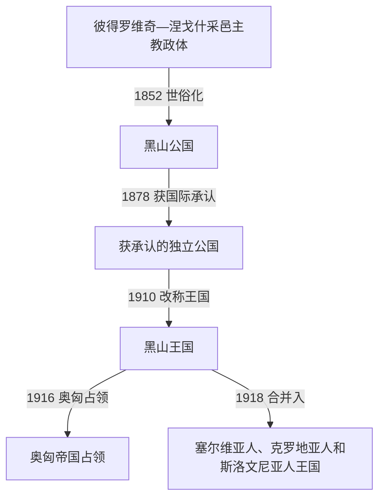

# 黑山公国与王国

## 时间

1852年—1918年

## 概括

1852年政教合一终结后，黑山由世俗公国逐步发展为获得国际承认的王国。国家通过战争、外交和行政改革扩大领土并取得出海口，但扩张也把更多穆斯林、阿尔巴尼亚人等群体纳入国家；第一次世界大战中的占领和1918年的合并终结了彼得罗维奇—涅戈什王朝统治。

## 君主世系

| 顺序 | 君主 | 政体与在位时间 | 主要转折 |
|---:|---|---|---|
| 1 | 达尼洛一世 | 黑山亲王，1852年—1860年 | 推动世俗化和中央集权；1858年格拉霍沃战役后边界获得国际划定。 |
| 2 | **尼古拉一世** | 黑山亲王，1860年—1910年；黑山国王，1910年—1918年 | 1878年获得国际承认和领土扩张，1910年改称王国，一战流亡后被废黜。 |

## 重要事件

- 1852年，达尼洛把采邑主教政体改为世俗公国，建立可由世俗家族继承的亲王权力。
- 1876—1878年黑山参加反奥斯曼战争；柏林会议正式承认其独立，并确认领土扩大和亚得里亚海出海口。
- 行政、司法、教育和常备武装逐步发展，但部族结构、宗族关系与中央国家建设长期并存。
- 1910年尼古拉一世把公国改称王国。
- 黑山参加巴尔干战争并扩张，围绕斯库台等地的行动也受到列强干预。
- 第一次世界大战中，黑山与协约国共同作战，1916年被奥匈帝国占领，国王和政府流亡。
- 1918年波德戈里察议会宣布废黜尼古拉一世并与塞尔维亚合并，随后进入新的南斯拉夫王国框架；反对者发动“圣诞起义”，说明合并并无国内一致共识。

## 演变关系

- 前一阶段：[奥斯曼边疆、采邑主教与自治](/%E4%BA%BA%E6%96%87%E7%A7%91%E5%AD%A6/%E5%8E%86%E5%8F%B2/%E6%AC%A7%E6%B4%B2/%E4%B8%9C%E5%8D%97%E6%AC%A7%E4%B8%8E%E5%B7%B4%E5%B0%94%E5%B9%B2/%E9%BB%91%E5%B1%B1/%E5%A5%A5%E6%96%AF%E6%9B%BC%E8%BE%B9%E7%96%86%E3%80%81%E9%87%87%E9%82%91%E4%B8%BB%E6%95%99%E4%B8%8E%E8%87%AA%E6%B2%BB.md)。
- 后一阶段：[南斯拉夫时期的黑山](/%E4%BA%BA%E6%96%87%E7%A7%91%E5%AD%A6/%E5%8E%86%E5%8F%B2/%E6%AC%A7%E6%B4%B2/%E4%B8%9C%E5%8D%97%E6%AC%A7%E4%B8%8E%E5%B7%B4%E5%B0%94%E5%B9%B2/%E9%BB%91%E5%B1%B1/%E5%8D%97%E6%96%AF%E6%8B%89%E5%A4%AB%E6%97%B6%E6%9C%9F%E7%9A%84%E9%BB%91%E5%B1%B1.md)。
- 1918年后共同国家的完整过程：[南斯拉夫王国](/%E4%BA%BA%E6%96%87%E7%A7%91%E5%AD%A6/%E5%8E%86%E5%8F%B2/%E6%AC%A7%E6%B4%B2/%E4%B8%9C%E5%8D%97%E6%AC%A7%E4%B8%8E%E5%B7%B4%E5%B0%94%E5%B9%B2/%E5%8D%97%E6%96%AF%E6%8B%89%E5%A4%AB%E5%8E%86%E5%8F%B2/%E5%8D%97%E6%96%AF%E6%8B%89%E5%A4%AB%E7%8E%8B%E5%9B%BD.md)。
