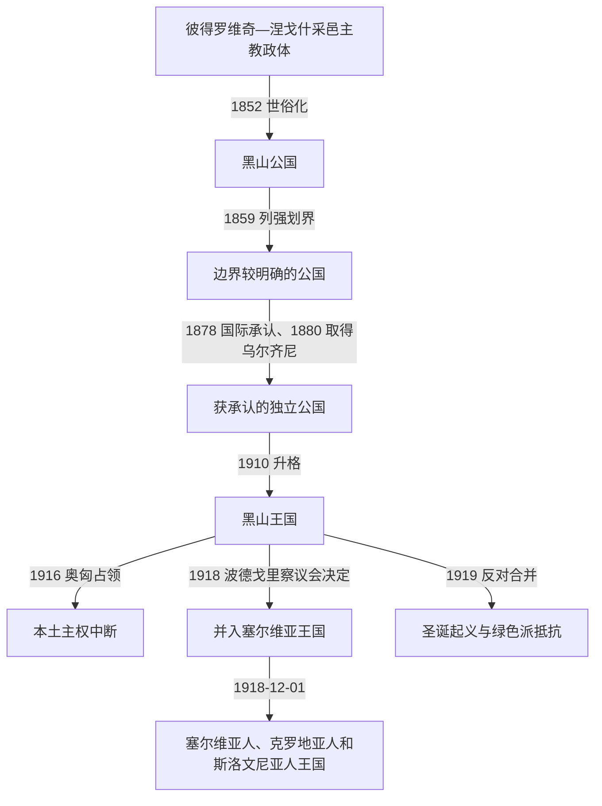

# 黑山公国与王国

## 时间

1852年—1918年；王国政府的流亡机构及王朝拥护者活动延续至1920年代。

## 概括

1852年，达尼洛把世袭化的采邑主教权转为世俗亲王权，黑山由部族—教会共同体迈向领土国家。达尼洛一世和尼古拉一世依靠中央集权、军制与法律建设、对奥斯曼战争和列强外交，先后取得边界划定、国际承认、出海口和大幅领土扩张。国家在1910年升格为王国，却因议会政治受限、巴尔干战争后的治理负担和第一次世界大战中的军事崩溃而迅速失去自主权。1918年波德戈里察议会废黜尼古拉一世并决定与塞尔维亚合并，但其代表性和程序自当时起即有争议；1919年的圣诞起义表明合并并非无异议的自然继承。

## 建立背景与崛起机制

- 彼得二世去世后，元老院主席佩罗·托莫夫·彼得罗维奇一度争夺继承权；达尼洛在俄国支持下压倒对手，并于1852年放弃必须由神职人员担任统治者的旧制。
- 世俗化解决了亲王结婚和父子继承的制度障碍，也把军事、司法、税收和外交权更明确地集中到采蒂涅。
- 山地部族仍是动员军队和地方治理的基本单位。中央通过亲王卫队、元老院、地方队长和成文法逐步约束血仇与部族自主，而非一次性建立现代官僚国家。
- 黑山利用1850年代至1870年代的东方问题，在俄国援助、法国与奥匈外交竞争和奥斯曼衰退之间扩大谈判空间；战场胜利必须经过列强会议和边界委员会才能转化为国际法上的领土。

## 分阶段发展

| 阶段 | 政治与军事过程 | 阶段结果 |
|---|---|---|
| 1852年—1860年 | 达尼洛一世世俗化、颁布法典并压制部族反抗；1858年格拉霍瓦茨战役击败奥斯曼军。 | 1859年列强参与划界，黑山获得较清楚的边界，但奥斯曼仍不完全放弃宗主权主张。 |
| 1860年—1875年 | 尼古拉一世继位；1862年战争失利后签订斯库台协定，限制部分军事行动；亲王随后重建军队、学校和行政机构。 | 国家生存下来并等待新的巴尔干危机，王朝借婚姻与俄国关系提高国际地位。 |
| 1875年—1880年 | 黑山支援黑塞哥维那起义，1876年正式对奥斯曼开战，在武契伊多和丰迪纳取胜，夺取尼克希奇、巴尔等地。 | 1878年《柏林条约》承认独立并扩大领土；乌尔齐尼在列强海上施压后于1880年交付，黑山最终取得可用海岸。 |
| 1880年—1905年 | 设部、法院和地方行政，颁布《一般财产法典》，扩展教育、邮政、道路和外交机构。 | 国家能力上升，但财政依赖俄国补助和借款，尼古拉的家长式统治仍居核心。 |
| 1905年—1910年 | 1905年宪法设国民议会和责任政府，人民党、真人民党等形成；王室与反对派冲突并出现炸弹案、科拉欣案等政治审判。 | 宪政扩大了公开政治，却未建立稳定的议会主导制；亲王保留任免政府、军队和外交等关键权力。 |
| 1910年—1914年 | 尼古拉加冕为国王；黑山参加两次巴尔干战争，围攻斯库台并扩大北部、东北部领土。 | 列强迫使黑山退出斯库台；新领土增加人口和资源，也带来行政、财政及族群整合压力。 |
| 1914年—1918年 | 与协约国参战；军队在洛夫琴、桑贾克和莫伊科瓦茨作战。1916年奥匈军攻陷洛夫琴，政府同意停战，国王流亡。 | 本土由奥匈占领，国内行政权中断；流亡王室在战后统一安排中处于不利地位。 |

## 统治结构

| 机构或角色 | 权力与变化 | 实际限制 |
|---|---|---|
| 亲王／国王 | 国家元首、军队统帅和外交决策中心；1905年后仍可任免大臣、召集或解散议会。 | 权力依赖王族网络、部族首领、俄国资助和列强承认。 |
| 国务委员会、各部与法院 | 1879年改革后逐步分化行政、立法咨询与司法职能；地方由队长、区和市镇机关执行命令。 | 官员规模小，亲缘政治和个人命令常穿透正式制度。 |
| 国民议会 | 1905年宪法后承担立法、预算和政治辩论。 | 选举规则、王室干预和政府更替使其难以控制行政权。 |
| 军队 | 以全民武装和部族营为基础，战时动员率高；逐步建立常备干部和炮兵。 | 经济基础薄弱，补给、交通和重武器不足，一战中尤其明显。 |
| 东正教都主教区 | 不再掌握世俗最高权力，但继续提供宗教合法性并管理教会事务。 | 国家扩张后还须治理天主教徒和穆斯林；1886年与教廷签订协定。 |

君主只有两位，王朝前后继承、流亡继承主张及争议另见[黑山采邑主教与彼得罗维奇王朝世系表](/%E4%BA%BA%E6%96%87%E7%A7%91%E5%AD%A6/%E5%8E%86%E5%8F%B2/%E6%AC%A7%E6%B4%B2/%E4%B8%9C%E5%8D%97%E6%AC%A7%E4%B8%8E%E5%B7%B4%E5%B0%94%E5%B9%B2/%E9%BB%91%E5%B1%B1/%E9%BB%91%E5%B1%B1%E9%87%87%E9%82%91%E4%B8%BB%E6%95%99%E4%B8%8E%E5%BD%BC%E5%BE%97%E7%BD%97%E7%BB%B4%E5%A5%87%E7%8E%8B%E6%9C%9D%E4%B8%96%E7%B3%BB%E8%A1%A8.md)；历届政府首脑、代理者与流亡内阁见[黑山近现代国家元首与政府首脑表](/%E4%BA%BA%E6%96%87%E7%A7%91%E5%AD%A6/%E5%8E%86%E5%8F%B2/%E6%AC%A7%E6%B4%B2/%E4%B8%9C%E5%8D%97%E6%AC%A7%E4%B8%8E%E5%B7%B4%E5%B0%94%E5%B9%B2/%E9%BB%91%E5%B1%B1/%E9%BB%91%E5%B1%B1%E8%BF%91%E7%8E%B0%E4%BB%A3%E5%9B%BD%E5%AE%B6%E5%85%83%E9%A6%96%E4%B8%8E%E6%94%BF%E5%BA%9C%E9%A6%96%E8%84%91%E8%A1%A8.md)。

## 重要事件

1. **1852年世俗化**：达尼洛取得俄国认可后改称亲王，采邑主教政体终结；奥斯曼反对这一单方面变化，并于1852—1853年出兵。
2. **1855年《达尼洛法典》**：在早期法典基础上强化国家法院、财产与刑事规则，也把中央权力伸入部族社会；其宗教与族群条款反映了当时国家建设的限制。
3. **1858年格拉霍瓦茨战役与1859年划界**：黑山军取胜后，列强迫使奥斯曼接受边界委员会，军事控制第一次较系统地转化为地图上的边界。
4. **1860年达尼洛遇刺**：达尼洛无存活男性后嗣，侄辈尼古拉继位；刺杀的个人、部族和政治动机仍有不同解释。
5. **1862年黑山—奥斯曼战争**：黑山因支援黑塞哥维那起义遭奥斯曼进攻，斯库台协定允许奥斯曼修筑经过黑山的道路并限制武装支援，显示国际承认前的脆弱地位。
6. **1876—1878年战争**：武契伊多、丰迪纳等胜利和尼克希奇、巴尔的夺取扩大了事实控制；圣斯特凡诺安排又经柏林会议重订。
7. **1878年《柏林条约》与1880年乌尔齐尼交付**：条约正式承认黑山独立并原则上给出海岸，但领土交付经历当地抵抗和列强施压，不能把1880年的结果简化成1878年即时完成。
8. **1879—1888年制度改革**：建立国务院、各部和大法院；1888年《一般财产法典》尝试协调现代私法与地方习惯法。
9. **1905年宪法政治**：第一部宪法和国民议会开启政党竞争；王室与反对派围绕亲塞尔维亚南斯拉夫主义、财政与权力边界持续冲突。
10. **1910年改称王国**：称王提升王朝声望，却没有改变国力与财政基础，也未解决王室和议会间的紧张。
11. **1912—1913年巴尔干战争**：黑山率先向奥斯曼宣战并长期围攻斯库台；列强建立阿尔巴尼亚后迫使其撤军，但黑山仍获得普列夫利亚、比耶洛波列、贝拉内等地。
12. **1916年军事崩溃**：莫伊科瓦茨战斗掩护了部分撤退通道，但其战略意义不宜脱离塞尔维亚军既有撤退进程而绝对化。洛夫琴失守后政府谈判投降，尼古拉前往意大利、法国。
13. **1918年波德戈里察议会**：在塞尔维亚军队和统一派占优势的环境中，议会于11月废黜尼古拉并决定无条件与塞尔维亚统一；12月1日塞尔维亚又加入塞尔维亚人、克罗地亚人和斯洛文尼亚人王国。
14. **1919年圣诞起义**：主张恢复黑山国家地位或以联邦方式统一的“绿色派”反抗主张无条件统一的“白色派”，起义被镇压，游击抵抗延续至1920年代。

## 鼎盛条件

- 1875—1878年巴尔干起义和俄土战争使奥斯曼难以集中兵力，黑山得以把高动员率转化为战场优势。
- 俄国的资金、军械、教育名额和外交庇护，配合法国、奥匈、意大利等国相互牵制，为小国留下外交空间。
- 王朝权威、东正教网络与部族军事组织可以迅速动员人口；成文法和中央机关又逐步把战时联盟转化为常设国家。
- 亚得里亚海港口、新领土和国际承认扩大税源、贸易与外交地位，使1880年代至1912年成为国家能力持续增长期。

## 衰落与灭亡原因

### 结构因素

- 人口、财政、工业和交通基础有限，军队虽动员比例高，却缺乏长期战争所需的补给、炮兵和运输体系。
- 王权个人化与宪政机构发展不平衡。反对派、青年军官和南斯拉夫统一主义者对尼古拉长期统治不满，削弱王朝的国内整合能力。
- 巴尔干战争后的领土骤增带来行政费用、战损和多族群治理任务，国家尚未消化扩张便进入世界大战。

### 外部压力

- 奥匈控制亚得里亚海和洛夫琴制高点，1916年的集中进攻超过黑山独立承受能力。
- 塞尔维亚主导的南斯拉夫统一网络、协约国的战后安排及列强对统一方案的承认，使流亡王室难以恢复。
- 俄国革命消除了尼古拉最重要的传统保护者，法国等盟国也不愿以军事力量支持复国。

### 直接终结过程

1916年投降造成国内主权机关中断；1918年协约国和塞尔维亚军队进入后，统一派控制政治议程。波德戈里察议会以废黜王朝和并入塞尔维亚完成国内法上的终结，随后共同王国的建立和国际承认巩固结果。由于选举方式、军队环境和反对派参与均有争议，这一过程应区分“作出的法律决定”“当时的实际力量关系”与“后来国家叙事”。

## 演变关系

- 前一阶段：[奥斯曼边疆、采邑主教与自治](/%E4%BA%BA%E6%96%87%E7%A7%91%E5%AD%A6/%E5%8E%86%E5%8F%B2/%E6%AC%A7%E6%B4%B2/%E4%B8%9C%E5%8D%97%E6%AC%A7%E4%B8%8E%E5%B7%B4%E5%B0%94%E5%B9%B2/%E9%BB%91%E5%B1%B1/%E5%A5%A5%E6%96%AF%E6%9B%BC%E8%BE%B9%E7%96%86%E3%80%81%E9%87%87%E9%82%91%E4%B8%BB%E6%95%99%E4%B8%8E%E8%87%AA%E6%B2%BB.md)。
- 后一阶段：[南斯拉夫时期的黑山](/%E4%BA%BA%E6%96%87%E7%A7%91%E5%AD%A6/%E5%8E%86%E5%8F%B2/%E6%AC%A7%E6%B4%B2/%E4%B8%9C%E5%8D%97%E6%AC%A7%E4%B8%8E%E5%B7%B4%E5%B0%94%E5%B9%B2/%E9%BB%91%E5%B1%B1/%E5%8D%97%E6%96%AF%E6%8B%89%E5%A4%AB%E6%97%B6%E6%9C%9F%E7%9A%84%E9%BB%91%E5%B1%B1.md)。
- 共同国家全史：[南斯拉夫王国](/%E4%BA%BA%E6%96%87%E7%A7%91%E5%AD%A6/%E5%8E%86%E5%8F%B2/%E6%AC%A7%E6%B4%B2/%E4%B8%9C%E5%8D%97%E6%AC%A7%E4%B8%8E%E5%B7%B4%E5%B0%94%E5%B9%B2/%E5%8D%97%E6%96%AF%E6%8B%89%E5%A4%AB%E5%8E%86%E5%8F%B2/%E5%8D%97%E6%96%AF%E6%8B%89%E5%A4%AB%E7%8E%8B%E5%9B%BD.md)。
