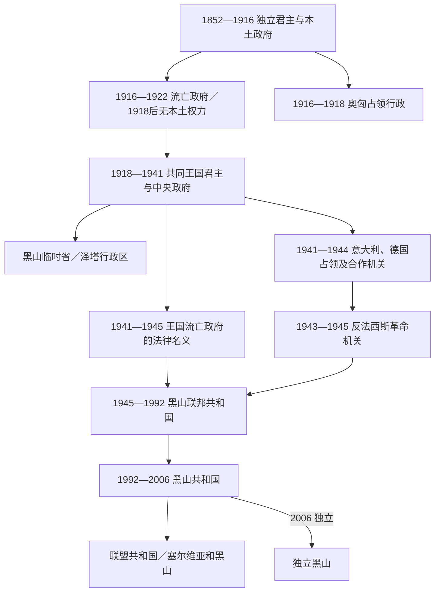

# 黑山近现代国家元首与政府首脑表

## 时间与收录原则

1852年至今；现任人物核验截止2026年7月14日。

本表以“统治层级”和“法律地位”分列人物：

- 1852—1918年列独立黑山的君主和部长会议主席；1916年后另标本土占领与流亡政府。
- 1918—1941年黑山没有单独国家元首或政府首脑。表中列共同王国的君主、黑山境内临时行政机关和泽塔省长，但不把省长称为黑山元首。
- 1941—1944年同时存在南斯拉夫王国的国际法名义、轴心国占领行政、地方合作机关和游击队革命机关，必须平行阅读。
- 1943—1992年列黑山联邦共和国的法定元首与政府首脑；共产党／共产党联盟领导人另表，仅用于说明一党制下的实际权力。
- 1992—2006年同时列黑山共和国和共同国家首脑；2006年后只列独立共和国。
- 日期采用公历。代理、共同代理、战地代理、自称和流亡职位均明确标注；“法律上在任”不等于对黑山本土拥有实际控制。

## 总体权力层级

## 1852年—1918年：君主

| 顺序 | 姓名 | 称号与在位 | 与前任关系 | 法律与实际权力 |
|---:|---|---|---|---|
| 1 | **达尼洛一世·彼得罗维奇-涅戈什** | 亲王，1852年3月13日—1860年8月13日 | 彼得二世的侄子；由采邑主教候选人转为世俗君主 | 本土最高统治者；1860年遇刺，无存活男性后嗣。 |
| 2 | **尼古拉一世·彼得罗维奇-涅戈什** | 亲王，1860年8月13日—1910年8月28日；国王，1910年8月28日—1918年11月26日 | 达尼洛一世的侄子一辈亲属 | 1916年1月前掌握本土王权；流亡后仅保留盟国一度承认的君主名义，1918年被波德戈里察议会废黜。 |

更早的采邑主教、共同统治者、摄政、王朝继承主张和1921年以后流亡继承，见[黑山采邑主教与彼得罗维奇王朝世系表](/%E4%BA%BA%E6%96%87%E7%A7%91%E5%AD%A6/%E5%8E%86%E5%8F%B2/%E6%AC%A7%E6%B4%B2/%E4%B8%9C%E5%8D%97%E6%AC%A7%E4%B8%8E%E5%B7%B4%E5%B0%94%E5%B9%B2/%E9%BB%91%E5%B1%B1/%E9%BB%91%E5%B1%B1%E9%87%87%E9%82%91%E4%B8%BB%E6%95%99%E4%B8%8E%E5%BD%BC%E5%BE%97%E7%BD%97%E7%BB%B4%E5%A5%87%E7%8E%8B%E6%9C%9D%E4%B8%96%E7%B3%BB%E8%A1%A8.md)。

## 1879年—1929年：部长会议主席及流亡政府

1879年以前，治理元老院主席承担近似政府首脑的职责，已列入王朝世系专表。1879年建立现代部长会议后，完整顺序如下。

| 顺序 | 姓名 | 任期 | 性质 | 权力与备注 |
|---:|---|---|---|---|
| 1 | 博若·彼得罗维奇-涅戈什 | 1879年3月20日—1905年12月19日 | 部长会议主席，无党派 | 尼古拉的近亲和长期首相；职位实际服从君主。 |
| 2 | 拉扎尔·米尤什科维奇 | 1905年12月19日—1906年11月24日 | 真人民党 | 宪法实施后的首届政府首脑。 |
| 3 | 马尔科·拉杜洛维奇 | 1906年11月24日—1907年2月1日 | 人民党 | 短期议会反对派政府。 |
| 4 | 安德里亚·拉多维奇 | 1907年2月1日—1907年4月17日 | 人民党 | 因与王室冲突迅速下台；一战流亡期再任。 |
| 5 | 拉扎尔·托马诺维奇 | 1907年4月17日—1912年6月19日 | 无党派 | 1910年政体由公国改为王国，任期连续。 |
| 6 | 米塔尔·马尔蒂诺维奇 | 1912年6月19日—1913年5月8日 | 真人民党 | 巴尔干战争期间兼具军政角色。 |
| 代理 | 杜尚·武科蒂奇 | 1912年10月3日—1913年5月8日 | 战地代理 | 马尔蒂诺维奇在前线时代理政府事务，与正式首相任期重叠。 |
| 7 | 扬科·武科蒂奇 | 1913年5月8日—1916年1月2日 | 无党派 | 一战时期政府首脑兼高级将领。 |
| 代理 | 里斯托·波波维奇 | 1914年7月17日—1916年1月2日 | 战地代理 | 武科蒂奇在军中时代理，任期与正式首相重叠。 |
| 代理 | 米尔科·米尤什科维奇 | 1915年10月3日—1916年1月2日 | 战地代理 | 接替部分代理职责，仍不取代武科蒂奇的正式身份。 |
| 8 | 拉扎尔·米尤什科维奇 | 1916年1月2日—1916年5月12日 | 真人民党；1月25日起流亡 | 1月25日前为本土政府；投降和国王离境后转为流亡政府。 |
| 9 | 安德里亚·拉多维奇 | 1916年5月12日—1917年1月17日 | 人民党；流亡 | 倡导与塞尔维亚统一并与国王决裂，辞职后组织统一委员会。 |
| 10 | 米洛·马塔诺维奇 | 1917年1月17日—1917年6月11日 | 无党派；流亡 | 无本土行政权。 |
| 11 | 埃夫格尼耶·波波维奇 | 1917年6月11日—1919年2月17日 | 无党派；流亡 | 1918年11月后，政府的国内法律地位被新秩序否定。 |
| 12 | 约万·普拉梅纳茨 | 1919年2月17日—1921年6月28日 | 真人民党；流亡 | 支持复国和绿色派；只能进行外交与流亡政治。 |
| 13 | 米卢廷·武契尼奇 | 1921年6月28日—1922年9月14日 | 真人民党；流亡 | 由流亡王朝摄政安排任命，不控制本土。 |
| 自称 | 约万·普拉梅纳茨 | 1922年9月16日—1922年9月23日 | 自称流亡首相 | 未获统一承认。 |
| 14 | 安托·格沃兹德诺维奇 | 1922年9月23日—1929年9月14日 | 流亡王朝任命 | 由米莱娜王后／王朝摄政系统任命；1929年王位继承人米哈伊洛放弃主张后终止。 |

1916年1月以后，“流亡首相”与黑山本土行政首脑不是同一概念。1918年后这些职位也不等于获得普遍国际承认的在亡国家政府。

## 1916年—1918年：奥匈占领的实际行政

| 层级 | 人物 | 时间 | 性质与说明 |
|---|---|---|---|
| 最高战区指挥 | 赫尔曼·克韦斯·冯·克韦斯哈扎 | 1916年1月—3月 | 奥匈占领初期高级军事指挥；不属于黑山政府。 |
| 军事总督 | 鲁道夫·布劳恩 | 1916年3月—4月 | 采蒂涅军政府首任负责人，任期很短。 |
| 军事总督 | 维克托·韦伯·埃德勒·冯·韦贝瑙 | 1916年4月—1917年7月 | 掌握占领区军民行政，黑山流亡政府无力在本土执行命令。 |
| 军事总督 | 海因里希·克拉姆-马丁尼茨伯爵 | 1917年7月—1918年10月 | 延续奥匈军政府。 |
| 撤退期高级指挥 | 卡尔·普弗兰策-巴尔廷 | 1918年10月—11月 | 奥匈崩溃和撤军阶段；地方控制迅速转移。 |

尼古拉一世在此期仍主张为合法国王，流亡政府也继续存在；实际税收、治安和军事权却由占领军掌握。

## 1918年—1941年：共同王国与地方行政

### 共同王国的法律元首

| 顺序 | 君主 | 任期 | 摄政与备注 |
|---:|---|---|---|
| 1 | 彼得一世·卡拉乔杰维奇 | 1918年12月1日—1921年8月16日 | 亚历山大王储继续摄政并实际主持国家事务。 |
| 2 | **亚历山大一世** | 1921年8月16日—1934年10月9日 | 1929年建立王室独裁并改国名；在马赛遇刺。 |
| 3 | 彼得二世 | 1934年10月9日—1945年11月29日 | 未成年期由保罗亲王主导三人摄政团至1941年3月；政变后宣布成年，轴心国入侵后流亡。 |

1918年后黑山没有独立君主。共同王国历届中央政府首脑不在本地表重复，见[南斯拉夫王国](/%E4%BA%BA%E6%96%87%E7%A7%91%E5%AD%A6/%E5%8E%86%E5%8F%B2/%E6%AC%A7%E6%B4%B2/%E4%B8%9C%E5%8D%97%E6%AC%A7%E4%B8%8E%E5%B7%B4%E5%B0%94%E5%B9%B2/%E5%8D%97%E6%96%AF%E6%8B%89%E5%A4%AB%E5%8E%86%E5%8F%B2/%E5%8D%97%E6%96%AF%E6%8B%89%E5%A4%AB%E7%8E%8B%E5%9B%BD.md)。

### 黑山境内的临时和省级行政

| 顺序 | 负责人 | 任期 | 机构与法律层级 |
|---:|---|---|---|
| 1 | 斯特沃·彼得罗维奇-武科蒂奇及五人执行委员会 | 1918年11月28日—1919年4月29日 | 波德戈里察议会产生的民族执行委员会；负责过渡行政，受统一派和塞尔维亚军政环境支配。马尔科·达科维奇等为委员，不应把委员名单误作多位国家元首。 |
| 2 | 伊沃·帕维切维奇 | 1919年4月29日—1922年4月28日 | 王国政府驻黑山专员；由中央任命，不是黑山政府总理。 |
| — | 泽塔州行政长官 | 1922年4月28日—1929年10月9日 | 黑山并入疆界更广的泽塔州，已无覆盖“黑山国家”的单独首脑职位。 |
| 3 | 克尔斯塔·斯米利亚尼奇 | 1929年10月9日—1931年1月10日 | 泽塔省长；中央任命。 |
| 4 | 乌罗什·克鲁利 | 1931年1月10日—1932年7月3日 | 泽塔省长。 |
| 5 | 阿列克萨·斯塔尼希奇 | 1932年7月3日—1934年4月23日 | 泽塔省长。 |
| 6 | 穆约·索契察 | 1934年4月23日—1936年8月13日 | 泽塔省长。 |
| 7 | 佩塔尔·伊万尼舍维奇 | 1936年8月13日—1939年5月25日 | 泽塔省长。 |
| 8 | 博日达尔·克尔斯蒂奇 | 1939年5月25日—1941年4月1日 | 泽塔省长。 |
| 9 | 布拉若·久卡诺维奇 | 1941年4月1日—1941年4月17日 | 末任泽塔省长；轴心国入侵使机构终结。 |

泽塔省包括今日黑山以及波黑、塞尔维亚、科索沃和克罗地亚的部分地区，省长既不是现代黑山总统，也不代表民族自治。

## 1941年—1945年：法律主权、占领权与抵抗机关

### 并立权力

| 权力线 | 负责人 | 时间 | 法律地位与实际控制 |
|---|---|---|---|
| 南斯拉夫王国 | 彼得二世及流亡政府 | 1941年4月—1945年11月 | 获盟国承认的法律主权，1941年后不控制黑山本土；1944—1945年经铁托—舒巴希奇安排与革命政府过渡。 |
| 意大利高级专员 | 塞拉菲诺·马佐利尼 | 1941年4月28日—7月23日 | 占领行政首长；策划受意大利保护的黑山安排。 |
| 意大利总督 | 亚历山德罗·皮尔齐奥·比罗利 | 1941年7月23日—1943年7月13日 | 七月起义后掌握军民全权，实施军事镇压。 |
| 意大利总督 | 库里奥·巴尔巴塞蒂·迪·普伦 | 1943年7月13日—9月10日 | 意大利投降前最后一任总督。 |
| 地方合作委员会 | 塞库拉·德尔列维奇 | 1941年7月12日—10月3日，名义 | 主持短暂的治理委员会／建国宣告；真正军政权在意大利手中。 |
| 地方合作委员会 | 布拉若·久卡诺维奇 | 1942年7月24日—1943年10月19日 | 民族委员会负责人；依赖意军，不能视为主权政府首脑。 |
| 德军上级指挥 | 特奥多尔·盖布 | 1943年9月—1944年5月 | 阿尔巴尼亚—黑山方向上级军事指挥，同时一度兼采蒂涅区职责。 |
| 德军地方指挥 | 威廉·凯珀 | 1943年9月—1944年末 | 第1040野战司令部／驻黑山全权将军，掌握占领军实际强制力；与盖布部分任期重叠，是上下级而非简单继任。 |
| 德占地方行政 | 柳博米尔·武克萨诺维奇 | 1943年11月10日—1944年末 | 民族行政委员会主席兼内务负责人，由德军任命，权力受占领军限制。 |
| 游击队革命机关 | 尼科·米利亚尼奇 | 1943年11月15日—1946年11月21日 | 黑山和博卡反法西斯委员会／大会主席；1944年末后从抵抗机关转为实际政权和联邦共和国法源。 |

“1941年黑山王国”没有稳定君主和独立国家机器。彼得罗维奇王位人选拒绝接受意大利安排，所谓王国实际上由占领总督掌权。

## 1943年—1990年：黑山联邦共和国法定元首

1943—1974年，议会或反法西斯大会主席依法承担共和国元首职能；1974年后改为集体主席团主席。

| 顺序 | 姓名 | 法定职务 | 任期 | 备注 |
|---:|---|---|---|---|
| 1 | 尼科·米利亚尼奇 | 反法西斯民族解放大会主席 | 1943年11月15日—1946年11月21日 | 战时与建国过渡。 |
| 2 | 米洛什·拉绍维奇 | 人民议会主席团主席 | 1946年11月21日—1950年11月6日 | 共产党一党体制。 |
| 3 | 尼古拉·科瓦切维奇 | 人民议会主席团主席；后为人民议会主席 | 1950年11月6日—1953年12月15日 | 1953年2月4日职称改变，任职连续。 |
| 4 | 布拉若·约万诺维奇 | 人民议会主席 | 1953年12月15日—1962年7月12日 | 此前长期任政府首脑。 |
| 5 | 菲利普·巴伊科维奇 | 人民议会主席 | 1962年7月12日—1963年5月5日 | 共和国更名前后交接。 |
| 6 | 安德里亚·穆戈沙 | 议会主席 | 1963年5月5日—1967年5月5日 | 法定元首。 |
| 7 | 韦利科·米拉托维奇 | 议会主席 | 1967年5月5日—1969年10月6日 | 后再任主席团主席。 |
| 8 | 维多耶·扎尔科维奇 | 议会主席 | 1969年10月6日—1974年4月1日 | 1974年宪制转换。 |
| 代理 | 布迪斯拉夫·绍什基奇 | 代理议会主席／元首 | 1974年4月1日—4月5日 | 四日过渡代理。 |
| 9 | 韦利科·米拉托维奇 | 主席团主席 | 1974年4月5日—1982年5月7日 | 集体元首机关的主席。 |
| 10 | 韦塞林·久拉诺维奇 | 主席团主席 | 1982年5月7日—1983年5月7日 | 年度轮换。 |
| 11 | 马尔科·奥尔兰迪奇 | 主席团主席 | 1983年5月7日—1984年5月7日 | 年度轮换。 |
| 12 | 米奥德拉格·弗拉霍维奇 | 主席团主席 | 1984年5月7日—1985年5月7日 | 年度轮换。 |
| 13 | 布拉尼斯拉夫·绍什基奇 | 主席团主席 | 1985年5月7日—1986年5月7日 | 年度轮换。 |
| 14 | 拉迪沃耶·布拉约维奇 | 主席团主席 | 1986年5月7日—1988年5月7日 | 任期两年。 |
| 15 | 博日纳·伊万诺维奇 | 主席团主席 | 1988年5月7日—1989年1月13日 | 反官僚革命示威后辞职。 |
| 代理 | 斯洛博丹·西莫维奇 | 代理主席团主席 | 1989年1月13日—3月17日 | 领导层更替期代理。 |
| 16 | 布兰科·科斯蒂奇 | 主席团主席 | 1989年3月17日—1990年12月23日 | 新一代党内集团上升时期。 |
| 17 | 莫米尔·布拉托维奇 | 共和国总统 | 1990年12月23日起 | 直选／多党体制开始；其后任期见下表。 |

## 1945年—1991年：黑山联邦共和国政府首脑

| 顺序 | 姓名 | 法定职务 | 任期 | 备注 |
|---:|---|---|---|---|
| 过渡 | 米洛万·吉拉斯 | 联邦政府黑山部长 | 1945年3月7日—4月17日 | 负责组建共和国政府，不是独立国家总理。 |
| 1 | 布拉若·约万诺维奇 | 总理；1953年起执行委员会主席 | 1945年4月17日—1953年12月16日 | 1953年2月4日职称改变，任职连续。 |
| 2 | 菲利普·巴伊科维奇 | 执行委员会主席 | 1953年12月16日—1962年7月12日 | 共和国政府首脑。 |
| 3 | 乔尔吉耶·帕伊科维奇 | 执行委员会主席 | 1962年7月12日—1963年6月25日 | 共和国更名时期。 |
| 4 | 韦塞林·久拉诺维奇 | 执行委员会主席 | 1963年6月25日—1966年12月8日 | 共和国政府首脑。 |
| 5 | 米尤什科·希巴利奇 | 执行委员会主席 | 1966年12月8日—1967年5月5日 | 短期任职。 |
| 6 | 维多耶·扎尔科维奇 | 执行委员会主席 | 1967年5月5日—1969年10月7日 | 后任法定元首和党内领导。 |
| 7 | 扎尔科·布拉伊奇 | 执行委员会主席 | 1969年10月7日—1974年5月6日 | 1974年宪制转换时卸任。 |
| 8 | 马尔科·奥尔兰迪奇 | 执行委员会主席 | 1974年5月6日—1978年4月28日 | 后任主席团主席。 |
| 9 | 莫姆契洛·采莫维奇 | 执行委员会主席 | 1978年4月28日—1982年5月7日 | 共和国政府首脑。 |
| 10 | 拉迪沃耶·布拉约维奇 | 执行委员会主席 | 1982年5月7日—1986年6月6日 | 后任主席团主席。 |
| 11 | 武科·武卡迪诺维奇 | 执行委员会主席 | 1986年6月6日—1989年3月29日 | 经济和政治危机时期。 |
| 12 | 拉多耶·孔蒂奇 | 执行委员会主席 | 1989年3月29日—1991年2月15日 | 多党转型后由新“总理”职位接替。 |
| 13 | 米洛·久卡诺维奇 | 总理 | 1991年2月15日起 | 后续任期见共和国政府表。 |

## 一党时期的实际权力：党组织负责人

下表列黑山共产党／共产党联盟最高负责人。其职位不是法定国家元首，但在干部任免、政策路线和联邦协调中常比议会主席更有实权；实际权力还受南共联盟中央、铁托、联邦政府、军队和安全机关制约。

| 顺序 | 姓名 | 大致任期 | 说明 |
|---:|---|---|---|
| 1 | 布拉若·约万诺维奇 | 1943年—1963年 | 战后建国时期长期党政核心。 |
| 2 | 乔尔吉耶·帕伊科维奇 | 1963年—1968年 | 领导共和国党组织。 |
| 3 | 韦塞林·久拉诺维奇 | 1968年—1977年 | 后进入联邦最高层。 |
| 4 | 沃约·斯尔真蒂奇 | 1977年—1982年 | 党内集体领导阶段。 |
| 5 | 多布罗斯拉夫·丘拉菲奇 | 1982年—1984年 | 经济危机加深期。 |
| 6 | 维多耶·扎尔科维奇 | 1984年 | 短期负责人。 |
| 7 | 马尔科·奥尔兰迪奇 | 1984年—1986年 | 共和国党组织负责人。 |
| 8 | 米利扬·拉多维奇 | 1986年—1989年1月 | 在反官僚革命压力下离任。 |
| 9 | 韦塞林·武科蒂奇 | 1989年1月11日—4月26日 | 代理负责人。 |
| 10 | 米利察·佩亚诺维奇-久里希奇 | 1989年4月26日—4月28日 | 两日过渡负责人；不应与其1997年出任民主社会主义者党主席混淆。 |
| 11 | 莫米尔·布拉托维奇 | 1989年4月28日—1991年组织改名 | 新领导集团核心；此后继续领导改组后的民主社会主义者党，并当选共和国总统。 |

## 1990年—2006年：黑山共和国总统

| 顺序 | 姓名 | 任期 | 党派与职权说明 |
|---:|---|---|---|
| 1 | 莫米尔·布拉托维奇 | 1990年12月23日—1998年1月15日 | 共产党联盟／民主社会主义者党；1992年后为联盟共和国成员共和国总统。1997年党分裂后加入其亲联邦派。 |
| 2 | 米洛·久卡诺维奇 | 1998年1月15日—2002年11月25日 | 民主社会主义者党；与米洛舍维奇决裂并推动共和国制度分离。 |
| 代理 | 菲利普·武亚诺维奇 | 2002年11月25日—2003年5月19日 | 议会议长代理总统；总统选举因投票率规则反复无效。 |
| 共同代理 | 德拉甘·库约维奇、里法特·拉斯托德尔 | 2003年5月19日—5月22日 | 两位议会副议长共同行使职权，仅三日。 |
| 3 | 菲利普·武亚诺维奇 | 2003年5月22日—2006年6月3日 | 民主社会主义者党；在国家联盟框架下任共和国总统，独立后连续任职。 |

## 1991年—2006年：黑山共和国政府首脑

| 顺序 | 姓名 | 任期 | 党派与备注 |
|---:|---|---|---|
| 1 | 米洛·久卡诺维奇 | 1991年2月15日—1998年2月5日 | 民主社会主义者党；早期与米洛舍维奇结盟，1997年后转向制度分离。 |
| 2 | 菲利普·武亚诺维奇 | 1998年2月5日—2003年1月8日 | 民主社会主义者党；联邦与共和国冲突、德国马克引入时期。 |
| 3 | 米洛·久卡诺维奇 | 2003年1月8日—2006年6月3日 | 民主社会主义者党；国家联盟和独立公投时期，独立后连续任职至11月。 |

## 1992年—2006年：共同国家的法律首脑

这些职位代表南斯拉夫联盟共和国或塞尔维亚和黑山，而非黑山共和国。将其与上两表并列，才能看清双层国家结构。

### 联盟共和国／国家联盟元首

| 顺序 | 姓名 | 任期 | 说明 |
|---:|---|---|---|
| 1 | 多布里察·乔西奇 | 1992年6月15日—1993年5月31日 | 联盟共和国总统；与塞尔维亚总统米洛舍维奇冲突后被罢免。 |
| 代理 | 米洛什·拉杜洛维奇 | 1993年5月31日—6月25日 | 联邦议院共和国院议长代行总统职权。 |
| 2 | 佐兰·利利奇 | 1993年6月25日—1997年6月25日 | 联盟共和国总统；实际影响常低于米洛舍维奇。 |
| 代理 | 斯尔贾·博若维奇 | 1997年6月25日—7月23日 | 共和国院议长代行总统职权。 |
| 3 | 斯洛博丹·米洛舍维奇 | 1997年7月23日—2000年10月7日 | 联盟共和国总统；控制党政、安全和军方网络，实际权力远超早期总统。 |
| 4 | 沃伊斯拉夫·科什图尼察 | 2000年10月7日—2003年2月4日 | 米洛舍维奇败选后就任；任至国家改组。 |
| 5 | 斯韦托扎尔·马罗维奇 | 2003年3月7日—2006年6月3日 | 塞尔维亚和黑山总统兼部长会议主席；2月4日至3月7日为制度组建过渡。 |

### 联盟共和国／国家联盟政府首脑

| 顺序 | 姓名 | 任期 | 说明 |
|---:|---|---|---|
| 1 | 米兰·帕尼奇 | 1992年7月14日—12月29日 | 联邦总理；与米洛舍维奇路线冲突后被不信任案推翻。 |
| 2 | 拉多耶·孔蒂奇 | 1992年12月29日—1998年5月19日 | 先代理、1993年2月9日起正式任联邦总理；来自黑山执政党。 |
| 3 | 莫米尔·布拉托维奇 | 1998年5月19日—2000年11月4日 | 联邦总理；虽来自黑山，却与久卡诺维奇领导的共和国政府对立。 |
| 4 | 佐兰·日日奇 | 2000年11月4日—2001年7月24日 | 联邦总理；因与黑山地位及对前政权人员移交等问题辞职。 |
| 5 | 德拉吉沙·佩希奇 | 2001年7月24日—2003年3月7日 | 最后一任联盟共和国总理。 |
| 6 | 斯韦托扎尔·马罗维奇 | 2003年3月7日—2006年6月3日 | 国家联盟不再另设总理，总统兼任部长会议主席。 |

1990年代前半期，塞尔维亚总统米洛舍维奇虽不总担任联邦总统，却常是实际最高权力中心；1997年后黑山共和国机关与联邦机关形成竞争合法性。

## 2006年至今：独立黑山总统

| 顺序 | 姓名 | 任期 | 党派与关键转折 |
|---:|---|---|---|
| 1 | 菲利普·武亚诺维奇 | 2006年6月3日—2018年5月20日 | 民主社会主义者党；由成员共和国总统连续成为独立国家总统。 |
| 2 | 米洛·久卡诺维奇 | 2018年5月20日—2023年5月20日 | 民主社会主义者党；与该党长期执政网络保持核心关系，2023年败选。 |
| 3 | **雅科夫·米拉托维奇** | 2023年5月20日至今 | “欧洲现在”运动当选；2024年退出该党后为无党籍总统。截止2026年7月14日在任。 |

## 2006年至今：独立黑山政府首脑

| 顺序 | 姓名 | 任期 | 党派与关键转折 |
|---:|---|---|---|
| 1 | 米洛·久卡诺维奇 | 2006年6月3日—11月10日 | 民主社会主义者党；由独立前总理连续过渡。 |
| 2 | 热利科·什图拉诺维奇 | 2006年11月10日—2008年2月29日 | 民主社会主义者党；因健康原因辞职。 |
| 3 | 米洛·久卡诺维奇 | 2008年2月29日—2010年12月29日 | 民主社会主义者党。 |
| 4 | 伊戈尔·卢克希奇 | 2010年12月29日—2012年12月4日 | 民主社会主义者党；欧盟谈判启动。 |
| 5 | 米洛·久卡诺维奇 | 2012年12月4日—2016年11月28日 | 民主社会主义者党；北约入盟议程和2016年选举争议时期。 |
| 6 | 杜什科·马尔科维奇 | 2016年11月28日—2020年12月4日 | 民主社会主义者党；2017年加入北约，2020年选举后交权。 |
| 7 | 兹德拉夫科·克里沃卡皮奇 | 2020年12月4日—2022年4月28日 | 无党派，依托三大反对派联盟；独立后首次中央轮替。 |
| 8 | 德里坦·阿巴佐维奇 | 2022年4月28日—2023年10月31日 | 联合改革行动；2022年8月失去议会信任后以看守身份留任至新政府产生。 |
| 9 | **米洛伊科·斯帕伊奇** | 2023年10月31日至今 | “欧洲现在”运动；领导多党联合政府。截止2026年7月14日在任。 |

## 如何使用这张表

- 君主、摄政和王朝继承问题应同时查看[黑山采邑主教与彼得罗维奇王朝世系表](/%E4%BA%BA%E6%96%87%E7%A7%91%E5%AD%A6/%E5%8E%86%E5%8F%B2/%E6%AC%A7%E6%B4%B2/%E4%B8%9C%E5%8D%97%E6%AC%A7%E4%B8%8E%E5%B7%B4%E5%B0%94%E5%B9%B2/%E9%BB%91%E5%B1%B1/%E9%BB%91%E5%B1%B1%E9%87%87%E9%82%91%E4%B8%BB%E6%95%99%E4%B8%8E%E5%BD%BC%E5%BE%97%E7%BD%97%E7%BB%B4%E5%A5%87%E7%8E%8B%E6%9C%9D%E4%B8%96%E7%B3%BB%E8%A1%A8.md)和[黑山公国与王国](/%E4%BA%BA%E6%96%87%E7%A7%91%E5%AD%A6/%E5%8E%86%E5%8F%B2/%E6%AC%A7%E6%B4%B2/%E4%B8%9C%E5%8D%97%E6%AC%A7%E4%B8%8E%E5%B7%B4%E5%B0%94%E5%B9%B2/%E9%BB%91%E5%B1%B1/%E9%BB%91%E5%B1%B1%E5%85%AC%E5%9B%BD%E4%B8%8E%E7%8E%8B%E5%9B%BD.md)。
- 共同王国、占领与社会主义联邦的过程见[南斯拉夫时期的黑山](/%E4%BA%BA%E6%96%87%E7%A7%91%E5%AD%A6/%E5%8E%86%E5%8F%B2/%E6%AC%A7%E6%B4%B2/%E4%B8%9C%E5%8D%97%E6%AC%A7%E4%B8%8E%E5%B7%B4%E5%B0%94%E5%B9%B2/%E9%BB%91%E5%B1%B1/%E5%8D%97%E6%96%AF%E6%8B%89%E5%A4%AB%E6%97%B6%E6%9C%9F%E7%9A%84%E9%BB%91%E5%B1%B1.md)；跨地区完整机关见[南斯拉夫王国](/%E4%BA%BA%E6%96%87%E7%A7%91%E5%AD%A6/%E5%8E%86%E5%8F%B2/%E6%AC%A7%E6%B4%B2/%E4%B8%9C%E5%8D%97%E6%AC%A7%E4%B8%8E%E5%B7%B4%E5%B0%94%E5%B9%B2/%E5%8D%97%E6%96%AF%E6%8B%89%E5%A4%AB%E5%8E%86%E5%8F%B2/%E5%8D%97%E6%96%AF%E6%8B%89%E5%A4%AB%E7%8E%8B%E5%9B%BD.md)、[第二次世界大战时期的南斯拉夫](/%E4%BA%BA%E6%96%87%E7%A7%91%E5%AD%A6/%E5%8E%86%E5%8F%B2/%E6%AC%A7%E6%B4%B2/%E4%B8%9C%E5%8D%97%E6%AC%A7%E4%B8%8E%E5%B7%B4%E5%B0%94%E5%B9%B2/%E5%8D%97%E6%96%AF%E6%8B%89%E5%A4%AB%E5%8E%86%E5%8F%B2/%E7%AC%AC%E4%BA%8C%E6%AC%A1%E4%B8%96%E7%95%8C%E5%A4%A7%E6%88%98%E6%97%B6%E6%9C%9F%E7%9A%84%E5%8D%97%E6%96%AF%E6%8B%89%E5%A4%AB.md)、[南斯拉夫社会主义联邦共和国](/%E4%BA%BA%E6%96%87%E7%A7%91%E5%AD%A6/%E5%8E%86%E5%8F%B2/%E6%AC%A7%E6%B4%B2/%E4%B8%9C%E5%8D%97%E6%AC%A7%E4%B8%8E%E5%B7%B4%E5%B0%94%E5%B9%B2/%E5%8D%97%E6%96%AF%E6%8B%89%E5%A4%AB%E5%8E%86%E5%8F%B2/%E5%8D%97%E6%96%AF%E6%8B%89%E5%A4%AB%E7%A4%BE%E4%BC%9A%E4%B8%BB%E4%B9%89%E8%81%94%E9%82%A6%E5%85%B1%E5%92%8C%E5%9B%BD.md)。
- 双层共和国和共同国家的权力冲突见[塞尔维亚和黑山及独立建国](/%E4%BA%BA%E6%96%87%E7%A7%91%E5%AD%A6/%E5%8E%86%E5%8F%B2/%E6%AC%A7%E6%B4%B2/%E4%B8%9C%E5%8D%97%E6%AC%A7%E4%B8%8E%E5%B7%B4%E5%B0%94%E5%B9%B2/%E9%BB%91%E5%B1%B1/%E5%A1%9E%E5%B0%94%E7%BB%B4%E4%BA%9A%E5%92%8C%E9%BB%91%E5%B1%B1%E5%8F%8A%E7%8B%AC%E7%AB%8B%E5%BB%BA%E5%9B%BD.md)及[南斯拉夫联盟共和国与塞尔维亚和黑山](/%E4%BA%BA%E6%96%87%E7%A7%91%E5%AD%A6/%E5%8E%86%E5%8F%B2/%E6%AC%A7%E6%B4%B2/%E4%B8%9C%E5%8D%97%E6%AC%A7%E4%B8%8E%E5%B7%B4%E5%B0%94%E5%B9%B2/%E5%8D%97%E6%96%AF%E6%8B%89%E5%A4%AB%E5%8E%86%E5%8F%B2/%E5%8D%97%E6%96%AF%E6%8B%89%E5%A4%AB%E8%81%94%E7%9B%9F%E5%85%B1%E5%92%8C%E5%9B%BD%E4%B8%8E%E5%A1%9E%E5%B0%94%E7%BB%B4%E4%BA%9A%E5%92%8C%E9%BB%91%E5%B1%B1.md)。
- 现行制度和2026年领导层见[独立后的黑山](/%E4%BA%BA%E6%96%87%E7%A7%91%E5%AD%A6/%E5%8E%86%E5%8F%B2/%E6%AC%A7%E6%B4%B2/%E4%B8%9C%E5%8D%97%E6%AC%A7%E4%B8%8E%E5%B7%B4%E5%B0%94%E5%B9%B2/%E9%BB%91%E5%B1%B1/%E7%8B%AC%E7%AB%8B%E5%90%8E%E7%9A%84%E9%BB%91%E5%B1%B1.md)。
