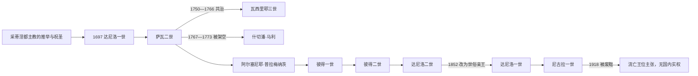

# 黑山采邑主教与彼得罗维奇王朝世系表

[返回黑山历史](/%E4%BA%BA%E6%96%87%E7%A7%91%E5%AD%A6/%E5%8E%86%E5%8F%B2/%E6%AC%A7%E6%B4%B2/%E4%B8%9C%E5%8D%97%E6%AC%A7%E4%B8%8E%E5%B7%B4%E5%B0%94%E5%B9%B2/%E9%BB%91%E5%B1%B1/README.md) · [奥斯曼边疆、采邑主教与自治](/%E4%BA%BA%E6%96%87%E7%A7%91%E5%AD%A6/%E5%8E%86%E5%8F%B2/%E6%AC%A7%E6%B4%B2/%E4%B8%9C%E5%8D%97%E6%AC%A7%E4%B8%8E%E5%B7%B4%E5%B0%94%E5%B9%B2/%E9%BB%91%E5%B1%B1/%E5%A5%A5%E6%96%AF%E6%9B%BC%E8%BE%B9%E7%96%86%E3%80%81%E9%87%87%E9%82%91%E4%B8%BB%E6%95%99%E4%B8%8E%E8%87%AA%E6%B2%BB.md) · [黑山公国与王国](/%E4%BA%BA%E6%96%87%E7%A7%91%E5%AD%A6/%E5%8E%86%E5%8F%B2/%E6%AC%A7%E6%B4%B2/%E4%B8%9C%E5%8D%97%E6%AC%A7%E4%B8%8E%E5%B7%B4%E5%B0%94%E5%B9%B2/%E9%BB%91%E5%B1%B1/%E9%BB%91%E5%B1%B1%E5%85%AC%E5%9B%BD%E4%B8%8E%E7%8E%8B%E5%9B%BD.md)

## 使用说明

“1516年起都主教统治黑山”是常见分期，却不能当作一份无争议、连续且等同现代君主制的名单。采蒂涅教会名录显示瓦维拉在1493—1495年任职、罗曼见于1496年、格尔曼三世自1496年起在位；16世纪若干姓名和年代又重叠或留有空档。下表因此先列教会首长，再列1697年后兼具显著政治权威的都主教、共治者和世俗实际统治者。都主教的宗教职位、部族大会授权、奥斯曼宗主权和实际国家能力必须分开。

## 采蒂涅都主教序列：1491—1697年

| 顺序 | 都主教 / 主教 | 任期 | 继承与并立说明 | 政治地位备注 |
|---:|---|---|---|---|
| 1 | 帕霍米耶一世 | 1491年—1493年 | 前期采蒂涅教会首长 | 仍处茨尔诺耶维奇时代；列入是为解释1516年前已有都主教。 |
| 2 | 瓦维拉 | 1493年—1495年 | 接帕霍米耶 | 后世“首位采邑主教”名单常写1516—1520年，与教会名录冲突；不能同时视为确证。 |
| 3 | 罗曼 | 1496年 | 短期 | 久拉季离境和奥斯曼接管之际的教会首长，材料很少。 |
| 4 | 格尔曼三世 | 1496年—1520年 | 接罗曼 | 1516年政治分期大致落在其任内；是否具完整世俗统治权有争议。 |
| 5 | 帕夫莱 | 1520年—1530年 | 接格尔曼三世 | 黑山桑贾克后期，教会权威与奥斯曼地方行政并存。 |
| 6 | 瓦西里耶一世 | 1530年—1532年 | 接帕夫莱 | 任期短，资料有限。 |
| 7 | 罗米尔一世 | 1532年—1540年 | 接瓦西里耶一世 | 地方政治作用不详。 |
| 8 | 尼科迪姆 | 1540年 | 短期 | 资料不详。 |
| 9 | 鲁维姆一世 | 1540年—约1550年 | 接尼科迪姆 | 部分名录延至1559年，起讫应视为约数。 |
| 10 | 马卡里耶 | 约1550年—1558年 | 与鲁维姆二世年代可能重叠 | 名录亦有1560—1561年说，可能涉及同名或记录错置。 |
| 11 | 迪奥尼西耶 | 1558年 | 短期 | 仅零散记载。 |
| 12 | 罗米尔二世 | 1558年—1561年 | 接迪奥尼西耶 | 与鲁维姆二世记录重叠。 |
| 13 | 鲁维姆二世 | 约1551年—1569年 | 可能为助理、并立或名录年代错置 | 不应强行排成无重叠单线。 |
| 14 | 帕霍米耶二世 | 1569年—1579年 | 接鲁维姆二世 | 后期同格拉西姆记载重叠。 |
| 15 | 格拉西姆 | 1575年—1582年 | 与帕霍米耶二世部分重叠 | 可能反映共治、不同文书使用或年代误差。 |
| 16 | 韦尼亚明 | 1582年—1591年 | 接格拉西姆 | 资料有限。 |
| 17A | 尼卡诺尔一世 | 1591年—1593年 | 与斯特凡并列 | 两人可能为共治或记录代表不同层级。 |
| 17B | 斯特凡 | 1591年—1593年 | 与尼卡诺尔一世并列 | 不合并为“某主教等”。 |
| 18 | **鲁维姆三世·涅古什** | 1593年—1636年 | 接前述并立者 | 任期较长，在部族调解与反奥斯曼活动中较重要。 |
| 19 | 马尔达里耶·科尔内查宁 | 1637年—1659年 | 接鲁维姆三世 | 威尼斯—奥斯曼克里特战争时期，政治选择受边疆战争影响。 |
| 空档 | 继承记录不完整 | 1659年—1673年 | 有名录另列维萨里翁或“马尔达里耶二世” | 证据和识别不一，保留空档比制造确定序列更妥当。 |
| 20 | 鲁维姆四世·博列维奇 | 1673年—1685年 | 空档后见于文书 | 在威尼斯—奥斯曼冲突中活动。 |
| 21 | 瓦西里耶二世 | 1685年 | 短期 | 资料有限。 |
| 22 | 维萨里翁二世·博里洛维奇—巴伊察 | 1685年—1692年 | 接瓦西里耶二世 | 1692年奥斯曼军毁坏采蒂涅修道院。 |
| 23 | 萨瓦一世·奥奇尼奇 | 1694年—1697年 | 接维萨里翁二世 | 由大会推举；1697年达尼洛当选后，彼得罗维奇时代开始。 |

## 1697—1852年兼具政治权威的都主教与实际统治者

| 顺序 | 姓名、家族与称号 | 在位 / 实际掌权 | 与前任关系 | 共治、废立与关键事件 |
|---:|---|---|---|---|
| 1 | **达尼洛一世·什切普切维奇·彼得罗维奇—涅戈什**，都主教 | 1697年7月—1735年1月11日 | 由部族大会推举，非萨瓦一世血缘继承 | 奠定彼得罗维奇家族叔侄式传承；转向俄国，1711年响应反奥斯曼行动，经历1712、1714年远征。 |
| 2 | 萨瓦二世·彼得罗维奇—涅戈什，都主教 | 1735年—1781 / 1782年 | 达尼洛一世亲属 / 侄辈 | 政策较谨慎；1750—1766年与瓦西里耶三世共治，1767—1773年又被什切潘·马利架空。终年有1781、1782两说。 |
| 共治3 | **瓦西里耶三世·彼得罗维奇—涅戈什**，都主教 | 1750年8月11日—1766年3月10日 | 达尼洛与萨瓦亲属 | 与萨瓦二世共同在位，更多承担俄国外交、募援和政治宣传；死于俄国。 |
| 实际统治 | **什切潘·马利**，自称“沙皇” | 1767年10月17日—1773年9月22日 | 无王朝关系，自称俄国彼得三世 | 由大会和部族拥立，压过仍在位的萨瓦二世；整顿裁判与治安，后遭刺杀。应列实际权力者而非都主教。 |
| 4 | 阿尔塞尼耶二世·普拉梅纳茨，都主教 | 1781 / 1782年—1784年5月 | 萨瓦二世指定或获支持，非彼得罗维奇 | 短期打断家族连续；政治影响有限。 |
| 5 | **彼得一世·彼得罗维奇—涅戈什**，都主教 | 1782年获推举，1784年10月祝圣—1830年10月30日 | 彼得罗维奇亲属 | 1796年两战胜利，推动《共同誓约》、1798 / 1803年法典和政府法庭；扩大旧黑山与布尔达联合。 |
| 6 | **彼得二世·彼得罗维奇—涅戈什**，都主教 | 1830年10月30日—1851年10月31日 | 彼得一世侄孙、指定继承 | 1831年设参议院、卫队，1832年废总督，建立税收和地方法院；诗人和国家建构者。 |
| 争位 / 摄政 | 佩罗·托莫夫·彼得罗维奇—涅戈什，参议院首脑 | 1851年10月—1852年初争位；继续任参议院首脑至1853年 | 彼得二世之兄 | 彼得二世死后凭家族长辈和参议院地位争取统治；未获俄国承认，败于达尼洛。 |
| 7 | 达尼洛二世·彼得罗维奇—涅戈什，都主教候选人 | 1851年10月31日—1852年3月13日 | 彼得二世侄辈、指定继承人 | 从未受主教祝圣；获俄国支持后改称世俗亲王，作为君主改称达尼洛一世。 |

## 与都主教并立的世俗总督

总督职位的起源、早期姓名和起讫年代争议很大；下表只列1756年以后较稳定的拉多尼奇家族线。总督负责对威尼斯联络、军事和世俗事务，既可与都主教合作，也可成为竞争中心。

| 顺序 | 总督 | 任期 | 与前任关系 | 备注 |
|---:|---|---|---|---|
| 1 | 斯塔尼斯拉夫 / 斯塔诺·拉多尼奇 | 1756年—1758年3月 | 首位有较稳定文献的世袭总督 | 在萨瓦二世与瓦西里耶三世时期任职。 |
| 2 | 武卡莱 / 武科拉伊·斯塔尼希奇—拉多尼奇 | 1758年—1764年 | 斯塔尼斯拉夫长子，身份细节有争议 | 部分材料把任期写至1762年，继任间可能有短暂过渡。 |
| 3 | 约万 / 约沃·拉多尼奇 | 1764年—1803年 | 前任弟弟 | 与萨瓦、什切潘·马利、彼得一世先后并立；亲威尼斯 / 奥地利倾向使其同彼得一世有竞争。 |
| 4 | 武科拉伊·拉多尼奇 | 1803 / 1804年—1830年失势，1832年职位废除 | 约万之子 | 同彼得二世争权，被控私通奥地利；1832年遭放逐，世俗总督制度终结。 |

## 1831—1879年黑山与布尔达参议院首脑

参议院兼行政、司法和立法功能，其主席不是独立国家元首，却常掌握日常政府和法院。1834—1837年的主席连续性不明，表中保留空档。

| 顺序 | 主席 | 任期 | 与君主 / 都主教关系 | 关键说明 |
|---:|---|---|---|---|
| 1 | 伊万·武科蒂奇 | 1831年9月2日—1834年初 | 彼得二世邀请的俄国归侨官员 | 首任主席；因同彼得二世冲突离境。 |
| 空档 | 集体或未稳定设置 | 1834年—1837年 | 不详 | 不以推测人物填补。 |
| 2 | 佩罗·托莫夫·彼得罗维奇 | 1837年9月3日—1853年12月1日 | 彼得二世之兄 | 1851年后争取最高权力失败；仍续任参议院首脑。 |
| 3 | 久拉季耶·彼得罗维奇 | 1853年12月1日—1857年2月18日 | 王族成员 | 达尼洛一世中央化时期任职。 |
| 4 | 米尔科·彼得罗维奇 | 1857年2月18日—1867年7月20日 | 达尼洛一世之兄、尼古拉一世之父 | 兼军事统帅，是王朝实际权力核心。 |
| 5 | 博若·彼得罗维奇—涅戈什 | 1867年7月20日—1879年3月20日 | 王族成员 | 1879年机构改革后成为首任部长会议主席。 |

## 世俗彼得罗维奇君主：1852—1918年

| 顺序 | 君主 | 称号与在位 | 生卒 | 与前任关系 | 关键事件 / 备注 |
|---:|---|---|---|---|---|
| 1 | **达尼洛一世·彼得罗维奇—涅戈什** | 黑山亲王，1852年3月13日—1860年8月13日 | 1826年—1860年 | 彼得二世侄辈 | 终止政教合一，1855年法典加强中央权力；1858年格拉霍沃胜利后边界获国际划定；在科托尔遇刺，无子。 |
| 2 | **尼古拉一世·彼得罗维奇—涅戈什** | 亲王，1860年8月13日—1910年8月28日；国王，1910年8月28日—1918年11月26日 | 1841年—1921年 | 达尼洛一世侄辈，米尔科之子 | 1878年获国际承认及扩张；1905年宪政；1910年称王；1916年起流亡，1918年波德戈里察议会宣布废黜。 |

## 1918年后的流亡王位主张

下列人物没有在黑山境内行使国家权力，只是王朝或流亡政府的主张者。1918年后法定共同国家的元首属于卡拉乔尔杰维奇王朝，应在南斯拉夫主线理解。

| 顺序 | 主张者 / 摄政 | 主张时期 | 继承关系 | 实际地位 |
|---:|---|---|---|---|
| 1 | 尼古拉一世 | 1918年11月26日—1921年3月1日 | 被废黜君主 | 不承认合并，在法国维持流亡宫廷和政府；无境内行政权。 |
| 2 | 达尼洛王储 | 1921年3月1日—3月7日 | 尼古拉一世长子 | 接受王朝主张仅数日即放弃，未统治黑山。 |
| 摄政 | 米莱娜王后 | 1921年—1923年 | 尼古拉遗孀、未成年米哈伊洛祖母 | 代表未成年主张者；流亡政府逐渐瓦解。 |
| 3 | 米哈伊洛王子 | 1921年3月7日—1929年9月14日 | 尼古拉之孙、早逝米尔科之子 | 未成年时由米莱娜摄政；1929年放弃王位主张并承认南斯拉夫王国。 |
| 流亡政府首脑 / 摄政性角色 | 安托·格沃兹德诺维奇 | 1922年—1929年 | 非王族 | 以流亡政府首脑和王朝代表身份维持活动；不构成境内国家政府。 |

## 继承机制的变化

- 16—17世纪都主教主要经教会与地方推举产生，政治影响随个人、部族接受和战争环境变化。
- 1697年后彼得罗维奇把候选人限制在家族内，但仍需大会认可和外部教会祝圣；萨瓦—瓦西里耶共治、什切潘·马利架空和阿尔塞尼耶插入都说明这不是严格自动世袭。
- 1852年改为世俗亲王后，王朝才可通过婚姻和父系规则建立普通君主继承。
- 1918年境内国家权力被新的南斯拉夫国家取代，1921—1929年的“继承”只属于流亡主张，不能延长黑山王国的实际存在。
