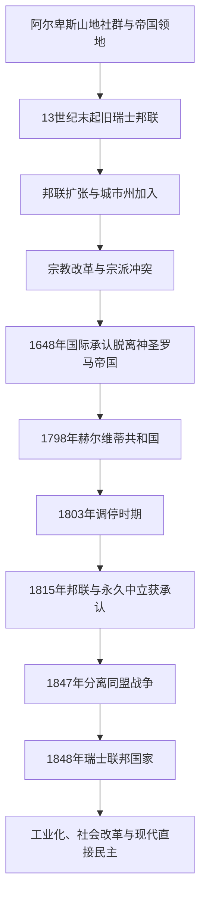

# 瑞士

## 概括

瑞士由阿尔卑斯山地、城市和乡村州形成的旧邦联发展而来。其历史包括与哈布斯堡及神圣罗马帝国的冲突和联系、宗教改革与宗派分裂、法国革命时期的赫尔维蒂共和国，以及1848年建立的现代联邦国家。

## 演变关系

## 统治结构与政治阶段

| 阶段 | 时间 | 统治结构 |
|---|---|---|
| 旧瑞士邦联 | 约13世纪末—1798年 | 各州通过盟约合作，中央机构薄弱，城市州与乡村州结构不同。 |
| 赫尔维蒂共和国 | 1798—1803年 | 法国支持的中央集权共和国，受到战争和地方反抗冲击。 |
| 调停与复辟邦联 | 1803—1848年 | 州权恢复，1815年后邦联扩大并获得永久中立的国际承认。 |
| 瑞士联邦 | 1848年至今 | 联邦制共和国，联邦议会、联邦委员会、州权与公民投票共同构成政治体系。 |

## 重要事件

- 13世纪末的山地盟约传统成为旧邦联形成的重要象征，邦联随后吸纳更多城市和州。
- 1499年施瓦本战争后，邦联在帝国内获得更大实际独立；1648年其独立地位获国际承认。
- 苏黎世和日内瓦等地宗教改革推动新教发展，也引发州际宗派冲突。
- 1798年法国入侵后建立赫尔维蒂共和国，中央集权实验因战争和内部矛盾难以维持。
- 1847年分离同盟战争结束后，1848年宪法建立现代联邦国家。
- 瑞士在两次世界大战中保持武装中立，但经济往来、难民政策和战时金融仍存在争议。

## 关键辨析

- 瑞士中立是长期形成并由国际政治保障的政策，不等于对外部战争完全没有联系。
- 旧邦联不是现代联邦国家，州际关系更接近盟约联合。
- 瑞士具有德语、法语、意大利语和罗曼什语等多语言传统，不是单一德语国家。

## 上级

- [中欧](/%E4%BA%BA%E6%96%87%E7%A7%91%E5%AD%A6/%E5%8E%86%E5%8F%B2/%E6%AC%A7%E6%B4%B2/%E4%B8%AD%E6%AC%A7/README.md)
