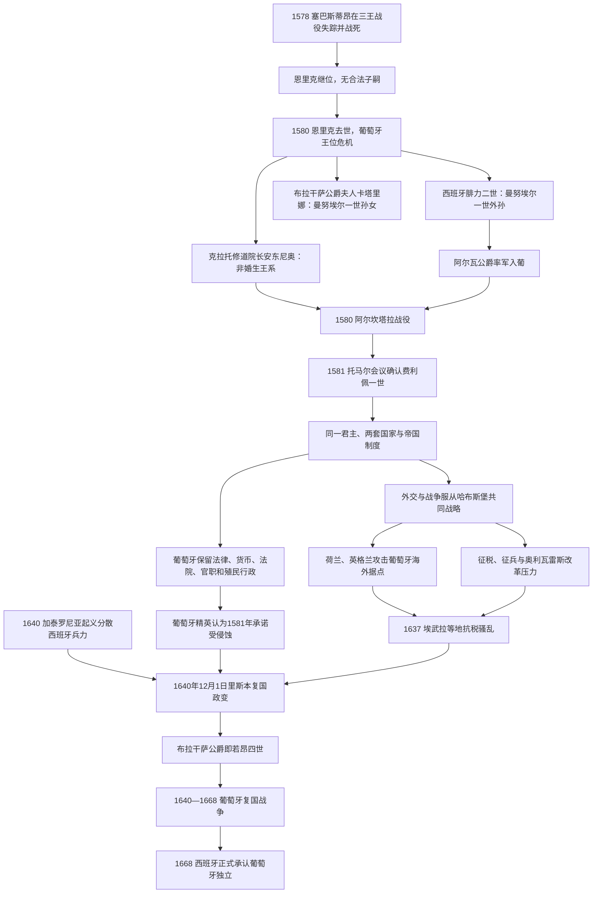

# 伊比利亚联盟

## 时间

1580年王位危机与军事占领开始；1581年托马尔会议确认共主安排；1640年12月1日葡萄牙复国政变结束实际联合。西班牙到1668年才在条约中正式承认葡萄牙独立。

## 别称

伊比利亚共主邦联、腓力王朝时期；葡萄牙史中常称“菲律宾王朝”。“伊比利亚联盟”是后世概括，不是当时建立的统一国号。

## 概括

伊比利亚联盟不是西班牙吞并葡萄牙为一个统一国家，而是西班牙哈布斯堡君主兼任葡萄牙国王的复合君主制。1578年葡萄牙国王塞巴斯蒂昂在摩洛哥战死，继位的枢机国王恩里克又无合法子嗣，王位危机使具有葡萄牙王室血统的西班牙国王腓力二世凭谱系、贵族支持和军事力量取得王冠。1581年托马尔会议承认其为葡萄牙国王费利佩一世，并以保留葡萄牙法律、法院、货币、官职、税收和海外帝国为交换。

联合初期，葡萄牙精英可借哈布斯堡全球网络获得保护和贸易机会；但两国共同君主使葡萄牙在外交上无法保持中立。荷兰、英格兰和法国把葡萄牙港口与殖民地视为西班牙战争目标，亚洲、非洲和巴西据点遭到攻击。17世纪西班牙财政危机、奥利瓦雷斯伯爵公爵的战争动员、葡萄牙官职和税收不满，以及1640年加泰罗尼亚起义造成的军事窗口，共同促成布拉干萨公爵若昂发动复国。联盟的崩溃是制度互信、海外安全和王朝财政同时失效的结果，不宜只解释为民族意识突然觉醒。

## 联盟形成图

## 建立背景

### 塞巴斯蒂昂远征与王位断绝

年轻的塞巴斯蒂昂希望在摩洛哥建立基督教盟友并恢复葡萄牙十字军与海权声望。1578年，他率大军干预摩洛哥王位战争，在阿尔卡塞尔—基比尔战役（葡萄牙传统称“三王战役”）惨败，国王、摩洛哥交战双方的两位苏丹均死亡。葡萄牙不仅失去君主，也需支付俘虏赎金，财政和贵族军事骨干遭受重创。塞巴斯蒂昂遗体与死亡消息的不确定性又催生“塞巴斯蒂昂主义”，以后长期出现期待失踪国王归来的政治救世传统。

年老的枢机恩里克即位，却没有合法子嗣且未能获教宗允许建立继承人。1580年1月恩里克去世，阿维斯王朝直系终结。主要候选人都可追溯至曼努埃尔一世：

| 候选人 | 血缘与依据 | 支持基础 | 结局 |
|---|---|---|---|
| **西班牙国王腓力二世** | 曼努埃尔一世之女伊莎贝尔的儿子；嫡系外孙 | 多数高级贵族、主教、商人和需要秩序的官僚；同时拥有最强军力 | 军事获胜后被会议承认为葡萄牙国王。 |
| 克拉托修道院长安东尼奥 | 曼努埃尔一世之子路易斯的非婚生子 | 里斯本等城市平民、部分下级贵族和反卡斯蒂利亚力量 | 1580年短暂自称国王，败走亚速尔，后流亡法国。 |
| 布拉干萨公爵夫人卡塔里娜 | 曼努埃尔一世之子杜阿尔特的女儿；女性嫡系孙辈 | 布拉干萨家族及部分法学家 | 未在1580年武装争位；其孙1640年成为若昂四世。 |
| 萨伏依公爵埃马努埃莱·菲利贝托等 | 其他王女后裔或婚姻关系 | 半岛外王室 | 实际竞争力有限。 |

继承法没有一条所有人共同接受的机械规则。腓力的性别、血缘接近和资源有利，反对者则强调外国君主、葡萄牙政治共同体和安东尼奥的本地支持。最终结果由法律论证、精英交易和军事力量共同决定。

### 军事征服与托马尔妥协

1580年夏，阿尔瓦公爵率西班牙军从东部进入，海军配合控制河口。安东尼奥在桑塔伦和里斯本获拥立，却于8月阿尔坎塔拉战役败北；大陆主要城市随即归顺。亚速尔群岛特塞拉岛继续支持安东尼奥，1582年蓬塔德尔加达附近海战和1583年远征才结束有组织抵抗。

腓力没有只依赖占领。1581年托马尔会议宣誓承认他为费利佩一世，君主则确认葡萄牙王国的制度身份：王国法律、法院、货币、海关、税收、官职和殖民体系原则上由葡萄牙人管理，葡萄牙语继续用于行政。里斯本不是降为普通西班牙省会；卡斯蒂利亚、阿拉贡、葡萄牙及哈布斯堡其他领地仍各有法制，只共享君主和王朝战略。

## 共主与完整世系

| 顺序 | 西班牙称号 / 葡萄牙称号 | 王室 | 兼任葡萄牙国王 | 与前任关系及取得方式 | 葡萄牙与联盟关键事件 |
|---:|---|---|---|---|---|
| 1 | **腓力二世 / 费利佩一世** | 西班牙哈布斯堡 | 1580／1581—1598 | 葡萄牙王室外孙；击败安东尼奥并获托马尔会议承认 | 建立共主安排；1583年平定亚速尔；保留葡萄牙制度；1588年无敌舰队使用里斯本与葡萄牙船只。 |
| 2 | 腓力三世 / 费利佩二世 | 西班牙哈布斯堡 | 1598—1621 | 前任之子，世袭继承 | 王廷长期不驻葡萄牙；1603年修订葡萄牙法典；荷兰势力加紧攻击亚洲与大西洋贸易；1609年曾赴里斯本会议。 |
| 3 | **腓力四世 / 费利佩三世** | 西班牙哈布斯堡 | 1621—1640 | 前任之子，世袭继承 | 奥利瓦雷斯推动更大财政军事负担；荷兰夺取巴西东北部等据点；1637年抗税骚乱；1640年复国政变将其废黜。 |

1640年后，西班牙仍把腓力四世视为葡萄牙合法君主，葡萄牙则拥立若昂四世。两套宣称并存到1668年正式承认，不能把1640后的战争时期写成双方已经法律和解。

## 统治结构

| 领域 | 制度安排 | 实际运作与张力 |
|---|---|---|
| 最高权力 | 西班牙哈布斯堡君主同时以葡萄牙独立王号统治 | 君主常驻马德里，葡萄牙政治难以直接接近王廷。 |
| 中央咨询 | 马德里设葡萄牙委员会，向君主处理葡萄牙事务 | 原则上由葡萄牙人任职；宫廷派系与首相政治可绕过承诺。 |
| 在地代表 | 由王族成员、总督或数人组成的治理委员会代表国王 | 总督权力受葡萄牙法律、地方法院与马德里命令共同约束。 |
| 议会 | 葡萄牙三级会议在1581年确认契约，此后召集减少 | 精英认为缺少定期协商削弱联合合法性。 |
| 法律司法 | 葡萄牙法、最高法院和地方法庭保留 | 1603年《菲律宾法典》是葡萄牙法律汇编，不等同于卡斯蒂利亚法取代。 |
| 财政货币 | 独立税制、货币和海关原则上保留 | 王朝战争增加特别税、借款、军需和港口负担。 |
| 官职 | 葡萄牙本土与帝国官职原则上授予葡萄牙臣民 | 任命争议和“卡斯蒂利亚化”观感损害信任，实际程度因职位而异。 |
| 海外帝国 | 葡萄牙保有巴西、非洲、印度洋和亚洲行政网络 | 外交敌友由共主决定，葡萄牙据点无法对荷兰、英格兰保持中立。 |
| 军事外交 | 王朝层面统一战争与和平方向 | 葡萄牙资源被用于西班牙战略，敌国也把葡萄牙帝国视作共同目标。 |

## 分阶段发展

### 1580—1598年：妥协与高峰

费利佩一世亲赴葡萄牙、召开会议并让本地精英分享官职，联合具有较强契约色彩。西班牙美洲白银、葡萄牙非洲—印度洋网络和跨大西洋航线处于同一君主保护下，商人尝试跨越原有帝国边界。里斯本作为港口和舰队基地重要，葡萄牙船只参与1588年无敌舰队。

共同资源不等于贸易全面合并。西班牙美洲和葡萄牙帝国仍有各自垄断法规，跨界商人常通过执照、亲属和走私经营。对英战争使葡萄牙航运受损，说明联合收益一开始就伴随风险。

### 1598—1621年：距离与海外竞争

费利佩二世（西班牙腓力三世）较少亲自处理葡萄牙事务，宠臣政治增强王廷距离。1603年公布的《菲律宾法典》整理葡萄牙既有法令，直到19世纪仍长期有效，是制度延续的证据。

荷兰共和国反抗西班牙后，原与葡萄牙贸易密切的荷兰商人被禁止进入伊比利亚港口，于是建立东印度公司和西印度公司，直接争夺香料、奴隶贸易、糖和海运。荷兰攻击摩鹿加、锡兰、巴西和非洲据点的动力既来自商业竞争，也来自对哈布斯堡战争。葡萄牙商人因此越来越把联盟外交视为安全负担。

### 1621—1640年：战争国家与契约危机

腓力四世首相奥利瓦雷斯试图让哈布斯堡各领地更平均承担三十年战争，1626年“武器联盟”计划要求葡萄牙提供兵员和财政。方案并非把葡萄牙立即废省，却触及1581年本地官职、税收协商和独立负担的期待。马德里要求葡萄牙参与对荷、对法战争，而海外防务资源不足。

1624年荷兰一度占领巴西萨尔瓦多，次年联合舰队收复；1630年荷兰占领伯南布哥并扩大巴西东北据点。1622年霍尔木兹被波斯与英格兰联军夺取，亚洲海权也受打击。并非所有损失都能归罪联合：葡萄牙帝国本身据点分散、兵力有限，亚洲贸易竞争和地方联盟也已变化。但王朝政府无法保护帝国，同时继续征税，政治合法性因而下降。

1637年埃武拉爆发“曼努埃利尼奥”抗税骚乱，扩散至阿连特茹多地。贵族没有立即领导革命，政府也恢复秩序；事件却显示普通纳税人与地方官已经不满财政动员。

## 重要事件

| 时间 | 事件 | 直接结果 | 长期意义 |
|---|---|---|---|
| 1578年8月 | 阿尔卡塞尔—基比尔战役 | 塞巴斯蒂昂及大批贵族战死或被俘 | 阿维斯王朝继承危机与财政创伤开始。 |
| 1580年1月 | 枢机国王恩里克去世 | 无公认继承人 | 多方王位宣称转为政治军事竞争。 |
| 1580年8月 | 阿尔坎塔拉战役 | 安东尼奥败退，腓力控制大陆葡萄牙 | 西班牙军事优势决定继承争端。 |
| 1581年 | 托马尔会议 | 腓力获承认为费利佩一世 | 以保留葡萄牙制度换取王朝服从。 |
| 1582—1583年 | 亚速尔海战与征服 | 安东尼奥最后基地被平定 | 联盟取得全境实际控制。 |
| 1588年 | 无敌舰队远征英格兰 | 舰队失败、葡萄牙船只受损 | 葡萄牙被直接卷入哈布斯堡战争。 |
| 1603年 | 《菲律宾法典》公布 | 葡萄牙法律重新汇编 | 显示法律制度延续，也留下王朝时代名称。 |
| 1622年 | 霍尔木兹陷落 | 波斯—英格兰联军终结葡萄牙海湾据点 | 亚洲海权和贸易网络受挫。 |
| 1624—1625年 | 荷兰占领、联军收复萨尔瓦多 | 巴西首府短暂失守后恢复 | 海外防务必须消耗共同王朝资源。 |
| 1626年 | “武器联盟”计划 | 要求各领地承担更多兵员财政 | 加剧葡萄牙对契约被侵蚀的担忧。 |
| 1630年起 | 荷兰占领伯南布哥等地 | 巴西东北糖区长期受荷兰控制 | 商人与贵族质疑共主能否保护帝国。 |
| 1637年 | 埃武拉抗税骚乱 | 地方叛乱被压制 | 预示财政和行政不满已跨出宫廷。 |
| 1640年6月 | 加泰罗尼亚起义扩大 | 西班牙需要向东部集中军队 | 为葡萄牙政变提供低成本窗口。 |
| 1640年12月1日 | 里斯本复国政变 | 王室国务秘书被杀，总督被控制，若昂四世获拥立 | 实际联盟终结，布拉干萨王朝开始。 |
| 1640—1668年 | 葡萄牙复国战争 | 边境战、外交结盟和殖民竞争持续 | 葡萄牙独立由政变转为可持续国家事实。 |
| 1668年 | 《里斯本条约》 | 西班牙承认布拉干萨王朝与葡萄牙独立 | 王位争议在国际法和外交上终结。 |

## 联盟瓦解机制

### 结构因素

复合君主制依靠距离治理：葡萄牙愿意接受共同君主，前提是自身法律、官职和帝国利益受到保护。君主常驻马德里、葡萄牙会议缺少政治主导力、三级会议不常召开，使利益表达越来越通过宫廷请愿而非契约更新。葡萄牙与卡斯蒂利亚经济规模不同，王朝战争成本分配又难以被视为公平。

### 外部压力

荷兰、英格兰和法国同哈布斯堡为敌，使葡萄牙全球据点成为攻击目标。海外损失削弱贸易税、商人信用和帝国声望，葡萄牙精英认为联合取消了中立选择。与此同时，三十年战争、荷兰战争和对法战争耗尽西班牙财政。

### 内部政治

奥利瓦雷斯希望把松散复合王国改造成更能动员资源的战争君主制，葡萄牙地方精英则以1581年承诺维护特权。布拉干萨家族拥有最强本地贵族声望，公爵若昂又继承卡塔里娜的王位依据。部分贵族最初犹豫，是宫廷边缘化、税役与失去官职机会逐步改变成本计算。

### 直接触发

1640年加泰罗尼亚起义迫使西班牙两线应对，马德里还要求葡萄牙贵族和军队支援。12月1日约四十名共谋者占领里斯本王宫，杀死国务秘书米格尔·德·瓦斯孔塞洛斯，控制总督曼图亚公爵夫人，拥立布拉干萨公爵。西班牙无法立即调集优势军队，政变得以扩展为全国政权更替。

## 复国后的巩固

若昂四世建立新的国务、军事和财政机构，争取城市、教会和海外据点效忠。葡萄牙通过同法国、荷兰和英格兰的外交周旋获取空间；与荷兰的殖民战争并未因共同反西班牙自动停止，巴西和安哥拉利益仍需武力夺回。边境战争长期以小规模袭扰为主，1663年阿梅西亚尔、1665年蒙特斯克拉鲁斯等胜利证明西班牙难以恢复统治。

1640年并非所有葡萄牙旧领地都回归。休达选择继续效忠西班牙，后来正式成为西班牙领地；部分海外据点已落入荷兰或地方政权。复国恢复的是葡萄牙王权和国家主权，并非瞬间恢复1580年的帝国版图。

## 长期影响

1. 联盟证明近代欧洲王朝联合可以共享君主而保持法律和国家身份，不能用现代单一制国家概念理解。
2. 1581年承诺成为葡萄牙精英衡量哈布斯堡合法性的契约基准；制度保留既维持联盟，也为退出保存行政能力。
3. 葡萄牙帝国被卷入西班牙敌对体系，荷兰全球扩张由此加速，但葡萄牙自身帝国过度伸展同样重要。
4. 1640年复国确立布拉干萨王朝，决定葡萄牙与西班牙此后分立的国家方向。
5. 复国战争促进葡萄牙常备军事、外交和财政制度发展，也加强对英结盟。
6. 塞巴斯蒂昂主义、复国纪念与“六十年统治”成为葡萄牙民族记忆，后世叙事常简化当时精英合作和帝国收益。
7. 西班牙失去葡萄牙却保留休达，说明联合瓦解并非按语言或现代国界自动完成。

## 关键辨析

- 伊比利亚联盟是共主联合，不是西班牙把葡萄牙改成一个普通行省。
- “西班牙国王腓力二世”在葡萄牙王号中是“费利佩一世”，后两位序号同样相差一。
- 1580年是军事控制和王位宣称开始，1581年是托马尔会议承认；两者都可作为建立节点但含义不同。
- 葡萄牙保留殖民行政，不表示能独立决定对外战争，外交统一正是海外损失争议核心。
- 荷兰扩张不只是“西班牙拖累”；葡萄牙据点分散、贸易垄断和地方竞争也造成脆弱。
- 1640年政变立即结束实际共主，但西班牙到1668年才正式承认。
- 若昂四世的王位主张来自布拉干萨家族与卡塔里娜的谱系，不只是成功军人自立。
- 加泰罗尼亚起义是直接战略窗口，不是葡萄牙复国的唯一原因。
- 休达未随葡萄牙复国，不能把1640年边界直接等同于现代葡萄牙。
- “六十年西班牙统治”是葡萄牙记忆用语，精确制度性质仍应称复合君主制或共主联合。

## 演变关系

- 葡萄牙前一阶段：[阿维斯王朝与大航海](/%E4%BA%BA%E6%96%87%E7%A7%91%E5%AD%A6/%E5%8E%86%E5%8F%B2/%E6%AC%A7%E6%B4%B2/%E4%BC%8A%E6%AF%94%E5%88%A9%E4%BA%9A%E5%8D%8A%E5%B2%9B/%E8%91%A1%E8%90%84%E7%89%99/%E9%98%BF%E7%BB%B4%E6%96%AF%E7%8E%8B%E6%9C%9D%E4%B8%8E%E5%A4%A7%E8%88%AA%E6%B5%B7.md)。
- 葡萄牙区域页：[伊比利亚联盟时期的葡萄牙](/%E4%BA%BA%E6%96%87%E7%A7%91%E5%AD%A6/%E5%8E%86%E5%8F%B2/%E6%AC%A7%E6%B4%B2/%E4%BC%8A%E6%AF%94%E5%88%A9%E4%BA%9A%E5%8D%8A%E5%B2%9B/%E8%91%A1%E8%90%84%E7%89%99/%E4%BC%8A%E6%AF%94%E5%88%A9%E4%BA%9A%E8%81%94%E7%9B%9F%E6%97%B6%E6%9C%9F%E7%9A%84%E8%91%A1%E8%90%84%E7%89%99.md)。
- 西班牙共主：[西班牙哈布斯堡王朝](/%E4%BA%BA%E6%96%87%E7%A7%91%E5%AD%A6/%E5%8E%86%E5%8F%B2/%E6%AC%A7%E6%B4%B2/%E4%BC%8A%E6%AF%94%E5%88%A9%E4%BA%9A%E5%8D%8A%E5%B2%9B/%E8%A5%BF%E7%8F%AD%E7%89%99/%E8%A5%BF%E7%8F%AD%E7%89%99%E5%93%88%E5%B8%83%E6%96%AF%E5%A0%A1%E7%8E%8B%E6%9C%9D.md)。
- 葡萄牙后继：[布拉干萨王朝](/%E4%BA%BA%E6%96%87%E7%A7%91%E5%AD%A6/%E5%8E%86%E5%8F%B2/%E6%AC%A7%E6%B4%B2/%E4%BC%8A%E6%AF%94%E5%88%A9%E4%BA%9A%E5%8D%8A%E5%B2%9B/%E8%91%A1%E8%90%84%E7%89%99/%E5%B8%83%E6%8B%89%E5%B9%B2%E8%90%A8%E7%8E%8B%E6%9C%9D.md)。
- 共同海外背景：[西葡帝国与大航海](/%E4%BA%BA%E6%96%87%E7%A7%91%E5%AD%A6/%E5%8E%86%E5%8F%B2/%E6%AC%A7%E6%B4%B2/%E4%BC%8A%E6%AF%94%E5%88%A9%E4%BA%9A%E5%8D%8A%E5%B2%9B/%E8%A5%BF%E8%91%A1%E5%B8%9D%E5%9B%BD%E4%B8%8E%E5%A4%A7%E8%88%AA%E6%B5%B7.md)。
- 所属总览：[伊比利亚半岛](/%E4%BA%BA%E6%96%87%E7%A7%91%E5%AD%A6/%E5%8E%86%E5%8F%B2/%E6%AC%A7%E6%B4%B2/%E4%BC%8A%E6%AF%94%E5%88%A9%E4%BA%9A%E5%8D%8A%E5%B2%9B/README.md)。
