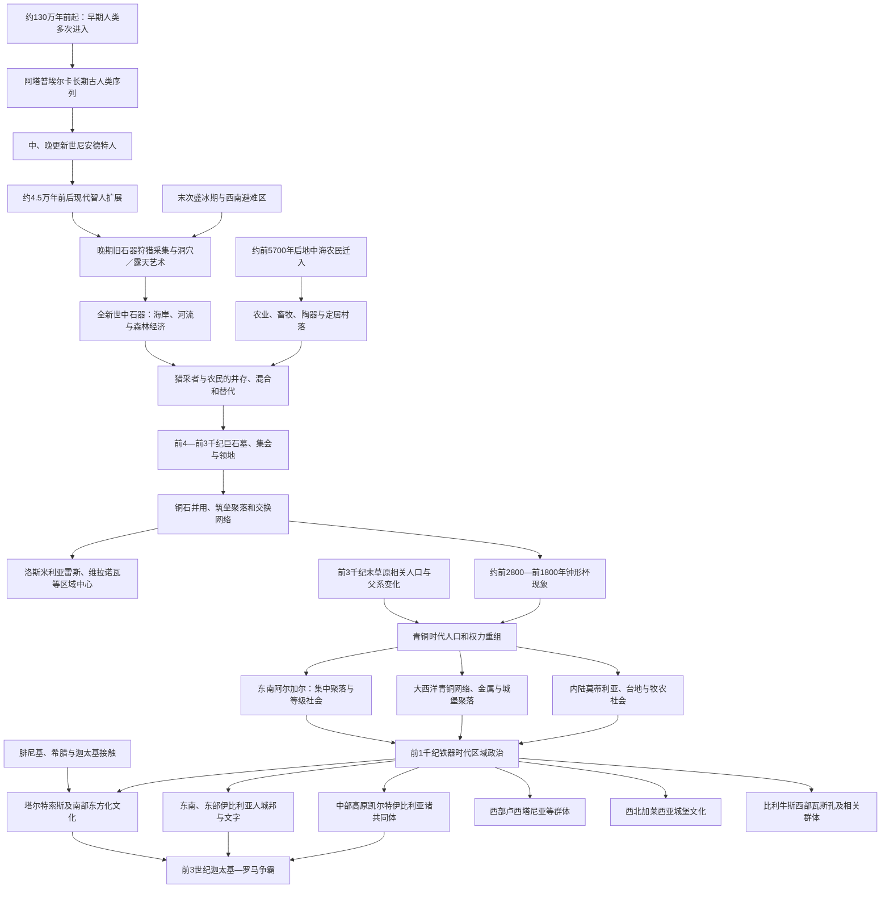

# 史前与古代伊比利亚

## 时间

约130万年前的早期人类活动至前3世纪罗马进入半岛前后。史前、青铜时代与铁器时代在各地区转换不同；沿海地区自前1千纪已有外来文字记录，内陆许多社会仍主要依靠考古资料。

## 范围与史料

本笔记讨论伊比利亚半岛原住人口、技术和区域社会的长期形成，范围覆盖今西班牙、葡萄牙、安道尔及比利牛斯南北接触带。腓尼基、希腊、迦太基的据点和战争过程另见[腓尼基、希腊与迦太基殖民](/%E4%BA%BA%E6%96%87%E7%A7%91%E5%AD%A6/%E5%8E%86%E5%8F%B2/%E6%AC%A7%E6%B4%B2/%E4%BC%8A%E6%AF%94%E5%88%A9%E4%BA%9A%E5%8D%8A%E5%B2%9B/%E8%85%93%E5%B0%BC%E5%9F%BA%E3%80%81%E5%B8%8C%E8%85%8A%E4%B8%8E%E8%BF%A6%E5%A4%AA%E5%9F%BA%E6%AE%96%E6%B0%91.md)；罗马征服另见[罗马时期的伊比利亚](/%E4%BA%BA%E6%96%87%E7%A7%91%E5%AD%A6/%E5%8E%86%E5%8F%B2/%E6%AC%A7%E6%B4%B2/%E4%BC%8A%E6%AF%94%E5%88%A9%E4%BA%9A%E5%8D%8A%E5%B2%9B/%E7%BD%97%E9%A9%AC%E6%97%B6%E6%9C%9F%E7%9A%84%E4%BC%8A%E6%AF%94%E5%88%A9%E4%BA%9A.md)。

史前认识来自洞穴、露天遗址、墓葬、工具、岩画、动植物遗存、同位素和古DNA。前1千纪的腓尼基、希腊、罗马作者及伊比利亚、凯尔特伊比利亚铭文增加文字材料，却常以外来政治和民族分类描述当地。“伊比利亚人”“凯尔特伊比利亚人”“卢西塔尼亚人”等名称主要反映铁器时代区域共同体，不能倒推为从旧石器时代连续不变的民族。

## 概括

伊比利亚是欧洲人类史最早且资料最丰富的地区之一。阿塔普埃尔卡保存近百万年以上的多阶段古人类记录，尼安德特人与现代智人后来先后生活于半岛。末次冰期中，半岛部分地区是欧洲西南人口和动植物避难区；旧石器洞穴与露天岩刻显示复杂象征生活。约前6千纪，来自地中海的农民携带谷物、家畜和陶器进入，同本地猎采者在不同地区发生替代、混合与长期并存。

前4—前3千纪，巨石墓、围沟聚落、铜冶金和远距交换扩大，南部洛斯米利亚雷斯与葡萄牙中部筑垒聚落显示竞争和社会分层。钟形杯器物从伊比利亚向欧洲多地传播，又被不同人口采用，不能视为一个单一“钟形杯民族”。前3千纪末以后，草原相关祖源和新的父系谱系进入半岛，青铜时代社会重组；东南部阿尔加尔形成集中聚落、仓储和显著等级，内陆、北部与大西洋区则保持不同模式。

前1千纪，铁器、城寨、区域语言和地中海贸易推动更大政治共同体。东部和南部形成使用伊比利亚文字的城邦与领地，内陆高原则有凯尔特伊比利亚人，西部有卢西塔尼亚等群体，西北有加莱西亚城堡文化，埃布罗上游与比利牛斯西部有瓦斯孔等社会。塔尔特索斯是南部本地传统、矿产网络和腓尼基接触共同形成的复杂文化。半岛从未在罗马前统一为一个国家；其多语言、沿海—内陆差异和贸易通道决定后来征服持续两个世纪。

## 社会演变图

## 旧石器时代

### 最早人类与阿塔普埃尔卡

西班牙北部阿塔普埃尔卡山地的西马德尔埃莱凡特、格兰多利纳和“骨坑”等地点保存约130万年前至晚期史前的连续层位。最早石器与人骨分类仍在研究；约85万年前格兰多利纳遗骨常归为“先驱人”，但其在人类谱系中的位置有争议。约43万年前“骨坑”保存大量早期尼安德特人相关个体，为群体结构、创伤和死亡处理提供罕见资料。

这些材料不表示一个人口从百万年前不间断延续。冰期—间冰期气候、动物群和地理通道反复变化，不同古人类曾进入、消失或被后续人口吸收。直布罗陀洞穴保存晚期尼安德特人活动，但过去把个别遗址解释为“尼安德特人最后堡垒”的精确年代已被重新检验。

### 现代智人与艺术

现代智人大约在前4.5万年至前4万年间进入伊比利亚，不同地区与尼安德特人的时间重叠仍有争论。晚期旧石器社会猎取马、鹿、野牛、山羊和海岸资源，使用石叶、骨角器、装饰品和缝制衣物。坎塔布里亚北岸阿尔塔米拉等洞穴的多色动物图，及葡萄牙科阿河谷、西班牙谢加贝尔德的露天岩刻，说明图像制作并不限于地下“神庙”。

艺术跨越多个时期和地区，功能可能包括叙事、身份、仪式、领地记忆与教学，不能只用“狩猎魔法”解释。科阿露天艺术还纠正了旧石器艺术只保存于洞穴的偏见。

### 冰期避难区

末次盛冰期约前2.6万—前1.9万年，冰川和寒冷草原限制欧洲北部居住，伊比利亚的坎塔布里亚沿岸、地中海岸和部分内陆成为人口避难区。半岛内部仍有高原严寒和干旱，不是整体温暖乐园。冰后人口向北扩散对西欧遗传与文化有影响，但后来新石器、青铜时代和历史时期迁徙又多次改变人口，不能把现代伊比利亚人简单称为冰期居民直系。

## 中石器时代与海岸适应

约前9600年后气候转暖、森林扩展，居民采用细石器，狩猎鹿、野猪和小型动物，并大量利用鱼、贝类和植物。葡萄牙塔霍河口穆日贝丘等遗址保存长期食物废弃、人类墓葬和河口生计；北岸洞穴与地中海地区有不同季节移动。海平面上升淹没许多旧海岸，现存遗址低估了航海和滨海活动。

中石器共同体并非等待农业到来的“停滞者”。他们拥有稳定领地、交换、墓葬和环境知识。农业抵达后，一些地区迅速转型，另一些地区猎采和农耕人群长期邻接；古DNA和饮食同位素显示交流、通婚与社会边界并存。

## 新石器时代（约前5700—前3200年）

### 农业传播

约前5700年后，地中海沿岸出现压印或卡迪亚陶器、磨制石器、小麦、大麦、羊、山羊、牛和家猪。人口与技术主要由经过意大利南部、法国南部的地中海航海农民带入，并沿海岸和河谷扩散。半岛北部、内陆和大西洋岸采用农业的速度不同，本地猎采者也参与基因与文化形成。

农业提高粮食储存与定居能力，却带来土地清理、疾病、营养压力和冲突。洞穴仍被用作牧养、储藏、埋葬或仪式空间，村落形态并不统一。地中海沿岸“黎凡特岩画”描绘人物、弓箭、采集和群体场景，其绝对年代与创作者关系仍有讨论。

### 巨石墓与共同体

前5千纪末至前3千纪，大西洋与内陆广泛建造支石墓、通道墓、石冢和人工洞墓。安特克拉巨石群、阿连特茹和葡萄牙中北部墓群显示大型石材运输、天文或地景取向和跨代使用。巨石墓通常只容纳部分人口，既表达祖先与领地，也可能掩盖社会差异。

巨石传统不来自一个“巨石民族”，也不证明统一祭司国家。沿海航行、婚姻、石材和仪式知识形成网络，各地仍保留建筑和葬俗差异。

## 铜石并用时代（约前3200—前2200年）

### 筑垒聚落与冶金

铜冶炼、象牙、燧石、海贝和特殊陶器的交换增强。东南部洛斯米利亚雷斯拥有多重城墙、堡垒、圆形墓和广域物资；葡萄牙中部维拉诺瓦—德圣佩德罗、赞布哈尔等筑垒聚落控制河谷和交换。大型围沟地点如瓦伦西纳可能兼具聚居、集会、生产和葬仪功能。

筑墙、武器和创伤显示冲突，财富墓葬与手工业说明分层，却不能直接把所有大型遗址称为国家首都。聚落兴衰可能与土壤、干旱、贸易路径、内部权力和暴力共同有关。

### 钟形杯现象

约前2800年后，钟形杯、护腕、铜匕首、箭镞和特定饮酒／葬俗组合出现在伊比利亚并传播到西欧、中欧。早期伊比利亚与中欧钟形杯使用者遗传关系有限，说明器物和礼仪可通过交换与模仿传播；其后来自中北欧、带草原相关祖源的人口又进入伊比利亚。因此“钟形杯文化”包括不同时间的人口移动与本地采纳，不能等同一个民族自伊比利亚征服欧洲。

## 青铜时代（约前2200—前800年）

### 人口重组

前3千纪末至前2千纪初，草原相关祖源进入半岛，男性谱系发生显著变化，而本地新石器与铜石时代祖源仍大量延续。这可能包括分阶段迁徙、通婚网络、精英竞争和疾病，不能用一次有名字的入侵解释。语言变化尤其不确定：印欧语何时、分几次进入伊比利亚，不能只凭基因直接判定。

青铜冶金对铜与锡供应、合金知识和铸模提出更高要求。半岛西北和葡萄牙拥有锡资源，连接大西洋沿岸贸易；东南则同西地中海联系更密切。

### 阿尔加尔社会

约前2200—前1550年，东南阿尔加尔文化以山丘聚落、石砌建筑、控制粮仓、标准化陶器和室内瓮棺或石箱墓著称。拉阿尔莫洛亚等地点有大型大厅与高等级女性墓葬，显示权力、性别和亲属关系复杂。银饰、青铜武器和不平等随葬品提示明显阶层，一些研究者称其为早期国家或阶级社会，是否达到国家尺度仍有争论。

约前1600—前1500年许多中心被废弃或焚毁，可能与生态压力、社会反抗、生产体系失衡和贸易变化有关。没有证据支持单一外族灭亡阿尔加尔。

### 内陆与大西洋地区

拉曼查的“莫蒂利亚”是围绕水井与粮储建立的同心堡垒，可能回应青铜时代干旱和地下水管理。中部台地有科戈塔斯等牧农传统；巴利阿里群岛发展塔莱奥特石塔和岛屿社会；西北、葡萄牙与大西洋沿岸形成金属、黄金和海上交换网络。区域多样性比“一个伊比利亚青铜文明”更准确。

## 铁器时代与原史社会（约前1000—前3世纪）

### 技术与聚落

铁器逐步普及，青铜仍用于武器、容器和装饰。城墙聚落、山地堡寨和低地城市扩大，农业出现更密集田地、橄榄与葡萄生产。腓尼基、希腊商人带来字母、钱币、陶轮、葡萄酒和新消费形式，本地精英选择性采用并改造，外来接触不等于沿海社会被全部移民替代。

### 塔尔特索斯

前9—前6世纪南部瓜达尔基维尔、韦尔瓦和埃斯特雷马杜拉形成通常称为塔尔特索斯的文化—政治网络。银、铜、锡、农业和大西洋—地中海贸易支持精英中心，东方化金饰、建筑、宗教器物与本地传统结合。希腊作者把“塔尔特索斯”描述为河流、地区或富裕王国，但考古尚不能证明一个疆域固定、世系连续的统一国家。

前6世纪后部分中心毁弃或转型，原因可能包括矿贸变化、腓尼基网络重组、内部权力变化和环境影响。塔尔特索斯并非神秘“失落文明”突然消失，后续图尔德塔尼等南部社会继承许多人口与传统。

### 伊比利亚人

东部和南部从安达卢西亚到朗格多克分布多种使用伊比利亚语或相关文字、拥有城寨和贵族战士的共同体。它们包括埃德塔尼、伊勒尔盖特、巴斯特塔尼、图尔德塔尼等罗马作者所列群体，没有统一“伊比利亚王国”。伊比利亚文字可读出音值，语言大部尚不能可靠翻译；它不是巴斯克语的已证直系祖先，虽存在可能联系研究。

城邦、地方王、贵族议会和雇佣军并存。雕塑、彩绘陶器、圣所和火葬墓显示区域宗教与身份。沿海同腓尼基、希腊、迦太基密切交易，部分首领后来与迦太基或罗马结盟。

### 凯尔特伊比利亚人与中部群体

埃布罗上游和中部高原的阿雷瓦基、贝利、提蒂等被称凯尔特伊比利亚人，使用凯尔特语并借用伊比利亚文字书写。努曼提亚等山城、战士精英、牲畜和铁器构成社会基础。名称表示凯尔特语言与伊比利亚地域文化的结合，不是“一半凯尔特一半伊比利亚”的生物分类。

高原西部还有维托内斯，以石雕公牛／野猪和堡寨著称；中部其他群体的语言与政治身份不完全清楚。罗马把多方统称为“部族”，实际联盟会随战争变化。

### 卢西塔尼亚、西北与比利牛斯西部

卢西塔尼亚人大致分布于今葡萄牙中部和西班牙西部，语言常归为印欧语但与凯尔特语的关系有争议。西北加莱西亚、阿斯图里亚和坎塔布里亚地区以“卡斯特罗”城堡聚落、矿产和地方共同体著称，不能视为同一民族。罗马征服时它们采用不同联盟和抵抗方式。

瓦斯孔人及比利牛斯西部相关群体同后世巴斯克形成有关，但古代名称、现代语言区和现代民族边界不重合。巴斯克语是西欧罕见非印欧语言，其史前深度很大，具体同每一考古文化的对应仍不能确定。

## 主要区域共同体

| 名称 | 大致地区 | 语言 / 文化线索 | 政治与经济特征 | 需要避免的误解 |
|---|---|---|---|---|
| 塔尔特索斯 | 西南部、瓜达尔基维尔与埃斯特雷马杜拉 | 本地青铜末期传统与腓尼基“东方化”融合；西南文字未完全释读 | 矿业、农业、精英中心和远距贸易 | 不一定是一个统一王朝国家，也不是突然消失的神秘民族。 |
| 图尔德塔尼等南部群体 | 安达卢西亚南西部 | 伊比利亚南部文化、文字与腓尼基影响 | 城市、农业和矿业发达 | 不是塔尔特索斯灭亡后完全更换人口。 |
| 伊比利亚语诸群体 | 地中海东部、东南部 | 伊比利亚语言和多种文字 | 城寨、贵族、圣所、钱币与贸易 | “伊比利亚人”不是全半岛统一民族。 |
| 凯尔特伊比利亚人 | 埃布罗上游与中部高原东部 | 凯尔特语，使用改造的伊比利亚文字 | 山城、牧农、铁器、战士联盟 | 名称是历史文化分类，不是简单混血比例。 |
| 卢西塔尼亚人 | 今葡萄牙中部、西班牙西部 | 印欧语言，精确分类有争议 | 牧农、堡寨、临时战争联盟 | 不等同于后来葡萄牙民族或现代国界。 |
| 加莱西亚人 | 半岛西北 | 多种可能凯尔特或印欧语言、卡斯特罗文化 | 城堡聚落、矿产、大西洋交流 | 不是一个中央化“加利西亚王国”。 |
| 阿斯图里亚、坎塔布里亚诸群体 | 北部山地 | 地方铁器文化，语言资料有限 | 牧养、山地堡寨和区域联盟 | 不能把罗马战争形象投射到全部史前生活。 |
| 瓦斯孔及相关群体 | 比利牛斯西部、埃布罗上游部分 | 与古巴斯克语言环境有关 | 山地—河谷交换和地方聚落 | 古名、现代巴斯克人和现代行政区不完全等同。 |
| 巴利阿里岛屿社会 | 马略卡、梅诺卡等 | 塔莱奥特、陶器和岛屿网络 | 石塔聚落、投石兵传统和海上联系 | 岛屿社会并非半岛内陆文化附属。 |

## 重要事件与过程

| 时间 | 事件或过程 | 直接结果 | 长期意义 |
|---|---|---|---|
| 约130万—80万年前 | 阿塔普埃尔卡早期人类活动 | 留下欧洲最早一批人类遗存 | 展示伊比利亚多次人口进入，而非单线祖先史。 |
| 约43万年前 | “骨坑”群体形成 | 保存大量早期尼安德特人相关遗骨 | 提供亲缘、暴力和身体演化资料。 |
| 约前4.5万—前4万年 | 现代智人扩展 | 晚期旧石器技术和象征文化发展 | 尼安德特人最终消失，具体互动仍有争议。 |
| 约前2万—前1.2万年 | 坎塔布里亚洞穴与科阿河谷艺术繁荣 | 洞穴、露天岩画长期制作 | 说明艺术、交流和地景记忆复杂。 |
| 约前5700年后 | 农业人群沿地中海进入 | 作物、家畜、陶器和定居扩展 | 人口、土地使用和社会组织根本改变。 |
| 前4—前3千纪 | 巨石墓广布 | 多代葬仪与大型协作工程 | 祖先、领地和区域航海网络增强。 |
| 约前3200—前2200年 | 铜冶金和筑垒中心发展 | 洛斯米利亚雷斯等聚落兴起 | 交换、冲突和社会分层扩大。 |
| 约前2800—前1800年 | 钟形杯现象传播 | 器物、宴饮和个人墓葬跨区共享 | 展示文化传播与人口迁徙不能机械等同。 |
| 前3千纪末—前2千纪初 | 草原相关人口进入 | 遗传与父系结构显著变化 | 青铜时代人口和可能语言格局重组。 |
| 约前2200—前1550年 | 阿尔加尔社会 | 东南形成集中、高度分层聚落 | 代表半岛最复杂的早期青铜政治之一。 |
| 约前1000年后 | 铁器和城寨扩展 | 区域共同体、贵族与城市发展 | 为文字记录中的族群格局奠基。 |
| 前9—前6世纪 | 塔尔特索斯与地中海接触 | 矿业—农业中心和东方化文化形成 | 本地与腓尼基网络共同塑造西南原史社会。 |
| 前6—前3世纪 | 伊比利亚、凯尔特伊比利亚等社会成熟 | 文字、钱币、城邦和联盟发展 | 形成迦太基、罗马进入时的多政治体半岛。 |
| 前3世纪后期 | 迦太基扩张与罗马战争 | 地方共同体被卷入大国竞争 | 史前／原史主线转入长期罗马征服。 |

## 转型机制

### 从猎采到农业

主要动力包括地中海农民迁徙、航海网络、作物家畜组合和人口增长；本地猎采者既被吸收，也在边缘地区维持独立。农业并非必然“进步”：定居带来粮储和人口，也增加疾病、等级和土地冲突。

### 从村落到区域中心

冶金、盐与矿产、远距奢侈品、粮食储存和祖先仪式支持精英权力。围墙与武器说明竞争，但大型聚落也需要合作、灌溉和集会。气候干旱、资源耗竭、社会冲突和贸易路线变化会共同造成中心废弃。

### 从青铜社会到铁器共同体

铁资源比锡青铜原料更普遍，农业集约和人口上升推动堡寨、城市与领地。地中海殖民者带来文字和市场，本地首领通过控制矿产与进口品强化地位。语言、器物和政治身份的边界仍会变动，罗马作者后来固定的“部族表”不是永恒地图。

## 长期影响

1. 阿塔普埃尔卡与旧石器艺术使伊比利亚成为研究欧洲人类演化和象征行为的关键区域。
2. 地中海农业、大西洋巨石和金属网络证明半岛从不孤立，同时内部山地、高原和海岸差异长期存在。
3. 拉丁化以前的语言多样性留下地名、人名和巴斯克语等遗产，但现代西班牙语、葡萄牙语不能直接追溯为“伊比利亚语”。
4. 矿产、河谷、台地通道和沿海港湾吸引腓尼基、迦太基和罗马，也使外部征服依赖本地盟友。
5. 古代区域名称后来被罗马行省、中世纪王国和现代民族重新使用，名称连续不等于国家或人口完全连续。
6. 史前社会的不平等、战争和交换为后来的国家形成提供条件，却没有产生覆盖全半岛的统一帝国。

## 关键辨析

- “伊比利亚”是地理概念；罗马前不存在一个统一伊比利亚国家。
- 阿塔普埃尔卡保存多种古人类，不表示现代伊比利亚人从约百万年前原地连续演化。
- 尼安德特人与现代智人的最后共存年代不断修订，应使用“约”和“存在争议”。
- 洞穴画与露天岩刻跨越数千年，不能归于一个祭司组织或单一功能。
- 新石器农业主要伴随人口迁入，但本地猎采者并未在所有地方同时消失。
- 巨石墓是多地区网络，不是“巨石民族”帝国。
- 钟形杯首先是器物与社会实践组合；不同地区可能通过迁徙、交换或模仿采用。
- 古DNA祖源不能直接等同语言或民族，青铜时代人口变化不自动证明凯尔特语到达日期。
- 阿尔加尔高度分层，但是否属于严格意义国家仍有学术争议。
- 塔尔特索斯既有本地基础也受腓尼基影响，不是腓尼基殖民地的同义词。
- 伊比利亚人只主要分布在东部和南部，不能代表全半岛居民。
- 卢西塔尼亚人不是现代葡萄牙人的直接国家祖先，分布也跨越现代西葡边界。
- 巴斯克语与古瓦斯孔环境有关，但不能把所有史前非印欧遗址都标成巴斯克人。
- 罗马作者的族群名称受战争、行政和外部观察影响，边界并非固定。

## 演变关系

- 外来沿海网络：[腓尼基、希腊与迦太基殖民](/%E4%BA%BA%E6%96%87%E7%A7%91%E5%AD%A6/%E5%8E%86%E5%8F%B2/%E6%AC%A7%E6%B4%B2/%E4%BC%8A%E6%AF%94%E5%88%A9%E4%BA%9A%E5%8D%8A%E5%B2%9B/%E8%85%93%E5%B0%BC%E5%9F%BA%E3%80%81%E5%B8%8C%E8%85%8A%E4%B8%8E%E8%BF%A6%E5%A4%AA%E5%9F%BA%E6%AE%96%E6%B0%91.md)。
- 后续征服：[罗马时期的伊比利亚](/%E4%BA%BA%E6%96%87%E7%A7%91%E5%AD%A6/%E5%8E%86%E5%8F%B2/%E6%AC%A7%E6%B4%B2/%E4%BC%8A%E6%AF%94%E5%88%A9%E4%BA%9A%E5%8D%8A%E5%B2%9B/%E7%BD%97%E9%A9%AC%E6%97%B6%E6%9C%9F%E7%9A%84%E4%BC%8A%E6%AF%94%E5%88%A9%E4%BA%9A.md)。
- 西班牙方向：[西班牙](/%E4%BA%BA%E6%96%87%E7%A7%91%E5%AD%A6/%E5%8E%86%E5%8F%B2/%E6%AC%A7%E6%B4%B2/%E4%BC%8A%E6%AF%94%E5%88%A9%E4%BA%9A%E5%8D%8A%E5%B2%9B/%E8%A5%BF%E7%8F%AD%E7%89%99/README.md)。
- 葡萄牙方向：[葡萄牙](/%E4%BA%BA%E6%96%87%E7%A7%91%E5%AD%A6/%E5%8E%86%E5%8F%B2/%E6%AC%A7%E6%B4%B2/%E4%BC%8A%E6%AF%94%E5%88%A9%E4%BA%9A%E5%8D%8A%E5%B2%9B/%E8%91%A1%E8%90%84%E7%89%99/README.md)。
- 所属总览：[伊比利亚半岛](/%E4%BA%BA%E6%96%87%E7%A7%91%E5%AD%A6/%E5%8E%86%E5%8F%B2/%E6%AC%A7%E6%B4%B2/%E4%BC%8A%E6%AF%94%E5%88%A9%E4%BA%9A%E5%8D%8A%E5%B2%9B/README.md)。
