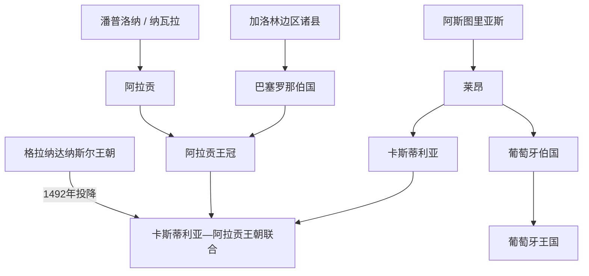

# 基督教诸国与收复失地运动

## 时间

8世纪—1492年

## 概括

“收复失地运动”（Reconquista）是后世用来概括伊比利亚基督教政权长期向南扩张的名称，但八个世纪间不存在一个始终统一、按预定路线执行的国家计划。北部政权也彼此战争、分封、通婚，并与穆斯林政权结盟或收取贡赋；疆域推进还包括移民、城镇自治、领主扩张、教会建制和原居民身份重组。1492年格拉纳达投降是穆斯林国家在半岛终结的节点，不是现代西班牙或葡萄牙从8世纪起“必然复国”的证明。

## 演进图

## 北部政权的形成

| 政权方向 | 形成背景 | 发展机制 | 后续 |
|---|---|---|---|
| 阿斯图里亚斯—莱昂 | 坎塔布连山地未被稳定控制，地方贵族、教会和西哥特遗民记忆结合 | 山地防御、修道院与贵族网络、杜罗河谷堡垒和移民 | 910年后以莱昂为中心；卡斯蒂利亚伯国逐渐自主。 |
| 潘普洛纳—纳瓦拉 | 巴斯克地方集团处在法兰克与科尔多瓦之间 | 在两强间结盟，控制比利牛斯通道 | 桑乔三世时期影响广大，后受卡斯蒂利亚、阿拉贡和法国挤压。 |
| 阿拉贡与加泰罗尼亚诸县 | 法兰克“西班牙边区”和比利牛斯山地伯国 | 王室婚姻、城市与商贸网络、埃布罗河谷征服 | 1137年阿拉贡王室与巴塞罗那伯爵家结合，形成复合王冠。 |
| 卡斯蒂利亚 | 莱昂东部堡垒边区，伯爵权力逐渐世袭 | 骑士、自治市、畜牧网络与王室分封支撑南扩 | 1085年取得托莱多；1230年与莱昂永久共主，成为最大王冠。 |
| 葡萄牙 | 莱昂西部边境伯国及本地贵族—教会网络 | 向南战争、外交承认和反加利西亚政治 | 12世纪取得王国地位，1249年完成阿尔加维征服。 |

各政权完整在位次序分别见[阿斯图里亚斯与莱昂君主世系表](/%E4%BA%BA%E6%96%87%E7%A7%91%E5%AD%A6/%E5%8E%86%E5%8F%B2/%E6%AC%A7%E6%B4%B2/%E4%BC%8A%E6%AF%94%E5%88%A9%E4%BA%9A%E5%8D%8A%E5%B2%9B/%E8%A5%BF%E7%8F%AD%E7%89%99/%E9%98%BF%E6%96%AF%E5%9B%BE%E9%87%8C%E4%BA%9A%E6%96%AF%E4%B8%8E%E8%8E%B1%E6%98%82%E5%90%9B%E4%B8%BB%E4%B8%96%E7%B3%BB%E8%A1%A8.md)、[卡斯蒂利亚王国](/%E4%BA%BA%E6%96%87%E7%A7%91%E5%AD%A6/%E5%8E%86%E5%8F%B2/%E6%AC%A7%E6%B4%B2/%E4%BC%8A%E6%AF%94%E5%88%A9%E4%BA%9A%E5%8D%8A%E5%B2%9B/%E8%A5%BF%E7%8F%AD%E7%89%99/%E5%8D%A1%E6%96%AF%E8%92%82%E5%88%A9%E4%BA%9A%E7%8E%8B%E5%9B%BD.md)、[阿拉贡王国与阿拉贡王冠](/%E4%BA%BA%E6%96%87%E7%A7%91%E5%AD%A6/%E5%8E%86%E5%8F%B2/%E6%AC%A7%E6%B4%B2/%E4%BC%8A%E6%AF%94%E5%88%A9%E4%BA%9A%E5%8D%8A%E5%B2%9B/%E8%A5%BF%E7%8F%AD%E7%89%99/%E9%98%BF%E6%8B%89%E8%B4%A1%E7%8E%8B%E5%9B%BD%E4%B8%8E%E9%98%BF%E6%8B%89%E8%B4%A1%E7%8E%8B%E5%86%A0.md)、[纳瓦拉君主世系表](/%E4%BA%BA%E6%96%87%E7%A7%91%E5%AD%A6/%E5%8E%86%E5%8F%B2/%E6%AC%A7%E6%B4%B2/%E4%BC%8A%E6%AF%94%E5%88%A9%E4%BA%9A%E5%8D%8A%E5%B2%9B/%E8%A5%BF%E7%8F%AD%E7%89%99/%E7%BA%B3%E7%93%A6%E6%8B%89%E5%90%9B%E4%B8%BB%E4%B8%96%E7%B3%BB%E8%A1%A8.md)与[葡萄牙王国](/%E4%BA%BA%E6%96%87%E7%A7%91%E5%AD%A6/%E5%8E%86%E5%8F%B2/%E6%AC%A7%E6%B4%B2/%E4%BC%8A%E6%AF%94%E5%88%A9%E4%BA%9A%E5%8D%8A%E5%B2%9B/%E8%91%A1%E8%90%84%E7%89%99/%E8%91%A1%E8%90%84%E7%89%99%E7%8E%8B%E5%9B%BD.md)。

## 分阶段过程与重要事件

| 时间 | 事件 / 阶段 | 过程与影响 |
|---|---|---|
| 约718/722年 | 科瓦东加传统 | 佩拉约集团在北部取得局部胜利，后被阿斯图里亚斯王权塑造成建国记忆；规模与确切年代存在争议。 |
| 8—9世纪 | 法兰克边区与潘普洛纳兴起 | 加洛林势力夺取巴塞罗那等地；潘普洛纳在法兰克和科尔多瓦之间保持自主。 |
| 9—10世纪 | 杜罗河谷扩张 | 阿斯图里亚斯—莱昂通过堡垒、移民与修道院推进；不能简单理解为“无人区复土”。 |
| 10世纪后半 | 科尔多瓦占优势 | 哈里发军队和曼苏尔远征迫使北部诸国纳贡或防守，扩张并非持续单向。 |
| 1000—1035年 | 桑乔三世的王朝网络 | 纳瓦拉王室通过婚姻和继承影响卡斯蒂利亚、莱昂与阿拉贡，死后分封加速多王国格局。 |
| 1085年 | 卡斯蒂利亚夺取托莱多 | 阿方索六世控制战略旧都；泰法求助穆拉比特，次年卡斯蒂利亚在萨拉卡战败。 |
| 1090年代—12世纪 | 北非王朝反攻与边疆反复 | 穆拉比特、后来的穆瓦希德统一安达卢斯，多次阻断南扩；基督教诸国间也持续战争。 |
| 1128—1179年 | 葡萄牙独立形成 | 圣马梅德战役、向南扩张、1143年协议与1179年教宗承认共同完成国家化。 |
| 1137年 | 阿拉贡—巴塞罗那结合 | 婚姻建立共享王朝但制度分立的阿拉贡王冠，向埃布罗和地中海发展。 |
| 1212年 | 托洛萨会战 | 卡斯蒂利亚、阿拉贡、纳瓦拉等联军击败穆瓦希德；其后马格里布内战和泰法复起比单场战役更直接推动崩解。 |
| 1230—1249年 | 大规模河谷与城市征服 | 莱昂—卡斯蒂利亚永久联合；科尔多瓦、瓦伦西亚、塞维利亚、阿尔加维相继被征服。 |
| 13—15世纪 | 格拉纳达与边境平衡 | 格拉纳达常向卡斯蒂利亚纳贡，边境既有劫掠战争，也有人口、商品与贵族跨境活动。 |
| 1340年 | 萨拉多河战役 | 卡斯蒂利亚和葡萄牙击败格拉纳达—马林联军，北非大规模干预半岛的能力下降。 |
| 1482—1492年 | 格拉纳达战争 | 天主教双王建立长期税收、火炮与围城动员，利用纳斯尔内战逐城推进；格拉纳达最终依约投降。 |

## 扩张如何发生

- **王室战争与封建义务。** 国王以土地、税权和官职换取贵族、骑士团与城市军役，但贵族也会转投竞争王国。
- **移民与城镇特许。** 王室颁布 fueros，吸引定居者、工匠和武装市民；所谓“再移民”常包含对原有村社的整编、驱逐或附属化。
- **军修会与教会。** 圣地亚哥、卡拉特拉瓦、阿维斯等骑士团控制边疆城堡和大片领地；主教区重建把征服纳入拉丁教会网络。
- **贡赋与外交。** 泰法的保护费 parias 为北部王国提供铸币和军费；双方又以婚姻、雇佣军和短期联盟改变力量平衡。
- **土地分配。** 大城市和河谷征服后，王室向贵族、教会、骑士团和移民 repartimiento。不同地区保留穆斯林农民的程度不一，产生穆德哈尔社群。
- **海上与地中海力量。** 葡萄牙、加泰罗尼亚和巴伦西亚的港口、船队与商人使扩张不只沿陆地南进，也转向北非、岛屿与远洋。

## 被征服社会与制度后果

投降条约常允许穆斯林保留宗教、财产和自治法官，但战争、税制、土地分配与后续叛乱会改变条件。穆斯林穆德哈尔、犹太社群和基督徒共享市场与城市空间，同时受到不同法律身份约束。13世纪卡斯蒂利亚的穆德哈尔起义和人口迁移、阿拉贡王冠较长期的穆斯林农民社区，都说明结果因地区而异。

“边疆社会”既产生文化翻译、建筑互鉴和法律借用，也伴随奴役、强迫迁徙、宗教暴力和贵族土地集中。1492年后的犹太人驱逐、穆斯林强制改宗和16—17世纪摩里斯科问题是新王权宗教统一政策的后续，而非整个中世纪过程始终不变的目标。

## 为什么格局最终改变

结构上，北部人口与农业扩展、自治城市和税制、跨比利牛斯援助以及多王国竞争提高了军事动员；安达卢斯则多次受继承内战、泰法分裂和马格里布帝国危机影响。外部压力来自教廷十字军动员、法兰克骑士、地中海贸易与北非王朝交替。直接转折包括1085年托莱多陷落、1212年后穆瓦希德解体和13世纪连续城市征服。格拉纳达的终局还需要卡斯蒂利亚—阿拉贡王朝联合、稳定财政与火炮围城能力，不能以宗教热情单因解释。

## 演变关系

- 并行的穆斯林主线：[安达卢斯与穆斯林统治](/%E4%BA%BA%E6%96%87%E7%A7%91%E5%AD%A6/%E5%8E%86%E5%8F%B2/%E6%AC%A7%E6%B4%B2/%E4%BC%8A%E6%AF%94%E5%88%A9%E4%BA%9A%E5%8D%8A%E5%B2%9B/%E5%AE%89%E8%BE%BE%E5%8D%A2%E6%96%AF%E4%B8%8E%E7%A9%86%E6%96%AF%E6%9E%97%E7%BB%9F%E6%B2%BB.md)。
- 王朝联合与格拉纳达终局：[天主教双王与西班牙形成](/%E4%BA%BA%E6%96%87%E7%A7%91%E5%AD%A6/%E5%8E%86%E5%8F%B2/%E6%AC%A7%E6%B4%B2/%E4%BC%8A%E6%AF%94%E5%88%A9%E4%BA%9A%E5%8D%8A%E5%B2%9B/%E5%A4%A9%E4%B8%BB%E6%95%99%E5%8F%8C%E7%8E%8B%E4%B8%8E%E8%A5%BF%E7%8F%AD%E7%89%99%E5%BD%A2%E6%88%90.md)。
- 葡萄牙方向：[葡萄牙](/%E4%BA%BA%E6%96%87%E7%A7%91%E5%AD%A6/%E5%8E%86%E5%8F%B2/%E6%AC%A7%E6%B4%B2/%E4%BC%8A%E6%AF%94%E5%88%A9%E4%BA%9A%E5%8D%8A%E5%B2%9B/%E8%91%A1%E8%90%84%E7%89%99/README.md)。
- 西班牙方向：[西班牙](/%E4%BA%BA%E6%96%87%E7%A7%91%E5%AD%A6/%E5%8E%86%E5%8F%B2/%E6%AC%A7%E6%B4%B2/%E4%BC%8A%E6%AF%94%E5%88%A9%E4%BA%9A%E5%8D%8A%E5%B2%9B/%E8%A5%BF%E7%8F%AD%E7%89%99/README.md)。
- 所属总览：[伊比利亚半岛](/%E4%BA%BA%E6%96%87%E7%A7%91%E5%AD%A6/%E5%8E%86%E5%8F%B2/%E6%AC%A7%E6%B4%B2/%E4%BC%8A%E6%AF%94%E5%88%A9%E4%BA%9A%E5%8D%8A%E5%B2%9B/README.md)。
