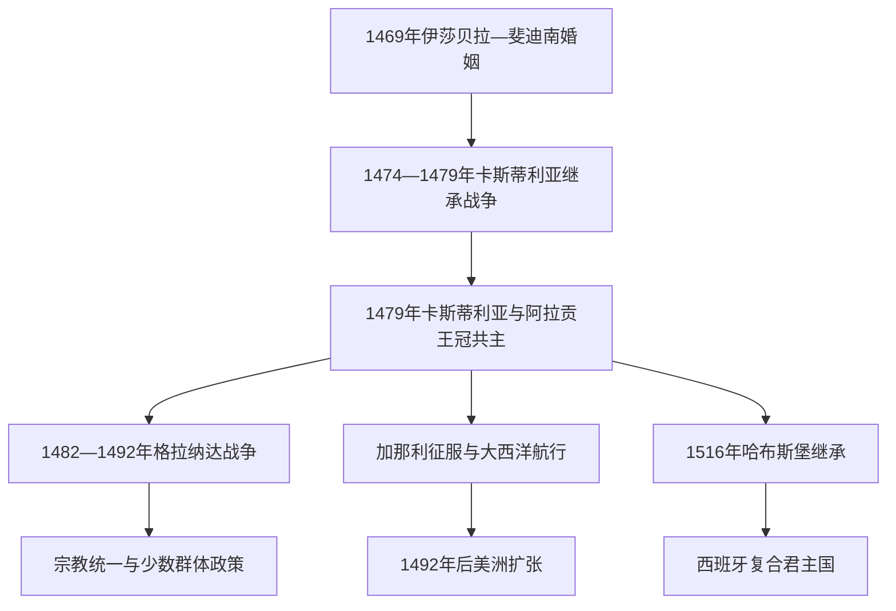

# 天主教双王与西班牙形成

## 时间

1469年—1516年；西班牙统一国家的制度形成延续至18世纪

## 概括

卡斯蒂利亚的伊莎贝拉一世与阿拉贡的斐迪南二世通过婚姻和继承，把两个王冠置于同一对君主之下。这个联合增强了外交、战争和王朝政策的协调，却没有立即合并法律、议会、税收、货币或海外贸易体系。因此“1492年西班牙统一”只能作为象征性简写：现代西班牙是王朝联合、哈布斯堡复合君主国和波旁中央化长期累积的结果。

## 演进图

## 建立背景

15世纪的卡斯蒂利亚和阿拉贡都面临王权—贵族竞争。卡斯蒂利亚国王恩里克四世的女儿胡安娜与异母妹伊莎贝拉均有继承支持者；阿拉贡国王胡安二世则刚经历加泰罗尼亚内战，需要卡斯蒂利亚同盟。1469年伊莎贝拉和斐迪南结婚并非自动取得王位，而是为后续继承战争建立政治联盟。

1474年恩里克四世死后，伊莎贝拉即位。葡萄牙国王阿方索五世支持并迎娶胡安娜，卡斯蒂利亚贵族、城市和外国势力分成两派。1476年托罗战役军事结果并不彻底，伊莎贝拉阵营却在卡斯蒂利亚政治上占优；1479年《阿尔卡索瓦什条约》承认伊莎贝拉王位，并划分葡萄牙与卡斯蒂利亚的大西洋势力。胡安二世同年去世，斐迪南继承阿拉贡王冠，王朝联合才正式成立。

## 统治者、共治与继承

| 统治者 | 领地与在位 | 与前任关系 | 权力与备注 |
|---|---|---|---|
| **伊莎贝拉一世** | 卡斯蒂利亚女王，1474—1504年 | 恩里克四世异母妹 | 王位经继承战争巩固；与斐迪南共同决策，但卡斯蒂利亚王权来自她本人。 |
| **斐迪南二世** | 阿拉贡国王，1479—1516年；卡斯蒂利亚共治国王，1475—1504年 | 阿拉贡胡安二世之子；伊莎贝拉之夫 | 在两王冠分别宣誓和行政；伊莎贝拉死后一度与女儿胡安娜共同拥有卡斯蒂利亚名义。 |
| 胡安娜一世 | 卡斯蒂利亚女王，1504—1555年；1516年起兼阿拉贡 | 伊莎贝拉与斐迪南之女 | 法定君主，但精神健康、丈夫和父亲的权力争夺及长期幽禁使她少有实权。 |
| 腓力一世 | 卡斯蒂利亚共治国王，1506年 | 胡安娜之夫，哈布斯堡宗室 | 与斐迪南争夺摄政，短期掌权后去世。 |
| 斐迪南二世 | 卡斯蒂利亚摄政，1507—1516年 | 胡安娜之父 | 以女王无力理政为由再次掌权；1512年征服南纳瓦拉。 |
| 卡洛斯一世 | 1516年起共同继承两王冠 | 胡安娜之子 | 在母亲仍为名义女王时执政，开启西班牙哈布斯堡主线。 |

## 王权整合而非单一国家

| 领域 | 卡斯蒂利亚 | 阿拉贡王冠 | 联合后的共同部分 |
|---|---|---|---|
| 法律与议会 | 卡斯蒂利亚议会、王室审判院和较统一税基 | 阿拉贡、加泰罗尼亚、巴伦西亚等各有 fueros、议会和官署 | 君主、王室婚姻、外交及部分战争目标共享。 |
| 财政 | 人口和税收规模更大；承担格拉纳达战争和美洲事业主体 | 征税通常需分别与各地议会协商 | 没有统一国库，资源动员不对称。 |
| 海外方向 | 加那利、大西洋和1492年后的美洲 | 西地中海、意大利与北非 | 外交协商，但垄断机构仍分属王冠。 |
| 官僚与地方 | 圣兄弟会、王室委员会、巡回审判院 | 总督和地方议会契约传统 | 君主强化任命与司法，却依赖地方精英。 |

## 重要政策与事件

- **王权与贵族。** 双王拆除部分私家堡垒、重组圣兄弟会、扩大王室委员会和审判院，并把军事骑士团总团长权逐步纳入王室。他们没有消灭贵族，而是以官职、宫廷和土地秩序重新整合贵族。
- **格拉纳达战争。** 1482—1492年连续围城依靠卡斯蒂利亚税收、阿拉贡军事经验、火炮、贵族军役和教廷支持。纳斯尔王族内战使征服加快；1491年投降条约承诺保护穆斯林宗教和财产。
- **宗教裁判所。** 1478年教宗授权王室设立西班牙宗教裁判所，最初重点审理被指秘密实践犹太教的皈依者。它既服务宗教正统，也成为跨王冠的王权机构。
- **1492年犹太人驱逐。** 皈依天主教或离境成为选择，造成家庭、商业和知识网络破裂；部分塞法迪犹太人迁往葡萄牙、北非、奥斯曼和意大利。
- **穆斯林政策转向。** 格拉纳达投降初期政策相对宽容，1499年后强制改宗与反抗升级；卡斯蒂利亚1502年要求穆斯林改宗或离境。阿拉贡王冠的全面强制改宗发生在1520年代，不能全部归于1492年一天。
- **大西洋。** 卡斯蒂利亚在加那利群岛的征服包含条约、战争、奴役和殖民定居。1492年哥伦布航行开启对美洲的持续征服和殖民，并非单纯“发现空白新大陆”。
- **葡萄牙竞争。** 1494年《托德西利亚斯条约》在教宗划界基础上重新划分海外主张；它没有征得美洲、非洲或亚洲居民同意，实际边界也取决于航行和占领。
- **意大利与纳瓦拉。** 斐迪南在意大利战争中扩大那不勒斯控制；1512年利用法国战争征服南纳瓦拉，使半岛政治版图进一步接近后来西班牙边界。

## 崛起条件与局限

双王成功来自卡斯蒂利亚人口税源、城市和贵族对继承稳定的需求、阿拉贡外交军事网络、教会支持以及两位君主分工。格拉纳达战争和海外事业又为王权提供共同象征。然而整合始终不均衡：卡斯蒂利亚承担较多财政，阿拉贡诸地保留契约制度，纳瓦拉和巴斯克特权亦延续。王权的宗教统一政策制造被迫改宗、财产没收和流亡，也给16世纪摩里斯科问题留下长期冲突。

## 王朝转折与后续

伊莎贝拉唯一存活的继承女胡安娜嫁入哈布斯堡。1504年后围绕胡安娜的理政能力，斐迪南、腓力和卡斯蒂利亚贵族展开摄政竞争；腓力早逝后斐迪南重新掌权。1516年斐迪南死去，卡洛斯以胡安娜共治者身份继承卡斯蒂利亚和阿拉贡，同时带来尼德兰与哈布斯堡家产。双王的联合由此转化为规模更大的复合帝国，而非一个已完成制度统一的民族国家。

## 演变关系

- 形成基础：[卡斯蒂利亚王国](/%E4%BA%BA%E6%96%87%E7%A7%91%E5%AD%A6/%E5%8E%86%E5%8F%B2/%E6%AC%A7%E6%B4%B2/%E4%BC%8A%E6%AF%94%E5%88%A9%E4%BA%9A%E5%8D%8A%E5%B2%9B/%E8%A5%BF%E7%8F%AD%E7%89%99/%E5%8D%A1%E6%96%AF%E8%92%82%E5%88%A9%E4%BA%9A%E7%8E%8B%E5%9B%BD.md)、[阿拉贡王国与阿拉贡王冠](/%E4%BA%BA%E6%96%87%E7%A7%91%E5%AD%A6/%E5%8E%86%E5%8F%B2/%E6%AC%A7%E6%B4%B2/%E4%BC%8A%E6%AF%94%E5%88%A9%E4%BA%9A%E5%8D%8A%E5%B2%9B/%E8%A5%BF%E7%8F%AD%E7%89%99/%E9%98%BF%E6%8B%89%E8%B4%A1%E7%8E%8B%E5%9B%BD%E4%B8%8E%E9%98%BF%E6%8B%89%E8%B4%A1%E7%8E%8B%E5%86%A0.md)。
- 格拉纳达背景：[安达卢斯与穆斯林统治](/%E4%BA%BA%E6%96%87%E7%A7%91%E5%AD%A6/%E5%8E%86%E5%8F%B2/%E6%AC%A7%E6%B4%B2/%E4%BC%8A%E6%AF%94%E5%88%A9%E4%BA%9A%E5%8D%8A%E5%B2%9B/%E5%AE%89%E8%BE%BE%E5%8D%A2%E6%96%AF%E4%B8%8E%E7%A9%86%E6%96%AF%E6%9E%97%E7%BB%9F%E6%B2%BB.md)。
- 后一王朝：[西班牙哈布斯堡王朝](/%E4%BA%BA%E6%96%87%E7%A7%91%E5%AD%A6/%E5%8E%86%E5%8F%B2/%E6%AC%A7%E6%B4%B2/%E4%BC%8A%E6%AF%94%E5%88%A9%E4%BA%9A%E5%8D%8A%E5%B2%9B/%E8%A5%BF%E7%8F%AD%E7%89%99/%E8%A5%BF%E7%8F%AD%E7%89%99%E5%93%88%E5%B8%83%E6%96%AF%E5%A0%A1%E7%8E%8B%E6%9C%9D.md)。
- 海外比较：[西葡帝国与大航海](/%E4%BA%BA%E6%96%87%E7%A7%91%E5%AD%A6/%E5%8E%86%E5%8F%B2/%E6%AC%A7%E6%B4%B2/%E4%BC%8A%E6%AF%94%E5%88%A9%E4%BA%9A%E5%8D%8A%E5%B2%9B/%E8%A5%BF%E8%91%A1%E5%B8%9D%E5%9B%BD%E4%B8%8E%E5%A4%A7%E8%88%AA%E6%B5%B7.md)。
- 所属总览：[伊比利亚半岛](/%E4%BA%BA%E6%96%87%E7%A7%91%E5%AD%A6/%E5%8E%86%E5%8F%B2/%E6%AC%A7%E6%B4%B2/%E4%BC%8A%E6%AF%94%E5%88%A9%E4%BA%9A%E5%8D%8A%E5%B2%9B/README.md)。
