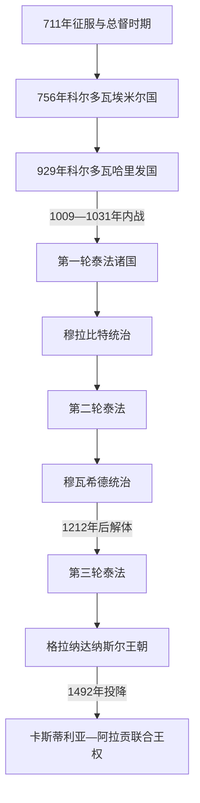

# 安达卢斯与穆斯林统治

## 时间

711年—1492年

## 概括

“安达卢斯”是中世纪穆斯林对伊比利亚受其统治地区的称呼，其疆域和政体不断变化。711年的征服由阿拉伯—柏柏尔军队完成，但早期统治大量沿用既有城市、主教区、地方贵族和税收网络；此后又经历科尔多瓦倭马亚政权、泰法诸国、马格里布王朝和格拉纳达纳斯尔王朝。它既不是八百年不变的统一国家，也不是与北部基督教社会完全隔绝的文明岛屿。

## 演进图

## 建立背景与征服过程

西哥特王国晚期的选王冲突、地方贵族竞争和王室军事动员困难为外来干预创造机会，但并不能单独解释政权迅速瓦解。711年塔里克在直布罗陀登陆，在瓜达莱特战役击败国王罗德里克；712年穆萨率增援进入。军队沿罗马道路和城市网络推进，并通过投降协议、纳贡与地方合作取得多数地区。少数山地、边区和贵族集团继续抵抗，半岛控制不是一次战役自动完成。

征服者内部也不统一：阿拉伯部族、叙利亚军团和人数更多的柏柏尔士兵在土地、军饷和职位上竞争。740年代柏柏尔起义与军团内战几乎撕裂行省。750年大马士革倭马亚王朝覆亡后，宗室阿卜杜勒-拉赫曼逃到伊比利亚，依靠叙利亚军人和地方联盟于756年击败总督优素福，建立独立埃米尔国。

## 政权阶段与统治结构

| 阶段 | 时间 | 权力结构 | 形成、维持与终结 |
|---|---|---|---|
| 征服与总督时期 | 711—756年 | 总督名义上隶属北非和大马士革；军团、部族首领与地方领主分享权力 | 靠军事胜利和地方条约建立；柏柏尔起义、阿拉伯部族战与倭马亚帝国覆亡使秩序失稳。 |
| 科尔多瓦埃米尔国 | 756—929年 | 倭马亚埃米尔、宫廷官僚、军队与边区家族 | 王朝合法性、税收和雇佣军维持中央；9世纪后穆拉迪领主与边区叛乱令控制收缩。 |
| 科尔多瓦哈里发国 | 929—1031年 | 哈里发兼具政治与宗教权威；宰相、侍从军、行省与边区军政官运作 | 阿卜杜勒-拉赫曼三世重建中央并对抗法蒂玛；幼主、阿米尔家族摄政、军队派系和继承内战导致解体。 |
| 泰法诸国 | 11—13世纪三轮出现 | 塞维利亚、托莱多、萨拉戈萨、巴达霍斯、格拉纳达等地方宫廷并立 | 城市税收与文化竞争活跃，却常向北方王国纳贡、彼此雇佣敌军；不能写成单一衰败阶段。 |
| 穆拉比特与穆瓦希德 | 约1090—1228年 | 马格里布帝国的哈里发 / 埃米尔、驻军与安达卢斯地方精英 | 受泰法邀请或乘危进入，短期恢复军事统一；跨海统治、宗教政治冲突和马格里布内战削弱控制。 |
| 格拉纳达纳斯尔王朝 | 1232/1238—1492年 | 埃米尔、宰相、王族、军队、城市与边境领主；常向卡斯蒂利亚纳贡 | 山地、港口贸易、外交平衡和移民人口支持生存；15世纪王族内战与卡斯蒂利亚—阿拉贡联合攻势使其灭亡。 |

完整在位次序、复位和争议编号见[安达卢斯统治者世系表](/%E4%BA%BA%E6%96%87%E7%A7%91%E5%AD%A6/%E5%8E%86%E5%8F%B2/%E6%AC%A7%E6%B4%B2/%E4%BC%8A%E6%AF%94%E5%88%A9%E4%BA%9A%E5%8D%8A%E5%B2%9B/%E5%AE%89%E8%BE%BE%E5%8D%A2%E6%96%AF%E7%BB%9F%E6%B2%BB%E8%80%85%E4%B8%96%E7%B3%BB%E8%A1%A8.md)。

## 社会、经济与文化机制

- **人口与身份。** 阿拉伯、柏柏尔、改宗伊斯兰的穆拉迪、保持基督教的莫扎拉布、犹太社群、来自欧洲和非洲的奴隶与自由民共同构成社会。身份、语言和法律地位会跨代改变，不能以现代民族边界套用。
- **土地与城市。** 罗马—西哥特土地结构并未消失，但灌溉、园艺作物、市场和城市手工业持续发展。科尔多瓦、塞维利亚、托莱多、萨拉戈萨和格拉纳达是政治与学术中心，城乡差异和地区生态同样重要。
- **宗教秩序。** 基督徒和犹太人通常以受保护而负担专门税役的社群存在，具体待遇随时期和统治者变化。合作、翻译与共同市场真实存在，歧视、暴力、强制迁移和宗教压迫也真实存在；“三教永恒和谐”与“持续宗教战争”都是过度简化。
- **知识与艺术。** 宫廷和城市网络支持医学、哲学、天文、诗歌、翻译、建筑和工艺。科尔多瓦大清真寺、麦地那·扎赫拉和阿尔罕布拉宫反映不同政权的资源与合法性表达。
- **跨境关系。** 穆斯林与基督教政权既战争，也结盟、通婚、纳贡、雇佣对方士兵和交换技术。边疆是一条不断移动的社会带，不是封闭文明的硬边界。

## 重要事件与转折

| 时间 | 事件 | 过程与意义 |
|---|---|---|
| 711—714年 | 征服西哥特王国大部 | 军事胜利与地方投降协议并用，建立总督统治。 |
| 740—743年 | 柏柏尔起义与军团内战 | 暴露征服集团内部的资源和身份冲突。 |
| 756年 | 独立埃米尔国建立 | 阿卜杜勒-拉赫曼一世摆脱阿拔斯政治控制。 |
| 818、852—859年 | 科尔多瓦社会冲突 | 郊区起义、宗教殉道运动和国家镇压反映城市矛盾。 |
| 880年代—928年 | 伊本·哈夫孙反叛 | 南部山地与穆拉迪领主挑战中央；最终被阿卜杜勒-拉赫曼三世平定。 |
| 929年 | 称哈里发 | 科尔多瓦与阿拔斯、法蒂玛竞争，王权进入鼎盛。 |
| 976—1002年 | 曼苏尔掌权 | 宫廷侍从集团架空希沙姆二世，以远征和军队维持权威。 |
| 1009—1031年 | 安达卢斯内战 | 倭马亚、哈穆德、柏柏尔与斯拉夫军政集团争位，哈里发国被取消。 |
| 1085—1090年 | 托莱多陷落与穆拉比特介入 | 泰法向马格里布求援；穆拉比特从盟军转为征服者。 |
| 1140年代 | 穆拉比特瓦解 | 安达卢斯起义与穆瓦希德扩张造成第二轮泰法。 |
| 1195、1212年 | 阿拉科斯胜利与托洛萨失败 | 穆瓦希德军事优势先达到高点，后遭联盟军重创；帝国内战加速伊比利亚解体。 |
| 1236—1248年 | 科尔多瓦、瓦伦西亚、塞维利亚相继陷落 | 卡斯蒂利亚和阿拉贡取得主要河谷与城市，只余格拉纳达。 |
| 1232/1238年 | 纳斯尔政权形成 | 穆罕默德一世以格拉纳达为都，在称臣和结盟中建立末代穆斯林国家。 |
| 1340年 | 萨拉多河战役 | 卡斯蒂利亚—葡萄牙击败格拉纳达—马林联军，北非大规模军事介入衰退。 |
| 1482—1492年 | 格拉纳达战争 | 纳斯尔内战与天主教双王的长期围城结合；1492年1月2日交城。 |

## 鼎盛、衰退与终结的因果

科尔多瓦政权的优势来自农业和城市税基、跨地中海贸易、专业官僚、军队与倭马亚王朝象征；它的瓦解则由幼主继承、侍从摄政、军队族群竞争、边区自主和财政军事压力共同造成。泰法的政治分裂并不等于文化停滞，却提高了纳贡和外部干预成本。穆拉比特、穆瓦希德的统一也不是单纯“外族入侵”，而是安达卢斯精英求援、马格里布帝国扩张和宗教改革相互作用的结果。

格拉纳达长期存续依靠有利地形、密集人口、丝绸与港口贸易、向卡斯蒂利亚称臣和在伊比利亚—马格里布诸国之间平衡。15世纪内部废立使对手可以扶植王位竞争者；卡斯蒂利亚与阿拉贡的王朝联合、稳定税源、火炮和连续十年围城构成结构性外压。纳斯尔王族内战是加速因素，1492年投降是直接终点。此后穆斯林居民先受投降条款保护，后来经历强制改宗、反抗与驱逐，社会转型远晚于政权灭亡。

## 演变关系

- 前一阶段：[西哥特统治下的伊比利亚](/%E4%BA%BA%E6%96%87%E7%A7%91%E5%AD%A6/%E5%8E%86%E5%8F%B2/%E6%AC%A7%E6%B4%B2/%E4%BC%8A%E6%AF%94%E5%88%A9%E4%BA%9A%E5%8D%8A%E5%B2%9B/%E8%A5%BF%E5%93%A5%E7%89%B9%E7%BB%9F%E6%B2%BB%E4%B8%8B%E7%9A%84%E4%BC%8A%E6%AF%94%E5%88%A9%E4%BA%9A.md)。
- 并行主线：[基督教诸国与收复失地运动](/%E4%BA%BA%E6%96%87%E7%A7%91%E5%AD%A6/%E5%8E%86%E5%8F%B2/%E6%AC%A7%E6%B4%B2/%E4%BC%8A%E6%AF%94%E5%88%A9%E4%BA%9A%E5%8D%8A%E5%B2%9B/%E5%9F%BA%E7%9D%A3%E6%95%99%E8%AF%B8%E5%9B%BD%E4%B8%8E%E6%94%B6%E5%A4%8D%E5%A4%B1%E5%9C%B0%E8%BF%90%E5%8A%A8.md)。
- 终结与王朝联合：[天主教双王与西班牙形成](/%E4%BA%BA%E6%96%87%E7%A7%91%E5%AD%A6/%E5%8E%86%E5%8F%B2/%E6%AC%A7%E6%B4%B2/%E4%BC%8A%E6%AF%94%E5%88%A9%E4%BA%9A%E5%8D%8A%E5%B2%9B/%E5%A4%A9%E4%B8%BB%E6%95%99%E5%8F%8C%E7%8E%8B%E4%B8%8E%E8%A5%BF%E7%8F%AD%E7%89%99%E5%BD%A2%E6%88%90.md)。
- 所属总览：[伊比利亚半岛](/%E4%BA%BA%E6%96%87%E7%A7%91%E5%AD%A6/%E5%8E%86%E5%8F%B2/%E6%AC%A7%E6%B4%B2/%E4%BC%8A%E6%AF%94%E5%88%A9%E4%BA%9A%E5%8D%8A%E5%B2%9B/README.md)。
