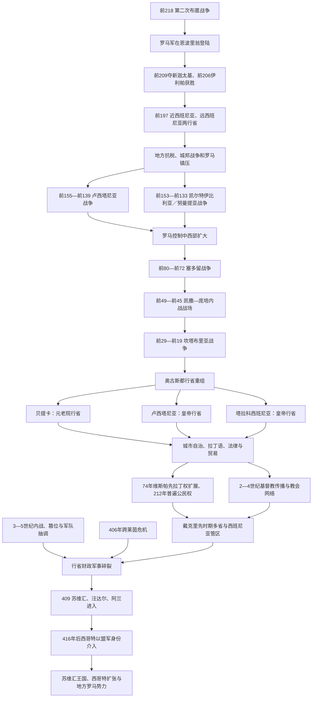

# 罗马时期的伊比利亚

## 时间

前218年罗马军登陆至5世纪后期西罗马在半岛的行省权力消失。罗马对全半岛的征服直到前19年坎塔布里亚战争结束才大体完成；409年并非所有地区同时脱离，东北塔拉科西班尼亚仍由帝国或其代理势力控制数十年。

## 别称

罗马西班尼亚、西班尼亚诸行省。拉丁语“Hispania”是半岛地理和行政集合名，不是现代西班牙民族国家；今葡萄牙大部同样属于西班尼亚。

## 概括

罗马因第二次布匿战争进入伊比利亚，前206年赶走迦太基后却没有撤军，而是把沿海基地改造成两个行省。地方城邦、卢西塔尼亚、凯尔特伊比利亚和北部山地共同体以战争、叛乱、结盟和服役等不同方式应对；从登陆到坎塔布里亚战争结束历时近两百年。罗马胜利依靠地中海海运、盟友、持续兵源、分区行政与地方精英合作，不是一次征服完成。

帝国时期，贝提卡、卢西塔尼亚和塔拉科西班尼亚等行省通过城市自治、道路、拉丁语、罗马法、税收和军队接入地中海。橄榄油、鱼酱、矿产、葡萄酒、粮食和军人推动繁荣，也建立在奴隶劳动、征税和矿区强制之上。不同地区“罗马化”程度不一：南部与东岸城市密集，北部和乡村保留更多语言、宗教和社会传统；地方人同时可以成为罗马公民、城市精英与本地共同体成员。

5世纪帝国财政军事危机、内战和跨莱茵集团进入使行省秩序碎裂。苏维汇、汪达尔和阿兰人在409年进入，西哥特作为帝国盟军介入，地方地主、城市和军队继续以罗马名义活动。西罗马权力不是在单一年份“被蛮族推翻”，而在争帝、条约、迁徙和地方接管中逐步终结。

## 征服与行省演变图

## 罗马进入半岛

### 第二次布匿战争

前218年汉尼拔进攻萨贡托后，罗马同迦太基开战。罗马原计划在伊比利亚牵制汉尼拔，格奈乌斯·西庇阿从恩波里翁登陆并同东北本地城邦结盟。战争初期双方都依赖伊比利亚、凯尔特伊比利亚和巴利阿里兵员，本地共同体根据人质、贡赋和安全反复选边。

前211年两位西庇阿统帅在南部战死，罗马战线一度崩溃。小西庇阿前209年突袭新迦太基，夺取港口、银库、武器和人质；前206年伊利帕战役后迦太基主力撤离，加迪尔同罗马议和。罗马从盟友手中接管贡赋和驻军，很快引发伊勒尔盖特等反抗，说明“驱逐迦太基”与“接受罗马统治”是两回事。

### 两行省

前197年，罗马设近西班尼亚和远西班尼亚，由年度总督统治。边界随战争而变，早期行政实际集中于沿海、贝提斯河谷和主要军路。总督既指挥军队、司法和外交，也可通过战利品、税收与矿权获利；距离罗马遥远、任期短，容易出现勒索。地方城邦可能是免税盟友、缴税共同体、殖民地或被征服居民，地位并不统一。

前195年执政官老加图率军镇压东北起义，命令拆毁部分城墙。罗马常以分化联盟、没收武器、迁移人口和缔结不平等条约维持控制；本地精英也利用罗马支持打击竞争者。

## 长期征服过程

### 卢西塔尼亚战争

前2世纪中期，罗马向今葡萄牙中部和西班牙西部扩张。前150年总督加尔巴以谈判和分地为名聚集卢西塔尼亚人，随后屠杀和奴役多人，激化抵抗。维里阿修斯约前147年成为重要统帅，利用山地、快速移动和地方盟友多次击败罗马军，并一度获条约承认为“罗马人民之友”。

罗马元老院后来否认或改变和约，前139年维里阿修斯被三名使者刺杀。传统称罗马拒绝支付刺客并说“罗马不奖赏叛徒”，具体语句来自后世叙事。抵抗在领袖死后瓦解，直接原因是联盟依赖个人指挥、罗马持续增援和精英分化；这不表示卢西塔尼亚人口消失。

### 凯尔特伊比利亚与努曼提亚

罗马同中部高原城邦经历多轮战争。前153年塞吉达扩建城墙与联盟争端触发战争，罗马甚至把执政官年度开始提前到1月，传统上与这场动员相关。努曼提亚以坚固山城和机动作战抵抗，多名罗马统帅失败或签下屈辱条约。

前134—前133年，小西庇阿整顿军纪、修建环形营垒切断补给。长期饥饿后努曼提亚投降，部分居民自杀或被卖为奴隶，城被摧毁。后世把它塑造成西班牙民族抵抗象征，但当时是特定阿雷瓦基城邦和盟友的战争，不代表一个统一民族国家。

### 塞多留战争

罗马内战把半岛纳入共和国派系竞争。马略派将领昆图斯·塞多留前80年在伊比利亚建立反苏拉政权，联合卢西塔尼亚和其他共同体，设流亡元老院、训练本地军队，并为精英子弟办学校。他既利用地方自主诉求，也自称合法罗马政府，不是现代意义独立领袖。

庞培和梅特鲁斯长期无法决定性击败他，后通过消耗与招降削弱联盟。前72年塞多留被部将佩尔佩尔纳刺杀，后者很快被庞培击败。战争显示罗马化精英、本地军力和帝国政治已不可分。

### 凯撒、庞培与坎塔布里亚战争

凯撒曾任远西班尼亚总督，前61—前60年远征西北并取得战利品。前49年内战中，他在伊莱尔达迫使庞培军投降；前45年蒙达战役击败庞培诸子，半岛城市因选边获得奖赏或惩罚。

北部坎塔布里亚、阿斯图里亚和加莱西亚部分地区直到奥古斯都时仍未稳定纳入。前29—前19年罗马多路进攻，奥古斯都亲临但因病离开，阿格里帕等完成镇压。军队围困山堡、迁民至低地、奴役俘虏并控制矿区。前19年通常视为征服结束，但山地仍需驻军，反抗记载也受罗马胜利宣传影响。

## 行省结构

### 奥古斯都时期

| 行省 | 大致范围 | 地位与首府 | 经济和军事特征 |
|---|---|---|---|
| 贝提卡 | 南部贝提斯河谷与安达卢西亚大部 | 元老院行省；首府科尔杜巴 | 城市密集、橄榄油、酒、鱼酱、矿业；驻军相对少。 |
| 卢西塔尼亚 | 半岛西部中南部，含今葡萄牙大部内陆及西班牙西部 | 皇帝行省；首府奥古斯塔·埃梅里塔 | 退伍军人殖民地、道路、农业、矿产和边地整合。 |
| 塔拉科西班尼亚 | 北部、东部和中部广大区域 | 皇帝行省；首府塔拉科 | 面积最大，含军团与北部矿区；地方差异显著。 |

边界和行政不是现代国界。葡萄牙北部多属塔拉科西班尼亚，西班牙西部部分属卢西塔尼亚；“卢西塔尼亚等于葡萄牙”不准确。

### 帝国后期改革

3世纪行政和军事压力促使行省细分。戴克里先及其后继时期，半岛形成贝提卡、卢西塔尼亚、塔拉科西班尼亚、加莱西亚、迦太基西班尼亚，后来巴利阿里群岛另设行省；北非毛里塔尼亚廷吉塔纳在行政上也隶属西班尼亚管区。各省由较低级总督治理，管区代理官协调，最高军权逐渐与民政分离。

这种细分不是衰落本身，而是提高征税、司法和响应能力。问题在于4—5世纪内战和边防压力使中央无法稳定提供军饷和机动军。

## 城市、法律与地方精英

### 城市等级

罗马通过殖民地、自治市和本地公民共同体管理。意大利或退伍军人殖民地如伊塔利卡、奥古斯塔·埃梅里塔、恺撒奥古斯塔拥有罗马式土地和公民制度；许多旧伊比利亚、布匿城市逐步取得拉丁权或罗马公民权。城市议会由地方富户担任成员，负责税收、道路、市场、祭祀和公共建筑。

74年维斯帕先向西班尼亚多数自由共同体授予拉丁权，担任地方官者及家庭可取得罗马公民权，推动精英整合。212年卡拉卡拉敕令把帝国几乎全部自由居民纳为公民。公民权扩大不等于社会平等：奴隶、被释奴、佃户、贫民和女性的法律能力仍不同。

### “罗马化”的机制

拉丁语、罗马法、名字、服饰、浴场和神庙常由本地精英主动采用，以进入帝国官职和贸易。军队服役、城市法院、市场和跨地区婚姻扩大传播。地方语言在东部、北部和乡村延续数世纪，伊比利亚语约在帝国早期逐渐消失，巴斯克语言祖先在比利牛斯西部存续。

因此“罗马化”是强制、利益、模仿和混合，不是意大利人口替换半岛居民。城市罗马身份可以同本地家族、神祇和地区认同并存。

## 经济与基础设施

### 农业与海运

贝提卡橄榄油以双耳罐大量运往罗马和边防，罗马蒙特泰斯塔乔陶片山保存其规模。酒、谷物、羊毛、马、鱼酱和盐渍鱼也跨地中海交易。庄园、自由小农、租佃和奴隶劳动并存；并非所有土地由少数罗马移民占有。

港口加迪斯、卡塔戈诺瓦、塔拉科、希斯帕利斯与奥利西波连接海路。瓜达尔基维尔、埃布罗等河流和道路把内陆产品运至港口。

### 矿业

卡塔赫纳和莫雷纳山银铅矿、里奥廷托铜矿、西北拉斯梅杜拉斯金矿等由国家、承包商和地方劳工开采。拉斯梅杜拉斯使用引水冲蚀山体，规模宏大，也改变环境和社区。战俘、奴隶、自由矿工及服役共同体都可能参与，地区和时期不同。

矿产为战争与货币提供财政，是征服北部的重要动力之一，却不能解释所有战争。资源控制需要道路、军营、法律和税务网络。

### 道路与城市设施

奥古斯塔大道沿地中海岸，银路连接埃梅里塔与西北，道路里程碑、桥梁和驿站支持军队、邮传与贸易。塞哥维亚水道、梅里达剧场桥梁、塔拉戈纳建筑等显示工程能力。城市宏伟由皇帝、地方精英和税赋共同资助，农村生活条件与城市公共空间差异很大。

## 社会与文化

### 多重人口

军团、辅助军、商人、官员和奴隶来自意大利、北非、高卢、东方及半岛内部。军队退伍者定居殖民地，本地辅助军也被派往不列颠、莱茵等边疆。墓志铭显示家庭、被释奴和职业流动，罗马西班尼亚从不是单一血缘社会。

半岛诞生或培育多位帝国人物：塞涅卡、卢坎、昆体良、马提亚尔等用拉丁语参与罗马文学；图拉真、哈德良同伊塔利卡家族相关，狄奥多西一世出身西班尼亚。称他们为“西班牙皇帝”容易投射现代国籍，更准确是来自罗马西班尼亚的帝国精英。

### 宗教

朱庇特、皇帝崇拜、密特拉及东方神同本地恩多维利库斯、阿塔埃奇娜等神祇并存，罗马式祭坛常保留本地神名。宗教融合由城市、军队和个人还愿推动，不是官方一次替换。

基督教至少在3世纪已有可靠社群，304年前后迫害传统产生圣徒记忆，约305／306年埃尔维拉会议显示主教、教规和社区网络。4世纪皇帝支持后，教会获得财产与公共影响，乡村传统信仰仍延续。普里西利安因禁欲神学和教会政治于385年被处死，是首批由基督教世俗当局以异端罪处决者之一，其支持在西北持续。

## 3世纪危机与晚期恢复

3世纪内战、军队拥立、货币贬值和海上袭击影响贸易与城市建设。约260年代法兰克等集团可能袭击高卢和西班尼亚海岸，材料有限，不宜夸大为全半岛毁灭。部分别墅和农业在4世纪繁荣，基督教建筑和富豪马赛克扩展，说明危机后存在恢复。

西班尼亚曾卷入高卢帝国和后来的争帝。4世纪末狄奥多西家族进入帝国最高政治，5世纪初西班尼亚又成为不列颠篡位者君士坦丁三世与霍诺留势力争夺的后方。地方军队被内战消耗，为跨比利牛斯集团进入创造条件。

## 罗马统治终结过程

### 409年进入与分区

406年末汪达尔、阿兰和苏维汇等跨越莱茵进入高卢，409年穿过比利牛斯。传统记载称他们在411年前后抽签分配行省：苏维汇和哈斯丁汪达尔居加莱西亚，阿兰人控制卢西塔尼亚与迦太基西班尼亚，西林汪达尔在贝提卡。这个安排可能得到篡位政权或地方条约默认，具体边界和中央批准不清。

来者人数有限，依靠军队与本地税收，并未取代全体居民。城市、主教、地主和罗马官员继续存在；塔拉科西班尼亚尤其较久保持帝国联系。

### 西哥特盟军介入

416年后，西罗马政府让西哥特王瓦利亚作为盟军打击阿兰和西林汪达尔。西哥特军摧毁其主要王权，幸存者依附哈斯丁汪达尔；后者扩大后于429年渡海北非。苏维汇留在西北，建立更持久王国。

西哥特最初的主要定居地在高卢阿基坦，并非416年立即建立托莱多王国。5世纪中后期，他们多次以盟军或独立强权进入半岛；欧里克时期控制塔拉科等地，476年西罗马皇帝被废前后已成为主要后继者。西北苏维汇、地方罗马贵族和巴斯克等仍保有不同权力。

### 没有单一“罗马撤离日”

罗马不列颠可用410年前后描述中央撤离，西班尼亚则没有同样模式。行省被跨境军团占领、罗马借盟军重建、地方精英继续行政，最后由苏维汇与西哥特等政权吸收。409、418、472、476都代表不同转折，不能任选一个当作全半岛同时终点。

## 重要事件

| 时间 | 事件 | 直接结果 | 长期意义 |
|---|---|---|---|
| 前218年 | 罗马在恩波里翁登陆 | 开辟伊比利亚战场 | 罗马进入半岛并逐步取代迦太基。 |
| 前209年 | 新迦太基陷落 | 迦太基失军港、银库和人质 | 罗马掌握东南战略中心。 |
| 前206年 | 伊利帕战役与加迪尔转向 | 迦太基撤出 | 罗马由战时盟友变为占领者。 |
| 前197年 | 设近、远西班尼亚 | 建立常设总督和赋税 | 两百年征服与行省化开始。 |
| 前155—前139年 | 卢西塔尼亚战争 | 维里阿修斯联盟兴亡 | 西部被逐步纳入，罗马违约记忆深刻。 |
| 前153—前133年 | 凯尔特伊比利亚／努曼提亚战争 | 努曼提亚被围降 | 中部高原控制扩大。 |
| 前80—前72年 | 塞多留战争 | 反苏拉罗马政权联合本地势力 | 半岛成为共和国世界内战核心。 |
| 前49、前45年 | 伊莱尔达与蒙达战役 | 凯撒击败庞培势力 | 城市地位与殖民建立重组。 |
| 前29—前19年 | 坎塔布里亚战争 | 北部主要抵抗被镇压 | 罗马大体控制全半岛。 |
| 约前27年后 | 奥古斯都重组行省 | 贝提卡、卢西塔尼亚、塔拉科西班尼亚形成 | 奠定帝国期行政格局。 |
| 74年 | 维斯帕先扩大拉丁权 | 更多城市精英取得公民权途径 | 地方自治与帝国整合深化。 |
| 212年 | 卡拉卡拉普遍公民权 | 多数自由居民成为罗马公民 | 法律身份统一但社会等级延续。 |
| 约305／306年 | 埃尔维拉会议 | 西班尼亚教会制定纪律 | 证明基督教已有区域组织。 |
| 298年前后 | 戴克里先行政改革 | 行省细分并组成西班尼亚管区 | 提高晚期治理密度。 |
| 385年 | 普里西利安被处死 | 禁欲运动遭镇压 | 展示教会争论与世俗刑罚结合。 |
| 409年 | 苏维汇、汪达尔、阿兰进入 | 多省军政权力碎裂 | 后罗马诸政权形成开始。 |
| 416—418年 | 西哥特作为盟军作战 | 阿兰和西林汪达尔王权被摧毁 | 西哥特进入半岛权力政治。 |
| 429年 | 汪达尔渡海北非 | 半岛南部权力再洗牌 | 苏维汇、西哥特与地方势力成为主角。 |
| 472年左右 | 西哥特控制塔拉科等地 | 东北最后主要罗马行政被吸收 | 半岛行省时代接近结束。 |

## 罗马统治的维持条件

- 地中海舰队和沿岸基地保证军队可持续增援，地方联盟则分散抵抗。
- 行省、城市议会和税务把地方精英利益同帝国官职、公民权连接。
- 道路、港口和驿站同时服务军队、司法、邮传与市场。
- 矿产、农业和海运提供税收，使驻军和城市公共建设可维持。
- 拉丁权、公民权和军队服役允许本地人逐步成为罗马统治者的一部分。
- 宗教融合和后来的基督教网络跨越地方共同体。
- 帝国能从其他行省调动军团，弥补单一总督失败。

## 衰落因素与直接终结

### 结构因素

晚期帝国税收、军费和官僚需求上升，富豪可能通过庇护和地产逃避城市义务。西班尼亚远离莱茵与多瑙主战场，常备机动军有限；一旦高卢通道失控，中央增援困难。大地产和地方主教能维持秩序，也使权力更地方化。

### 内部政治

争帝和内战反复抽调军队。407年君士坦丁三世从不列颠进入高卢，其将领同霍诺留家族在西班尼亚交战；双方都可能借用跨境军团。合法政府优先对付篡位者，边防和财政命令链因而崩溃。

### 外部压力

跨莱茵集团不是一支统一民族联军，而是携家属与军队、在高卢战争中移动的多个政治共同体。它们寻找土地、粮饷和安全，并利用罗马派系。西哥特同样在盟军、敌军与独立王国间转换。

### 直接过程

409年进入、411年前后分区、西罗马委托西哥特作战、429年汪达尔离开和5世纪中后期西哥特扩张共同终结行省。没有一场战役消灭整个罗马西班尼亚；中央任命、税收和军队逐省失效，地方制度则被后继王国吸收。

## 长期影响

1. 通俗拉丁语是西班牙语、葡萄牙语、加泰罗尼亚语、加利西亚语等罗曼语言的基础，巴斯克语则在罗马环境中延续并吸收大量拉丁词。
2. 城市、道路、港口和桥梁影响中世纪与现代聚落，但并非所有设施连续使用。
3. 罗马法、城市议会和教会区划为西哥特及中世纪政权提供制度材料。
4. 基督教在西哥特到来前已经组织化，不能把半岛基督教化只归于后罗马王国。
5. 贝提卡橄榄油、矿业和大西洋—地中海交通形成长期区域专门化，也留下环境与劳工代价。
6. “西班尼亚”作为半岛名称被后世王权借用，但罗马行政统一不等于现代西班牙国家直接存在。
7. 苏维汇、西哥特和地方罗马精英的混合，使后罗马转型既有断裂也有制度连续。

## 关键辨析

- 西班尼亚包括现代葡萄牙及安道尔等地区，不能翻译成只属于“西班牙”的国家史。
- 前206年只是击败迦太基，罗马直到前19年才大体完成全半岛征服。
- “罗马化”不是意大利人替换本地人，而是强制、利益、城市制度和文化选择共同过程。
- 拉丁语占优势经历数世纪，伊比利亚、凯尔特和巴斯克相关语言没有在征服当日消失。
- 卢西塔尼亚行省与现代葡萄牙边界不同，北葡萄牙多不属该省。
- 维里阿修斯和努曼提亚是地方抵抗，不能直接称现代葡萄牙或西班牙民族战争。
- 塞多留建立的是反对苏拉派的罗马政权，并非独立伊比利亚国家。
- 图拉真、哈德良等是来自西班尼亚家族的罗马皇帝，不是现代国籍意义的“西班牙皇帝”。
- 帝国后期行省细分是治理改革，不等于国家在改革时立即崩溃。
- 409年进入没有瞬间消灭罗马人口、城市和教会；政治终结持续数十年。
- 西哥特在416年最初是罗马盟军，托莱多中心王国是更晚形成。
- “蛮族入侵”不能掩盖罗马内战、条约、地方合作和人口规模差异。

## 演变关系

- 前一阶段：[腓尼基、希腊与迦太基殖民](/%E4%BA%BA%E6%96%87%E7%A7%91%E5%AD%A6/%E5%8E%86%E5%8F%B2/%E6%AC%A7%E6%B4%B2/%E4%BC%8A%E6%AF%94%E5%88%A9%E4%BA%9A%E5%8D%8A%E5%B2%9B/%E8%85%93%E5%B0%BC%E5%9F%BA%E3%80%81%E5%B8%8C%E8%85%8A%E4%B8%8E%E8%BF%A6%E5%A4%AA%E5%9F%BA%E6%AE%96%E6%B0%91.md)。
- 罗马通史：[古罗马](/%E4%BA%BA%E6%96%87%E7%A7%91%E5%AD%A6/%E5%8E%86%E5%8F%B2/%E6%AC%A7%E6%B4%B2/_%E9%80%9A%E5%8F%B2/%E5%8F%A4%E7%BD%97%E9%A9%AC/README.md)与[罗马帝国](/%E4%BA%BA%E6%96%87%E7%A7%91%E5%AD%A6/%E5%8E%86%E5%8F%B2/%E6%AC%A7%E6%B4%B2/_%E9%80%9A%E5%8F%B2/%E5%8F%A4%E7%BD%97%E9%A9%AC/%E7%BD%97%E9%A9%AC%E5%B8%9D%E5%9B%BD.md)。
- 后一阶段：[西哥特统治下的伊比利亚](/%E4%BA%BA%E6%96%87%E7%A7%91%E5%AD%A6/%E5%8E%86%E5%8F%B2/%E6%AC%A7%E6%B4%B2/%E4%BC%8A%E6%AF%94%E5%88%A9%E4%BA%9A%E5%8D%8A%E5%B2%9B/%E8%A5%BF%E5%93%A5%E7%89%B9%E7%BB%9F%E6%B2%BB%E4%B8%8B%E7%9A%84%E4%BC%8A%E6%AF%94%E5%88%A9%E4%BA%9A.md)。
- 西班牙区域对读：[罗马西班尼亚与西哥特传统](/%E4%BA%BA%E6%96%87%E7%A7%91%E5%AD%A6/%E5%8E%86%E5%8F%B2/%E6%AC%A7%E6%B4%B2/%E4%BC%8A%E6%AF%94%E5%88%A9%E4%BA%9A%E5%8D%8A%E5%B2%9B/%E8%A5%BF%E7%8F%AD%E7%89%99/%E7%BD%97%E9%A9%AC%E8%A5%BF%E7%8F%AD%E5%B0%BC%E4%BA%9A%E4%B8%8E%E8%A5%BF%E5%93%A5%E7%89%B9%E4%BC%A0%E7%BB%9F.md)。
- 所属总览：[伊比利亚半岛](/%E4%BA%BA%E6%96%87%E7%A7%91%E5%AD%A6/%E5%8E%86%E5%8F%B2/%E6%AC%A7%E6%B4%B2/%E4%BC%8A%E6%AF%94%E5%88%A9%E4%BA%9A%E5%8D%8A%E5%B2%9B/README.md)。
