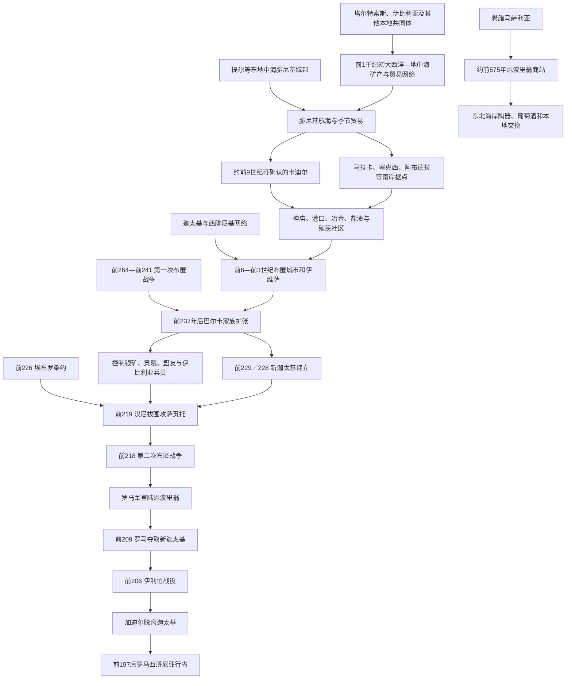

# 腓尼基、希腊与迦太基殖民

## 时间

约前9世纪可确认的腓尼基定居至前206年迦太基丧失半岛主要据点。希腊殖民主要始于前6世纪；迦太基巴尔卡家族的领土扩张集中在前237—前206年。

## 概括

地中海殖民没有把整个伊比利亚半岛变成腓尼基、希腊或迦太基领土。腓尼基商人首先在南岸河口、岛屿和港湾建立卡迪尔、马拉卡、塞克西、阿布德拉等据点，交换银、铜、锡、农产品、奴隶和工艺品，并经营捕鱼、盐渍、陶器、葡萄酒与橄榄油。希腊人主要从马萨利亚沿东北海岸建立恩波里翁等商贸城，影响范围远小于后世“希腊遍布西班牙”的地图印象。

迦太基继承西腓尼基网络，却不是从一开始就直接统治所有腓尼基城市。第一次布匿战争后，哈米尔卡、哈斯德鲁巴和汉尼拔把南部、东南部的贸易关系改造为征税、采矿、征兵和驻军的巴尔卡政权，以新迦太基为中心筹集对罗马战争资源。前218年第二次布匿战争爆发后，罗马军以切断汉尼拔补给为目标进入半岛；到前206年，迦太基主力和加迪尔均退出。殖民网络的长期意义在于本地城市、文字、货币、宗教、农业和海上贸易被重组，而不是原住社会被单向“文明化”。

## 殖民与争霸图

## 建立背景

### 矿产与海上通道

伊比利亚西南拥有银、铜和通往大西洋锡源的通道，东南矿区和农业平原也有吸引力。晚期青铜时代本地商人与撒丁、意大利、北非和大西洋沿岸已有交换，腓尼基人并非发现一个与世隔绝的半岛。他们带来更稳定的远洋船队、称量体系、字母、轮制陶器和东地中海商品，本地首领则提供矿石、食物、土地、劳动力和政治保护。

腓尼基据点常选在河口岛屿或靠近本地中心的港湾，便于防御与转运。早期“商站”会发展成常住社区、墓地、神庙和作坊；殖民者同本地人通婚、共居与冲突，不存在清晰不变的族群隔墙。

### 年代问题

古代传统把加迪尔建立追溯到前12世纪、接近特洛伊战争后，但目前可确认的聚落和器物主要从前9世纪起。传统日期可能保存早期航海记忆，也可能是城市为提高古老声望而构造。书写时应区分古典文献传说与考古年代。

“希腊殖民”同样常被夸大。恩波里翁的建立和希腊物品传播有坚实证据，罗德岛人建立罗得的传统和南岸“迈纳刻”位置则有争议；发现希腊陶器不等于当地由希腊人统治。

## 腓尼基殖民网络

### 主要据点

| 名称 | 约略建立 / 活跃期 | 位置 | 功能与特点 | 后续 |
|---|---|---|---|---|
| **卡迪尔（今加的斯）** | 考古可确认约前9世纪起 | 大西洋岸岛屿与河口 | 梅尔卡特神庙、海运、银与大西洋贸易、盐渍鱼 | 后成为重要布匿盟城，前206年转向罗马。 |
| 奥努巴 | 前9—前8世纪起交流增强 | 今韦尔瓦一带 | 接近塔尔特索斯矿产与河口 | 本地与腓尼基社区交织。 |
| 卡斯蒂略—德多尼亚布兰卡 | 前8世纪起 | 加的斯湾内陆岸 | 港口、城墙、葡萄酒与陶器生产 | 展示殖民聚落与本地腹地联系。 |
| 马拉卡 | 前8—前7世纪起 | 今马拉加 | 港口、鱼酱、贸易和手工业 | 延续为布匿、罗马城市。 |
| 托斯卡诺斯 | 前8—前6世纪 | 贝莱斯河口 | 仓储、商贸与河谷通道 | 后衰退，功能被周边中心吸收。 |
| 塞克西 | 前8—前7世纪起 | 今阿尔穆涅卡尔 | 港口、墓地、盐渍与区域贸易 | 延续至布匿和罗马时期。 |
| 阿布德拉 | 前8—前7世纪起 | 今阿德拉 | 东南海岸航线与农业腹地 | 后成为罗马城市。 |
| 伊博西姆（伊维萨） | 前7世纪中后期起 | 巴利阿里群岛 | 航线中继、盐、农业与布匿墓地 | 成为迦太基西地中海重要基地。 |

这些据点彼此并非一个由“腓尼基皇帝”统治的殖民省。它们同提尔等母城保持宗教、亲属和贸易联系，通常由本城精英、商人和神庙组织治理。提尔受亚述、巴比伦和波斯压力后，西方城市仍能延续自身生活，并逐渐同迦太基建立更紧密的布匿共同体。

### 经济与技术

腓尼基商人用银矿、铜、锡、铅和黄金换取陶器、珠宝、织物、酒、油及奢侈品。殖民作坊引入或扩大双耳罐、陶轮、铁器、象牙雕刻和精细金属加工。葡萄与橄榄并非半岛此前绝对不存在，但种植、压榨和商品化显著加强。加的斯湾与南岸盐场、渔业和鱼酱生产后来成为地中海著名产业。

字母书写通过腓尼基模型影响西南、南部与东部本地文字。不同伊比利亚文字不是简单复制，部分采用半音节体系，显示本地创造。称量、契约、神庙祭祀和精英礼物共同支持贸易，暴力、债役与奴隶交易也属于网络。

### 塔尔特索斯与“东方化”

西南塔尔特索斯并非腓尼基殖民地的别名。当地晚期青铜社会、矿工、农民和首领主动参与贸易，建筑、宴饮、宗教和金饰吸收东地中海元素，形成混合的“东方化”文化。腓尼基商人依赖本地政治保护，本地精英又用进口物资强化权威。前6世纪后塔尔特索斯中心转型，与矿业收益、航线、迦太基发展和内部社会变化相关，不能只归因“迦太基摧毁”。

## 希腊殖民与贸易

### 恩波里翁

福西亚希腊人在高卢南岸建立马萨利亚后，约前575年在今加泰罗尼亚海岸建立恩波里翁，名字本义即“商场”。最早聚落位于近岸小岛或旧城，后来扩展到大陆新城。它同附近因迪盖特等伊比利亚共同体交易谷物、金属、盐、织物和奴隶，并输入葡萄酒、陶器和工艺品。

恩波里翁有希腊宗教、钱币和城市机构，但始终依赖本地腹地。第二次布匿战争中，罗马军选择此地登陆，表明它既是航海基地，也是反迦太基外交节点。罗马时期，希腊城、本地聚落和罗马军营逐步组成新的城市。

### 罗得与迈纳刻问题

今罗萨斯常与古代罗得相联系，可能由希腊人建立或受其影响，具体建城者与日期仍有争议。古代作者所称南岸希腊城迈纳刻长期被寻找，有观点把它同马拉加附近遗址联系，但考古多为腓尼基性质。不能依据古名或希腊器物绘制大片希腊领地。

### 文化影响的边界

希腊陶器、雕塑风格、钱币和神话图像通过贸易深入东部伊比利亚城镇。本地艺术家将其改造为自己的墓葬和圣所语言。希腊作者提供“伊比利亚”“塔尔特索斯”等名称，却依据商人和航海者信息，地理、族群分类常不准确。

## 迦太基与布匿网络

### 从城市联系到区域霸权

迦太基本是北非腓尼基城市，前6世纪后在撒丁、西西里、西北非和伊维萨的影响上升。伊比利亚南岸旧腓尼基城市分享布匿语言、宗教和物质文化，有时与迦太基结盟，但并非都由迦太基官员直接管理。对当地“迦太基时代”的判断应区分文化布匿化、外交领导与领土统治。

第一次布匿战争以前，迦太基利用伊比利亚雇佣兵、矿产和港口；其对内陆征税和驻军范围不清。真正大规模领土扩张发生在前237年后。

### 巴尔卡家族扩张

第一次布匿战争败于罗马、又经历雇佣兵战争后，迦太基失去西西里和撒丁并负担赔款。哈米尔卡·巴尔卡率军赴伊比利亚，通过战争、结盟、婚姻和矿业建立新资源基地。前229／228年哈米尔卡战死，其女婿哈斯德鲁巴继承，建立新迦太基（今卡塔赫纳），以优良港口和附近银矿为军政中心。

前226年，哈斯德鲁巴同罗马约定不武装越过埃布罗河。条约内容、适用对象及罗马同萨贡托关系后来成为争议。前221年哈斯德鲁巴遇刺，军队拥立汉尼拔。汉尼拔巩固内陆盟友，前219年围攻萨贡托；该城位于埃布罗河以南，却同罗马有友好关系。罗马以此要求交出汉尼拔，迦太基拒绝，第二次布匿战争爆发。

## 巴尔卡统治结构

| 层级 | 运作 | 作用与限制 |
|---|---|---|
| 迦太基元老与公民机构 | 名义上授权将领、决定大战与外交 | 巴尔卡家族在远方拥有较大自主性，国内派系并不始终支持。 |
| 巴尔卡统帅 | 哈米尔卡、哈斯德鲁巴、汉尼拔及兄弟统领军队 | 以个人忠诚、家族婚姻和战利品维持联盟。 |
| 新迦太基 | 港口、银矿、兵工、财政与人质中心 | 是伊比利亚领土帝国的实际首府。 |
| 布匿沿海城市 | 保有本地市政、神庙和商业精英 | 对迦太基忠诚程度不同，加迪尔前206年选择议和。 |
| 本地盟王与城邦 | 以条约、婚姻、贡赋和人质加入 | 可在罗马来临后倒戈，忠诚取决于利益和强制。 |
| 矿区与贡赋地 | 提供银、粮食、军费和劳动力 | 高强度汲取支持对罗马战争，也引发抵抗。 |
| 多族军队 | 利比亚、努米底亚、伊比利亚、凯尔特伊比利亚、巴利阿里投石兵等 | 战斗力强，需薪饷、战利品与统帅关系维系。 |

巴尔卡政权有“家族领地”特征，却仍代表迦太基国家作战；称其完全独立于迦太基同样过度。当地政治依赖人质、盟约和军队，继承主要由军队拥立与迦太基认可结合，而非正式世袭王朝。

## 第二次布匿战争中的半岛

### 罗马登陆与长期拉锯

前218年，汉尼拔从新迦太基出发，越过比利牛斯和阿尔卑斯进入意大利。罗马的格奈乌斯·科尔内利乌斯·西庇阿在恩波里翁登陆，目标是切断兵员、金银和补给。罗马同北部和东部本地共同体结盟，在埃布罗河以北建立基地；迦太基由汉尼拔的兄弟哈斯德鲁巴等维持。

前211年，两位西庇阿统帅在南部战败身亡，说明罗马胜利并非线性。前210年小西庇阿接任，前209年突袭新迦太基，夺取港口、武器、银库和各部族人质，并释放部分人质以重建盟友关系。前208年贝库拉战役后，哈斯德鲁巴仍率军赴意大利，但其半岛控制减弱。

### 伊利帕与迦太基退出

前206年伊利帕战役中，小西庇阿调整阵列击败迦太基主力。加迪尔的统治精英见迦太基无力援助，逮捕或排斥其官员并同罗马议和。马戈撤离后，迦太基在伊比利亚的领土统治结束。罗马随后面对本地盟友对贡赋和驻军的不满，立即爆发伊勒尔盖特等反抗；这证明地方人并非把罗马普遍视为“解放者”。

## 重要事件

| 时间 | 事件 | 直接结果 | 长期意义 |
|---|---|---|---|
| 约前9世纪 | 卡迪尔等腓尼基据点有可靠考古证据 | 南岸常住殖民与港口网络形成 | 半岛矿业和农业接入更稳定地中海贸易。 |
| 前8—前7世纪 | 南岸殖民点、伊维萨和本地东方化中心扩大 | 混合社区、神庙与作坊发展 | 文字、陶轮、铁器和商品农业传播。 |
| 约前575年 | 恩波里翁建立 | 希腊商站连接马萨利亚与伊比利亚东北 | 后成为罗马登陆与贸易基地。 |
| 前6世纪 | 塔尔特索斯中心转型、迦太基西方影响上升 | 旧贸易体系重组 | 西腓尼基城市逐渐进入布匿共同体。 |
| 前264—前241年 | 第一次布匿战争 | 迦太基失西西里、负赔款 | 推动巴尔卡家族转向伊比利亚资源。 |
| 前237年 | 哈米尔卡开始半岛扩张 | 南部和东南部领土、盟友扩大 | 贸易网络转为更强军政汲取体系。 |
| 前229／228年 | 新迦太基建立 | 形成巴尔卡财政军事中心 | 银矿、港口和人质支持对罗马战争。 |
| 前226年 | 埃布罗条约 | 双方约定迦太基扩张北界 | 萨贡托争端时条约解释成为战争借口。 |
| 前219年 | 汉尼拔攻陷萨贡托 | 罗马要求交人遭拒 | 第二次布匿战争直接导火索。 |
| 前218年 | 罗马军登陆恩波里翁 | 半岛成为独立战场 | 罗马由盟军转为长期征服者。 |
| 前211年 | 两位西庇阿战败身亡 | 罗马南进一度崩溃 | 显示本地盟友和军队忠诚的重要性。 |
| 前209年 | 罗马夺取新迦太基 | 失去军港、银库、武器和人质 | 迦太基战略体系遭决定性打击。 |
| 前206年 | 伊利帕战役、加迪尔转向罗马 | 迦太基主力撤出伊比利亚 | 罗马西班尼亚征服阶段开始。 |

## 影响与代价

### 城市和经济

殖民港口促进城市密度、标准化仓储、钱币与商品生产，鱼酱、葡萄酒、橄榄油、矿石和金属工艺成为长期产业。贸易也包含强迫劳动、奴隶和贡赋，矿区财富并未平均改善本地生活。外来商人与本地精英都可能从不平等交换获利。

### 文字与文化

腓尼基字母影响西南和伊比利亚文字，希腊字母也被部分本地语言采用。梅尔卡特、阿斯塔特、塔尼特等神祇同本地圣所和仪式互动；艺术图像、宴饮器物和墓葬发生混合。文化融合不是和平程度的指标：同一城市可同时存在通婚、贸易、身份区隔和战争。

### 政治军事

迦太基和罗马都依赖本地盟王、雇佣兵、投石兵和骑兵。半岛共同体通过选边、倒戈和谈判追求自身利益，却也遭人质、贡赋和屠城强制。巴尔卡家族建立的道路、矿业和联盟网络后来被罗马接管，使第二次布匿战争成为殖民网络转为行省帝国的桥梁。

## 殖民势力兴衰机制

### 腓尼基网络的形成

航海技术、银锡需求、港湾和本地首领合作是主要条件。提尔等母城提供宗教与商贸联系，但西方城市能独立适应。前6世纪以后并非腓尼基人消失，而是语言文化逐渐称为“布匿”，政治联系更多转向迦太基。

### 希腊据点的有限扩展

马萨利亚航线、葡萄酒与陶器贸易支撑恩波里翁；腓尼基—布匿在南岸的先发优势、本地政治和迦太基海权限制希腊领土扩张。希腊文化影响远超过希腊人口和直接统治范围。

### 迦太基扩张与灭亡

第一次布匿战争后的财政与战略压力、巴尔卡统帅能力、新迦太基银矿和本地兵员促成快速崛起。结构弱点是统治依赖将领、强制贡赋和可变盟友；外部压力来自罗马海运和持续增援。萨贡托危机触发全面战争，新迦太基失守破坏财政与人质体系，伊利帕战败和加迪尔倒戈直接结束统治。

## 长期影响

1. 腓尼基与布匿港口奠定加的斯、马拉加、伊维萨等城市的长期海洋功能。
2. 本地文字、钱币、城市和商品农业在外来接触中加速发展，但并非全由殖民者从零创造。
3. 塔尔特索斯、伊比利亚人与殖民社区的互动说明“本地—外来”边界会跨代变化。
4. 迦太基利用伊比利亚银、士兵和港口挑战罗马，使半岛成为西地中海霸权核心。
5. 罗马征服继承并扩大布匿矿业和交通网络，也带来更长期的赋税和战争。
6. 古代殖民留下语言和宗教痕迹，却没有让现代西班牙或葡萄牙成为腓尼基、希腊或迦太基国家的直系延续。

## 关键辨析

- 加迪尔“前1104年建城”来自古代传统；可确认考古证据主要晚得多，应明确区分。
- 腓尼基殖民城没有组成一个由提尔直接管理的伊比利亚行省。
- 塔尔特索斯不是腓尼基人的另一名称，也未必是统一王国。
- 发现希腊陶器不等于希腊殖民；恩波里翁以外的据点和传统需逐案判断。
- 迦太基文化影响、外交领导和直接领土统治是三个不同层次。
- 巴尔卡家族有高度自主，但仍以迦太基国家名义扩张和作战。
- 埃布罗条约没有自动明确萨贡托地位，战争责任在古今叙事中均有争议。
- 本地伊比利亚人既非迦太基天然盟友，也非罗马天然盟友，立场随城市和阶段变化。
- “殖民带来文明”掩盖本地晚期青铜社会、主动选择、奴役和军事强制。
- 前206年结束迦太基领土统治，不等于半岛立即安定；罗马征服又持续近两个世纪。

## 演变关系

- 本地背景：[史前与古代伊比利亚](/%E4%BA%BA%E6%96%87%E7%A7%91%E5%AD%A6/%E5%8E%86%E5%8F%B2/%E6%AC%A7%E6%B4%B2/%E4%BC%8A%E6%AF%94%E5%88%A9%E4%BA%9A%E5%8D%8A%E5%B2%9B/%E5%8F%B2%E5%89%8D%E4%B8%8E%E5%8F%A4%E4%BB%A3%E4%BC%8A%E6%AF%94%E5%88%A9%E4%BA%9A.md)。
- 迦太基本体：[迦太基](/%E4%BA%BA%E6%96%87%E7%A7%91%E5%AD%A6/%E5%8E%86%E5%8F%B2/%E5%8C%97%E9%9D%9E/_%E9%80%9A%E5%8F%B2/%E8%BF%A6%E5%A4%AA%E5%9F%BA/README.md)。
- 希腊殖民背景：[古希腊](/%E4%BA%BA%E6%96%87%E7%A7%91%E5%AD%A6/%E5%8E%86%E5%8F%B2/%E6%AC%A7%E6%B4%B2/_%E9%80%9A%E5%8F%B2/%E5%8F%A4%E5%B8%8C%E8%85%8A/README.md)。
- 后继：[罗马时期的伊比利亚](/%E4%BA%BA%E6%96%87%E7%A7%91%E5%AD%A6/%E5%8E%86%E5%8F%B2/%E6%AC%A7%E6%B4%B2/%E4%BC%8A%E6%AF%94%E5%88%A9%E4%BA%9A%E5%8D%8A%E5%B2%9B/%E7%BD%97%E9%A9%AC%E6%97%B6%E6%9C%9F%E7%9A%84%E4%BC%8A%E6%AF%94%E5%88%A9%E4%BA%9A.md)。
- 所属总览：[伊比利亚半岛](/%E4%BA%BA%E6%96%87%E7%A7%91%E5%AD%A6/%E5%8E%86%E5%8F%B2/%E6%AC%A7%E6%B4%B2/%E4%BC%8A%E6%AF%94%E5%88%A9%E4%BA%9A%E5%8D%8A%E5%B2%9B/README.md)。
