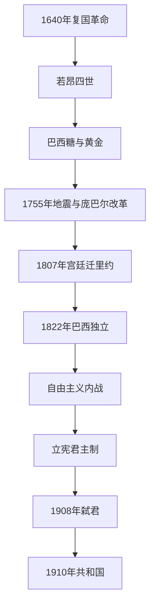

# 布拉干萨王朝

## 时间

1640年—1910年

## 演进图

## 概括

布拉干萨王朝由1640年复国革命建立，先通过长期战争恢复葡萄牙独立，再依靠巴西糖、黄金和奴隶贸易维持大西洋帝国。1755年里斯本地震后出现庞巴尔改革；拿破仑入侵迫使宫廷迁往巴西，王朝此后经历巴西独立、自由主义战争和立宪君主制，最终在1910年共和革命中终结葡萄牙本土统治。

## 完整君主世系

| 顺序 | 君主 | 在位时间 | 与前任关系 / 关键事项 |
|---:|---|---|---|
| 1 | **若昂四世** | 1640—1656 | 布拉干萨公爵；复国革命拥立。 |
| 2 | 阿方索六世 | 1656—1683 | 若昂四世之子；1668年后被剥夺实权。 |
| 3 | 佩德罗二世 | 1683—1706 | 阿方索之弟；1668年起摄政，后正式即位。 |
| 4 | 若昂五世 | 1706—1750 | 佩德罗之子；依靠巴西黄金强化王权。 |
| 5 | 若泽一世 | 1750—1777 | 若昂五世之子；庞巴尔侯爵主持改革。 |
| 6 | 玛丽亚一世与佩德罗三世 | 1777—1786 | 玛丽亚为若泽之女，佩德罗为叔父兼王夫、共治国王。 |
| 7 | 玛丽亚一世 | 1786—1816 | 佩德罗去世后单独统治；晚年由王储若昂摄政。 |
| 8 | 若昂六世 | 1816—1826 | 玛丽亚之子；宫廷在巴西，后回里斯本。 |
| 9 | 佩德罗四世 | 1826 | 若昂之子、巴西皇帝佩德罗一世；颁宪章后让位。 |
| 10 | 玛丽亚二世 | 1826—1828 | 佩德罗之女；首次在位。 |
| 11 | 米格尔一世 | 1828—1834 | 若昂六世之子；夺取王位，内战败亡。 |
| 12 | 玛丽亚二世 | 1834—1853 | 复位；与费尔南多二世婚后形成布拉干萨—萨克森-科堡支系。 |
| 13 | 佩德罗五世 | 1853—1861 | 玛丽亚之子；早逝。 |
| 14 | 路易斯一世 | 1861—1889 | 佩德罗五世之弟。 |
| 15 | 卡洛斯一世 | 1889—1908 | 路易斯之子；在里斯本弑君事件中遇害。 |
| 16 | 曼努埃尔二世 | 1908—1910 | 卡洛斯次子；末代国王。 |

## 发展阶段与重要事件

- 1640—1668年复国战争依靠贵族、城市与英格兰联盟抵挡西班牙，1668年获正式承认。
- 17世纪后期巴西糖业受加勒比竞争，发现米纳斯吉拉斯黄金后，里斯本获得大量王室税收，但对英国工业品和金融依赖增加。
- 1755年里斯本大地震及海啸造成灾难。庞巴尔侯爵重建首都、改革教育财政、限制贵族与耶稣会，却以高压手段集中权力。
- 1807年法军入侵，王室在英国海军护送下迁里约热内卢；巴西开放港口并于1815年升为联合王国组成部分。
- 1820年波尔图自由革命要求王室回国和制定宪法；若昂六世回里斯本，佩德罗在1822年宣布巴西独立。
- 佩德罗四世与米格尔派围绕宪章、绝对王权和继承权交战，1834年自由派获胜。
- 19世纪后半叶“轮替制”使再生党与进步党相继执政，铁路、教育和殖民行政扩张，但财政债务和选举操控削弱信任。
- 1890年英国最后通牒迫使放弃连接安哥拉—莫桑比克的殖民主张，共和派借民族屈辱扩大影响；1908年弑君使危机恶化。

## 维持与覆亡原因

王朝依靠复国合法性、海外资源、天主教和英国联盟维持。巴西独立后，国内税基薄弱、债务和殖民军费上升；立宪制度受有限选举和宫廷干预制约。弑君、军队不满、城市共和组织和政党失能构成直接危机，1910年10月革命迫使曼努埃尔二世流亡。

## 演变关系

- 前一阶段：[伊比利亚联盟时期的葡萄牙](/%E4%BA%BA%E6%96%87%E7%A7%91%E5%AD%A6/%E5%8E%86%E5%8F%B2/%E6%AC%A7%E6%B4%B2/%E4%BC%8A%E6%AF%94%E5%88%A9%E4%BA%9A%E5%8D%8A%E5%B2%9B/%E8%91%A1%E8%90%84%E7%89%99/%E4%BC%8A%E6%AF%94%E5%88%A9%E4%BA%9A%E8%81%94%E7%9B%9F%E6%97%B6%E6%9C%9F%E7%9A%84%E8%91%A1%E8%90%84%E7%89%99.md)
- 后一阶段：[葡萄牙第一共和国](/%E4%BA%BA%E6%96%87%E7%A7%91%E5%AD%A6/%E5%8E%86%E5%8F%B2/%E6%AC%A7%E6%B4%B2/%E4%BC%8A%E6%AF%94%E5%88%A9%E4%BA%9A%E5%8D%8A%E5%B2%9B/%E8%91%A1%E8%90%84%E7%89%99/%E8%91%A1%E8%90%84%E7%89%99%E7%AC%AC%E4%B8%80%E5%85%B1%E5%92%8C%E5%9B%BD.md)
- 国家主线：[葡萄牙王国](/%E4%BA%BA%E6%96%87%E7%A7%91%E5%AD%A6/%E5%8E%86%E5%8F%B2/%E6%AC%A7%E6%B4%B2/%E4%BC%8A%E6%AF%94%E5%88%A9%E4%BA%9A%E5%8D%8A%E5%B2%9B/%E8%91%A1%E8%90%84%E7%89%99/%E8%91%A1%E8%90%84%E7%89%99%E7%8E%8B%E5%9B%BD.md)
