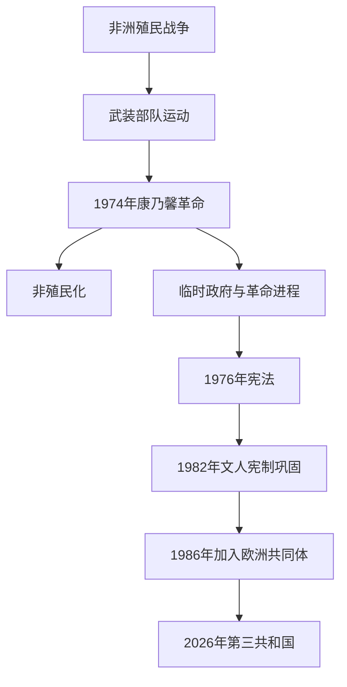

# 康乃馨革命与第三共和国

## 时间

1974年至今

## 演进图

## 概括

1974年4月25日武装部队运动推翻新国家体制，开启非殖民化、社会经济重组与制宪。1976年宪法确立半总统制议会共和国；1982年取消军方革命委员会，文人统治稳定。葡萄牙1986年加入欧洲共同体，民主制度与欧洲一体化成为第三共和国的两条主线。

## 革命与民主化过程

- 中级军官因殖民战争、晋升制度和政治僵局组织武装部队运动，以广播暗号发动政变。里斯本群众给士兵枪管插上康乃馨，成为和平转型象征。
- 1974—1975年革命进程中，临时政府、军方派别、共产党、社会党与保守力量围绕土地、银行、工厂和国家方向竞争。
- 1975年安哥拉、莫桑比克、佛得角、圣多美和几内亚比绍等独立，大量葡裔居民迁回本土；东帝汶随后遭印度尼西亚占领。
- 1975年11月军内温和派获胜，结束革命激进阶段；1976年宪法和选举确立民主体制。
- 1982年修宪废除革命委员会并加强宪法法院；1986年加入欧洲共同体，基础设施、市场与社会政策加速欧洲化。
- 2011年主权债务危机期间接受国际援助和紧缩，政党轮替仍在宪法框架内进行。
- 2026年总统与政府均经正常选举和宪法程序更替，显示制度已完成代际延续。

革命以来的临时元首、代理总理、历届宪法政府及2026年现任核验，另见[葡萄牙共和国国家元首与政府首脑表](/%E4%BA%BA%E6%96%87%E7%A7%91%E5%AD%A6/%E5%8E%86%E5%8F%B2/%E6%AC%A7%E6%B4%B2/%E4%BC%8A%E6%AF%94%E5%88%A9%E4%BA%9A%E5%8D%8A%E5%B2%9B/%E8%91%A1%E8%90%84%E7%89%99/%E8%91%A1%E8%90%84%E7%89%99%E5%85%B1%E5%92%8C%E5%9B%BD%E5%9B%BD%E5%AE%B6%E5%85%83%E9%A6%96%E4%B8%8E%E6%94%BF%E5%BA%9C%E9%A6%96%E8%84%91%E8%A1%A8.md)。

## 国家元首

| 顺序 | 总统 | 任期 |
|---:|---|---|
| 1 | 安东尼奥·德斯皮诺拉 | 1974 |
| 2 | 弗朗西斯科·达科斯塔·戈麦斯 | 1974—1976 |
| 3 | 安东尼奥·拉马略·埃亚内斯 | 1976—1986 |
| 4 | 马里奥·苏亚雷斯 | 1986—1996 |
| 5 | 若热·桑帕约 | 1996—2006 |
| 6 | 阿尼巴尔·卡瓦科·席尔瓦 | 2006—2016 |
| 7 | 马塞洛·雷贝洛·德索萨 | 2016—2026 |
| 8 | **安东尼奥·若泽·塞古罗** | 2026年至今（2026年3月9日就职；截至7月14日在任） |

总统全民直选，可任命总理、否决法律、请求宪法审查并在宪定条件下解散议会；日常行政由总理和内阁承担。

## 政府首脑

| 总理 | 任期 |
|---|---|
| 阿德利诺·达帕尔马·卡洛斯 | 1974 |
| 瓦斯科·贡萨尔维斯 | 1974—1975 |
| 若泽·皮涅罗·德阿泽维多 | 1975—1976 |
| 马里奥·苏亚雷斯 | 1976—1978、1983—1985 |
| 阿尔弗雷多·诺布雷·达科斯塔 | 1978 |
| 卡洛斯·莫塔·平托 | 1978—1979 |
| 玛丽亚·德卢尔德斯·平塔西尔戈 | 1979—1980 |
| 弗朗西斯科·萨·卡内罗 | 1980 |
| 弗朗西斯科·平托·巴尔塞芒 | 1981—1983 |
| 阿尼巴尔·卡瓦科·席尔瓦 | 1985—1995 |
| 安东尼奥·古特雷斯 | 1995—2002 |
| 若泽·曼努埃尔·巴罗佐 | 2002—2004 |
| 佩德罗·桑塔纳·洛佩斯 | 2004—2005 |
| 若泽·苏格拉底 | 2005—2011 |
| 佩德罗·帕索斯·科埃略 | 2011—2015 |
| 安东尼奥·科斯塔 | 2015—2024 |
| **路易斯·蒙特内格罗** | 2024年至今（第二十五届政府自2025年6月5日起；截至2026年7月14日在任） |

## 稳定机制与持续挑战

半总统制在总统仲裁和议会责任政府之间分权，比例代表制使少数政府或联盟常见。欧盟与欧元区提供资金市场和规则，也限制财政政策空间。人口老龄化、住房、低生产率、内陆—沿海差距和殖民记忆是长期议题，但不再通过军事政变解决。

## 演变关系

- 前一阶段：[新国家体制](/%E4%BA%BA%E6%96%87%E7%A7%91%E5%AD%A6/%E5%8E%86%E5%8F%B2/%E6%AC%A7%E6%B4%B2/%E4%BC%8A%E6%AF%94%E5%88%A9%E4%BA%9A%E5%8D%8A%E5%B2%9B/%E8%91%A1%E8%90%84%E7%89%99/%E6%96%B0%E5%9B%BD%E5%AE%B6%E4%BD%93%E5%88%B6.md)
- 所属总览：[葡萄牙](/%E4%BA%BA%E6%96%87%E7%A7%91%E5%AD%A6/%E5%8E%86%E5%8F%B2/%E6%AC%A7%E6%B4%B2/%E4%BC%8A%E6%AF%94%E5%88%A9%E4%BA%9A%E5%8D%8A%E5%B2%9B/%E8%91%A1%E8%90%84%E7%89%99/README.md)
- 半岛总览：[伊比利亚半岛](/%E4%BA%BA%E6%96%87%E7%A7%91%E5%AD%A6/%E5%8E%86%E5%8F%B2/%E6%AC%A7%E6%B4%B2/%E4%BC%8A%E6%AF%94%E5%88%A9%E4%BA%9A%E5%8D%8A%E5%B2%9B/README.md)
