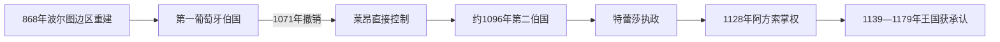

# 葡萄牙伯国

## 时间

868年—1139年

## 演进图

## 概括

葡萄牙伯国先后有两个性质不同的阶段。第一伯国是阿斯图里亚斯—莱昂王权在杜罗河以北复土后设置的边境辖区，1071年因伯爵努诺·门德斯反叛而被撤销；第二伯国由莱昂国王阿方索六世约1096年授予勃艮第的亨利，逐步形成独立王权。1139年阿方索·恩里克斯称王，伯国转为葡萄牙王国。

## 第一伯国：边境重建

868年维马拉·佩雷斯夺取波尔图一带，在旧地名 Portucale 基础上组织伯国。伯爵负责堡垒、移民、司法和向南战争，但仍是阿斯图里亚斯、后来的莱昂国王臣属。10—11世纪本地贵族通过修道院赞助、婚姻和世袭土地形成区域网络。

早期资料残缺，部分任期只能约定。常见伯爵次序如下：

| 顺序 | 伯爵 / 摄政 | 任期 | 备注 |
|---:|---|---|---|
| 1 | **维马拉·佩雷斯** | 868—873 | 攻取波尔图，第一伯国建立者。 |
| 2 | 卢西迪奥·维马拉内斯 | 873年后 | 维马拉之子，任期不详。 |
| 3 | 迪奥戈·费尔南德斯 | 10世纪初 | 与前一王族通婚，年代存在不确定。 |
| 4 | 穆马多娜·迪亚斯 | 约924—950 | 重要女领主，创立吉马良斯修道院与城堡。 |
| 5 | 贡萨洛·门德斯 | 约950—997 | 穆马多娜之子。 |
| 6 | 门多·贡萨尔维斯 | 997—1008 | 贡萨洛之子。 |
| 7 | 阿尔维托·努内斯 | 1008—1015 | 通过婚姻继承。 |
| 8 | 努诺·阿尔维特斯 | 1017—1028 | 阿尔维托之子；早年由母亲伊尔杜阿拉摄政。 |
| 9 | 门多·努内斯 | 1028—1050 | 努诺之子。 |
| 10 | 努诺·门德斯 | 1050—1071 | 反抗加西亚二世，在佩德罗苏战败身亡，伯国撤销。 |

## 第二伯国：走向独立

| 统治者 | 任期 | 地位与行动 |
|---|---|---|
| **勃艮第的亨利** | 约1096—1112 | 阿方索六世女婿，获葡萄牙伯国，扩大地方贵族和教会支持。 |
| 特蕾莎 | 1112—1128 | 亨利遗孀，以女王式称号执政；与加利西亚特拉瓦家族结盟，引发本地贵族反对。 |
| **阿方索·恩里克斯** | 1128—1139 | 亨利与特蕾莎之子；圣马梅德战役击败母方集团，取得统治，后称葡萄牙国王。 |

## 崛起机制与关键事件

- 大规模边境移民、修道院垦殖和城堡网络使米尼奥—杜罗地区形成较稳定的经济与军事基础。
- 本地贵族与布拉加总主教希望摆脱加利西亚政治控制，成为阿方索·恩里克斯的重要支持者。
- 1128年圣马梅德战役是实际权力转折；阿方索随后向南进攻穆斯林政权，也与莱昂争取平等地位。
- 1139年奥里基战役后称王的传统日期具有象征性；1143年《萨莫拉条约》和1179年教宗诏书才逐步完成外部承认。

## 从伯国到王国的原因

区域贵族网络、独立教会中心、向南扩张机会和莱昂王室内部竞争共同创造分离条件。直接触发点是特蕾莎亲加利西亚联盟引发的贵族反弹及阿方索的军事胜利。国家形成因此是长期自治与外交承认过程，而非1139年一次事件。

## 演变关系

- 半岛共同背景：[基督教诸国与收复失地运动](/%E4%BA%BA%E6%96%87%E7%A7%91%E5%AD%A6/%E5%8E%86%E5%8F%B2/%E6%AC%A7%E6%B4%B2/%E4%BC%8A%E6%AF%94%E5%88%A9%E4%BA%9A%E5%8D%8A%E5%B2%9B/%E5%9F%BA%E7%9D%A3%E6%95%99%E8%AF%B8%E5%9B%BD%E4%B8%8E%E6%94%B6%E5%A4%8D%E5%A4%B1%E5%9C%B0%E8%BF%90%E5%8A%A8.md)
- 后一阶段：[葡萄牙王国](/%E4%BA%BA%E6%96%87%E7%A7%91%E5%AD%A6/%E5%8E%86%E5%8F%B2/%E6%AC%A7%E6%B4%B2/%E4%BC%8A%E6%AF%94%E5%88%A9%E4%BA%9A%E5%8D%8A%E5%B2%9B/%E8%91%A1%E8%90%84%E7%89%99/%E8%91%A1%E8%90%84%E7%89%99%E7%8E%8B%E5%9B%BD.md)
- 所属总览：[葡萄牙](/%E4%BA%BA%E6%96%87%E7%A7%91%E5%AD%A6/%E5%8E%86%E5%8F%B2/%E6%AC%A7%E6%B4%B2/%E4%BC%8A%E6%AF%94%E5%88%A9%E4%BA%9A%E5%8D%8A%E5%B2%9B/%E8%91%A1%E8%90%84%E7%89%99/README.md)
