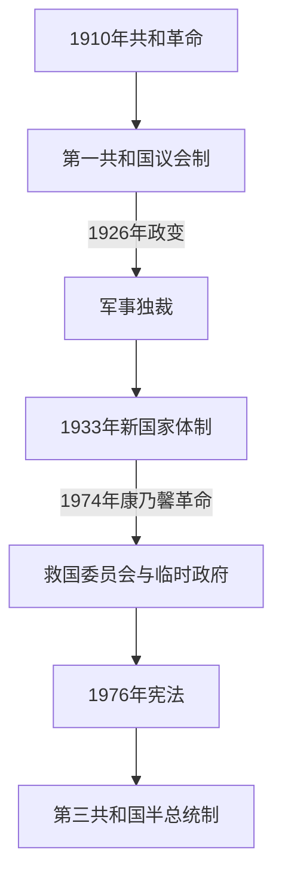

# 葡萄牙共和国国家元首与政府首脑表

## 时间

1910年至今；核验截止2026年7月14日

## 读表说明

本表把共和国国家元首与政府首脑分列。1910—1926年议会共和国的总统通常不是日常行政首脑；1926—1933年军事独裁中，军人总统和部长会议主席的权力边界反复变化；新国家体制名义上仍有总统，实际长期由政府首脑萨拉查控制。1976年宪法下，总统由全民直选并有任命总理、否决和解散议会等权力，日常行政由对议会负责的总理主持。

## 权力结构演进图

## 国家元首完整表

| 顺序 | 国家元首 / 集体机关 | 任期 | 产生方式与实际地位 |
|---:|---|---|---|
| 1 | 特奥菲洛·布拉加 | 1910年10月5日—1911年8月24日 | 临时政府主席，革命后的集体政府首脑兼国家代表。 |
| 2 | 曼努埃尔·德阿里亚加 | 1911年8月24日—1915年5月29日 | 国会选出的首位宪法总统；军事政治危机中辞职。 |
| 3 | 特奥菲洛·布拉加 | 1915年5月29日—10月5日 | 国会选出的过渡总统。 |
| 4 | 贝尔纳迪诺·马沙多 | 1915年10月5日—1917年12月12日 | 首次任期；被西多尼奥·派斯政变推翻。 |
| 5 | 西多尼奥·派斯 | 1917年12月12日—1918年12月14日 | 政变后先任军政府首脑，1918年经直接选举任总统并兼具强势行政权；遇刺。 |
| 6 | 若昂·多坎托·伊·卡斯特罗 | 1918年12月16日—1919年10月5日 | 议会选举的过渡总统；应对北方君主复辟。 |
| 7 | 安东尼奥·若泽·德阿尔梅达 | 1919年10月5日—1923年10月5日 | 第一共和国唯一完成完整总统任期者。 |
| 8 | 曼努埃尔·特谢拉·戈梅斯 | 1923年10月5日—1925年12月11日 | 在政治与军方压力下辞职。 |
| 9 | 贝尔纳迪诺·马沙多 | 1925年12月11日—1926年5月31日 | 第二任期；被军事政变推翻。 |
| 10 | 若泽·门德斯·卡贝萨达斯 | 1926年5月31日—6月19日 | 政变后临时总统兼政府首脑，被军内对手逼退。 |
| 11 | 曼努埃尔·戈梅斯·达科斯塔 | 1926年6月29日—7月9日 | 军政府强人；6月17日起已主持政府，6月29日才正式兼任国家元首，旋被另一场军内政变推翻。 |
| 12 | **奥斯卡·卡尔莫纳** | 1926年7月9日—1951年4月18日 | 先为临时军人总统，1928年起经受控制选举任职；为萨拉查体制提供元首合法性。 |
| 13 | 国家元首职位空缺；部长会议维持过渡 | 1951年4月18日—8月9日 | 卡尔莫纳去世至克拉韦罗·洛佩斯就职之间没有正式共和国总统；萨拉查仍是政府首脑和实际最高决策者，但不列入总统世系。 |
| 14 | 弗朗西斯科·克拉韦罗·洛佩斯 | 1951年8月9日—1958年8月9日 | 军人总统；与萨拉查分歧后未获再次提名。 |
| 15 | 阿梅里科·托马斯 | 1958年8月9日—1974年4月25日 | 新国家末期总统，实际服从萨拉查，卡埃塔诺时期拥有一定仲裁空间；革命中被推翻。 |
| 16 | 救国委员会 | 1974年4月25日—5月15日 | 武装部队运动政变后的集体国家元首机关，由斯皮诺拉主持。 |
| 17 | 安东尼奥·德斯皮诺拉 | 1974年5月15日—9月30日 | 临时总统；在非殖民化和政治方向争议中辞职。 |
| 18 | 弗朗西斯科·达科斯塔·戈麦斯 | 1974年9月30日—1976年7月14日 | 革命过渡期总统，协调军方派系和制宪。 |
| 19 | 安东尼奥·拉马略·埃亚内斯 | 1976年7月14日—1986年3月9日 | 首位1976年宪法下民选总统；军方退出政治的关键过渡者。 |
| 20 | 马里奥·苏亚雷斯 | 1986年3月9日—1996年3月9日 | 首位民主时期文职总统。 |
| 21 | 若热·桑帕约 | 1996年3月9日—2006年3月9日 | 两任。 |
| 22 | 阿尼巴尔·卡瓦科·席尔瓦 | 2006年3月9日—2016年3月9日 | 两任。 |
| 23 | 马塞洛·雷贝洛·德索萨 | 2016年3月9日—2026年3月9日 | 两任，任满离职。 |
| 24 | **安东尼奥·若泽·塞古罗** | 2026年3月9日至今 | 2026年2月8日当选，第21任共和国总统；截至2026年7月14日在任。 |

## 政府首脑：第一共和国

1911年宪法下通常称“部长会议主席”；短命内阁很多，同一人多次组阁分别列行。1915年和1917年政变过渡中，法定任命、实际掌权与就职时间偶有一两日差异。

| 顺序 | 政府首脑 | 任期 | 政治阶段 / 备注 |
|---:|---|---|---|
| 1 | 特奥菲洛·布拉加 | 1910年10月5日—1911年9月3日 | 临时政府主席。 |
| 2 | 若昂·沙加斯 | 1911年9月4日—11月12日 | 首届宪法政府。 |
| 3 | 奥古斯托·德瓦斯孔塞洛斯 | 1911年11月12日—1912年6月16日 | 共和派联合内阁。 |
| 4 | 杜阿尔特·莱特 | 1912年6月16日—1913年1月9日 | 温和共和派政府。 |
| 5 | **阿方索·科斯塔** | 1913年1月9日—1914年2月9日 | 第一次组阁，民主党政府。 |
| 6 | 贝尔纳迪诺·马沙多 | 1914年2月9日—12月12日 | 第一次世界大战初期。 |
| 7 | 维托尔·乌戈·德阿泽维多·科蒂尼奥 | 1914年12月12日—1915年1月25日 | 被批评为民主党控制的短命内阁。 |
| 8 | 若阿金·皮门塔·德卡斯特罗 | 1915年1月25日—5月14日 | 军人威权政府，被“5月14日革命”推翻。 |
| 9 | 若泽·德卡斯特罗 | 1915年5月17日—11月29日 | 政变后恢复宪政；原拟由若昂·沙加斯组阁，但其遇袭无法就任。 |
| 10 | 阿方索·科斯塔 | 1915年11月29日—1916年3月15日 | 第二次组阁。 |
| 11 | 安东尼奥·若泽·德阿尔梅达 | 1916年3月15日—1917年4月25日 | “神圣联合”政府，主持参战。 |
| 12 | 阿方索·科斯塔 | 1917年4月25日—12月10日 | 第三次组阁，被西多尼奥政变推翻。 |
| 13 | **西多尼奥·派斯** | 1917年12月11日—1918年12月14日 | 先任革命委员会首脑，后兼总统；“新共和国”实际最高权力。 |
| 14 | 若昂·多坎托·伊·卡斯特罗 | 1918年12月14日—23日 | 派斯遇刺后的短期过渡。 |
| 15 | 若昂·塔马尼尼·巴尔博萨 | 1918年12月23日—1919年1月27日 | 西多尼奥派过渡政府。 |
| 16 | 若泽·雷尔瓦斯 | 1919年1月27日—3月30日 | 恢复共和议会框架，平定君主派。 |
| 17 | 多明戈斯·佩雷拉 | 1919年3月30日—6月29日 | 第一次组阁。 |
| 18 | 阿尔弗雷多·德萨·卡多佐 | 1919年6月29日—1920年1月15日 | 民主党政府。 |
| 19 | 弗朗西斯科·费尔南德斯·科斯塔 | 1920年1月15日 | “五分钟政府”，获任命但未能正常宣誓执政；列为争议短任。 |
| 20 | 阿尔弗雷多·德萨·卡多佐 | 1920年1月15日—21日 | 继续代理至新政府组成。 |
| 21 | 多明戈斯·佩雷拉 | 1920年1月21日—3月8日 | 第二次组阁。 |
| 22 | 安东尼奥·马里亚·巴普蒂斯塔 | 1920年3月8日—6月6日 | 任内突发死亡。 |
| 23 | 若泽·拉莫斯·普雷托 | 1920年6月6日—26日 | 过渡内阁。 |
| 24 | 安东尼奥·马里亚·达席尔瓦 | 1920年6月26日—7月19日 | 第一次组阁。 |
| 25 | 安东尼奥·格兰若 | 1920年7月19日—11月20日 | 第一次组阁。 |
| 26 | 阿尔瓦罗·德卡斯特罗 | 1920年11月20日—30日 | 第一次组阁。 |
| 27 | 利贝拉托·达米昂·里贝罗·平托 | 1920年11月30日—1921年3月2日 | 军人与宪政矛盾加深。 |
| 28 | 贝尔纳迪诺·马沙多 | 1921年3月2日—5月23日 | 短期政府。 |
| 29 | 托梅·德巴罗斯·凯罗斯 | 1921年5月23日—8月30日 | 自由派政府。 |
| 30 | 安东尼奥·格兰若 | 1921年8月30日—10月19日 | 第二次组阁，在“血腥之夜”遇害。 |
| 31 | 曼努埃尔·马里亚·科埃略 | 1921年10月19日—11月5日 | 军人政变后的短期政府。 |
| 32 | 卡洛斯·马亚·平托 | 1921年11月5日—12月16日 | 过渡政府。 |
| 33 | 弗朗西斯科·达库尼亚·莱亚尔 | 1921年12月16日—1922年2月6日 | 自由共和派。 |
| 34 | 安东尼奥·马里亚·达席尔瓦 | 1922年2月6日—1923年11月15日 | 第二次组阁，第一共和国较长内阁之一。 |
| 35 | 安东尼奥·吉内斯塔尔·马沙多 | 1923年11月15日—12月18日 | 国民共和派短任。 |
| 36 | 阿尔瓦罗·德卡斯特罗 | 1923年12月18日—1924年7月6日 | 第二次组阁。 |
| 37 | 阿尔弗雷多·罗德里格斯·加斯帕尔 | 1924年7月6日—11月22日 | 民主党政府。 |
| 38 | 若泽·多明格斯·多斯桑托斯 | 1924年11月22日—1925年2月16日 | 左翼民主派改革政府。 |
| 39 | 维托里诺·吉马良斯 | 1925年2月16日—7月1日 | 财政与军政危机持续。 |
| 40 | 安东尼奥·马里亚·达席尔瓦 | 1925年7月1日—8月1日 | 第三次组阁。 |
| 41 | 多明戈斯·佩雷拉 | 1925年8月1日—12月17日 | 第三次组阁。 |
| 42 | 安东尼奥·马里亚·达席尔瓦 | 1925年12月17日—1926年5月30日 | 第四次组阁，军事政变中终结。 |

## 政府首脑：军事独裁与新国家体制

| 顺序 | 政府首脑 | 任期 | 法定职位与实际权力 |
|---:|---|---|---|
| 1 | 若泽·门德斯·卡贝萨达斯 | 1926年5月31日—6月17日 | 兼临时总统，军内权力不稳。 |
| 2 | 曼努埃尔·戈梅斯·达科斯塔 | 1926年6月17日—7月9日 | 兼国家元首，旋被卡尔莫纳推翻。 |
| 3 | 奥斯卡·卡尔莫纳 | 1926年7月9日—1928年4月18日 | 兼国家元首与政府首脑；巩固军事独裁。 |
| 4 | 若泽·维森特·德弗雷塔斯 | 1928年4月18日—1929年7月8日 | 军人政府；萨拉查任财政部长并扩大控制。 |
| 5 | 阿图尔·伊文斯·费拉斯 | 1929年7月8日—1930年1月21日 | 军人过渡内阁。 |
| 6 | 多明戈斯·奥利维拉 | 1930年1月21日—1932年7月5日 | 国民联盟形成，向萨拉查体制过渡。 |
| 7 | **安东尼奥·德奥利维拉·萨拉查** | 1932年7月5日—1968年9月27日 | 部长会议主席；1933年后为新国家实际最高领导人，总统主要提供法定元首形式。 |
| 8 | 马塞洛·卡埃塔诺 | 1968年9月27日—1974年4月25日 | 政府首脑；有限开放但维持一党、警察与殖民战争，革命中被推翻。 |

## 政府首脑：革命过渡与第三共和国

| 顺序 | 政府首脑 | 任期 | 备注 |
|---:|---|---|---|
| 1 | 阿德利诺·达帕尔马·卡洛斯 | 1974年5月16日—7月18日 | 第一临时政府。 |
| 2 | 瓦斯科·贡萨尔维斯 | 1974年7月18日—1975年9月19日 | 连续主持第二至第五临时政府，革命左翼影响上升。 |
| 3 | 若泽·皮涅罗·德阿泽维多 | 1975年9月19日—1976年6月23日 | 第六临时政府。 |
| 4 | 瓦斯科·阿尔梅达·伊·科斯塔 | 1976年6月23日—7月23日 | 阿泽维多患病后的代理政府首脑。 |
| 5 | 马里奥·苏亚雷斯 | 1976年7月23日—1978年8月29日 | 第一、第二宪法政府。 |
| 6 | 阿尔弗雷多·诺布雷·达科斯塔 | 1978年8月29日—11月22日 | 总统任命政府，未获稳定议会支持。 |
| 7 | 卡洛斯·莫塔·平托 | 1978年11月22日—1979年8月1日 | 第四宪法政府。 |
| 8 | 玛丽亚·德卢尔德斯·平塔西尔戈 | 1979年8月1日—1980年1月3日 | 首位女总理，过渡政府。 |
| 9 | 弗朗西斯科·萨·卡内罗 | 1980年1月3日—12月4日 | 民主联盟政府；空难身亡。 |
| 10 | 迪奥戈·弗雷塔斯·杜阿马拉尔 | 1980年12月4日—1981年1月9日 | 副总理代理。 |
| 11 | 弗朗西斯科·平托·巴尔塞芒 | 1981年1月9日—1983年6月9日 | 两届政府。 |
| 12 | 马里奥·苏亚雷斯 | 1983年6月9日—1985年11月6日 | 第二段总理任期。 |
| 13 | 阿尼巴尔·卡瓦科·席尔瓦 | 1985年11月6日—1995年10月28日 | 多届政府，加入欧洲共同体。 |
| 14 | 安东尼奥·古特雷斯 | 1995年10月28日—2002年4月6日 | 两届政府。 |
| 15 | 若泽·曼努埃尔·巴罗佐 | 2002年4月6日—2004年7月17日 | 离任后任欧盟委员会主席。 |
| 16 | 佩德罗·桑塔纳·洛佩斯 | 2004年7月17日—2005年3月12日 | 少数政府，提前选举。 |
| 17 | 若泽·苏格拉底 | 2005年3月12日—2011年6月21日 | 金融与主权债务危机中辞职。 |
| 18 | 佩德罗·帕索斯·科埃略 | 2011年6月21日—2015年11月26日 | 国际援助与紧缩阶段。 |
| 19 | 安东尼奥·科斯塔 | 2015年11月26日—2024年4月2日 | 三届政府，后辞职。 |
| 20 | **路易斯·蒙特内格罗** | 2024年4月2日—2025年6月5日 | 第二十四届宪法政府；2025年提前选举前后曾看守执政。 |
| 21 | **路易斯·蒙特内格罗** | 2025年6月5日至今 | 第二十五届宪法政府；截至2026年7月14日在任。 |

## 相关笔记

- 第一共和国过程：[葡萄牙第一共和国](/%E4%BA%BA%E6%96%87%E7%A7%91%E5%AD%A6/%E5%8E%86%E5%8F%B2/%E6%AC%A7%E6%B4%B2/%E4%BC%8A%E6%AF%94%E5%88%A9%E4%BA%9A%E5%8D%8A%E5%B2%9B/%E8%91%A1%E8%90%84%E7%89%99/%E8%91%A1%E8%90%84%E7%89%99%E7%AC%AC%E4%B8%80%E5%85%B1%E5%92%8C%E5%9B%BD.md)。
- 法定元首与实际最高权力：[新国家体制](/%E4%BA%BA%E6%96%87%E7%A7%91%E5%AD%A6/%E5%8E%86%E5%8F%B2/%E6%AC%A7%E6%B4%B2/%E4%BC%8A%E6%AF%94%E5%88%A9%E4%BA%9A%E5%8D%8A%E5%B2%9B/%E8%91%A1%E8%90%84%E7%89%99/%E6%96%B0%E5%9B%BD%E5%AE%B6%E4%BD%93%E5%88%B6.md)。
- 革命和现代民主：[康乃馨革命与第三共和国](/%E4%BA%BA%E6%96%87%E7%A7%91%E5%AD%A6/%E5%8E%86%E5%8F%B2/%E6%AC%A7%E6%B4%B2/%E4%BC%8A%E6%AF%94%E5%88%A9%E4%BA%9A%E5%8D%8A%E5%B2%9B/%E8%91%A1%E8%90%84%E7%89%99/%E5%BA%B7%E4%B9%83%E9%A6%A8%E9%9D%A9%E5%91%BD%E4%B8%8E%E7%AC%AC%E4%B8%89%E5%85%B1%E5%92%8C%E5%9B%BD.md)。
- 国家总览：[葡萄牙](/%E4%BA%BA%E6%96%87%E7%A7%91%E5%AD%A6/%E5%8E%86%E5%8F%B2/%E6%AC%A7%E6%B4%B2/%E4%BC%8A%E6%AF%94%E5%88%A9%E4%BA%9A%E5%8D%8A%E5%B2%9B/%E8%91%A1%E8%90%84%E7%89%99/README.md)。
