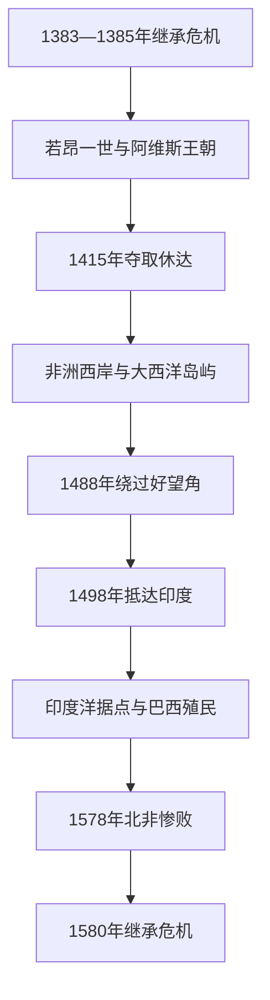

# 阿维斯王朝与大航海

## 时间

1385年—1580年

## 演进图

## 概括

阿维斯王朝源于1383—1385年继承危机。若昂一世依靠城市、部分贵族和英格兰援助击败卡斯蒂利亚，随后王室把军事、商贸与宗教资源投入北非和大西洋。绕过撒哈拉与地中海中介、获取黄金和香料的动机推动航海，最终建立由港口、要塞、航线和殖民地组成的跨洲帝国。

## 完整君主世系

| 顺序 | 君主 | 在位时间 | 与前任关系 / 关键事项 |
|---:|---|---|---|
| 1 | **若昂一世** | 1385—1433 | 佩德罗一世私生子、阿维斯骑士团团长；王朝创建者。 |
| 2 | 杜阿尔特一世 | 1433—1438 | 若昂一世之子；丹吉尔远征失败。 |
| 3 | 阿方索五世 | 1438—1481 | 杜阿尔特之子；幼年摄政，扩张北非，介入卡斯蒂利亚继承战。 |
| 4 | **若昂二世** | 1481—1495 | 阿方索五世之子；打击大贵族，支持非洲航路与印度计划。 |
| 5 | **曼努埃尔一世** | 1495—1521 | 若昂二世堂弟；达伽马抵印、卡布拉尔抵巴西，帝国鼎盛。 |
| 6 | 若昂三世 | 1521—1557 | 曼努埃尔之子；建立殖民总督体系，引入宗教裁判所。 |
| 7 | 塞巴斯蒂昂 | 1557—1578 | 若昂三世之孙；北非远征中失踪，无嗣。 |
| 8 | 恩里克一世 | 1578—1580 | 曼努埃尔之子、枢机；无嗣去世。 |

克拉托修道院长安东尼奥在1580年自称国王并获部分地区支持，但未获普遍承认，败于西班牙腓力二世军队，属继承战争中的争议统治者。

## 航海扩张过程

- 1415年攻占休达，既延续收复失地式圣战，也暴露控制北非腹地的困难。
- 恩里克王子资助下的船队逐段探索非洲西岸，马德拉和亚速尔成为蔗糖、移民与海航基地；奴隶贸易随之扩大。
- 1488年迪亚士绕过好望角；1494年《托德西利亚斯条约》划分葡西海外势力范围。
- 1498年达伽马抵达印度；1500年卡布拉尔船队抵达巴西。
- 阿尔布克尔克夺取果阿、马六甲和霍尔木兹，构建控制海峡与征收通行证的印度洋据点网。
- 王室在里斯本设印度院管理船队和特许贸易，但距离、腐败、船损和地方抵抗限制垄断。
- 巴西从沿岸木材贸易转向糖业种植园，依赖被强迫迁移的非洲奴隶劳动。

## 鼎盛条件与衰落原因

葡萄牙拥有大西洋港口、王室集中支持、地中海与犹太航海知识、火炮舰船和跨地商人网络。其弱点是人口与财政规模不足、据点分散、贸易依赖武力和亚洲地方合作。若昂三世以后王室债务上升，荷兰与英国竞争尚未全面爆发，真正的直接危机却来自塞巴斯蒂昂1578年北非惨败、贵族伤亡和王统断绝。

## 演变关系

- 国家主线：[葡萄牙王国](/%E4%BA%BA%E6%96%87%E7%A7%91%E5%AD%A6/%E5%8E%86%E5%8F%B2/%E6%AC%A7%E6%B4%B2/%E4%BC%8A%E6%AF%94%E5%88%A9%E4%BA%9A%E5%8D%8A%E5%B2%9B/%E8%91%A1%E8%90%84%E7%89%99/%E8%91%A1%E8%90%84%E7%89%99%E7%8E%8B%E5%9B%BD.md)
- 后一阶段：[伊比利亚联盟时期的葡萄牙](/%E4%BA%BA%E6%96%87%E7%A7%91%E5%AD%A6/%E5%8E%86%E5%8F%B2/%E6%AC%A7%E6%B4%B2/%E4%BC%8A%E6%AF%94%E5%88%A9%E4%BA%9A%E5%8D%8A%E5%B2%9B/%E8%91%A1%E8%90%84%E7%89%99/%E4%BC%8A%E6%AF%94%E5%88%A9%E4%BA%9A%E8%81%94%E7%9B%9F%E6%97%B6%E6%9C%9F%E7%9A%84%E8%91%A1%E8%90%84%E7%89%99.md)
- 所属总览：[葡萄牙](/%E4%BA%BA%E6%96%87%E7%A7%91%E5%AD%A6/%E5%8E%86%E5%8F%B2/%E6%AC%A7%E6%B4%B2/%E4%BC%8A%E6%AF%94%E5%88%A9%E4%BA%9A%E5%8D%8A%E5%B2%9B/%E8%91%A1%E8%90%84%E7%89%99/README.md)
