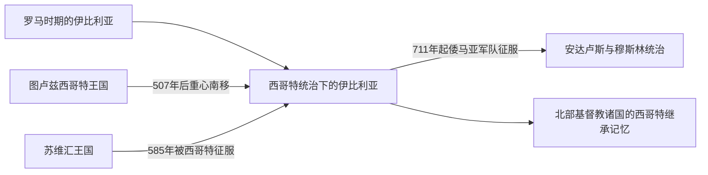

# 西哥特统治下的伊比利亚

## 时间

约507年—711年；西哥特势力进入半岛始于5世纪

## 范围

本页只整理西哥特王国在伊比利亚半岛的统治及其在半岛历史中的前后关系。西哥特人的迁徙、图卢兹王国和完整王权演变由[西哥特王国](/%E4%BA%BA%E6%96%87%E7%A7%91%E5%AD%A6/%E5%8E%86%E5%8F%B2/%E6%AC%A7%E6%B4%B2/_%E9%80%9A%E5%8F%B2/%E5%90%8E%E7%BD%97%E9%A9%AC%E6%97%B6%E4%BB%A3%E7%9A%84%E6%97%A5%E8%80%B3%E6%9B%BC%E8%AF%B8%E5%9B%BD/%E8%A5%BF%E5%93%A5%E7%89%B9%E7%8E%8B%E5%9B%BD.md)维护。

## 概括

507年武耶战役后，西哥特政治重心从高卢南部转向伊比利亚，并逐渐以托莱多为中心控制半岛大部分地区。托莱多王国连接罗马西班尼亚行省传统、中世纪天主教王权和711年以后安达卢斯与北部基督教诸国的形成。

## 演进图

## 伊比利亚统治的发展

- 西哥特人早在5世纪已进入伊比利亚，但早期王国中心位于图卢兹。
- 507年法兰克人在武耶战役击败阿拉里克二世后，西哥特势力主要退向半岛。
- 6世纪后期，莱奥维吉尔加强王权并征服西北部的苏维汇王国。
- 589年第三次托莱多会议上，国王雷卡雷德由阿里乌派改宗天主教，王权与半岛主流教会进一步结合。
- 托莱多会议兼具宗教会议和政治协商功能，但贵族与教会势力仍限制王位稳定。
- 711年起，倭马亚体系下的军队进入半岛；内部王位冲突和军事失败使王国迅速瓦解。
- 后来的阿斯图里亚斯、莱昂等北部基督教政权经常借用西哥特传统建构合法性，但这不是无间断的国家制度继承。

## 伊比利亚史定位

| 前后关系 | 说明 |
|---|---|
| 罗马遗产 | 城市、道路、拉丁语、法律和教会组织继续影响西哥特统治。 |
| 日耳曼军事集团 | 西哥特统治精英最初与罗马—伊比利亚人口有身份和法律差异，后来逐渐整合。 |
| 天主教王权 | 改宗和托莱多会议使王权、主教与贵族政治结合。 |
| 穆斯林征服 | 711年后半岛多数地区纳入安达卢斯，政治中心和土地权力重组。 |
| 后世记忆 | 北部王国借用西哥特继承叙事，但不能把711年前后的制度画成单一直线。 |

## 通史与相关入口

- 完整政权主线：[西哥特王国](/%E4%BA%BA%E6%96%87%E7%A7%91%E5%AD%A6/%E5%8E%86%E5%8F%B2/%E6%AC%A7%E6%B4%B2/_%E9%80%9A%E5%8F%B2/%E5%90%8E%E7%BD%97%E9%A9%AC%E6%97%B6%E4%BB%A3%E7%9A%84%E6%97%A5%E8%80%B3%E6%9B%BC%E8%AF%B8%E5%9B%BD/%E8%A5%BF%E5%93%A5%E7%89%B9%E7%8E%8B%E5%9B%BD.md)。
- 前一阶段：[罗马时期的伊比利亚](/%E4%BA%BA%E6%96%87%E7%A7%91%E5%AD%A6/%E5%8E%86%E5%8F%B2/%E6%AC%A7%E6%B4%B2/%E4%BC%8A%E6%AF%94%E5%88%A9%E4%BA%9A%E5%8D%8A%E5%B2%9B/%E7%BD%97%E9%A9%AC%E6%97%B6%E6%9C%9F%E7%9A%84%E4%BC%8A%E6%AF%94%E5%88%A9%E4%BA%9A.md)。
- 后一阶段：[安达卢斯与穆斯林统治](/%E4%BA%BA%E6%96%87%E7%A7%91%E5%AD%A6/%E5%8E%86%E5%8F%B2/%E6%AC%A7%E6%B4%B2/%E4%BC%8A%E6%AF%94%E5%88%A9%E4%BA%9A%E5%8D%8A%E5%B2%9B/%E5%AE%89%E8%BE%BE%E5%8D%A2%E6%96%AF%E4%B8%8E%E7%A9%86%E6%96%AF%E6%9E%97%E7%BB%9F%E6%B2%BB.md)。
- 征服的跨区域背景：[倭马亚王朝](/%E4%BA%BA%E6%96%87%E7%A7%91%E5%AD%A6/%E5%8E%86%E5%8F%B2/%E8%A5%BF%E4%BA%9A/_%E9%80%9A%E5%8F%B2/%E9%98%BF%E6%8B%89%E4%BC%AF%E5%B8%9D%E5%9B%BD/%E5%80%AD%E9%A9%AC%E4%BA%9A%E7%8E%8B%E6%9C%9D.md)。
- 区域总览：[伊比利亚半岛](/%E4%BA%BA%E6%96%87%E7%A7%91%E5%AD%A6/%E5%8E%86%E5%8F%B2/%E6%AC%A7%E6%B4%B2/%E4%BC%8A%E6%AF%94%E5%88%A9%E4%BA%9A%E5%8D%8A%E5%B2%9B/README.md)。

## 关键辨析

- 西哥特王国先以图卢兹为中心，不能把它从成立之初就写成纯粹的西班牙国家。
- 西哥特统治并未抹去罗马制度和伊比利亚地方社会。
- 后世“收复失地”叙事对西哥特遗产的运用属于政治记忆，不等于王国制度连续存在。
