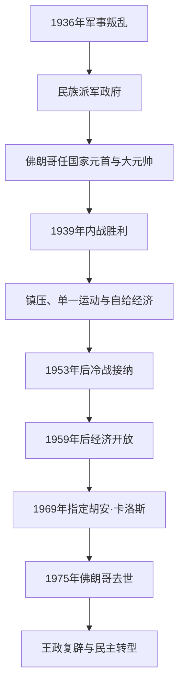

# 佛朗哥统治

## 时间

1939年—1975年；民族派政权中的佛朗哥国家元首地位始于1936年

## 概括

内战胜利后，弗朗西斯科·佛朗哥建立个人独裁。政权把军队、长枪党、卡洛斯派、君主派、天主教保守力量和技术官僚置于元首仲裁之下；它早期吸收法西斯政治形式，却不等同于由长枪党独立控制的单一党国。早期镇压、自给经济和民族天主教维持统治，冷战后以反共战略价值重获国际接纳，1959年后转向市场开放。1947年法定国号恢复为王国但王位空缺，佛朗哥仍是实际最高权力。

## 权力结构演进图

## 法定国家元首

| 国家元首 | 任期 | 法定称号与实际权力 |
|---|---|---|
| **弗朗西斯科·佛朗哥** | 1936年10月1日—1975年11月20日 | 民族派先称“国家政府元首”，内战胜利后统治全国；兼军队最高统帅和“运动领袖”，对法律、任免、军队与政府拥有最终决定权。 |
| 王位空缺 | 1947—1975年 | 《国家元首继承法》称西班牙为王国，但没有在位国王；佛朗哥可以指定继承人。 |
| 胡安·卡洛斯 | 1969年7月22日起为“西班牙亲王” | 接受佛朗哥体制宣誓，尚非国家元首；1975年11月22日即位后进入转型阶段。 |

## 政府首脑

| 顺序 | 政府首脑 | 任期 | 与实际最高权力的关系 |
|---:|---|---|---|
| 1 | **弗朗西斯科·佛朗哥** | 1938年1月30日—1973年6月9日 | 国家元首兼政府首脑，内阁只向其负责。 |
| 2 | 路易斯·卡雷罗·布兰科 | 1973年6月9日—12月20日 | 佛朗哥长期亲信，首次把政府首脑与国家元首分开；遭ETA刺杀。 |
| 3 | 托尔夸托·费尔南德斯-米兰达 | 1973年12月20—31日 | 副首相代理政府首脑。 |
| 4 | 卡洛斯·阿里亚斯·纳瓦罗 | 1973年12月31日—1976年7月1日 | 佛朗哥晚期政府首脑；佛朗哥死后仍短期留任，后被胡安·卡洛斯撤换。 |

## 机构与实际权力

| 主体 | 制度地位 | 实际作用 |
|---|---|---|
| 国家元首 | 通过一系列“基本法”而非一部民主宪法掌权 | 佛朗哥拥有立法认可、任免、赦免、军队与继承安排的最终权力。 |
| 西班牙传统主义长枪党与民族工团主义进攻委员会 | 1937年强制合并，后称“国民运动” | 垄断合法政治参与、工会和宣传，但军人、天主教徒、君主派和技术官僚仍各有派系。 |
| 西班牙议会 | 1942年恢复，为社团代表、官员和指定人士组成 | 不由自由竞争选举产生，主要确认政权法令。 |
| 军队和治安机关 | 政权核心支柱 | 军事法庭、国民警卫队、警察、监狱和强迫劳动镇压反对者。 |
| 天主教会 | 1953年政教协定保障教育和社会特权 | 早期提供民族天主教合法性；梵蒂冈二世后部分主教与教士转向批判。 |
| 技术官僚 | 1950年代后进入经济部门 | 1959年稳定计划、外资、旅游和工业化的主要设计者，政治上仍服从独裁。 |

## 分阶段发展与重要事件

1. **战后镇压与自给经济（1939—1950年代初）。** 处决、监禁、强迫劳动、流亡和公职清洗延续；地区语言公共使用受限制。粮食配给、黑市和国家干预造成长期匮乏。
2. **世界大战与孤立。** 西班牙从“非交战”转为中立，向苏德战场派蓝色师；战后因轴心联系遭外交排斥。
3. **冷战接纳。** 1953年同美国签基地协定、同梵蒂冈签政教协定，1955年加入联合国，反共价值压过西方对独裁的批评。
4. **经济开放。** 1959年稳定计划削减自给政策，旅游、侨汇、外资和工业化推动“西班牙奇迹”，农村人口大量移入城市。
5. **社会现代化与反对力量。** 新工人、中产、大学群体、地下工会、地区民族主义和教会内部批判扩大；ETA以暴力追求巴斯克独立。
6. **继承危机。** 1969年佛朗哥越过胡安·德波旁，指定胡安·卡洛斯继承；1973年卡雷罗遇刺使维持无佛朗哥的佛朗哥体制更困难。
7. **终结。** 佛朗哥1975年11月20日去世，胡安·卡洛斯即位；国王和改革派随后利用旧基本法开启制度拆除。

## 维持、衰落与直接终结

武力垄断、战后恐惧、派系平衡、教会与军队支持、冷战国际环境以及1960年代增长维持政权。其结构弱点是权力个人化、政治参与被封闭、地区与劳工冲突累积，社会经济现代化又与官方意识形态脱节。外部压力包括欧洲民主规范和葡萄牙1974年革命的示范。卡雷罗遇刺破坏继承设计，佛朗哥死亡则是直接权力断点；独裁并非自动消失，而是国王、苏亚雷斯政府、反对党、社会运动与军方在风险中谈判和斗争的结果。

## 演变关系

- 前一阶段：[西班牙内战](/%E4%BA%BA%E6%96%87%E7%A7%91%E5%AD%A6/%E5%8E%86%E5%8F%B2/%E6%AC%A7%E6%B4%B2/%E4%BC%8A%E6%AF%94%E5%88%A9%E4%BA%9A%E5%8D%8A%E5%B2%9B/%E8%A5%BF%E7%8F%AD%E7%89%99/%E8%A5%BF%E7%8F%AD%E7%89%99%E5%86%85%E6%88%98.md)。
- 后一阶段：[西班牙民主转型与现代西班牙](/%E4%BA%BA%E6%96%87%E7%A7%91%E5%AD%A6/%E5%8E%86%E5%8F%B2/%E6%AC%A7%E6%B4%B2/%E4%BC%8A%E6%AF%94%E5%88%A9%E4%BA%9A%E5%8D%8A%E5%B2%9B/%E8%A5%BF%E7%8F%AD%E7%89%99/%E8%A5%BF%E7%8F%AD%E7%89%99%E6%B0%91%E4%B8%BB%E8%BD%AC%E5%9E%8B%E4%B8%8E%E7%8E%B0%E4%BB%A3%E8%A5%BF%E7%8F%AD%E7%89%99.md)。
- 王国法定安排：[西班牙波旁王朝](/%E4%BA%BA%E6%96%87%E7%A7%91%E5%AD%A6/%E5%8E%86%E5%8F%B2/%E6%AC%A7%E6%B4%B2/%E4%BC%8A%E6%AF%94%E5%88%A9%E4%BA%9A%E5%8D%8A%E5%B2%9B/%E8%A5%BF%E7%8F%AD%E7%89%99/%E8%A5%BF%E7%8F%AD%E7%89%99%E6%B3%A2%E6%97%81%E7%8E%8B%E6%9C%9D.md)。
- 所属总览：[西班牙](/%E4%BA%BA%E6%96%87%E7%A7%91%E5%AD%A6/%E5%8E%86%E5%8F%B2/%E6%AC%A7%E6%B4%B2/%E4%BC%8A%E6%AF%94%E5%88%A9%E4%BA%9A%E5%8D%8A%E5%B2%9B/%E8%A5%BF%E7%8F%AD%E7%89%99/README.md)。
