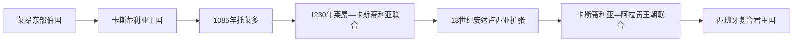

# 卡斯蒂利亚王国

## 时间

1035年—1715年

## 演进图

## 概括

卡斯蒂利亚由莱昂东部边境伯国发展为王国，依靠杜罗河以南的城市、骑士和牧业网络向托莱多、科尔多瓦、塞维利亚扩张。1230年后与莱昂永久共主，1479年后又与阿拉贡王冠形成王朝联合；其议会、财政、语言和大西洋港口成为西班牙全球帝国的主要制度核心。1707—1716年《新基本法令》重构各王冠制度，卡斯蒂利亚不再作为独立复合王冠运作。

## 完整君主世系

| 王朝 | 君主 | 在位时间 |
|---|---|---|
| 希梅尼斯 | 费尔南多一世 | 1035—1065；1037年起兼莱昂 |
| 希梅尼斯 | 桑乔二世 | 1065—1072 |
| 希梅尼斯 | 阿方索六世 | 1072—1109 |
| 希梅尼斯 | 乌拉卡 | 1109—1126 |
| 伊夫雷亚 | 阿方索七世 | 1126—1157 |
| 伊夫雷亚 | 桑乔三世 | 1157—1158 |
| 伊夫雷亚 | 阿方索八世 | 1158—1214 |
| 伊夫雷亚 | 恩里克一世 | 1214—1217 |
| 伊夫雷亚 | 贝伦加利亚 | 1217 |
| 伊夫雷亚 | **费尔南多三世** | 1217—1252；1230年起兼莱昂 |
| 伊夫雷亚 | 阿方索十世 | 1252—1284 |
| 伊夫雷亚 | 桑乔四世 | 1284—1295 |
| 伊夫雷亚 | 费尔南多四世 | 1295—1312 |
| 伊夫雷亚 | 阿方索十一世 | 1312—1350 |
| 伊夫雷亚 | 佩德罗一世 | 1350—1369 |
| 特拉斯塔马拉 | 恩里克二世 | 1369—1379 |
| 特拉斯塔马拉 | 胡安一世 | 1379—1390 |
| 特拉斯塔马拉 | 恩里克三世 | 1390—1406 |
| 特拉斯塔马拉 | 胡安二世 | 1406—1454 |
| 特拉斯塔马拉 | 恩里克四世 | 1454—1474 |
| 特拉斯塔马拉 | **伊莎贝拉一世** | 1474—1504 |
| 特拉斯塔马拉 | 胡安娜一世 | 1504—1555，长期为名义女王 |
| 哈布斯堡 | 腓力一世 | 1506，与胡安娜共治 |
| 哈布斯堡 | 卡洛斯一世 | 1516—1556，与胡安娜名义共治至1555 |
| 哈布斯堡 | 腓力二世 | 1556—1598 |
| 哈布斯堡 | 腓力三世 | 1598—1621 |
| 哈布斯堡 | 腓力四世 | 1621—1665 |
| 哈布斯堡 | 卡洛斯二世 | 1665—1700 |
| 波旁 | 腓力五世 | 1700—1715（本页制度终点） |

## 崛起与重要事件

- 1085年夺取托莱多使卡斯蒂利亚进入塔霍河流域；1212年托洛萨会战后穆瓦希德力量衰退。
- 费尔南多三世征服科尔多瓦、哈恩、塞维利亚，形成安达卢西亚大地产、穆德哈尔人口和自治市并存的社会。
- 阿方索十世推动法律、卡斯蒂利亚语文书和学术翻译，但王位继承冲突削弱王权。
- 14世纪黑死病、贵族战争和佩德罗一世—恩里克二世内战使特拉斯塔马拉王朝上台。
- 伊莎贝拉与阿拉贡斐迪南的婚姻构成王朝联合；1492年格拉纳达陷落、犹太人被驱逐、哥伦布航行同时发生。
- 美洲白银由卡斯蒂利亚财政和塞维利亚贸易体系管理，扩大王室资源，也造成通胀、债务和对外战争压力。
- 1520—1521年公社起义失败后，王权与贵族妥协，议会控制力减弱。

## 衰落与制度终结

人口危机、税负集中于卡斯蒂利亚、贵族与教会免税、帝国战争和财政破产削弱经济。卡斯蒂利亚仍是西班牙君主国核心，并非被另一王国征服；波旁王位继承战争后，腓力五世把卡斯蒂利亚式中央机关推广到阿拉贡诸地，复合王冠差异被大幅压缩。

## 演变关系

- 前史：[阿斯图里亚斯、莱昂与早期基督教王国](/%E4%BA%BA%E6%96%87%E7%A7%91%E5%AD%A6/%E5%8E%86%E5%8F%B2/%E6%AC%A7%E6%B4%B2/%E4%BC%8A%E6%AF%94%E5%88%A9%E4%BA%9A%E5%8D%8A%E5%B2%9B/%E8%A5%BF%E7%8F%AD%E7%89%99/%E9%98%BF%E6%96%AF%E5%9B%BE%E9%87%8C%E4%BA%9A%E6%96%AF%E3%80%81%E8%8E%B1%E6%98%82%E4%B8%8E%E6%97%A9%E6%9C%9F%E5%9F%BA%E7%9D%A3%E6%95%99%E7%8E%8B%E5%9B%BD.md)
- 联合王朝：[西班牙哈布斯堡王朝](/%E4%BA%BA%E6%96%87%E7%A7%91%E5%AD%A6/%E5%8E%86%E5%8F%B2/%E6%AC%A7%E6%B4%B2/%E4%BC%8A%E6%AF%94%E5%88%A9%E4%BA%9A%E5%8D%8A%E5%B2%9B/%E8%A5%BF%E7%8F%AD%E7%89%99/%E8%A5%BF%E7%8F%AD%E7%89%99%E5%93%88%E5%B8%83%E6%96%AF%E5%A0%A1%E7%8E%8B%E6%9C%9D.md)
- 所属总览：[西班牙](/%E4%BA%BA%E6%96%87%E7%A7%91%E5%AD%A6/%E5%8E%86%E5%8F%B2/%E6%AC%A7%E6%B4%B2/%E4%BC%8A%E6%AF%94%E5%88%A9%E4%BA%9A%E5%8D%8A%E5%B2%9B/%E8%A5%BF%E7%8F%AD%E7%89%99/README.md)
