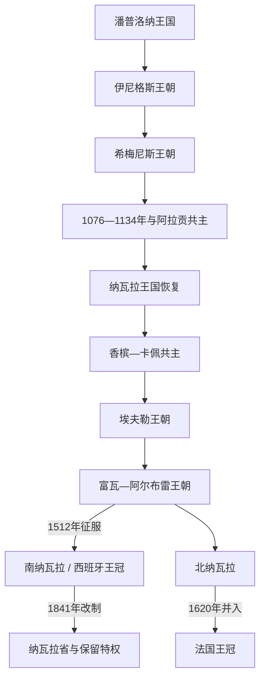

# 纳瓦拉君主世系表

## 时间

约824年—1841年；北纳瓦拉王统于1620年并入法国王冠

## 范围与说明

纳瓦拉源于潘普洛纳王国。1512年以后必须分成两条线：斐迪南二世征服的南纳瓦拉继续作为西班牙王冠内具有自身议会与特权的王国，直到1841年改制；比利牛斯以北的北纳瓦拉由原王室继续统治，1589年与法国共主，1620年制度并入法国。本表不把两条线合成虚假的单一继承。

## 世系演进图

## 潘普洛纳与统一纳瓦拉王统

| 顺序 | 王朝 | 君主 | 在位 | 与前任关系 | 关键事件 / 备注 |
|---:|---|---|---|---|---|
| 1 | 伊尼格斯 | **伊尼戈·阿里斯塔** | 约824—851/852年 | 本地领袖，王朝创建者 | 在法兰克、科尔多瓦与巴努·卡西家族之间建立自主政权。 |
| 2 | 伊尼格斯 | 加西亚·伊尼格斯 | 851/852—882年 | 伊尼戈之子 | 面对维京袭击与科尔多瓦压力。 |
| 3 | 伊尼格斯 | 福尔通·加尔塞斯 | 882—905年 | 加西亚之子 | 长期曾为科尔多瓦俘虏；被希梅尼斯家族取代。 |
| 4 | 希梅尼斯 | **桑乔一世·加尔塞斯** | 905—925年 | 王族旁支，政变上台 | 向里奥哈扩张；王后托达家族网络影响半岛政治。 |
| 5 | 希梅尼斯 | 加西亚·桑切斯一世 | 925—970年 | 桑乔一世之子 | 幼年由叔父希梅诺摄政；兼并阿拉贡伯国。 |
| 6 | 希梅尼斯 | 桑乔二世·加尔塞斯 | 970—994年 | 前任之子 | 与莱昂、卡斯蒂利亚结盟，后受曼苏尔压力。 |
| 7 | 希梅尼斯 | 加西亚·桑切斯二世 | 994—约1000年 | 前任之子 | 与科尔多瓦战争，死亡年代有争议。 |
| 8 | 希梅尼斯 | **桑乔三世“大帝”** | 约1000—1035年 | 前任之子 | 通过婚姻与战争影响卡斯蒂利亚、莱昂、阿拉贡；死后分封重塑诸国。 |
| 9 | 希梅尼斯 | 加西亚·桑切斯三世 | 1035—1054年 | 桑乔三世长子 | 分得潘普洛纳，阿塔普埃尔卡战役阵亡。 |
| 10 | 希梅尼斯 | 桑乔四世 | 1054—1076年 | 前任之子 | 被亲属暗杀，王国被阿拉贡与卡斯蒂利亚瓜分影响。 |
| 11 | 阿拉贡共主 | 桑乔·拉米雷斯 | 1076—1094年 | 桑乔四世堂兄、阿拉贡王 | 纳瓦拉贵族拥立，与阿拉贡共主。 |
| 12 | 阿拉贡共主 | 佩德罗一世 | 1094—1104年 | 前任之子 | 兼阿拉贡与潘普洛纳。 |
| 13 | 阿拉贡共主 | 阿方索一世 | 1104—1134年 | 佩德罗之弟 | 攻取萨拉戈萨；无嗣遗嘱引发分裂。 |
| 14 | 恢复王国 | **加西亚·拉米雷斯** | 1134—1150年 | 希梅尼斯旁支 | 纳瓦拉贵族另立，摆脱阿拉贡共主。 |
| 15 | 恢复王国 | 桑乔六世 | 1150—1194年 | 前任之子 | 采用“纳瓦拉国王”称号，整顿城镇与外交。 |
| 16 | 恢复王国 | 桑乔七世 | 1194—1234年 | 前任之子 | 参加1212年托洛萨会战；无合法子嗣。 |
| 17 | 香槟 | 特奥巴尔多一世 | 1234—1253年 | 桑乔七世外甥 | 法国香槟伯爵继承，王国更深卷入比利牛斯以北政治。 |
| 18 | 香槟 | 特奥巴尔多二世 | 1253—1270年 | 前任之子 | 无嗣，参加十字军时去世。 |
| 19 | 香槟 | 恩里克一世 | 1270—1274年 | 前任之弟 | 短任，留下幼女胡安娜。 |
| 20 | 香槟 | 胡安娜一世 | 1274—1305年 | 前任之女 | 幼年由母亲摄政；嫁法国腓力四世，形成法纳共主。 |
| 21 | 卡佩共主 | 路易斯一世 | 1305—1316年 | 胡安娜之子，即法国路易十世 | 在法国即位前已为纳瓦拉王。 |
| 22 | 卡佩共主 | 胡安一世 | 1316年 | 路易遗腹子 | 出生五日后夭折。 |
| 23 | 卡佩共主 | 腓力二世 | 1316—1322年 | 路易之弟，即法国腓力五世 | 以女性继承争议取得王位。 |
| 24 | 卡佩共主 | 卡洛斯一世 | 1322—1328年 | 腓力之弟，即法国查理四世 | 无男性后嗣；法纳王统再次分开。 |
| 25 | 埃夫勒 | **胡安娜二世** | 1328—1349年 | 路易一世之女 | 纳瓦拉承认其继承权；与丈夫腓力三世共治。 |
| 26 | 埃夫勒 | 腓力三世 | 1328—1343年 | 胡安娜二世之夫 | 共治国王，十字军行动中去世；胡安娜继续统治。 |
| 27 | 埃夫勒 | 卡洛斯二世 | 1349—1387年 | 胡安娜二世之子 | 深度介入法国百年战争与伊比利亚外交。 |
| 28 | 埃夫勒 | **卡洛斯三世** | 1387—1425年 | 前任之子 | 结束部分对外战争，调整继承与宫廷。 |
| 29 | 埃夫勒 | 布兰卡一世 | 1425—1441年 | 卡洛斯三世之女 | 与阿拉贡胡安二世共治；其死引发继承冲突。 |
| 30 | 特拉斯塔马拉共治 | 胡安二世 | 1425—1479年 | 布兰卡之夫 | 1441年后拒绝把权力交给儿子卡洛斯，导致纳瓦拉内战；实际统治延续。 |
| 31 | 争议继承 | 维亚纳王子卡洛斯 | 1441—1461年主张 | 布兰卡一世之子 | 按母亲遗嘱应继承，实际未稳定掌权；部分王表列为卡洛斯四世。 |
| 32 | 争议继承 | 布兰卡二世 | 1461—1464年主张 | 卡洛斯之妹 | 被父亲拘禁，未实际统治；部分王表列为女王。 |
| 33 | 富瓦 | 莱奥诺尔 | 1479年 | 布兰卡二世之妹 | 长期代表父亲治理，正式即位后数周去世。 |
| 34 | 富瓦 | 弗朗西斯科·费博 | 1479—1483年 | 莱奥诺尔之孙 | 幼年由母亲马德莱娜摄政，无嗣早逝。 |
| 35 | 富瓦—阿尔布雷 | **卡塔里娜** | 1483—1517年 | 弗朗西斯科之姐 | 与丈夫胡安三世共治；1512年失去南纳瓦拉，继续统治北部。 |
| 36 | 富瓦—阿尔布雷 | 胡安三世 | 1484—1516年 | 卡塔里娜之夫 | 共治国王，多次试图收复南部失败。 |

## 北纳瓦拉王统

| 顺序 | 君主 | 在位 | 与前任关系 | 关键事件 / 备注 |
|---:|---|---|---|---|
| 1 | 卡塔里娜 | 1512—1517年（北部） | 原统一女王 | 南部失陷后以圣让皮耶德波尔以北为中心。 |
| 2 | **恩里克二世** | 1517—1555年 | 卡塔里娜与胡安三世之子 | 1521年收复尝试失败；维持独立宫廷。 |
| 3 | 胡安娜三世 | 1555—1572年 | 恩里克二世之女 | 改宗加尔文派，卷入法国宗教战争。 |
| 4 | 安托万 | 1555—1562年 | 胡安娜三世之夫 | 共治国王，战死；胡安娜继续单独统治。 |
| 5 | **恩里克三世** | 1572—1610年 | 胡安娜之子 | 1589年成为法国亨利四世，两王冠共主但制度仍分。 |
| 6 | 路易斯二世 | 1610—1620年 | 恩里克三世之子，即法国路易十三 | 1620年下令把北纳瓦拉与贝阿恩制度并入法国王冠。 |

## 南纳瓦拉王统与制度终结

| 顺序 | 君主 / 实际统治者 | 在纳瓦拉统治 | 与前任关系 / 备注 |
|---:|---|---|---|
| 1 | **斐迪南** | 1512—1516年 | 阿拉贡斐迪南二世，以战争征服；1515年把南纳瓦拉并入卡斯蒂利亚王冠但保留王国机构。 |
| 2 | 胡安娜一世 | 1516—1555年 | 斐迪南之女，法定女王，长期无实权。 |
| 3 | 卡洛斯一世 | 1516—1556年 | 胡安娜之子，与母共治至1555；1521年击败纳瓦拉—法军收复尝试。 |
| 4 | 腓力二世 | 1556—1598年 | 卡洛斯之子。 |
| 5 | 腓力三世 | 1598—1621年 | 前任之子。 |
| 6 | 腓力四世 | 1621—1665年 | 前任之子。 |
| 7 | 卡洛斯二世 | 1665—1700年 | 前任之子，无嗣。 |
| 8 | 腓力五世 | 1700—1724年 | 波旁继承；纳瓦拉因支持其王位，保留多数 fueros。 |
| 9 | 路易斯一世 | 1724年 | 腓力五世之子，短任。 |
| 10 | 腓力五世 | 1724—1746年 | 复位。 |
| 11 | 费尔南多六世 | 1746—1759年 | 腓力五世之子。 |
| 12 | 卡洛斯三世 | 1759—1788年 | 费尔南多之弟。 |
| 13 | 卡洛斯四世 | 1788—1808年 | 前任之子。 |
| 14 | 费尔南多七世 | 1808年 | 卡洛斯四世之子；被拿破仑迫退。 |
| 15 | 约瑟夫·波拿巴及法军占领 | 1808—1813年 | 法定性遭广泛否认；战争期间实际控制反复。 |
| 16 | 费尔南多七世 | 1813—1833年 | 复位；自由主义与绝对主义冲突。 |
| 17 | 伊莎贝拉二世 | 1833—1841年（王国制度） | 费尔南多之女；第一次卡洛斯战争后，1841年法令把纳瓦拉改为省级体制并保留部分财政特权。 |

1841年后西班牙君主仍使用“纳瓦拉国王”历史称号，但不再存在独立的纳瓦拉王国机构。北部和南部巴斯克—纳瓦拉社会并未因王国终结而消失。

## 相关笔记

- 政权发展：[纳瓦拉王国](/%E4%BA%BA%E6%96%87%E7%A7%91%E5%AD%A6/%E5%8E%86%E5%8F%B2/%E6%AC%A7%E6%B4%B2/%E4%BC%8A%E6%AF%94%E5%88%A9%E4%BA%9A%E5%8D%8A%E5%B2%9B/%E8%A5%BF%E7%8F%AD%E7%89%99/%E7%BA%B3%E7%93%A6%E6%8B%89%E7%8E%8B%E5%9B%BD.md)。
- 半岛共同过程：[基督教诸国与收复失地运动](/%E4%BA%BA%E6%96%87%E7%A7%91%E5%AD%A6/%E5%8E%86%E5%8F%B2/%E6%AC%A7%E6%B4%B2/%E4%BC%8A%E6%AF%94%E5%88%A9%E4%BA%9A%E5%8D%8A%E5%B2%9B/%E5%9F%BA%E7%9D%A3%E6%95%99%E8%AF%B8%E5%9B%BD%E4%B8%8E%E6%94%B6%E5%A4%8D%E5%A4%B1%E5%9C%B0%E8%BF%90%E5%8A%A8.md)。
- 阿拉贡共主阶段：[阿拉贡王国与阿拉贡王冠](/%E4%BA%BA%E6%96%87%E7%A7%91%E5%AD%A6/%E5%8E%86%E5%8F%B2/%E6%AC%A7%E6%B4%B2/%E4%BC%8A%E6%AF%94%E5%88%A9%E4%BA%9A%E5%8D%8A%E5%B2%9B/%E8%A5%BF%E7%8F%AD%E7%89%99/%E9%98%BF%E6%8B%89%E8%B4%A1%E7%8E%8B%E5%9B%BD%E4%B8%8E%E9%98%BF%E6%8B%89%E8%B4%A1%E7%8E%8B%E5%86%A0.md)。
- 西班牙总览：[西班牙](/%E4%BA%BA%E6%96%87%E7%A7%91%E5%AD%A6/%E5%8E%86%E5%8F%B2/%E6%AC%A7%E6%B4%B2/%E4%BC%8A%E6%AF%94%E5%88%A9%E4%BA%9A%E5%8D%8A%E5%B2%9B/%E8%A5%BF%E7%8F%AD%E7%89%99/README.md)。
