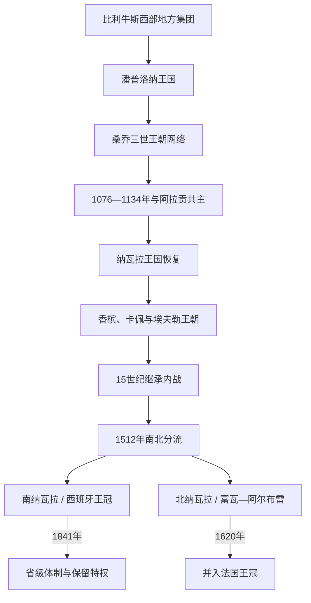

# 纳瓦拉王国

## 时间

约824年—1841年；1512年后南北分流，北纳瓦拉于1620年并入法国王冠

## 概括

纳瓦拉源于比利牛斯西部的潘普洛纳王国，处在巴斯克地方社会、法兰克世界、科尔多瓦与伊比利亚基督教诸国之间。它在桑乔三世时期通过王朝网络达到影响高峰，随后受卡斯蒂利亚、阿拉贡和法国竞争挤压。1512年南部被斐迪南征服，但仍以拥有议会和 fueros 的王国身份存在于西班牙王冠内，直至1841年改制；北部由原王室延续，1589年与法国共主，1620年制度并入法国。

## 演进图

## 建立与崛起

潘普洛纳盆地连接埃布罗河谷和比利牛斯山口。8—9世纪当地巴斯克贵族并非固定站在基督教或穆斯林一方：伊尼戈家族与埃布罗河谷的穆斯林巴努·卡西家族通婚结盟，也会同科尔多瓦或法兰克交战。约824年法兰克远征失败后，伊尼戈·阿里斯塔通常被视为首位国王。

905年希梅尼斯家族取得王位，向里奥哈扩张并加强与莱昂、卡斯蒂利亚的婚姻。桑乔三世（约1000—1035年）兼具纳瓦拉王、卡斯蒂利亚摄政及多个伯国宗主影响，但不能称为统一西班牙的国王；其死后家族分封反而推动卡斯蒂利亚和阿拉贡成为独立王国。

## 分阶段发展

| 阶段 | 时间 | 权力结构与特点 | 转折 |
|---|---|---|---|
| 伊尼格斯与希梅尼斯 | 约824—1076年 | 本地王族、修道院和跨宗教家族联盟；控制潘普洛纳与里奥哈 | 桑乔四世被刺后继承危机，阿拉贡王进入潘普洛纳。 |
| 阿拉贡共主 | 1076—1134年 | 两王国共享国王，地方贵族和制度仍有区别 | 阿方索一世无嗣；纳瓦拉贵族拒绝骑士团遗嘱，另立国王。 |
| 王国恢复 | 1134—1234年 | 加西亚·拉米雷斯及后裔在卡斯蒂利亚、阿拉贡之间平衡 | 桑乔七世无嗣，香槟外甥继位。 |
| 法国王朝联系 | 1234—1425年 | 香槟、卡佩、埃夫勒王室把纳瓦拉带入法国政治；本地等级会议和 fueros 延续 | 法纳共主、百年战争和跨比利牛斯宫廷增强外部介入。 |
| 继承内战 | 1425—1512年 | 布兰卡一世死后，胡安二世拒绝交权给子女；贵族分裂为长期派系 | 富瓦—阿尔布雷王朝地缘靠近法国，卡斯蒂利亚—阿拉贡干预加深。 |
| 南北分流 | 1512—1841年 | 南部由西班牙君主兼领但保留王国机构；北部由原王室延续至1620 | 法国战争为征服契机；南部1841年改制，北部1620年并入法国。 |

逐位君主、共治、复位、争议权利人和1512年后的两条王统见[纳瓦拉君主世系表](/%E4%BA%BA%E6%96%87%E7%A7%91%E5%AD%A6/%E5%8E%86%E5%8F%B2/%E6%AC%A7%E6%B4%B2/%E4%BC%8A%E6%AF%94%E5%88%A9%E4%BA%9A%E5%8D%8A%E5%B2%9B/%E8%A5%BF%E7%8F%AD%E7%89%99/%E7%BA%B3%E7%93%A6%E6%8B%89%E5%90%9B%E4%B8%BB%E4%B8%96%E7%B3%BB%E8%A1%A8.md)。

## 统治结构

- **fueros 与王权契约。** 国王即位须宣誓遵守本地法和特权；等级会议审批税收，王室法院与财政机关处理王国事务。
- **跨山口王国。** 纳瓦拉领地、贵族婚姻和商业横跨比利牛斯，不能只放在现代西班牙或法国单一国史中。
- **巴斯克语言与多语行政。** 巴斯克语在地方社会广泛使用，宫廷和文书又采用拉丁语、纳瓦拉—阿拉贡罗曼语、法语等；国家与单一语言民族并不重合。
- **地方贵族派系。** 15世纪阿格拉蒙特派与博蒙特派争斗同王位继承、法国和卡斯蒂利亚结盟相连，削弱共同防御。
- **南部并入后的自治。** 1515年南纳瓦拉并入卡斯蒂利亚王冠，却保留自身总督、议会、法院、税关和财政安排；它不是立刻降为普通省。

## 重要事件

| 时间 | 事件 | 过程与影响 |
|---|---|---|
| 约824年 | 潘普洛纳自主王权形成 | 法兰克控制失败，本地家族在多方联盟中建立政权。 |
| 905年 | 桑乔一世上台 | 希梅尼斯王朝取代伊尼格斯，向里奥哈扩张。 |
| 1000—1035年 | 桑乔三世统治 | 王朝婚姻网络影响半岛多国，死后分封改变力量格局。 |
| 1076年 | 桑乔四世遇刺 | 阿拉贡王桑乔·拉米雷斯获拥立，进入共主时期。 |
| 1134年 | 纳瓦拉恢复独立 | 阿方索一世无嗣，贵族另立加西亚·拉米雷斯。 |
| 1194—1234年 | 桑乔七世统治 | 参加托洛萨会战；无嗣使香槟王朝继承。 |
| 1274年后 | 法纳王室联系 | 胡安娜一世与法国腓力四世婚姻形成共主，纳瓦拉仍保留制度。 |
| 1328年 | 王冠再次分开 | 法国卡佩直系绝嗣，纳瓦拉承认胡安娜二世。 |
| 1441年后 | 纳瓦拉内战 | 胡安二世与维亚纳王子争位，贵族派系和外国干预长期化。 |
| 1512—1515年 | 南纳瓦拉被征服并合并 | 斐迪南利用法西战争出兵；军事占领后以独立王国名义纳入卡斯蒂利亚王冠。 |
| 1521年 | 收复尝试失败 | 纳瓦拉—法军一度收复潘普洛纳，最终在诺阿因战败。 |
| 1589—1620年 | 北纳瓦拉与法国共主并合并 | 恩里克三世成为法国亨利四世；路易十三在1620年完成制度合并。 |
| 1833—1841年 | 卡洛斯战争与制度改制 | 纳瓦拉是卡洛斯派重要基地；战后法律把王国转为省，保留部分财政特权。 |

## 分裂与终结原因

纳瓦拉体量小、位于法西通道，却拥有战略山口，因此王室婚姻持续引来大国竞争。15世纪继承争议和贵族派系削弱防御，法国战争让斐迪南获得军事与教宗政治借口，1512年入侵是直接转折。南部的“灭亡”不是一次制度清零：王国机构延续三百余年，1841年才转为省级体制。北部则因本王朝继承法国王位而共主，随后被法国君主行政合并。

## 演变关系

- 半岛背景：[基督教诸国与收复失地运动](/%E4%BA%BA%E6%96%87%E7%A7%91%E5%AD%A6/%E5%8E%86%E5%8F%B2/%E6%AC%A7%E6%B4%B2/%E4%BC%8A%E6%AF%94%E5%88%A9%E4%BA%9A%E5%8D%8A%E5%B2%9B/%E5%9F%BA%E7%9D%A3%E6%95%99%E8%AF%B8%E5%9B%BD%E4%B8%8E%E6%94%B6%E5%A4%8D%E5%A4%B1%E5%9C%B0%E8%BF%90%E5%8A%A8.md)。
- 阿拉贡共主及竞争：[阿拉贡王国与阿拉贡王冠](/%E4%BA%BA%E6%96%87%E7%A7%91%E5%AD%A6/%E5%8E%86%E5%8F%B2/%E6%AC%A7%E6%B4%B2/%E4%BC%8A%E6%AF%94%E5%88%A9%E4%BA%9A%E5%8D%8A%E5%B2%9B/%E8%A5%BF%E7%8F%AD%E7%89%99/%E9%98%BF%E6%8B%89%E8%B4%A1%E7%8E%8B%E5%9B%BD%E4%B8%8E%E9%98%BF%E6%8B%89%E8%B4%A1%E7%8E%8B%E5%86%A0.md)。
- 1512年后的西班牙主线：[天主教双王与西班牙形成](/%E4%BA%BA%E6%96%87%E7%A7%91%E5%AD%A6/%E5%8E%86%E5%8F%B2/%E6%AC%A7%E6%B4%B2/%E4%BC%8A%E6%AF%94%E5%88%A9%E4%BA%9A%E5%8D%8A%E5%B2%9B/%E5%A4%A9%E4%B8%BB%E6%95%99%E5%8F%8C%E7%8E%8B%E4%B8%8E%E8%A5%BF%E7%8F%AD%E7%89%99%E5%BD%A2%E6%88%90.md)。
- 所属总览：[西班牙](/%E4%BA%BA%E6%96%87%E7%A7%91%E5%AD%A6/%E5%8E%86%E5%8F%B2/%E6%AC%A7%E6%B4%B2/%E4%BC%8A%E6%AF%94%E5%88%A9%E4%BA%9A%E5%8D%8A%E5%B2%9B/%E8%A5%BF%E7%8F%AD%E7%89%99/README.md)。
