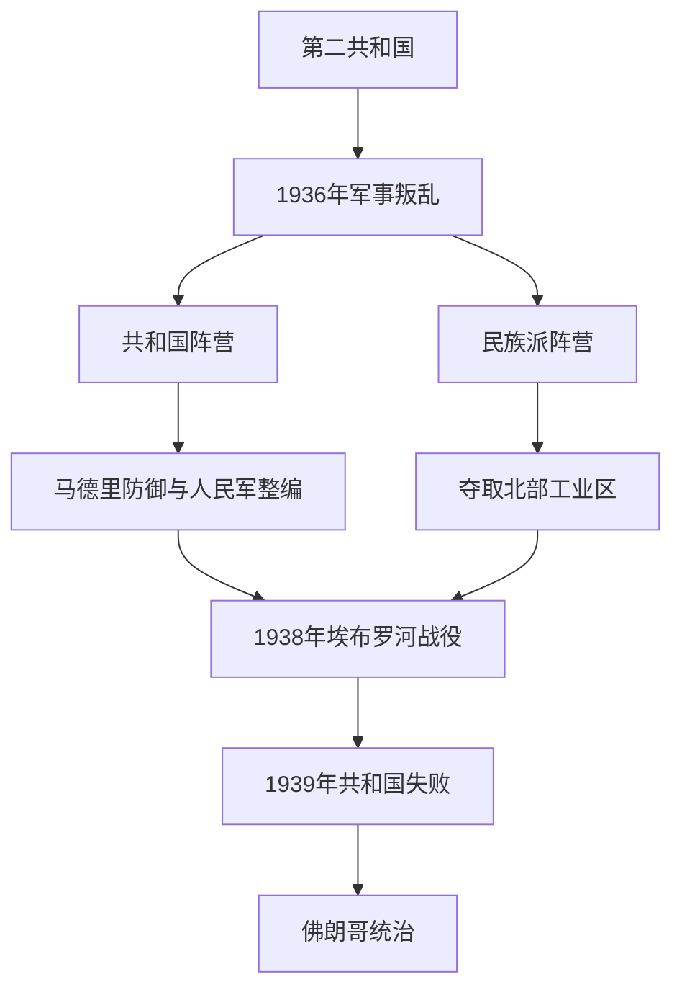

# 西班牙内战

## 时间

1936年—1939年

## 演进图

## 概括

西班牙内战始于1936年7月部分军官反对第二共和国的军事叛乱。政变未能迅速控制全国，国家、军队和地方社会分裂为共和国与民族派两个阵营。战争同时包含国家政权争夺、阶级革命、地区自治、宗教冲突与国际代理战争，但其直接起点是军事叛乱，而非不可避免的“民族性格”。

## 参战与权力结构

| 阵营 | 主要组成 | 实际权力 |
|---|---|---|
| 共和国 | 共和党、社会党、共产党、无政府主义组织、加泰罗尼亚和巴斯克自治力量 | 初期民兵和地方委员会分散；拉尔戈·卡瓦列罗、后内格林政府重建正规军。 |
| 民族派 | 叛军、长枪党、卡洛斯派、保守派、部分天主教组织 | 佛朗哥1936年被推为大元帅和国家元首，逐步统一党军。 |
| 国际援助 | 德国、意大利援助民族派；苏联、国际纵队援助共和国 | 英法主导“不干涉”，实际援助严重不对称。 |

## 战争过程

1. **政变与空运。** 佛朗哥指挥的非洲军团在德意飞机帮助下跨越直布罗陀；马德里、巴塞罗那等地政变失败，形成两区。
2. **马德里防御。** 1936年秋民族派进攻马德里未能得手，战线转为消耗战。
3. **北方战役。** 1937年民族派夺取巴斯克、桑坦德和阿斯图里亚斯工业区；格尔尼卡轰炸成为平民战争象征。
4. **共和国整编。** 共和国把民兵纳入人民军，但1937年巴塞罗那冲突暴露共产党、无政府派和反斯大林左翼分裂。
5. **阿拉贡与地中海。** 1938年民族派突破至地中海，将共和国领土切开；埃布罗河战役耗尽共和国主力。
6. **终局。** 1939年加泰罗尼亚陷落，大批难民进入法国；马德里内部反内格林政变后投降，4月1日佛朗哥宣布胜利。

## 暴力与社会后果

双方均实施处决和政治清洗；民族派暴力更系统地延续到战后国家镇压。战争造成战斗死亡、轰炸、饥荒、监禁和大规模流亡，具体伤亡数字因口径而异。宗教人员在共和国区遭杀害，左翼干部、教师、工会成员和地方民族主义者则在民族派控制区及战后受迫害。

## 民族派胜利原因

非洲军团战斗力、德意持续武器与航空援助、佛朗哥统一指挥和夺取北部工业区是军事优势。共和国受领土分散、武器供应受限、政治路线冲突和民主国家禁运制约。1938年慕尼黑危机表明英法不会出兵，埃布罗失败成为直接军事转折。

## 演变关系

- 前一阶段：[西班牙第二共和国](/%E4%BA%BA%E6%96%87%E7%A7%91%E5%AD%A6/%E5%8E%86%E5%8F%B2/%E6%AC%A7%E6%B4%B2/%E4%BC%8A%E6%AF%94%E5%88%A9%E4%BA%9A%E5%8D%8A%E5%B2%9B/%E8%A5%BF%E7%8F%AD%E7%89%99/%E8%A5%BF%E7%8F%AD%E7%89%99%E7%AC%AC%E4%BA%8C%E5%85%B1%E5%92%8C%E5%9B%BD.md)
- 后一阶段：[佛朗哥统治](/%E4%BA%BA%E6%96%87%E7%A7%91%E5%AD%A6/%E5%8E%86%E5%8F%B2/%E6%AC%A7%E6%B4%B2/%E4%BC%8A%E6%AF%94%E5%88%A9%E4%BA%9A%E5%8D%8A%E5%B2%9B/%E8%A5%BF%E7%8F%AD%E7%89%99/%E4%BD%9B%E6%9C%97%E5%93%A5%E7%BB%9F%E6%B2%BB.md)
- 所属总览：[西班牙](/%E4%BA%BA%E6%96%87%E7%A7%91%E5%AD%A6/%E5%8E%86%E5%8F%B2/%E6%AC%A7%E6%B4%B2/%E4%BC%8A%E6%AF%94%E5%88%A9%E4%BA%9A%E5%8D%8A%E5%B2%9B/%E8%A5%BF%E7%8F%AD%E7%89%99/README.md)
