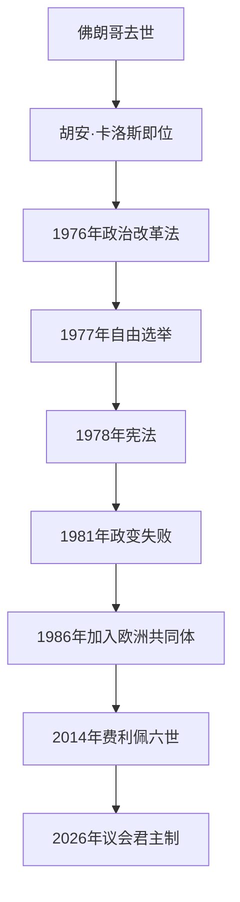

# 西班牙民主转型与现代西班牙

## 时间

1975年至今

## 演进图

## 概括

佛朗哥去世后，胡安·卡洛斯一世与首相阿道弗·苏亚雷斯利用旧体制的法律程序拆除独裁机构，反对党合法化并举行自由选举。1978年宪法确立社会民主法治国家、议会君主制和自治共同体制度。转型依靠谈判与妥协，但也受到政治暴力、军人威胁和对独裁罪责有限追究的制约。

## 国家元首与政府首脑

| 角色 | 人物 | 任期 |
|---|---|---|
| 国王 | 胡安·卡洛斯一世 | 1975—2014 |
| 国王 | **费利佩六世** | 2014年至今（截至2026年7月14日在位） |
| 首相 | 卡洛斯·阿里亚斯·纳瓦罗 | 1975—1976 |
| 首相 | 阿道弗·苏亚雷斯 | 1976—1981 |
| 首相 | 莱奥波尔多·卡尔沃-索特洛 | 1981—1982 |
| 首相 | 费利佩·冈萨雷斯 | 1982—1996 |
| 首相 | 何塞·玛丽亚·阿斯纳尔 | 1996—2004 |
| 首相 | 何塞·路易斯·罗德里格斯·萨帕特罗 | 2004—2011 |
| 首相 | 马里亚诺·拉霍伊 | 2011—2018 |
| 首相 | **佩德罗·桑切斯** | 2018年至今（截至2026年7月14日在任） |

国王是国家元首，按宪法提名首相候选人、公布法律和履行军队最高统帅礼仪；实际行政由获众议院信任的首相和内阁承担。宪法法院审查法律，普通司法独立。17个自治共同体拥有程度不同的立法行政权。

## 转型与巩固过程

- 1976年《政治改革法》经旧议会和公投通过，为解散佛朗哥式机构、普选两院创造合法路径。
- 1977年共产党合法化和首次自由选举，使主要反对力量进入议会；《蒙克洛亚协定》以经济社会妥协稳定转型。
- 1978年宪法在公投中通过，承认民族与地区自治，并保障政党、工会和基本权利。
- 1981年2月23日军人冲入议会，国王公开反对政变，军方干政遭决定性挫败。
- 1982年社会党执政实现和平轮替；1986年加入欧洲共同体，现代化和地方基础设施加速。
- ETA长期恐怖活动造成伤亡，2011年宣布停止武装活动。
- 2008年金融危机、失业与紧缩冲击两党体系，新政党和联合政府出现。
- 2017年加泰罗尼亚单方面独立公投及中央接管暴露自治宪制争议；司法、赦免与政治谈判延续。
- 2014年胡安·卡洛斯退位后，费利佩六世接任；王室合法性更依赖透明与政治中立。

## 成功条件与持续压力

精英谈判、群众民主诉求、欧洲一体化前景、军队逐步专业化和地区自治妥协帮助制度巩固。所谓“遗忘协议”降低即时冲突，却使内战、独裁受害者与万人坑问题长期存在。地区民族主义、住房与青年就业、移民、政党极化和王室声望是现代制度的主要压力。

## 演变关系

- 前一阶段：[佛朗哥统治](/%E4%BA%BA%E6%96%87%E7%A7%91%E5%AD%A6/%E5%8E%86%E5%8F%B2/%E6%AC%A7%E6%B4%B2/%E4%BC%8A%E6%AF%94%E5%88%A9%E4%BA%9A%E5%8D%8A%E5%B2%9B/%E8%A5%BF%E7%8F%AD%E7%89%99/%E4%BD%9B%E6%9C%97%E5%93%A5%E7%BB%9F%E6%B2%BB.md)
- 王朝主线：[西班牙波旁王朝](/%E4%BA%BA%E6%96%87%E7%A7%91%E5%AD%A6/%E5%8E%86%E5%8F%B2/%E6%AC%A7%E6%B4%B2/%E4%BC%8A%E6%AF%94%E5%88%A9%E4%BA%9A%E5%8D%8A%E5%B2%9B/%E8%A5%BF%E7%8F%AD%E7%89%99/%E8%A5%BF%E7%8F%AD%E7%89%99%E6%B3%A2%E6%97%81%E7%8E%8B%E6%9C%9D.md)
- 所属总览：[西班牙](/%E4%BA%BA%E6%96%87%E7%A7%91%E5%AD%A6/%E5%8E%86%E5%8F%B2/%E6%AC%A7%E6%B4%B2/%E4%BC%8A%E6%AF%94%E5%88%A9%E4%BA%9A%E5%8D%8A%E5%B2%9B/%E8%A5%BF%E7%8F%AD%E7%89%99/README.md)
