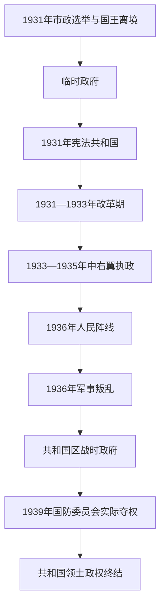

# 西班牙第二共和国

## 时间

1931年—1939年；流亡共和机构此后仍延续，但已无西班牙领土控制

## 概括

1931年市政选举显示城市反君主派胜利，阿方索十三世离境，第二共和国建立。共和国试图同时推进军队、土地、教育、政教关系、劳工和地区自治改革，但经济萧条、既得利益抵抗、革命左派与反共和右派动员使政治极化。1936年部分将领叛乱未能迅速夺权，遂演成三年内战；1939年共和国在国内军事失败，法定政府流亡。

## 政权演进图

## 国家元首完整表

| 顺序 | 国家元首 | 任期 | 产生方式与备注 |
|---:|---|---|---|
| 1 | 尼塞托·阿尔卡拉-萨莫拉 | 1931年4月14日—12月11日 | 临时政府主席，兼具过渡国家代表与政府首脑职能。 |
| 2 | **尼塞托·阿尔卡拉-萨莫拉** | 1931年12月11日—1936年4月7日 | 依宪法由议会选出的共和国总统；因解散议会争议被罢免。 |
| 3 | 迭戈·马丁内斯·巴里奥 | 1936年4月7日—5月11日 | 议会议长依序代理总统。 |
| 4 | **曼努埃尔·阿萨尼亚** | 1936年5月11日—1939年2月27日 | 议会选举；内战末期流亡法国并辞职。 |
| 5 | 迭戈·马丁内斯·巴里奥 | 1939年2月27日起依宪法为潜在代理；1945年8月17日正式宣誓 | 阿萨尼亚辞职后作为议会议长承接继承主张，但直到流亡议会重组才正式宣誓为流亡共和国临时总统；不与西班牙境内政权混列。 |

## 政府首脑完整表

| 顺序 | 政府首脑 | 任期 | 政治阶段 / 备注 |
|---:|---|---|---|
| 1 | 尼塞托·阿尔卡拉-萨莫拉 | 1931年4月14日—10月14日 | 临时政府主席；因宗教条款争议辞职。 |
| 2 | **曼努埃尔·阿萨尼亚** | 1931年10月14日—1933年9月12日 | 改革共和—社会党政府。 |
| 3 | 亚历杭德罗·莱鲁斯 | 1933年9月12日—10月8日 | 第一次组阁，未获稳定多数。 |
| 4 | 迭戈·马丁内斯·巴里奥 | 1933年10月8日—12月16日 | 主持选举的过渡政府。 |
| 5 | 亚历杭德罗·莱鲁斯 | 1933年12月16日—1934年4月28日 | 第二次组阁，中右翼议会支持。 |
| 6 | 里卡多·桑佩尔 | 1934年4月28日—10月4日 | 面对加泰罗尼亚和社会冲突。 |
| 7 | 亚历杭德罗·莱鲁斯 | 1934年10月4日—1935年9月25日 | 第三次组阁；1934年十月起义遭军事镇压，后因腐败丑闻垮台。 |
| 8 | 华金·查帕普列塔 | 1935年9月25日—12月14日 | 财政改革政府。 |
| 9 | 曼努埃尔·波特拉·巴利亚达雷斯 | 1935年12月14日—1936年2月19日 | 总统任命的看守政府，主持1936年选举。 |
| 10 | 曼努埃尔·阿萨尼亚 | 1936年2月19日—5月10日 | 人民阵线胜选后组阁，随后当选总统。 |
| 11 | 奥古斯托·巴尔西亚 | 1936年5月10—13日 | 阿萨尼亚转任总统期间短期代理。 |
| 12 | 圣地亚哥·卡萨雷斯·基罗加 | 1936年5月13日—7月19日 | 未能阻止军人密谋，叛乱爆发后辞职。 |
| 13 | 迭戈·马丁内斯·巴里奥 | 1936年7月19日 | 仅数小时；尝试同叛军将领谈判，未正式稳定执政。 |
| 14 | 何塞·希拉尔 | 1936年7月19日—9月4日 | 向工会和政党发放武器，政变转为内战。 |
| 15 | 弗朗西斯科·拉尔戈·卡瓦列罗 | 1936年9月4日—1937年5月17日 | 广泛左翼联合政府，重建人民军；五月冲突后辞职。 |
| 16 | **胡安·内格林** | 1937年5月17日—1939年3月 | 依总统和共和制度组成的法定政府；主张继续抵抗，领土失败后进入流亡。 |
| 17 | 国防委员会（主席何塞·米亚哈，核心组织者塞希斯蒙多·卡萨多） | 1939年3月5—28日 | 在共和国中央—南部控制区发动反内格林政变并掌握实际权力，试图议和；佛朗哥只接受无条件投降。 |

## 改革、反弹与战争过程

- 1931年宪法确立普选、世俗国家、公民权和地区自治可能；1933年女性首次参加全国议会选举。
- 阿萨尼亚政府缩减军官编制、扩大世俗教育，土地改革试图安置无地农民，但行政资源有限、执行缓慢。
- 加泰罗尼亚1932年取得自治；巴斯克自治在内战中实施。自治是协商制度，不等于共和国主动解体。
- 1932年桑胡尔霍政变失败；1933年选举后中右翼政府暂停或修订部分改革。
- 1934年阿斯图里亚斯工人起义遭军队严厉镇压，加泰罗尼亚政府同中央冲突，双方暴力记忆加深极化。
- 1936年人民阵线以选举获胜，罢工、土地占领、街头暴力和政治暗杀增加，但军事叛乱仍是内战的直接起点。
- 战时共和国同时面对政权保卫与社会革命。政府将民兵编入人民军，地方委员会、无政府派、社会主义者、共产党和地区政府之间权力反复重组。
- 德国、意大利长期援助民族派，苏联与国际纵队援助共和国；英法“不干涉”限制共和国正常采购，国际援助不对称。
- 1939年加泰罗尼亚陷落，阿萨尼亚辞职；卡萨多政变又在共和国区触发内战，马德里于3月底投降。

## 失败原因与长期影响

共和国的改革具有民主与现代化目标，却面对经济危机、地主和教会部分势力抵抗、军官阴谋、无政府主义对议会节奏的不信任和右翼反共和化。制度内部确有失误和暴力，但不能把军人叛乱写成改革的自然结果。军事上，民族派拥有非洲军团、较统一指挥和持续德意援助，逐步夺取北部工业与农业区；共和国领土分散、外援受限、联盟内战略矛盾严重。1939年军事失败直接终结国内政权，数十万人流亡，战后镇压与流亡共和机构又使合法性争论延续到民主转型。

## 演变关系

- 王政背景：[西班牙波旁王朝](/%E4%BA%BA%E6%96%87%E7%A7%91%E5%AD%A6/%E5%8E%86%E5%8F%B2/%E6%AC%A7%E6%B4%B2/%E4%BC%8A%E6%AF%94%E5%88%A9%E4%BA%9A%E5%8D%8A%E5%B2%9B/%E8%A5%BF%E7%8F%AD%E7%89%99/%E8%A5%BF%E7%8F%AD%E7%89%99%E6%B3%A2%E6%97%81%E7%8E%8B%E6%9C%9D.md)。
- 战争专题：[西班牙内战](/%E4%BA%BA%E6%96%87%E7%A7%91%E5%AD%A6/%E5%8E%86%E5%8F%B2/%E6%AC%A7%E6%B4%B2/%E4%BC%8A%E6%AF%94%E5%88%A9%E4%BA%9A%E5%8D%8A%E5%B2%9B/%E8%A5%BF%E7%8F%AD%E7%89%99/%E8%A5%BF%E7%8F%AD%E7%89%99%E5%86%85%E6%88%98.md)。
- 后一政权：[佛朗哥统治](/%E4%BA%BA%E6%96%87%E7%A7%91%E5%AD%A6/%E5%8E%86%E5%8F%B2/%E6%AC%A7%E6%B4%B2/%E4%BC%8A%E6%AF%94%E5%88%A9%E4%BA%9A%E5%8D%8A%E5%B2%9B/%E8%A5%BF%E7%8F%AD%E7%89%99/%E4%BD%9B%E6%9C%97%E5%93%A5%E7%BB%9F%E6%B2%BB.md)。
- 所属总览：[西班牙](/%E4%BA%BA%E6%96%87%E7%A7%91%E5%AD%A6/%E5%8E%86%E5%8F%B2/%E6%AC%A7%E6%B4%B2/%E4%BC%8A%E6%AF%94%E5%88%A9%E4%BA%9A%E5%8D%8A%E5%B2%9B/%E8%A5%BF%E7%8F%AD%E7%89%99/README.md)。
