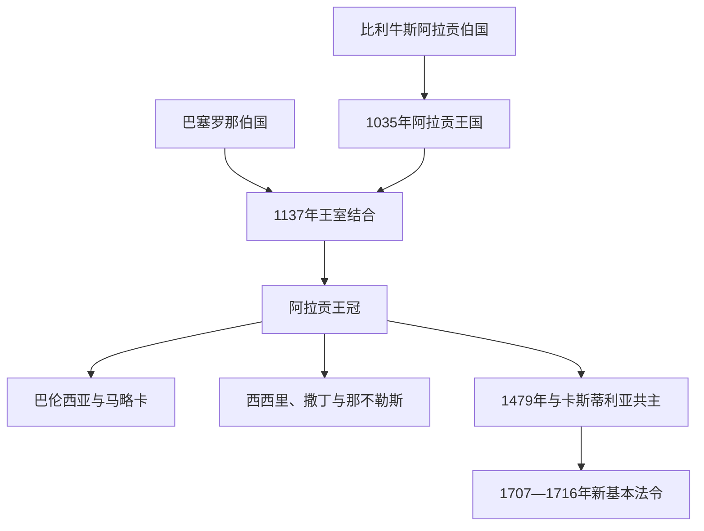

# 阿拉贡王国与阿拉贡王冠

## 时间

1035年—1715年

## 演进图

## 概括

阿拉贡从比利牛斯山地王国扩张至埃布罗河谷，1137年王室婚姻使其与巴塞罗那伯国结合，形成“阿拉贡王冠”。这不是一个制度同质的国家，而是阿拉贡、加泰罗尼亚、巴伦西亚、马略卡及地中海领地各保留法律和议会、共享君主的复合君主国。1479年后与卡斯蒂利亚王朝联合，1707—1716年被《新基本法令》重组。

## 完整君主世系

| 君主 | 在位时间 | 关键事项 |
|---|---|---|
| 拉米罗一世 | 1035—1063 | 阿拉贡首位国王。 |
| 桑乔·拉米雷斯 | 1063—1094 | 兼潘普洛纳王位。 |
| 佩德罗一世 | 1094—1104 | 夺取韦斯卡。 |
| **阿方索一世** | 1104—1134 | 夺取萨拉戈萨；无嗣。 |
| 拉米罗二世 | 1134—1137 | 修士国王；安排女儿婚姻后退居。 |
| 佩特罗妮拉 | 1137—1164 | 拉米罗二世之女，法定女王；1164年让位于子。 |
| 拉蒙·贝伦格尔四世 | 1137—1162 | 佩特罗妮拉之夫，称“阿拉贡亲王”而非国王，实际主持王冠军政并兼巴塞罗那伯爵。 |
| 阿方索二世 | 1164—1196 | 首位兼具阿拉贡王与巴塞罗那伯爵身份者。 |
| 佩德罗二世 | 1196—1213 | 米雷战役阵亡。 |
| **海梅一世** | 1213—1276 | 征服马略卡和巴伦西亚。 |
| 佩德罗三世 | 1276—1285 | 取得西西里。 |
| 阿方索三世 | 1285—1291 | 与贵族“联盟”冲突。 |
| 海梅二世 | 1291—1327 | 扩展撒丁势力。 |
| 阿方索四世 | 1327—1336 | 王冠内部继承安排。 |
| 佩德罗四世 | 1336—1387 | 加强王权，整合马略卡。 |
| 胡安一世 | 1387—1396 | 文化宫廷，财政困难。 |
| 马丁一世 | 1396—1410 | 无合法后嗣，死亡引发继承空位。 |
| 王位空缺与各领地代表协商 | 1410—1412 | 多名王位请求者竞争，由阿拉贡王冠各地代表通过卡斯佩妥协裁决。 |
| 费尔南多一世 | 1412—1416 | 卡斯佩妥协选立，特拉斯塔马拉支系开始。 |
| 阿方索五世 | 1416—1458 | 征服那不勒斯。 |
| 胡安二世 | 1458—1479 | 加泰罗尼亚内战。 |
| **斐迪南二世** | 1479—1516 | 与卡斯蒂利亚伊莎贝拉共治，王朝联合。 |
| 胡安娜 | 1516—1555 | 名义女王。 |
| 卡洛斯一世 | 1516—1556 | 与胡安娜共治至1555。 |
| 腓力二世 | 1556—1598 | 维持各地宪制。 |
| 腓力三世 | 1598—1621 | 王室财政压力增加。 |
| 腓力四世 | 1621—1665 | 1640年加泰罗尼亚反叛。 |
| 卡洛斯二世 | 1665—1700 | 无嗣，引发继承战争。 |
| 腓力五世 | 1700—1707/1716 | 战后废除多数王冠地区旧制度。 |

## 崛起、运作与衰落

地中海商人、城市议会、海军和贵族军役支持扩张；君主必须分别与各地议会协商税收，形成“契约主义”。1282年西西里晚祷后取得西西里，15世纪阿方索五世又控制那不勒斯。复合结构保护地方权利，却使共同财政动员困难。1640年加泰罗尼亚反叛源于战争征兵和中央政策冲突；王位继承战争中阿拉贡诸地多支持奥地利候选人，波旁胜利后以惩罚和中央化法令终结旧制度。

## 演变关系

- 平行王冠：[卡斯蒂利亚王国](/%E4%BA%BA%E6%96%87%E7%A7%91%E5%AD%A6/%E5%8E%86%E5%8F%B2/%E6%AC%A7%E6%B4%B2/%E4%BC%8A%E6%AF%94%E5%88%A9%E4%BA%9A%E5%8D%8A%E5%B2%9B/%E8%A5%BF%E7%8F%AD%E7%89%99/%E5%8D%A1%E6%96%AF%E8%92%82%E5%88%A9%E4%BA%9A%E7%8E%8B%E5%9B%BD.md)
- 后续王朝：[西班牙波旁王朝](/%E4%BA%BA%E6%96%87%E7%A7%91%E5%AD%A6/%E5%8E%86%E5%8F%B2/%E6%AC%A7%E6%B4%B2/%E4%BC%8A%E6%AF%94%E5%88%A9%E4%BA%9A%E5%8D%8A%E5%B2%9B/%E8%A5%BF%E7%8F%AD%E7%89%99/%E8%A5%BF%E7%8F%AD%E7%89%99%E6%B3%A2%E6%97%81%E7%8E%8B%E6%9C%9D.md)
- 所属总览：[西班牙](/%E4%BA%BA%E6%96%87%E7%A7%91%E5%AD%A6/%E5%8E%86%E5%8F%B2/%E6%AC%A7%E6%B4%B2/%E4%BC%8A%E6%AF%94%E5%88%A9%E4%BA%9A%E5%8D%8A%E5%B2%9B/%E8%A5%BF%E7%8F%AD%E7%89%99/README.md)
