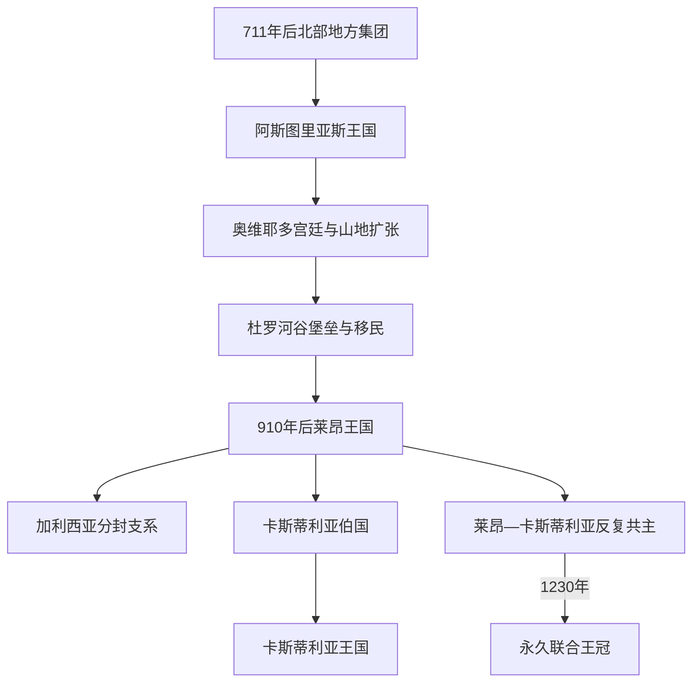

# 阿斯图里亚斯、莱昂与早期基督教王国

## 时间

约718年—1230年

## 概括

倭马亚军队征服西哥特王国后，半岛北部并未立刻出现一个统一的“西班牙复国政权”，而是形成阿斯图里亚斯、潘普洛纳、比利牛斯诸县及后来的莱昂、卡斯蒂利亚、阿拉贡等多个中心。阿斯图里亚斯王权在9—10世纪进入杜罗河流域，910年后政治中心转向莱昂；王室分封又使加利西亚、莱昂、卡斯蒂利亚反复联合和分裂。1230年费尔南多三世同时继承莱昂和卡斯蒂利亚，才形成不再分开的共同王冠。

## 演进图

## 建立背景

711年后倭马亚统治覆盖半岛大部，但坎塔布连山地交通困难、收益有限，地方贵族与社群仍有自主空间。后世编年史把佩拉约和科瓦东加塑造成西哥特国家连续复兴的起点；史实更可能是一个规模有限的地方权力中心逐步扩大。阿斯图里亚斯国王借教会、婚姻、战争和西哥特继承记忆建立合法性，却不能视为托莱多王国制度原封不动的延续。

## 分阶段发展

| 阶段 | 时间 | 政治中心与机制 | 主要转折 |
|---|---|---|---|
| 早期阿斯图里亚斯 | 约718—791年 | 坎塔布连山地贵族和王室亲族联盟，控制范围有限 | 佩拉约、阿方索一世等形成王统；内部废立频繁。 |
| 奥维耶多王权 | 791—866年 | 阿方索二世以奥维耶多为宫廷，发展教会、建筑和法兰克联系 | 圣地亚哥朝圣传统与西哥特合法性叙事增强。 |
| 杜罗河扩张 | 866—910年 | 阿方索三世支持堡垒、修道院和人口进入杜罗河谷 | 王国资源扩大；晚年被儿子迫退并分割领地。 |
| 莱昂与分封 | 910—1037年 | 莱昂处在平原交通与南方边疆中心；加利西亚、阿斯图里亚斯会另立君主 | 科尔多瓦哈里发及曼苏尔远征造成压力；卡斯蒂利亚伯爵日益自主。 |
| 莱昂—卡斯蒂利亚共主 | 1037—1157年 | 婚姻继承和战争使两王冠数度共主 | 费尔南多一世、阿方索六世取得托莱多；乌拉卡时期内战；阿方索七世死后再分。 |
| 最后分立 | 1157—1230年 | 莱昂与卡斯蒂利亚各自向南扩张并彼此竞争 | 阿方索九世取得埃斯特雷马杜拉城市；费尔南多三世通过继承永久联合。 |

逐位在位时间、复位、争议君主和分封支系见[阿斯图里亚斯与莱昂君主世系表](/%E4%BA%BA%E6%96%87%E7%A7%91%E5%AD%A6/%E5%8E%86%E5%8F%B2/%E6%AC%A7%E6%B4%B2/%E4%BC%8A%E6%AF%94%E5%88%A9%E4%BA%9A%E5%8D%8A%E5%B2%9B/%E8%A5%BF%E7%8F%AD%E7%89%99/%E9%98%BF%E6%96%AF%E5%9B%BE%E9%87%8C%E4%BA%9A%E6%96%AF%E4%B8%8E%E8%8E%B1%E6%98%82%E5%90%9B%E4%B8%BB%E4%B8%96%E7%B3%BB%E8%A1%A8.md)。

## 扩张与治理机制

- **山地与堡垒。** 早期统治依托坎塔布连山地防御；进入平原后，城堡、河谷城镇和道路成为边疆控制核心。
- **人口与土地。** 杜罗河谷并非绝对无人区。王室、贵族、修道院和自由农民通过 presura 占地、特许和既有社群重组扩大农业。
- **教会与记忆。** 奥维耶多、莱昂、圣地亚哥等教会中心连接法兰克和罗马；“恢复西哥特秩序”是合法性话语，不等于现代民族国家连续。
- **伯爵与自治市。** 王室需要地方伯爵守边，卡斯蒂利亚因此逐步世袭化；城市 fueros 又以司法、税役和军役优惠吸引人口。
- **贡赋与联盟。** 北部王国会向科尔多瓦称臣，也会收取泰法贡赋；基督教—穆斯林跨境联盟、婚姻和雇佣军并不少见。
- **分封继承。** 国王把领地视为家族权利的一部分，死后分给子女；贵族和教会选择支持者，使“国家边界”反复改变。

## 重要事件

| 时间 | 事件 | 意义 |
|---|---|---|
| 约718/722年 | 科瓦东加 | 佩拉约集团存续的象征，具体规模和日期有争议。 |
| 791—842年 | 阿方索二世统治 | 奥维耶多宫廷、教会网络与朝圣传统发展。 |
| 866—910年 | 阿方索三世扩张 | 杜罗河谷堡垒和移民扩大，编年史强化西哥特继承论。 |
| 910年 | 王国分封 | 莱昂、加利西亚和阿斯图里亚斯分由王子统治，莱昂逐渐成为主中心。 |
| 939年 | 西曼卡斯战役 | 拉米罗二世联盟击败科尔多瓦军，但未终止双方长期攻守。 |
| 977—1002年 | 曼苏尔远征 | 莱昂、圣地亚哥等遭袭，显示科尔多瓦仍具军事优势。 |
| 1037年 | 塔马龙战役 | 贝尔穆多三世战死，费尔南多一世凭妻子权利取得莱昂。 |
| 1065—1072年 | 费尔南多一世分封与兄弟战争 | 卡斯蒂利亚、莱昂、加利西亚重分；阿方索六世最终重新统一。 |
| 1085年 | 托莱多陷落 | 莱昂—卡斯蒂利亚进入塔霍河流域，穆拉比特随后介入。 |
| 1109—1126年 | 乌拉卡内战 | 女王、阿拉贡王夫、贵族和其子集团竞争，暴露王朝联合的脆弱。 |
| 1135年 | 阿方索七世称皇帝 | 象征对半岛诸国的宗主主张，实际权力仍需协商。 |
| 1188年 | 莱昂议会 | 城市代表参与王室会议，是欧洲早期等级会议的重要案例。 |
| 1230年 | 永久联合 | 阿方索九世死后，费尔南多三世与异母姐姐达成继承安排，兼领莱昂。 |

## 崛起、分裂与联合原因

早期存续依靠山地、防御成本低、地方贵族和教会网络；安达卢斯内部叛乱又为向南推进提供机会。10世纪科尔多瓦军事优势和地方伯爵坐大限制中央。11世纪泰法分裂、贡赋收入与托莱多征服使莱昂—卡斯蒂利亚资源跃升，但王室分封、短寿君主和贵族选择仍造成分裂。1230年联合的结构基础是共同家族、相邻扩张利益和卡斯蒂利亚更大资源，直接触发则是阿方索九世死亡及继承协议；这不是一次征服灭亡。

## 演变关系

- 前一共同背景：[安达卢斯与穆斯林统治](/%E4%BA%BA%E6%96%87%E7%A7%91%E5%AD%A6/%E5%8E%86%E5%8F%B2/%E6%AC%A7%E6%B4%B2/%E4%BC%8A%E6%AF%94%E5%88%A9%E4%BA%9A%E5%8D%8A%E5%B2%9B/%E5%AE%89%E8%BE%BE%E5%8D%A2%E6%96%AF%E4%B8%8E%E7%A9%86%E6%96%AF%E6%9E%97%E7%BB%9F%E6%B2%BB.md)。
- 后一阶段：[卡斯蒂利亚王国](/%E4%BA%BA%E6%96%87%E7%A7%91%E5%AD%A6/%E5%8E%86%E5%8F%B2/%E6%AC%A7%E6%B4%B2/%E4%BC%8A%E6%AF%94%E5%88%A9%E4%BA%9A%E5%8D%8A%E5%B2%9B/%E8%A5%BF%E7%8F%AD%E7%89%99/%E5%8D%A1%E6%96%AF%E8%92%82%E5%88%A9%E4%BA%9A%E7%8E%8B%E5%9B%BD.md)。
- 平行王国：[纳瓦拉王国](/%E4%BA%BA%E6%96%87%E7%A7%91%E5%AD%A6/%E5%8E%86%E5%8F%B2/%E6%AC%A7%E6%B4%B2/%E4%BC%8A%E6%AF%94%E5%88%A9%E4%BA%9A%E5%8D%8A%E5%B2%9B/%E8%A5%BF%E7%8F%AD%E7%89%99/%E7%BA%B3%E7%93%A6%E6%8B%89%E7%8E%8B%E5%9B%BD.md)、[阿拉贡王国与阿拉贡王冠](/%E4%BA%BA%E6%96%87%E7%A7%91%E5%AD%A6/%E5%8E%86%E5%8F%B2/%E6%AC%A7%E6%B4%B2/%E4%BC%8A%E6%AF%94%E5%88%A9%E4%BA%9A%E5%8D%8A%E5%B2%9B/%E8%A5%BF%E7%8F%AD%E7%89%99/%E9%98%BF%E6%8B%89%E8%B4%A1%E7%8E%8B%E5%9B%BD%E4%B8%8E%E9%98%BF%E6%8B%89%E8%B4%A1%E7%8E%8B%E5%86%A0.md)。
- 半岛共同主线：[基督教诸国与收复失地运动](/%E4%BA%BA%E6%96%87%E7%A7%91%E5%AD%A6/%E5%8E%86%E5%8F%B2/%E6%AC%A7%E6%B4%B2/%E4%BC%8A%E6%AF%94%E5%88%A9%E4%BA%9A%E5%8D%8A%E5%B2%9B/%E5%9F%BA%E7%9D%A3%E6%95%99%E8%AF%B8%E5%9B%BD%E4%B8%8E%E6%94%B6%E5%A4%8D%E5%A4%B1%E5%9C%B0%E8%BF%90%E5%8A%A8.md)。
- 所属总览：[西班牙](/%E4%BA%BA%E6%96%87%E7%A7%91%E5%AD%A6/%E5%8E%86%E5%8F%B2/%E6%AC%A7%E6%B4%B2/%E4%BC%8A%E6%AF%94%E5%88%A9%E4%BA%9A%E5%8D%8A%E5%B2%9B/%E8%A5%BF%E7%8F%AD%E7%89%99/README.md)。
