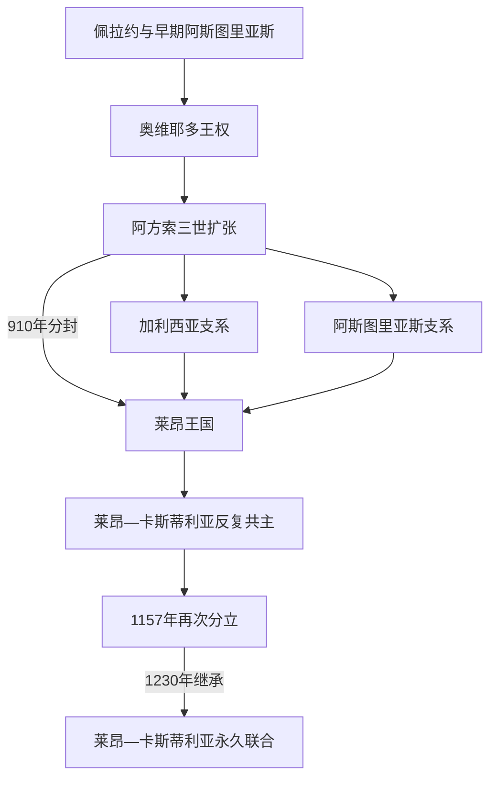

# 阿斯图里亚斯与莱昂君主世系表

## 时间

约718年—1230年

## 范围与说明

本表按阿斯图里亚斯王国—莱昂王国的主要王统逐位列出，并另列910年、925年和1065年分封时的加利西亚、阿斯图里亚斯与卡斯蒂利亚并立君主。早期年代主要来自后世编年史，科瓦东加和首批统治者的确切年份有争议；表中以“约”标注。1230年费尔南多三世继承莱昂后，莱昂与卡斯蒂利亚王冠不再分离，后续见[卡斯蒂利亚王国](/%E4%BA%BA%E6%96%87%E7%A7%91%E5%AD%A6/%E5%8E%86%E5%8F%B2/%E6%AC%A7%E6%B4%B2/%E4%BC%8A%E6%AF%94%E5%88%A9%E4%BA%9A%E5%8D%8A%E5%B2%9B/%E8%A5%BF%E7%8F%AD%E7%89%99/%E5%8D%A1%E6%96%AF%E8%92%82%E5%88%A9%E4%BA%9A%E7%8E%8B%E5%9B%BD.md)。

## 世系演进图

## 阿斯图里亚斯王国

| 顺序 | 君主 | 在位 | 生卒 | 与前任关系 | 关键事件 / 备注 |
|---:|---|---|---|---|---|
| 1 | **佩拉约** | 约718—737年 | 不详—737年 | 地方贵族领袖，非西哥特王位的无争议直系继承 | 科瓦东加传统的核心人物；建国年代和统治范围有争议。 |
| 2 | 法维拉 | 737—739年 | 不详—739年 | 佩拉约之子 | 在位短，据传狩猎时死亡。 |
| 3 | **阿方索一世** | 739—757年 | 约693—757年 | 佩拉约女婿、坎塔布里亚公爵之子 | 扩展坎塔布连山地控制，后世称“天主教徒”。 |
| 4 | 弗鲁埃拉一世 | 757—768年 | 约722—768年 | 阿方索一世之子 | 平定地方叛乱，后被贵族杀害。 |
| 5 | 奥雷利奥 | 768—774年 | 约740—774年 | 阿方索一世侄辈 | 贵族拥立；统治细节少。 |
| 6 | 西罗 | 774—783年 | 不详—783年 | 阿方索一世女婿 | 宫廷一度在普拉维亚；镇压加利西亚反抗。 |
| 7 | 毛雷加托 | 783—789年 | 不详—789年 | 阿方索一世私生子 | 排挤阿方索二世即位；后世贡女传说缺乏可靠依据。 |
| 8 | 贝尔穆多一世 | 789—791年 | 约750—797年 | 奥雷利奥之弟 | 军事失败后退位，成为修士。 |
| 9 | **阿方索二世** | 791—842年 | 约760—842年 | 弗鲁埃拉一世之子 | 以奥维耶多为中心，联络加洛林世界；圣地亚哥朝圣传统形成。 |
| 10 | 拉米罗一世 | 842—850年 | 约790—850年 | 贝尔穆多一世之子 | 在继承争夺中胜出；拉米罗建筑风格著名。 |
| 11 | 奥多尼奥一世 | 850—866年 | 约821—866年 | 拉米罗一世之子 | 向杜罗河谷扩张并重建城镇。 |
| 12 | **阿方索三世** | 866—910年 | 约848—910年 | 奥多尼奥一世之子 | 版图扩至杜罗河，编年史强化西哥特继承叙事；晚年被儿子们迫退。 |

## 莱昂主要王统

| 顺序 | 君主 | 在位 | 生卒 | 与前任关系 | 关键事件 / 备注 |
|---:|---|---|---|---|---|
| 1 | 加西亚一世 | 910—914年 | 约871—914年 | 阿方索三世长子 | 910年分得莱昂，王权中心正式南移。 |
| 2 | 奥多尼奥二世 | 914—924年 | 约873—924年 | 加西亚之弟；此前统治加利西亚 | 联合父系领地，继续对科尔多瓦作战。 |
| 3 | 弗鲁埃拉二世 | 924—925年 | 约875—925年 | 奥多尼奥之弟；此前统治阿斯图里亚斯 | 短暂重新统一三地。 |
| 4 | 阿方索·弗鲁埃拉斯 | 925年 | 约910—932年后 | 弗鲁埃拉二世之子 | 短暂继位，后被堂兄弟推翻；是否计入正式莱昂王表有争议。 |
| 5 | 阿方索四世 | 925—931年 | 约890—933年 | 奥多尼奥二世之子 | 退位为修士后试图复位，被拉米罗二世囚禁。 |
| 6 | **拉米罗二世** | 931—951年 | 约900—951年 | 阿方索四世之弟 | 939年西曼卡斯战役获胜，加强杜罗边疆。 |
| 7 | 奥多尼奥三世 | 951—956年 | 约926—956年 | 拉米罗二世之子 | 贵族与家族冲突持续。 |
| 8 | 桑乔一世 | 956—958年 | 约932—966年 | 奥多尼奥三世异母弟 | 第一次在位，被贵族废黜。 |
| 9 | 奥多尼奥四世 | 958—960年 | 约926—962年 | 阿方索四世之子 | 受卡斯蒂利亚集团支持即位，后失势投奔科尔多瓦。 |
| 10 | 桑乔一世 | 960—966年 | 约932—966年 | 复位 | 借科尔多瓦医疗和军援复位，后被毒杀。 |
| 11 | 拉米罗三世 | 966—984年 | 约961—985年 | 桑乔一世之子 | 幼年由姑母埃尔维拉摄政；在贵族反叛中被贝尔穆多二世取代。 |
| 12 | 贝尔穆多二世 | 984—999年 | 约953—999年 | 奥多尼奥三世之子 | 先在加利西亚称王；面对曼苏尔远征，莱昂一度被毁。 |
| 13 | 阿方索五世 | 999—1028年 | 约994—1028年 | 贝尔穆多二世之子 | 幼年摄政；重建莱昂并颁布1020年法令。 |
| 14 | 贝尔穆多三世 | 1028—1037年 | 约1017—1037年 | 阿方索五世之子 | 与卡斯蒂利亚费尔南多作战，在塔马龙战死，无嗣。 |
| 15 | **费尔南多一世** | 1037—1065年 | 约1015—1065年 | 贝尔穆多三世姐夫，凭妻桑查的莱昂权利即位 | 兼领莱昂和卡斯蒂利亚，死后再分封子女。 |
| 16 | **阿方索六世** | 1065—1072年 | 约1040—1109年 | 费尔南多一世之子，分得莱昂 | 被兄桑乔二世击败流亡。 |
| 17 | 桑乔二世 | 1072年 | 约1036—1072年 | 阿方索六世之兄、卡斯蒂利亚王 | 短暂夺取莱昂；围萨莫拉时被杀，其合法性有争议。 |
| 18 | 阿方索六世 | 1072—1109年 | 约1040—1109年 | 复位 | 兼并卡斯蒂利亚，1085年夺取托莱多；面对穆拉比特反攻。 |
| 19 | **乌拉卡** | 1109—1126年 | 约1081—1126年 | 阿方索六世之女 | 与阿拉贡阿方索一世的婚姻和贵族内战使共治权利高度争议。 |
| 20 | **阿方索七世** | 1126—1157年 | 1105—1157年 | 乌拉卡之子 | 1135年称“全西班牙皇帝”；死后莱昂与卡斯蒂利亚再分。 |
| 21 | 费尔南多二世 | 1157—1188年 | 1137—1188年 | 阿方索七世之子，分得莱昂 | 与葡萄牙、卡斯蒂利亚及穆瓦希德反复战争；发展城市特许。 |
| 22 | **阿方索九世** | 1188—1230年 | 1171—1230年 | 费尔南多二世之子 | 1188年莱昂议会著名；夺取卡塞雷斯、梅里达和巴达霍斯。 |
| 23 | 费尔南多三世 | 1230年起兼莱昂 | 1199/1201—1252年 | 阿方索九世之子，已为卡斯蒂利亚王 | 在母亲贝伦加利亚和两位异母姐姐协议下继承，完成永久联合。 |

## 并立支系与争议继承

| 地区 / 君主 | 在位 | 形成与结局 |
|---|---|---|
| 弗鲁埃拉二世，阿斯图里亚斯王 | 910—924年 | 阿方索三世分封给第三子；924年继承莱昂后重新统一。 |
| 奥多尼奥二世，加利西亚王 | 910—914年 | 阿方索三世分封给次子；继承莱昂后两地合一。 |
| 桑乔·奥多涅斯，加利西亚王 | 926—929年 | 奥多尼奥二世之子，在兄弟分割中取得加利西亚；死后并回莱昂。 |
| 加西亚二世，加利西亚王 | 1065—1071年、1072—1073年 | 费尔南多一世幼子；先被兄弟推翻，短暂复位后被阿方索六世囚禁。其领地含后来的葡萄牙伯国。 |
| 桑乔二世，卡斯蒂利亚王 | 1065—1072年；1072年短控莱昂 | 费尔南多一世长子；通过战争夺取兄弟领地，死后阿方索六世复位。 |
| 桑查、杜尔塞，莱昂继承权人 | 1230年 | 阿方索九世与前妻特蕾莎之女；《本纳文特协议》后放弃权利，换取收入，费尔南多三世继位。 |

## 继承制度与分合原因

王位并非严格长子继承：国王可能把领地分给子女，贵族和教会也会在候选人间选边，婚姻权利、私生身份、废立和军事占领常同时存在。10世纪的科尔多瓦压力、地方伯爵权力和短寿君主造成频繁更替；11—12世纪对托莱多与南方河谷的扩张又需要更大资源。1230年的永久联合不是莱昂被卡斯蒂利亚一次性“吞并”，而是同一继承人取得两顶王冠，随后共同君主、宫廷和外交逐渐整合，莱昂法律身份仍长期存在。

## 相关笔记

- 历史过程：[阿斯图里亚斯、莱昂与早期基督教王国](/%E4%BA%BA%E6%96%87%E7%A7%91%E5%AD%A6/%E5%8E%86%E5%8F%B2/%E6%AC%A7%E6%B4%B2/%E4%BC%8A%E6%AF%94%E5%88%A9%E4%BA%9A%E5%8D%8A%E5%B2%9B/%E8%A5%BF%E7%8F%AD%E7%89%99/%E9%98%BF%E6%96%AF%E5%9B%BE%E9%87%8C%E4%BA%9A%E6%96%AF%E3%80%81%E8%8E%B1%E6%98%82%E4%B8%8E%E6%97%A9%E6%9C%9F%E5%9F%BA%E7%9D%A3%E6%95%99%E7%8E%8B%E5%9B%BD.md)。
- 后续王统：[卡斯蒂利亚王国](/%E4%BA%BA%E6%96%87%E7%A7%91%E5%AD%A6/%E5%8E%86%E5%8F%B2/%E6%AC%A7%E6%B4%B2/%E4%BC%8A%E6%AF%94%E5%88%A9%E4%BA%9A%E5%8D%8A%E5%B2%9B/%E8%A5%BF%E7%8F%AD%E7%89%99/%E5%8D%A1%E6%96%AF%E8%92%82%E5%88%A9%E4%BA%9A%E7%8E%8B%E5%9B%BD.md)。
- 平行半岛主线：[基督教诸国与收复失地运动](/%E4%BA%BA%E6%96%87%E7%A7%91%E5%AD%A6/%E5%8E%86%E5%8F%B2/%E6%AC%A7%E6%B4%B2/%E4%BC%8A%E6%AF%94%E5%88%A9%E4%BA%9A%E5%8D%8A%E5%B2%9B/%E5%9F%BA%E7%9D%A3%E6%95%99%E8%AF%B8%E5%9B%BD%E4%B8%8E%E6%94%B6%E5%A4%8D%E5%A4%B1%E5%9C%B0%E8%BF%90%E5%8A%A8.md)。
- 西班牙总览：[西班牙](/%E4%BA%BA%E6%96%87%E7%A7%91%E5%AD%A6/%E5%8E%86%E5%8F%B2/%E6%AC%A7%E6%B4%B2/%E4%BC%8A%E6%AF%94%E5%88%A9%E4%BA%9A%E5%8D%8A%E5%B2%9B/%E8%A5%BF%E7%8F%AD%E7%89%99/README.md)。
