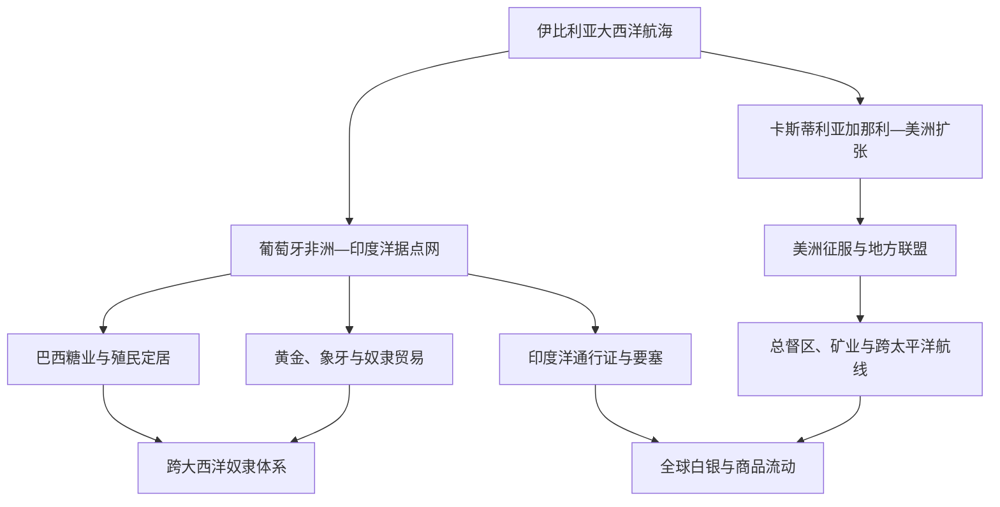

# 西葡帝国与大航海

## 时间

15世纪初—20世纪；本页重点为15—18世纪的形成与转型

## 概括

葡萄牙和卡斯蒂利亚—西班牙率先把大西洋航行、火炮舰船、王室特许、商人信贷和征服战争结合为跨洲帝国。葡萄牙早期更依赖港口、要塞、航线和贸易垄断，西班牙则在美洲形成大片领土、城市、矿区和总督辖区；两者都同时使用谈判、地方盟友、传教、强制劳动、奴隶贸易与军事暴力。所谓“大航海时代”不仅是欧洲探索史，也是非洲、美洲和亚洲社会被连接、征服、迁徙与重组的历史。

## 演进图

## 为什么由伊比利亚王国率先展开

- 半岛战争结束和贵族军事文化促使王权寻找北非与海外出口，但宗教动机始终与利润、税收和王朝竞争相连。
- 葡萄牙面向大西洋、拥有渔业和商贸航海传统；卡斯蒂利亚控制安达卢西亚港口和加那利群岛，为西航提供基地。
- 地中海制图、伊斯兰与犹太天文数学、伊比利亚造船、意大利金融和大西洋水手知识共同构成技术网络，不是某一王子或民族的单独发明。
- 王室通过特许、垄断、关税和国家暴力分担高风险航行；私人商人、外国银行家、地方盟友和殖民者同样不可或缺。
- 奥斯曼扩张并未“切断全部东方贸易”；寻找黄金、奴隶、香料和更有利的直达贸易利润才是持续动力。

## 葡萄牙扩张过程

| 阶段 | 时间 | 过程 | 统治与后果 |
|---|---|---|---|
| 北非与大西洋岛屿 | 1415—15世纪中叶 | 夺取休达；马德拉、亚速尔被殖民，沿非洲西岸逐段航行 | 岛屿糖业形成种植园—奴隶劳动实验；北非据点耗费大。 |
| 西非贸易 | 1440年代—1488年 | 建立阿尔金、埃尔米纳等贸易堡垒，绕过博哈多尔角至好望角 | 黄金、象牙、胡椒和被奴役人口进入王室特许贸易；非洲国家主动谈判也会抵抗。 |
| 印度洋据点网 | 1498—16世纪中叶 | 达伽马抵印度；夺取果阿、马六甲、霍尔木兹，在东非、印度与东南亚设站 | 以舰炮、海上通行证和港口联盟争夺贸易，无法全面征服广阔内陆。 |
| 巴西殖民 | 1500—18世纪 | 由巴西木贸易转为糖业、黄金和定居扩张 | 原住民遭疾病、战争、奴役和土地侵占；非洲奴隶成为主要劳动来源。 |
| 竞争与重心转移 | 17—18世纪 | 荷兰、英国、阿曼等夺取多个据点；葡萄牙保住巴西、安哥拉、莫桑比克、果阿、澳门等 | 亚洲垄断衰落，巴西资源成为帝国财政核心；与英国联盟和贸易依赖加深。 |

## 西班牙扩张过程

| 阶段 | 时间 | 过程 | 统治与后果 |
|---|---|---|---|
| 加那利与最初西航 | 15世纪—1492年 | 加那利征服成为大西洋殖民基地；哥伦布航行抵达加勒比 | 对关切人战争、奴役和传染病预示后续殖民模式。 |
| 加勒比殖民 | 1493—1520年代 | 伊斯帕尼奥拉、古巴等建立殖民城市和 encomienda | 原住民人口因疾病、暴力和强迫劳动锐减；非洲奴隶贸易扩大。 |
| 大陆征服 | 1519—1530年代 | 科尔特斯、皮萨罗等借助特拉斯卡拉及安第斯地方盟友、王朝内战和疫病击败阿兹特克、印加核心 | 少量西班牙人并非独力征服；地方同盟、翻译者和原住民军队决定胜负。 |
| 总督区与矿业 | 16—18世纪 | 新西班牙、秘鲁及后续总督区建立；波托西、萨卡特卡斯白银进入全球 | 王室法院、教会、城市议会和地方精英共治；米塔等强制劳动和土地重组造成深刻伤害。 |
| 太平洋与全球贸易 | 1565年后 | 马尼拉—阿卡普尔科航线把美洲白银、亚洲商品和欧洲市场连接 | 菲律宾殖民依靠墨西哥财政、传教与地方联盟；全球贸易并非只以欧洲为中心。 |
| 改革与独立 | 18—19世纪初 | 波旁改革提高税收、军队和半岛官员控制 | 殖民精英冲突、战争与革命促成美洲独立，古巴、波多黎各和菲律宾至1898年才失去。 |

## 划界、机构与实际权力

1494年《托德西利亚斯条约》把非欧洲世界按一条想象经线分给葡萄牙与卡斯蒂利亚，后来又以1529年《萨拉戈萨条约》处理亚洲争议。条约只约束签约王权，法国、英国、荷兰及当地国家并不承认；巴西实际边界也由探险、传教、奴隶捕捉和战争逐步突破。

| 层次 | 葡萄牙 | 西班牙 | 共同特征 |
|---|---|---|---|
| 王室机关 | 印度院、海外委员会、总督与据点长官 | 西印度委员会、塞维利亚贸易院、总督、审判院 | 法令与垄断从本土发出，距离使地方官员拥有广泛裁量。 |
| 地方合作者 | 非洲与亚洲商人、港口政权、混血家族、传教网络 | 原住民贵族、盟军、城市议会、教会、克里奥尔精英 | 帝国依靠中介统治，不是欧洲官僚单向控制。 |
| 劳动与税 | 奴隶贸易、种植园、港口税与王室垄断 | encomienda、贡赋、米塔、庄园、矿业税 | 强制劳动与法律保护并存，实际执行高度不平等。 |
| 军事 | 舰炮、堡垒、小规模驻军和海上通行证 | 征服军、民兵、要塞与地方盟军 | 暴力能力受补给、疾病、地方联盟和竞争帝国限制。 |

## 关键事件

- 1415年葡萄牙夺取休达，海外扩张由试探转为长期国家事业。
- 1488年迪亚士绕过好望角；1498年达伽马抵达印度洋贸易世界。
- 1492年哥伦布横渡大西洋；1494年葡西签订《托德西利亚斯条约》。
- 1500年卡布拉尔船队抵巴西，随后建立长期殖民。
- 1510—1511年葡萄牙夺取果阿、马六甲，尝试控制印度洋节点。
- 1519—1530年代西班牙借地方联盟与疫病冲击征服墨西哥和安第斯帝国核心。
- 1545年后波托西白银大规模开采，连接美洲、欧洲和亚洲市场。
- 1565年马尼拉—阿卡普尔科航线形成跨太平洋定期贸易。
- 1580—1640年伊比利亚联盟使两帝国共享君主，也使葡萄牙据点暴露于西班牙敌国。
- 17世纪荷兰夺取马六甲、锡兰和巴西部分地区；葡萄牙收复巴西东北却失去多处亚洲据点。
- 18世纪波旁与庞巴尔改革试图提高殖民财政和行政效率，也增加地方冲突。
- 1807年葡萄牙宫廷迁往里约；1822年巴西独立。1808年后西班牙美洲战争则逐步摧毁大陆帝国。

## 帝国崛起与相对衰退

早期优势来自先发航线、火炮舰船、王室信贷、港口基地和对地方矛盾的利用。帝国财富却从未均匀进入本土社会：军费、债务、进口和精英特权会吸收收入。葡萄牙人口财政有限，难以守卫分散据点；西班牙则把美洲白银投入欧洲王朝战争，并受通胀与债务制约。

相对衰退不是一场舰队失败或“民族懒惰”造成。荷兰、英国和法国更大规模的金融海军动员，亚洲国家反攻，殖民地经济重心变化，本土战争和地方精英自主共同削弱垄断。即使政治帝国收缩，葡萄牙语、西班牙语、天主教、混合社会、种植园经济、种族等级和边界争议仍形成长期遗产。

## 人的代价与历史评价

跨洋联系带来作物、动物、技术、语言和知识流动，也造成美洲原住民人口灾难、非洲人口被强迫迁徙、生态改造与殖民等级。传教士既参与文化压制，也有人记录语言、批判虐待；法律保护与殖民现实之间长期存在落差。航海者和征服者的个人行动应放回船员、领航员、翻译者、非洲与原住民盟友、被奴役劳动者及全球商人共同构成的网络中，不能只写成少数“英雄发现世界”。

## 演变关系

- 葡萄牙王朝与航海细节：[阿维斯王朝与大航海](/%E4%BA%BA%E6%96%87%E7%A7%91%E5%AD%A6/%E5%8E%86%E5%8F%B2/%E6%AC%A7%E6%B4%B2/%E4%BC%8A%E6%AF%94%E5%88%A9%E4%BA%9A%E5%8D%8A%E5%B2%9B/%E8%91%A1%E8%90%84%E7%89%99/%E9%98%BF%E7%BB%B4%E6%96%AF%E7%8E%8B%E6%9C%9D%E4%B8%8E%E5%A4%A7%E8%88%AA%E6%B5%B7.md)。
- 西班牙王权形成：[天主教双王与西班牙形成](/%E4%BA%BA%E6%96%87%E7%A7%91%E5%AD%A6/%E5%8E%86%E5%8F%B2/%E6%AC%A7%E6%B4%B2/%E4%BC%8A%E6%AF%94%E5%88%A9%E4%BA%9A%E5%8D%8A%E5%B2%9B/%E5%A4%A9%E4%B8%BB%E6%95%99%E5%8F%8C%E7%8E%8B%E4%B8%8E%E8%A5%BF%E7%8F%AD%E7%89%99%E5%BD%A2%E6%88%90.md)、[西班牙哈布斯堡王朝](/%E4%BA%BA%E6%96%87%E7%A7%91%E5%AD%A6/%E5%8E%86%E5%8F%B2/%E6%AC%A7%E6%B4%B2/%E4%BC%8A%E6%AF%94%E5%88%A9%E4%BA%9A%E5%8D%8A%E5%B2%9B/%E8%A5%BF%E7%8F%AD%E7%89%99/%E8%A5%BF%E7%8F%AD%E7%89%99%E5%93%88%E5%B8%83%E6%96%AF%E5%A0%A1%E7%8E%8B%E6%9C%9D.md)。
- 共主阶段：[伊比利亚联盟](/%E4%BA%BA%E6%96%87%E7%A7%91%E5%AD%A6/%E5%8E%86%E5%8F%B2/%E6%AC%A7%E6%B4%B2/%E4%BC%8A%E6%AF%94%E5%88%A9%E4%BA%9A%E5%8D%8A%E5%B2%9B/%E4%BC%8A%E6%AF%94%E5%88%A9%E4%BA%9A%E8%81%94%E7%9B%9F.md)。
- 半岛总览：[伊比利亚半岛](/%E4%BA%BA%E6%96%87%E7%A7%91%E5%AD%A6/%E5%8E%86%E5%8F%B2/%E6%AC%A7%E6%B4%B2/%E4%BC%8A%E6%AF%94%E5%88%A9%E4%BA%9A%E5%8D%8A%E5%B2%9B/README.md)。
