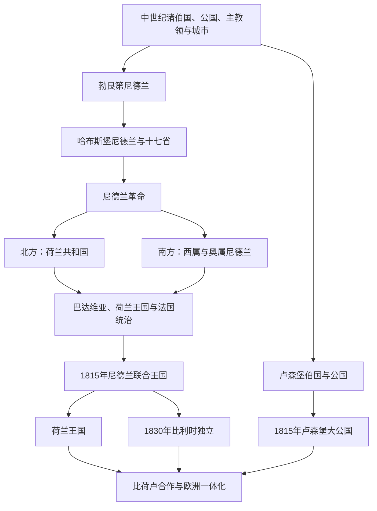

# 低地国家历史

[返回欧洲历史](/%E4%BA%BA%E6%96%87%E7%A7%91%E5%AD%A6/%E5%8E%86%E5%8F%B2/%E6%AC%A7%E6%B4%B2/README.md)

## 范围与概括

低地国家位于莱茵河、马斯河和斯海尔德河下游及北海沿岸，历史上包括众多伯国、公国、主教领和城市。勃艮第公国、哈布斯堡统治、尼德兰革命、海上贸易、工业化和欧洲一体化共同塑造荷兰、比利时与卢森堡。现代三国的形成不能倒推为中世纪以来固定不变的边界。

## 演进图

## 历史主线

低地国家的共同历史不是三部现代国史的简单相加，而是“河口城市与复合领地—勃艮第和哈布斯堡整合—尼德兰革命与南北分化—法国重组—1815 年再统一—1830 年后形成三国—战后区域与欧洲合作”的连续过程。具体世系、政府、战争、殖民和联邦结构分别在国家笔记中维护。

## 历史阶段导航

| 顺序 | 时段 | 区域主线 | 进入细节 |
|---:|---|---|---|
| 1 | 中世纪—14 世纪 | 佛兰德、荷兰、布拉班特、列日、卢森堡等伯国、公国、主教领与城市并立 | [荷兰](/%E4%BA%BA%E6%96%87%E7%A7%91%E5%AD%A6/%E5%8E%86%E5%8F%B2/%E6%AC%A7%E6%B4%B2/%E4%BD%8E%E5%9C%B0%E5%9B%BD%E5%AE%B6/%E8%8D%B7%E5%85%B0.md)、[比利时](/%E4%BA%BA%E6%96%87%E7%A7%91%E5%AD%A6/%E5%8E%86%E5%8F%B2/%E6%AC%A7%E6%B4%B2/%E4%BD%8E%E5%9C%B0%E5%9B%BD%E5%AE%B6/%E6%AF%94%E5%88%A9%E6%97%B6.md)、[卢森堡](/%E4%BA%BA%E6%96%87%E7%A7%91%E5%AD%A6/%E5%8E%86%E5%8F%B2/%E6%AC%A7%E6%B4%B2/%E4%BD%8E%E5%9C%B0%E5%9B%BD%E5%AE%B6/%E5%8D%A2%E6%A3%AE%E5%A0%A1.md) |
| 2 | 1384—1477 年 | 勃艮第公爵以婚姻、继承和战争汇集低地领地，中央机构与省份特权并存 | [荷兰](/%E4%BA%BA%E6%96%87%E7%A7%91%E5%AD%A6/%E5%8E%86%E5%8F%B2/%E6%AC%A7%E6%B4%B2/%E4%BD%8E%E5%9C%B0%E5%9B%BD%E5%AE%B6/%E8%8D%B7%E5%85%B0.md)、[比利时](/%E4%BA%BA%E6%96%87%E7%A7%91%E5%AD%A6/%E5%8E%86%E5%8F%B2/%E6%AC%A7%E6%B4%B2/%E4%BD%8E%E5%9C%B0%E5%9B%BD%E5%AE%B6/%E6%AF%94%E5%88%A9%E6%97%B6.md) |
| 3 | 1477—1566 年 | 勃艮第遗产转入哈布斯堡，查理五世整合十七省 | [荷兰](/%E4%BA%BA%E6%96%87%E7%A7%91%E5%AD%A6/%E5%8E%86%E5%8F%B2/%E6%AC%A7%E6%B4%B2/%E4%BD%8E%E5%9C%B0%E5%9B%BD%E5%AE%B6/%E8%8D%B7%E5%85%B0.md)、[比利时](/%E4%BA%BA%E6%96%87%E7%A7%91%E5%AD%A6/%E5%8E%86%E5%8F%B2/%E6%AC%A7%E6%B4%B2/%E4%BD%8E%E5%9C%B0%E5%9B%BD%E5%AE%B6/%E6%AF%94%E5%88%A9%E6%97%B6.md)、[卢森堡](/%E4%BA%BA%E6%96%87%E7%A7%91%E5%AD%A6/%E5%8E%86%E5%8F%B2/%E6%AC%A7%E6%B4%B2/%E4%BD%8E%E5%9C%B0%E5%9B%BD%E5%AE%B6/%E5%8D%A2%E6%A3%AE%E5%A0%A1.md) |
| 4 | 1566—1648 年 | 宗教、税收和省份特权冲突引发尼德兰革命，北方共和国与南尼德兰分化 | [荷兰](/%E4%BA%BA%E6%96%87%E7%A7%91%E5%AD%A6/%E5%8E%86%E5%8F%B2/%E6%AC%A7%E6%B4%B2/%E4%BD%8E%E5%9C%B0%E5%9B%BD%E5%AE%B6/%E8%8D%B7%E5%85%B0.md)、[比利时](/%E4%BA%BA%E6%96%87%E7%A7%91%E5%AD%A6/%E5%8E%86%E5%8F%B2/%E6%AC%A7%E6%B4%B2/%E4%BD%8E%E5%9C%B0%E5%9B%BD%E5%AE%B6/%E6%AF%94%E5%88%A9%E6%97%B6.md) |
| 5 | 1588—1795 年 | 北方联省共和国发展商业—海洋体系；南方经历西属、奥属尼德兰；卢森堡为战略要塞 | [荷兰](/%E4%BA%BA%E6%96%87%E7%A7%91%E5%AD%A6/%E5%8E%86%E5%8F%B2/%E6%AC%A7%E6%B4%B2/%E4%BD%8E%E5%9C%B0%E5%9B%BD%E5%AE%B6/%E8%8D%B7%E5%85%B0.md)、[比利时](/%E4%BA%BA%E6%96%87%E7%A7%91%E5%AD%A6/%E5%8E%86%E5%8F%B2/%E6%AC%A7%E6%B4%B2/%E4%BD%8E%E5%9C%B0%E5%9B%BD%E5%AE%B6/%E6%AF%94%E5%88%A9%E6%97%B6.md)、[卢森堡](/%E4%BA%BA%E6%96%87%E7%A7%91%E5%AD%A6/%E5%8E%86%E5%8F%B2/%E6%AC%A7%E6%B4%B2/%E4%BD%8E%E5%9C%B0%E5%9B%BD%E5%AE%B6/%E5%8D%A2%E6%A3%AE%E5%A0%A1.md) |
| 6 | 1795—1814 年 | 法国兼并、卫星政权和拿破仑统治打破旧省制，推动行政与法律统一 | [荷兰](/%E4%BA%BA%E6%96%87%E7%A7%91%E5%AD%A6/%E5%8E%86%E5%8F%B2/%E6%AC%A7%E6%B4%B2/%E4%BD%8E%E5%9C%B0%E5%9B%BD%E5%AE%B6/%E8%8D%B7%E5%85%B0.md)、[比利时](/%E4%BA%BA%E6%96%87%E7%A7%91%E5%AD%A6/%E5%8E%86%E5%8F%B2/%E6%AC%A7%E6%B4%B2/%E4%BD%8E%E5%9C%B0%E5%9B%BD%E5%AE%B6/%E6%AF%94%E5%88%A9%E6%97%B6.md)、[卢森堡](/%E4%BA%BA%E6%96%87%E7%A7%91%E5%AD%A6/%E5%8E%86%E5%8F%B2/%E6%AC%A7%E6%B4%B2/%E4%BD%8E%E5%9C%B0%E5%9B%BD%E5%AE%B6/%E5%8D%A2%E6%A3%AE%E5%A0%A1.md) |
| 7 | 1815—1839 年 | 尼德兰联合王国与卢森堡共主并存；比利时革命、战争和条约造成再分割 | [荷兰](/%E4%BA%BA%E6%96%87%E7%A7%91%E5%AD%A6/%E5%8E%86%E5%8F%B2/%E6%AC%A7%E6%B4%B2/%E4%BD%8E%E5%9C%B0%E5%9B%BD%E5%AE%B6/%E8%8D%B7%E5%85%B0.md)、[比利时](/%E4%BA%BA%E6%96%87%E7%A7%91%E5%AD%A6/%E5%8E%86%E5%8F%B2/%E6%AC%A7%E6%B4%B2/%E4%BD%8E%E5%9C%B0%E5%9B%BD%E5%AE%B6/%E6%AF%94%E5%88%A9%E6%97%B6.md)、[卢森堡](/%E4%BA%BA%E6%96%87%E7%A7%91%E5%AD%A6/%E5%8E%86%E5%8F%B2/%E6%AC%A7%E6%B4%B2/%E4%BD%8E%E5%9C%B0%E5%9B%BD%E5%AE%B6/%E5%8D%A2%E6%A3%AE%E5%A0%A1.md) |
| 8 | 1839—1945 年 | 荷兰、比利时和卢森堡各自进行工业化、民主化与国家建设，并经历两次世界大战 | [荷兰](/%E4%BA%BA%E6%96%87%E7%A7%91%E5%AD%A6/%E5%8E%86%E5%8F%B2/%E6%AC%A7%E6%B4%B2/%E4%BD%8E%E5%9C%B0%E5%9B%BD%E5%AE%B6/%E8%8D%B7%E5%85%B0.md)、[比利时](/%E4%BA%BA%E6%96%87%E7%A7%91%E5%AD%A6/%E5%8E%86%E5%8F%B2/%E6%AC%A7%E6%B4%B2/%E4%BD%8E%E5%9C%B0%E5%9B%BD%E5%AE%B6/%E6%AF%94%E5%88%A9%E6%97%B6.md)、[卢森堡](/%E4%BA%BA%E6%96%87%E7%A7%91%E5%AD%A6/%E5%8E%86%E5%8F%B2/%E6%AC%A7%E6%B4%B2/%E4%BD%8E%E5%9C%B0%E5%9B%BD%E5%AE%B6/%E5%8D%A2%E6%A3%AE%E5%A0%A1.md) |
| 9 | 1944 年—至今 | 比荷卢合作、北约与欧洲一体化；殖民解体、福利国家和多层级治理重塑三国 | [荷兰](/%E4%BA%BA%E6%96%87%E7%A7%91%E5%AD%A6/%E5%8E%86%E5%8F%B2/%E6%AC%A7%E6%B4%B2/%E4%BD%8E%E5%9C%B0%E5%9B%BD%E5%AE%B6/%E8%8D%B7%E5%85%B0.md)、[比利时](/%E4%BA%BA%E6%96%87%E7%A7%91%E5%AD%A6/%E5%8E%86%E5%8F%B2/%E6%AC%A7%E6%B4%B2/%E4%BD%8E%E5%9C%B0%E5%9B%BD%E5%AE%B6/%E6%AF%94%E5%88%A9%E6%97%B6.md)、[卢森堡](/%E4%BA%BA%E6%96%87%E7%A7%91%E5%AD%A6/%E5%8E%86%E5%8F%B2/%E6%AC%A7%E6%B4%B2/%E4%BD%8E%E5%9C%B0%E5%9B%BD%E5%AE%B6/%E5%8D%A2%E6%A3%AE%E5%A0%A1.md) |

## 重要转折与时间节点

| 时间 | 转折 | 区域意义 |
|---|---|---|
| 1477 年 | 勃艮第继承危机 | 低地遗产转入哈布斯堡，同时重新确认省份特权 |
| 1549 年 | 《国事诏书》 | 十七省被安排共同继承，但未成为单一国家 |
| 1579 年 | 阿拉斯联盟与乌得勒支同盟 | 南北政治—宗教分化制度化 |
| 1648 年 | 《明斯特和约》 | 荷兰共和国独立获承认，南尼德兰继续在哈布斯堡体系 |
| 1795 年 | 法国革命军重组低地 | 旧政体瓦解，现代行政法制的重要基础形成 |
| 1815 年 | 维也纳会议 | 建立尼德兰联合王国与卢森堡大公国的复杂共主安排 |
| 1830—1839 年 | 比利时革命与伦敦条约 | 比利时独立，林堡和卢森堡分割，现代三国边界趋于成形 |
| 1867—1890 年 | 卢森堡中立与王位分离 | 普军撤离、要塞拆除，卢森堡结束与尼德兰共主 |
| 1940—1945 年 | 德国占领 | 三国主权受压，战后转向集体安全和区域合作 |
| 1944—1958 年 | 比荷卢合作建立并生效 | 关税与经济合作成为欧洲一体化先行机制 |
| 1951—1993 年 | 欧洲共同体至欧盟 | 三国成为超国家制度和跨境治理的核心参与者 |

## 共同统治结构专表

- [勃艮第与哈布斯堡尼德兰统治者和总督表](/%E4%BA%BA%E6%96%87%E7%A7%91%E5%AD%A6/%E5%8E%86%E5%8F%B2/%E6%AC%A7%E6%B4%B2/%E4%BD%8E%E5%9C%B0%E5%9B%BD%E5%AE%B6/%E5%8B%83%E8%89%AE%E7%AC%AC%E4%B8%8E%E5%93%88%E5%B8%83%E6%96%AF%E5%A0%A1%E5%B0%BC%E5%BE%B7%E5%85%B0%E7%BB%9F%E6%B2%BB%E8%80%85%E5%92%8C%E6%80%BB%E7%9D%A3%E8%A1%A8.md)：按主权者、驻布鲁塞尔总督、北方反叛方并立机关和实际行政层级分表，处理 1384—1794 年共同权力线。

## 国家入口

| 国家 | 入口 | 历史主线 |
|---|---|---|
| 荷兰 | [荷兰](/%E4%BA%BA%E6%96%87%E7%A7%91%E5%AD%A6/%E5%8E%86%E5%8F%B2/%E6%AC%A7%E6%B4%B2/%E4%BD%8E%E5%9C%B0%E5%9B%BD%E5%AE%B6/%E8%8D%B7%E5%85%B0.md) | 尼德兰革命、荷兰共和国、海洋帝国、王国、占领与战后重建。 |
| 比利时 | [比利时](/%E4%BA%BA%E6%96%87%E7%A7%91%E5%AD%A6/%E5%8E%86%E5%8F%B2/%E6%AC%A7%E6%B4%B2/%E4%BD%8E%E5%9C%B0%E5%9B%BD%E5%AE%B6/%E6%AF%94%E5%88%A9%E6%97%B6.md) | 南尼德兰、1830年革命、工业化、殖民、世界大战与联邦化。 |
| 卢森堡 | [卢森堡](/%E4%BA%BA%E6%96%87%E7%A7%91%E5%AD%A6/%E5%8E%86%E5%8F%B2/%E6%AC%A7%E6%B4%B2/%E4%BD%8E%E5%9C%B0%E5%9B%BD%E5%AE%B6/%E5%8D%A2%E6%A3%AE%E5%A0%A1.md) | 伯国与公国、1815年大公国、1839年分割、独立与欧洲合作。 |

## 共同主线

- 北海港口、河运、城市自治、手工业和金融使低地国家长期处于欧洲商业网络核心。
- 宗教改革和哈布斯堡集权冲突推动尼德兰革命，但地区、阶层和宗教选择并不一致。
- 荷兰共和国以联省体制、商业金融和海外公司著称；南尼德兰则继续经历西班牙和奥地利哈布斯堡统治。
- 1815年的尼德兰联合王国试图整合北南两地，1830年比利时革命使其分裂。
- 三国在20世纪遭受德国占领，战后通过比荷卢合作、北约和欧洲一体化重新定位。

## 关键辨析

- 历史上的“尼德兰”范围大于现代荷兰，不能把所有低地国家史都写成荷兰国家史。
- 荷兰共和国不是现代中央集权共和国，而是各省和城市权力显著的联邦式政治共同体。
- 比利时的语言与地区分化具有长期历史，但现代联邦制度主要在20世纪后期形成。
- 卢森堡曾与尼德兰君主保持共主关系，却逐步形成独立大公国。

## 相关入口

- [法国](/%E4%BA%BA%E6%96%87%E7%A7%91%E5%AD%A6/%E5%8E%86%E5%8F%B2/%E6%AC%A7%E6%B4%B2/%E6%B3%95%E5%9B%BD/README.md)
- [德意志](/%E4%BA%BA%E6%96%87%E7%A7%91%E5%AD%A6/%E5%8E%86%E5%8F%B2/%E6%AC%A7%E6%B4%B2/%E5%BE%B7%E6%84%8F%E5%BF%97/README.md)
- [不列颠群岛](/%E4%BA%BA%E6%96%87%E7%A7%91%E5%AD%A6/%E5%8E%86%E5%8F%B2/%E6%AC%A7%E6%B4%B2/%E4%B8%8D%E5%88%97%E9%A2%A0%E7%BE%A4%E5%B2%9B/README.md)
