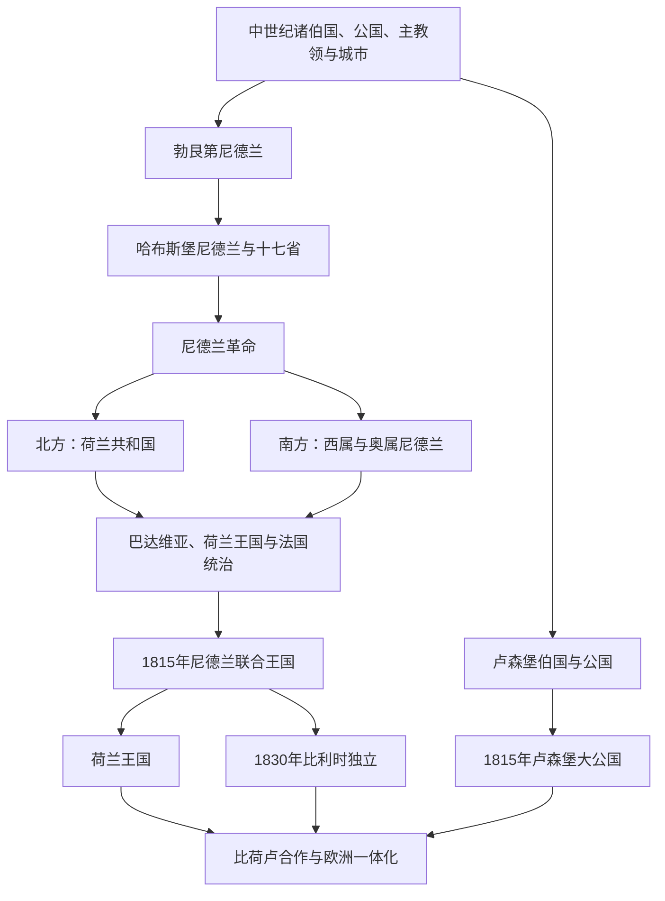

# 低地国家历史

[返回欧洲历史](/%E4%BA%BA%E6%96%87%E7%A7%91%E5%AD%A6/%E5%8E%86%E5%8F%B2/%E6%AC%A7%E6%B4%B2/README.md)

## 范围与概括

低地国家位于莱茵河、马斯河和斯海尔德河下游及北海沿岸，历史上包括众多伯国、公国、主教领和城市。勃艮第公国、哈布斯堡统治、尼德兰革命、海上贸易、工业化和欧洲一体化共同塑造荷兰、比利时与卢森堡。现代三国的形成不能倒推为中世纪以来固定不变的边界。

## 演进图

## 国家入口

| 国家 | 入口 | 历史主线 |
|---|---|---|
| 荷兰 | [荷兰](/%E4%BA%BA%E6%96%87%E7%A7%91%E5%AD%A6/%E5%8E%86%E5%8F%B2/%E6%AC%A7%E6%B4%B2/%E4%BD%8E%E5%9C%B0%E5%9B%BD%E5%AE%B6/%E8%8D%B7%E5%85%B0.md) | 尼德兰革命、荷兰共和国、海洋帝国、王国、占领与战后重建。 |
| 比利时 | [比利时](/%E4%BA%BA%E6%96%87%E7%A7%91%E5%AD%A6/%E5%8E%86%E5%8F%B2/%E6%AC%A7%E6%B4%B2/%E4%BD%8E%E5%9C%B0%E5%9B%BD%E5%AE%B6/%E6%AF%94%E5%88%A9%E6%97%B6.md) | 南尼德兰、1830年革命、工业化、殖民、世界大战与联邦化。 |
| 卢森堡 | [卢森堡](/%E4%BA%BA%E6%96%87%E7%A7%91%E5%AD%A6/%E5%8E%86%E5%8F%B2/%E6%AC%A7%E6%B4%B2/%E4%BD%8E%E5%9C%B0%E5%9B%BD%E5%AE%B6/%E5%8D%A2%E6%A3%AE%E5%A0%A1.md) | 伯国与公国、1815年大公国、1839年分割、独立与欧洲合作。 |

## 共同主线

- 北海港口、河运、城市自治、手工业和金融使低地国家长期处于欧洲商业网络核心。
- 宗教改革和哈布斯堡集权冲突推动尼德兰革命，但地区、阶层和宗教选择并不一致。
- 荷兰共和国以联省体制、商业金融和海外公司著称；南尼德兰则继续经历西班牙和奥地利哈布斯堡统治。
- 1815年的尼德兰联合王国试图整合北南两地，1830年比利时革命使其分裂。
- 三国在20世纪遭受德国占领，战后通过比荷卢合作、北约和欧洲一体化重新定位。

## 关键辨析

- 历史上的“尼德兰”范围大于现代荷兰，不能把所有低地国家史都写成荷兰国家史。
- 荷兰共和国不是现代中央集权共和国，而是各省和城市权力显著的联邦式政治共同体。
- 比利时的语言与地区分化具有长期历史，但现代联邦制度主要在20世纪后期形成。
- 卢森堡曾与尼德兰君主保持共主关系，却逐步形成独立大公国。

## 相关入口

- [法国](/%E4%BA%BA%E6%96%87%E7%A7%91%E5%AD%A6/%E5%8E%86%E5%8F%B2/%E6%AC%A7%E6%B4%B2/%E6%B3%95%E5%9B%BD/README.md)
- [德意志](/%E4%BA%BA%E6%96%87%E7%A7%91%E5%AD%A6/%E5%8E%86%E5%8F%B2/%E6%AC%A7%E6%B4%B2/%E5%BE%B7%E6%84%8F%E5%BF%97/README.md)
- [不列颠群岛](/%E4%BA%BA%E6%96%87%E7%A7%91%E5%AD%A6/%E5%8E%86%E5%8F%B2/%E6%AC%A7%E6%B4%B2/%E4%B8%8D%E5%88%97%E9%A2%A0%E7%BE%A4%E5%B2%9B/README.md)
