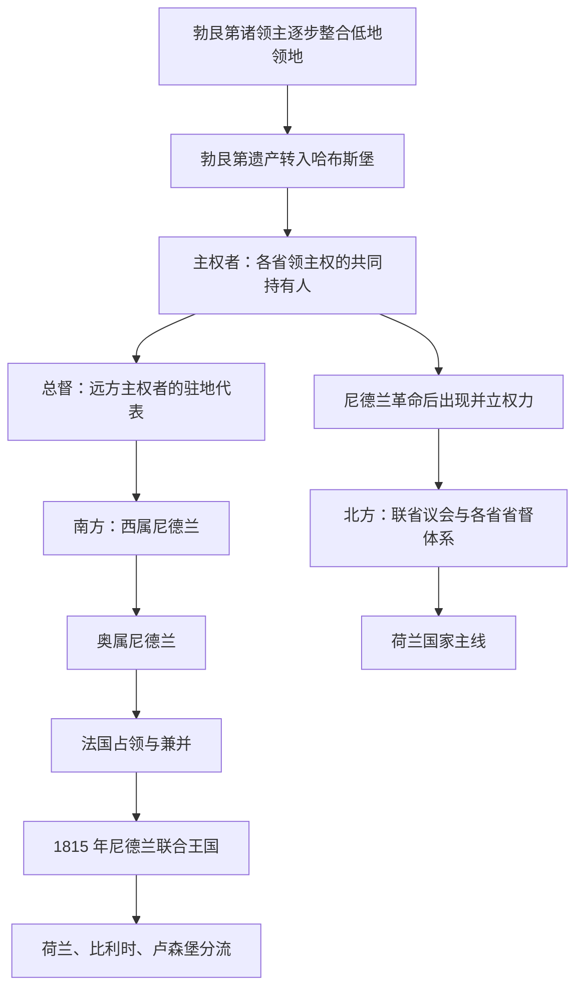

# 勃艮第与哈布斯堡尼德兰统治者和总督表

## 时间

约 1384—1794 年；其中 1581 年后北方反叛省份与哈布斯堡主权线逐步分离，1648 年后本表的哈布斯堡部分只适用于南尼德兰。

## 概括

这份专表把低地国家共同阶段的三种权力分开：握有各省领主权的勃艮第公爵或哈布斯堡君主、代表远方君主驻布鲁塞尔治理的总督，以及尼德兰革命中由反叛省份另行建立的并立机关。总督并非近代殖民地总督，省督也不是全国君主；同一时期还可能同时存在合法性互不承认的两套权力。

## 名称与权力边界

| 身份 | 权力来源 | 适用范围 | 不能混同之处 |
|---|---|---|---|
| 共同领地的主权者 | 继承、婚姻、购买、征服及各省分别承认的领主权 | 勃艮第公爵、哈布斯堡君主或 1598—1621 年共治大公夫妇 | 他们拥有的是一组法理与制度各异的省份，不是从一开始就统治单一“尼德兰国家” |
| 总督（Governor-General） | 由主权者委任，在主权者缺席时主持中央委员会、军政和对省份协商 | 勃艮第—哈布斯堡共同领地或后来的南尼德兰 | 不等于北方共和国的省督，也不等于现代首相 |
| 省督 | 各省的君主代表；革命后由反叛省份继续任命 | 荷兰、泽兰、弗里斯兰等单个省份，可由一人兼任多省 | 1747 年前没有统一、世袭的全国总省督；完整北方序列见荷兰主笔记 |
| 省议会与联省议会 | 城市、贵族和省级政治团体的授权 | 反叛省份及后来的联省共和国 | 共和国主权不属于省督个人，联省议会也不是现代直选总统 |
| 全权大臣与中央委员会 | 维也纳或马德里派遣并授权 | 尤其是奥属尼德兰日常行政 | 名义总督可能是皇族且长期不在场，实际日常权力会落在全权大臣和委员会 |

## 勃艮第—哈布斯堡共同领地主权者

下表按共同领地的主要继承线排列。各伯国、公国加入时间不同，表中年代表示统治家族的共同主线，不表示每一行人物从首年起就拥有后来“十七省”的全部领地。

| 顺序 | 主权者 | 统治时间 | 王室与继承关系 | 统治范围、关键事件与备注 |
|---:|---|---|---|---|
| 1 | **“大胆者”腓力与佛兰德的玛格丽特三世** | 1384—1404/1405 年 | 瓦卢瓦—勃艮第；玛格丽特继承佛兰德、阿图瓦等地 | 以婚姻继承建立勃艮第低地领地的基础；两人去世年份不同，故写作 1404/1405 |
| 2 | “无畏者”约翰 | 1404/1405—1419 年 | 前者之子 | 继承勃艮第与佛兰德等权利；卷入法国阿马尼亚克—勃艮第内战，遇刺身亡 |
| 3 | **“善良者”腓力** | 1419—1467 年 | 约翰之子 | 购买那慕尔，继承布拉班特、林堡，取得荷兰、泽兰、埃诺，并于 1443 年控制卢森堡；建立共同财政和宫廷机构 |
| 4 | “大胆者”查理 | 1467—1477 年 | 腓力之子 | 企图把分散领地连成更集中政体；兼并海尔德，1477 年在南锡战死，引发继承危机 |
| 5 | **勃艮第的玛丽** | 1477—1482 年 | 查理之女 | 以《大特权》换取省份支持；与哈布斯堡的马克西米连结婚，法国同时夺取勃艮第本土等领地 |
| 6 | 美男子腓力 | 1482—1506 年 | 玛丽之子，哈布斯堡家族 | 未成年初期由父亲马克西米连摄政；省份抵制集权，1493 年后腓力亲政 |
| 7 | **查理五世** | 1506—1555 年 | 腓力之子 | 先后取得弗里斯兰、乌得勒支、上艾瑟尔、格罗宁根、德伦特、海尔德等地；1549 年《国事诏书》安排共同继承，1555 年把尼德兰领主权交给其子 |
| 8 | 腓力二世 | 1555—1598 年 | 查理五世之子，西班牙哈布斯堡 | 远距离统治、宗教镇压和战争财政引发革命；北方反叛省份 1581 年否定其统治权，但南方继续承认 |
| 9 | **阿尔布雷希特七世与伊莎贝拉·克拉拉·欧亨尼娅** | 1598—1621 年 | 腓力二世之女与女婿，共同主权者 | 以婚姻赠与取得南尼德兰，在布鲁塞尔亲自治理；无嗣触发归还条款，阿尔布雷希特死后主权回到西班牙王室 |
| 10 | 腓力四世 | 1621—1665 年 | 西班牙哈布斯堡；前者之侄 | 伊莎贝拉改任总督；1648 年正式承认荷兰共和国，南尼德兰继续受其统治 |
| 11 | 查理二世 | 1665—1700 年 | 腓力四世之子 | 法国扩张与连续战争削减南尼德兰边境领土；无嗣去世引发西班牙王位继承战争 |
| 12 | 腓力五世 | 1700—1706 年在南尼德兰实际获承认 | 西班牙波旁；查理二世遗嘱继承人 | 大同盟不承认其取得全部西班牙遗产；1706 年拉米伊战役后失去南尼德兰实际控制 |
| 过渡 | 英荷共管与奥地利哈布斯堡声索 | 1706—1714/1716 年 | 大同盟占领区；卡尔大公以“西班牙国王卡洛斯三世”名义声索 | 不是一条稳定君主世系；英荷军政共管、地方委员会和奥地利声索重叠，乌得勒支、拉施塔特及屏障条约逐步完成移交 |
| 13 | **查理六世** | 1714—1740 年 | 奥地利哈布斯堡；战争和约受让南尼德兰 | 通过维也纳中央机关、驻布鲁塞尔总督和全权大臣治理，荷兰共和国在屏障要塞享有驻军权 |
| 14 | **玛丽亚·特蕾西亚** | 1740—1780 年 | 查理六世之女 | 奥地利王位继承战争期间一度遭法军占领；战后推动财政、贸易和行政改革，同时保留省份特权框架 |
| 15 | 约瑟夫二世 | 1780—1790 年 | 玛丽亚·特蕾西亚之子 | 急速改革教会、司法和省级制度，引发 1787 年抵制及 1789 年布拉班特革命 |
| 并立 | 比利时合众国 | 1790 年 | 南尼德兰起义省份组成的邦联 | 否定约瑟夫二世统治，但内部法农派与冯克派分裂；同年底奥军恢复控制 |
| 16 | 利奥波德二世 | 1790—1792 年 | 约瑟夫二世之弟 | 以撤回部分改革和政治和解恢复哈布斯堡统治 |
| 17 | 弗朗茨二世 | 1792—1794 年实际统治；1797 年正式放弃 | 利奥波德二世之子 | 革命战争中两度失守；1794 年弗勒吕斯战役后法国控制全境，1795 年兼并，1797 年和约确认割让 |

## 哈布斯堡尼德兰总督完整序列

本表列统辖共同领地或南尼德兰的总督，不把各省省督混入。任命与实际到任有时相差数月，因此早期年代以通行年份为主；临时委员会、代理和总督长期缺席时的实际权力另在备注说明。

| 顺序 | 总督 / 代行机关 | 任期 | 代表的主权者 | 关键事件与实际权力 |
|---:|---|---|---|---|
| 1 | 拿骚的恩格尔贝特二世 | 1501—1504 年 | 美男子腓力及马克西米连 | 早期共同中央治理的最高代表之一 |
| 2 | 阿尔斯霍特侯爵威廉·德·克鲁瓦 | 1504—1507 年 | 马克西米连、后幼年查理 | 美男子腓力去世后的过渡与监护体系 |
| 3 | **奥地利的玛格丽特** | 1507—1515、1519—1530 年 | 查理五世 | 查理成年亲政使其 1515—1519 年一度离任；两次任内强化梅赫伦中央机构并调和省份、帝国和王朝利益 |
| 4 | **匈牙利的玛丽** | 1531—1555 年 | 查理五世 | 主持财政、战争动员和对法防务；执行弟弟的宗教与整合政策 |
| 5 | 萨伏依公爵埃马努埃莱·菲利贝托 | 1555—1559 年 | 查理五世、后腓力二世 | 完成权力交接并参与对法战争 |
| 6 | 帕尔马的玛格丽特 | 1559—1567 年 | 腓力二世 | 贵族请愿、宗教冲突和 1566 年破坏圣像运动期间执政；实际政策受格兰维尔和马德里制约 |
| 7 | **阿尔瓦公爵费尔南多·阿尔瓦雷斯·德·托莱多** | 1567—1573 年 | 腓力二世 | 以军队和“除暴委员会”镇压，推行新税；加速反抗军事化 |
| 8 | 路易斯·德·雷克森斯 | 1573—1576 年 | 腓力二世 | 尝试有限和解但财政崩溃；任内去世 |
| 代行 | 国务委员会 | 1576 年 3—11 月 | 名义上代表腓力二世 | 雷克森斯死后集体代行；西班牙军队劫掠安特卫普后，各省缔结《根特和约》 |
| 9 | 奥地利的唐胡安 | 1576—1578 年 | 腓力二世 | 接受《永久敕令》后又恢复战争；与反叛方另立的马蒂亚斯总督并存 |
| 10 | **帕尔马公爵亚历山德罗·法尔内塞** | 1578—1592 年 | 腓力二世 | 以军事、宗教和地方妥协重新控制南方；攻取安特卫普，奠定南北分裂 |
| 11 | 彼得·恩斯特·冯·曼斯费尔德 | 1592—1594 年 | 腓力二世 | 法尔内塞死后的临时总督 |
| 12 | 奥地利大公恩斯特 | 1594—1595 年 | 腓力二世 | 皇族总督，任内去世 |
| 13 | 富恩特斯伯爵佩德罗·恩里克斯·德·阿塞维多 | 1595—1596 年 | 腓力二世 | 临时主持军政 |
| 14 | 奥地利大公阿尔布雷希特 | 1596—1598 年 | 腓力二世 | 先任总督，1598 年起与伊莎贝拉成为南尼德兰共同主权者 |
| 直接亲政 | 阿尔布雷希特与伊莎贝拉 | 1598—1621 年 | 二人为共同主权者 | 居于布鲁塞尔亲政，故不另设代表二人的常任总督 |
| 15 | **伊莎贝拉·克拉拉·欧亨尼娅** | 1621—1633 年 | 腓力四世 | 丈夫死后不再是独立主权者，改以总督身份代表西班牙国王 |
| 16 | 枢机亲王斐迪南 | 1633/1634—1641 年 | 腓力四世 | 国王之弟；兼掌军政，在讷德林根战役后进入低地 |
| 17 | 弗朗西斯科·德·梅洛 | 1641—1644 年 | 腓力四世 | 战争财政恶化，1643 年罗克鲁瓦战败 |
| 18 | 卡斯特洛-罗德里戈侯爵曼努埃尔·德·莫拉 | 1644—1647 年 | 腓力四世 | 明斯特和谈前期的防务与财政 |
| 19 | 奥地利大公利奥波德·威廉 | 1647—1656 年 | 腓力四世 | 1648 年和约后继续对法作战；皇族宫廷也是重要艺术收藏中心 |
| 20 | 奥地利的唐胡安·何塞 | 1656—1659 年 | 腓力四世 | 国王私生子；法国战争末期主持军政 |
| 21 | 卡拉塞纳侯爵路易斯·德·贝纳维德斯 | 1659—1664 年 | 腓力四世 | 《比利牛斯和约》后整顿边防 |
| 22 | 卡斯特洛-罗德里戈侯爵弗朗西斯科·德·莫拉 | 1664—1668 年 | 腓力四世、查理二世 | 权力移交及法国遗产战争期间执政 |
| 23 | 弗里亚斯公爵伊尼戈·梅尔乔尔·德·贝拉斯科 | 1668—1670 年 | 查理二世 | 和约后的短期重整 |
| 24 | 蒙特雷伯爵胡安·多明戈·德·苏尼加 | 1670—1675 年 | 查理二世 | 法荷战争与要塞防务 |
| 25 | 比利亚埃尔莫萨公爵卡洛斯·德·阿拉贡 | 1675—1677 年 | 查理二世 | 西班牙军力薄弱，南尼德兰成为多国作战场 |
| 代行 | 中央委员会短期主持 | 1677—1678 年 | 查理二世 | 前后总督交替间由布鲁塞尔机关维持行政 |
| 26 | 帕尔马亲王亚历山德罗·法尔内塞 | 1678—1682 年 | 查理二世 | 与 16 世纪同名帕尔马公爵并非同一人 |
| 27 | 格拉纳侯爵奥托内·恩里科·德尔·卡雷托 | 1682—1685 年 | 查理二世 | 法国“重聚政策”压力下治理边境 |
| 28 | 加斯塔尼亚加侯爵弗朗西斯科·安东尼奥·德·阿古托 | 1685—1692 年 | 查理二世 | 奥格斯堡同盟战争初期 |
| 29 | 巴伐利亚选侯马克西米利安二世·埃马努埃尔 | 1692—1706 年 | 查理二世、后腓力五世 | 西班牙王位继承战争中支持波旁；1701—1704 年离境时由伊西德罗·德拉奎瓦代理 |
| 过渡 | 英荷共管、国务委员会与奥地利全权代表 | 1706—1716 年 | 卡尔大公 / 查理六世的声索及大同盟占领体系 | 拉米伊战役后没有稳定单一总督；军权、地方行政和国际条约安排重叠 |
| 30 | **萨伏依的欧根亲王** | 1716—1724 年 | 查理六世 | 名义总督长期不驻布鲁塞尔；普里耶侯爵作为全权大臣主持日常政务 |
| 31 | 维里希·菲利普·冯·道恩 | 1725 年 2—10 月 | 查理六世 | 欧根卸任与皇族总督到任间的临时总督 |
| 32 | 奥地利的玛丽亚·伊丽莎白 | 1725—1741 年 | 查理六世、后玛丽亚·特蕾西亚 | 常驻布鲁塞尔的皇族总督；全权大臣与中央委员会负责大量日常行政 |
| 33 | 弗里德里希·奥古斯特·冯·哈拉赫 | 1741—1744 年 | 玛丽亚·特蕾西亚 | 原全权大臣，在总督去世后临时代行 |
| 34 | 奥地利的玛丽亚·安娜与洛林的查理·亚历山大 | 1744 年 | 玛丽亚·特蕾西亚 | 共同受任；玛丽亚·安娜同年去世 |
| 35 | **洛林的查理·亚历山大** | 1744—1780 年 | 玛丽亚·特蕾西亚 | 继续任总督；1745—1749 年法国占领期间离境，战后返任，在本地声望较高 |
| 36 | 奥地利的玛丽亚·克里斯蒂娜与萨克森-泰申的阿尔贝特·卡西米尔 | 1781—1793 年 | 约瑟夫二世、利奥波德二世、弗朗茨二世 | 共同总督；1789 年革命和 1792 年法军进攻时先后离境，1791 年曾返布鲁塞尔；重大改革仍由维也纳决定 |
| 37 | 奥地利大公卡尔 | 1793—1794 年 | 弗朗茨二世 | 最后一任总督；法国在弗勒吕斯获胜后结束哈布斯堡实际统治 |

## 尼德兰革命中的并立权力

| 时段 | 反叛方领袖或机关 | 法理身份 | 与哈布斯堡总督线的关系 |
|---|---|---|---|
| 1572—1584 年 | **奥兰治的威廉** | 荷兰、泽兰等省省督及反抗联盟核心领袖 | 不是全国君主；与腓力二世委任总督公开对抗，1584 年遇刺 |
| 1577/1578—1581 年 | 奥地利大公马蒂亚斯 | 由反叛省份邀请的总督，威廉任其副手 / 实际主导者 | 与腓力二世任命的唐胡安、法尔内塞并立；权力有限，1581 年离任 |
| 1581/1582—1583 年 | 安茹公爵弗朗索瓦 | 依条约获部分反叛省份推为“自由的保护者”并取得若干领主称号 | 试图以法国王子建立替代君主制；1583 年“法国狂暴”失败后撤离 |
| 1583—1585 年 | 联省议会与各省机关 | 在寻找外国保护者期间集体维持主权事务 | 各省仍是权力基础，尚未形成稳定共和国中央行政 |
| 1585—1587 年 | 莱斯特伯爵罗伯特·达德利 | 英格兰援助体系下的总督-general | 与城市摄政集团冲突，离任后外国保护方案失败 |
| 1588 年起 | **联省议会、各省议会和省督并行** | 共和国复合主权结构 | 不设单一全国君主或总统；北方省督完整表见[荷兰](/%E4%BA%BA%E6%96%87%E7%A7%91%E5%AD%A6/%E5%8E%86%E5%8F%B2/%E6%AC%A7%E6%B4%B2/%E4%BD%8E%E5%9C%B0%E5%9B%BD%E5%AE%B6/%E8%8D%B7%E5%85%B0.md) |

## 法国统治与 1815 年重组

| 地区 | 1794/1795—1814 年权力结构 | 1814—1815 年转折 |
|---|---|---|
| 北方原共和国 | 先后为巴达维亚共和国、大议长政体、路易·波拿巴的荷兰王国和法国直接兼并区；每阶段的最高机关分表见[荷兰](/%E4%BA%BA%E6%96%87%E7%A7%91%E5%AD%A6/%E5%8E%86%E5%8F%B2/%E6%AC%A7%E6%B4%B2/%E4%BD%8E%E5%9C%B0%E5%9B%BD%E5%AE%B6/%E8%8D%B7%E5%85%B0.md) | 奥兰治的威廉·弗雷德里克 1813 年返国任主权亲王，1815 年称威廉一世 |
| 南尼德兰 | 法国直接兼并为若干省，最高主权和中央行政在巴黎；地方由省长、司法与税务机关治理，没有一位统一的“比利时总督” | 列强把南北尼德兰合为尼德兰联合王国；1830 年革命后形成[比利时](/%E4%BA%BA%E6%96%87%E7%A7%91%E5%AD%A6/%E5%8E%86%E5%8F%B2/%E6%AC%A7%E6%B4%B2/%E4%BD%8E%E5%9C%B0%E5%9B%BD%E5%AE%B6/%E6%AF%94%E5%88%A9%E6%97%B6.md)国家线 |
| 卢森堡 | 以“森林省”纳入法国行政，封建领主权和旧公国机关被重组 | 1815 年另建[卢森堡大公国](/%E4%BA%BA%E6%96%87%E7%A7%91%E5%AD%A6/%E5%8E%86%E5%8F%B2/%E6%AC%A7%E6%B4%B2/%E4%BD%8E%E5%9C%B0%E5%9B%BD%E5%AE%B6/%E5%8D%A2%E6%A3%AE%E5%A0%A1.md)，由威廉一世兼任大公并加入德意志邦联；它与联合王国共主而非简单成为荷兰一省 |

## 关键辨析

- “勃艮第尼德兰”是多个领地逐步汇集的结果，不能把 1384 年后的每一位公爵都写成拥有固定边界的尼德兰国王。
- 1555 年腓力二世承继的是各省领主权；总督在布鲁塞尔代行中央职能，但征税和法律仍须面对省份特权。
- 1598—1621 年阿尔布雷希特与伊莎贝拉是共同主权者，1621 年后伊莎贝拉才以总督身份代表腓力四世，两种身份不可合并。
- 1581 年《断绝法案》否定腓力二世后，哈布斯堡仍在南方和部分战区维持主权；北方独立的国际承认要到 1648 年。
- 奥属尼德兰的皇族总督常具有礼仪、协调和军政地位，但维也纳全权大臣、中央委员会和省级机构共同构成实际行政。
- 列日采邑主教领长期不属于勃艮第—哈布斯堡十七省的常规主权序列，1795 年法国重组前应单独理解。

## 演变关系

- 上级总览：[低地国家历史](/%E4%BA%BA%E6%96%87%E7%A7%91%E5%AD%A6/%E5%8E%86%E5%8F%B2/%E6%AC%A7%E6%B4%B2/%E4%BD%8E%E5%9C%B0%E5%9B%BD%E5%AE%B6/README.md)。
- 北方共和国、王国与殖民体系：[荷兰](/%E4%BA%BA%E6%96%87%E7%A7%91%E5%AD%A6/%E5%8E%86%E5%8F%B2/%E6%AC%A7%E6%B4%B2/%E4%BD%8E%E5%9C%B0%E5%9B%BD%E5%AE%B6/%E8%8D%B7%E5%85%B0.md)。
- 南尼德兰、独立王国与联邦化：[比利时](/%E4%BA%BA%E6%96%87%E7%A7%91%E5%AD%A6/%E5%8E%86%E5%8F%B2/%E6%AC%A7%E6%B4%B2/%E4%BD%8E%E5%9C%B0%E5%9B%BD%E5%AE%B6/%E6%AF%94%E5%88%A9%E6%97%B6.md)。
- 公国、大公国与共主关系：[卢森堡](/%E4%BA%BA%E6%96%87%E7%A7%91%E5%AD%A6/%E5%8E%86%E5%8F%B2/%E6%AC%A7%E6%B4%B2/%E4%BD%8E%E5%9C%B0%E5%9B%BD%E5%AE%B6/%E5%8D%A2%E6%A3%AE%E5%A0%A1.md)。
