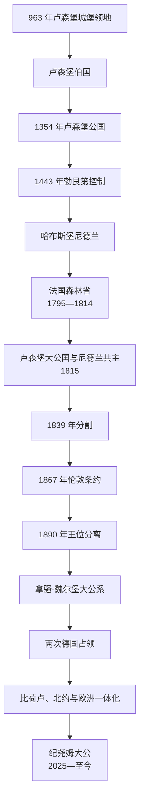

# 卢森堡

## 时间

约 963 年—至今；现代大公国始于 1815 年，现状核验截至 2026 年 7 月 14 日。

## 概括

卢森堡由阿尔泽特河谷的城堡领地发展为伯国、公国和欧洲战略要塞。中世纪卢森堡家族曾取得波希米亚王位并产生多位神圣罗马皇帝，但本地公国后来进入勃艮第—哈布斯堡尼德兰。1815 年维也纳会议建立卢森堡大公国，由尼德兰国王兼任大公，同时加入德意志邦联；这种共主关系不是把卢森堡简单并入荷兰。1839 年分割、1867 年伦敦条约和 1890 年王位分离逐步确定现代国家。两次世界大战的占领促使卢森堡放弃永久中立，战后依靠钢铁、金融、跨境劳动力和欧洲机构形成高度开放的小国经济。

## 前史与公国形成

- 963 年，阿登伯爵西格弗里德取得“卢西林布尔胡克”城堡及周边土地；城堡控制穿越阿尔泽特河谷的道路，名称逐渐扩展到伯国。
- 卢森堡家族依靠婚姻、战争和帝国政治扩张。亨利七世成为神圣罗马皇帝，其子约翰取得波希米亚王位；查理四世于 1354 年把卢森堡升为公国。
- 王朝重心移向波希米亚和帝国后，本地公国经债务、抵押和继承争端受外部家族控制。1443 年勃艮第公爵腓力三世占领卢森堡城，公国进入勃艮第尼德兰。
- 1477 年勃艮第大胆查理战死后，玛丽与哈布斯堡的马克西米连结婚，卢森堡随尼德兰遗产转入哈布斯堡体系。1555—1713 年大体由西班牙哈布斯堡支系统治，1713 年后转入奥地利哈布斯堡。
- 要塞位于法国、德意志和低地国家交通交界，17 世纪屡遭围攻。路易十四军队 1684 年占领后由沃邦改造防御，1697 年归还西班牙哈布斯堡。
- 法国革命军 1795 年兼并公国，设置“森林省”，废除封建制度并引入法国行政和法律；征兵、税收与宗教政策也引发抵抗。

## 大公国建立、分割与独立

### 1815 年安排

维也纳会议把卢森堡升为大公国，补偿奥兰治—拿骚家族失去的德意志领地。尼德兰国王威廉一世兼任大公，卢森堡同时成为德意志邦联成员，首都要塞驻有普鲁士军队。法律上它是独立大公国，实际却由威廉一世近似尼德兰省份管理，未建立独立中央行政。

### 1830—1839 年革命与分割

比利时革命爆发后，除由普鲁士驻军控制的首都要塞外，卢森堡多数地区支持革命并由比利时行政。列强在荷兰、比利时、德意志邦联和地方语言分布间妥协：

- 1839 年《伦敦条约》把面积较大、主要法语区的西部划给比利时，成为今日比利时卢森堡省。
- 以卢森堡城为核心的东部继续为大公国，并保持与尼德兰共主及德意志邦联成员身份。
- 分割不是民族边界的简单落实，而是军事要塞、列强均势、比利时独立和邦联领土补偿共同作用的结果。

### 1848—1890 年宪政与王位分离

- 1842 年卢森堡加入德意志关税同盟，钢铁和铁路逐渐接入德国市场。1848 年革命推动成文宪法、议会和责任政府萌芽；1856 年威廉三世曾以反动修宪强化君权，1868 年宪法又恢复较自由框架。
- 1866 年德意志邦联解体后，普鲁士驻军和大公国地位成为“卢森堡危机”。法国曾试图向威廉三世购买卢森堡，普鲁士舆论和俾斯麦反对。
- 1867 年第二次《伦敦条约》确认卢森堡永久中立、要求普鲁士撤军并拆除要塞；条约没有创造一个全新的国家，但消除了共主之外最重要的外国军事控制。
- 1890 年威廉三世去世，女儿威廉明娜继承尼德兰王位；卢森堡依据拿骚家族继承协定由男性旁支阿道夫继承。两国共主关系至此结束，拿骚—魏尔堡王朝建立独立大公序列。

## 完整大公序列

| 顺序 | 大公 | 在位 | 王室 / 与前任关系 | 关键事件与备注 |
|---:|---|---|---|---|
| 1 | 威廉一世 | 1815—1840 年 | 奥兰治—拿骚；大公国建立者 | 同时为尼德兰国王；1830 年革命后失去西部实际控制，1839 年接受分割 |
| 2 | 威廉二世 | 1840—1849 年 | 威廉一世之子 | 1848 年革命中接受宪法改革 |
| 3 | 威廉三世 | 1849—1890 年 | 威廉二世之子 | 1856 年反动修宪、1867 年危机与中立条约；无可继承卢森堡的男性后裔 |
| 4 | **阿道夫** | 1890—1905 年 | 拿骚—魏尔堡旁支 | 结束与尼德兰共主，建立本国大公王朝 |
| 5 | 威廉四世 | 1905—1912 年 | 阿道夫之子 | 因无子修改继承安排，使长女可继位；1908 年后由妻子玛丽亚·安娜摄政 |
| 6 | 玛丽-阿德莱德 | 1912—1919 年 | 威廉四世长女 | 1912 年成年前由母亲短期摄政；一战占领期政治立场引发争议，战后退位 |
| 7 | **夏洛特** | 1919—1964 年 | 玛丽-阿德莱德之妹 | 1919 年公投巩固王朝；二战流亡并成为抵抗象征，战后欧洲合作 |
| 8 | 让 | 1964—2000 年 | 夏洛特之子 | 经济从钢铁向金融和服务转型，欧洲共同体深化 |
| 9 | 亨利 | 2000—2025 年 10 月 3 日 | 让之子 | 现代宪政调整；2025 年主动退位 |
| 10 | **纪尧姆（威廉五世）** | 2025 年 10 月 3 日—至今 | 亨利之子 | 宣誓后继任国家元首；截至 2026 年 7 月 14 日在位 |

### 摄政与继承说明

| 人物 | 时间 | 身份与作用 |
|---|---|---|
| 玛丽亚·安娜大公夫人 | 1908—1912 年 | 威廉四世患病后摄政；玛丽-阿德莱德未成年初期继续摄政 |
| 让王储 | 1961—1964 年 | 被任命为大公代表，分担夏洛特的国家元首职务 |
| 纪尧姆王储 | 2024—2025 年 | 被任命为大公代表；2025 年正式继位，不能把代表期提前算作在位 |

## 政府首脑完整序列

1848 年以前，大公主要通过总督、行政委员会和尼德兰官员治理，没有可连续对应现代首相的职位。下表从宪政政府形成后列出全部部长会议主席、国务部长或首相；重复任期合并列示。

| 顺序 | 政府首脑 | 任期 | 主要阶段 |
|---:|---|---|---|
| 1 | 加斯帕尔-泰奥多尔-伊尼亚斯·德拉封丹 | 1848 年 | 首届宪政政府 |
| 2 | 让-雅克·维尔马尔 | 1848—1853 年 | 1848 年宪法初期 |
| 3 | 夏尔-马蒂亚斯·西蒙斯 | 1853—1860 年 | 1856 年保守修宪 |
| 4 | 维克托·德托纳科 | 1860—1867 年 | 关税同盟、铁路与卢森堡危机前期 |
| 5 | 埃马纽埃尔·塞尔韦 | 1867—1874 年 | 伦敦条约、要塞拆除和 1868 年宪法 |
| 6 | 费利克斯·德布洛豪森 | 1874—1885 年 | 工业化和铁路发展 |
| 7 | 爱德华·蒂尔热 | 1885—1888 年 | 王位分离前过渡 |
| 8 | **保罗·艾申** | 1888—1915 年 | 长期工业化、1890 年王位分离及一战初期 |
| 9 | 马蒂亚斯·蒙热纳 | 1915 年 | 艾申去世后的短期过渡 |
| 10 | 于贝尔·卢奇 | 1915—1916 年 | 占领期少数政府 |
| 11 | 维克托·托恩 | 1916—1917 年 | 占领期联合政府 |
| 12 | 莱昂·考夫曼 | 1917—1918 年 | 战争末期和宫廷争议 |
| 13 | 埃米尔·罗伊特 | 1918—1925 年 | 王朝危机、1919 年改革与比利时经济联盟 |
| 14 | 皮埃尔·普吕姆 | 1925—1926 年 | 右翼少数联盟 |
| 15 | **约瑟夫·贝希** | 1926—1937 年；1953—1958 年；1959 年短期代行 | 战间期、欧洲煤钢共同体和战后欧洲整合 |
| 16 | **皮埃尔·杜蓬** | 1937—1953 年 | 二战流亡政府、解放和战后重建 |
| 17 | 皮埃尔·弗里登 | 1958—1959 年 | 短期战后政府；任内去世 |
| 18 | **皮埃尔·维尔纳** | 1959—1974 年；1979—1984 年 | 金融中心成长、欧洲货币联盟构想 |
| 19 | 加斯东·托恩 | 1974—1979 年 | 自由—社会党联合政府 |
| 20 | 雅克·桑特 | 1984—1995 年 | 单一欧洲市场与欧盟深化 |
| 21 | **让-克洛德·容克** | 1995—2013 年 | 欧元、金融危机和长期联合政府 |
| 22 | 泽维尔·贝泰尔 | 2013—2023 年 | 联盟轮替、社会改革与欧洲事务 |
| 23 | **吕克·弗里登** | 2023 年 11 月 17 日—至今 | 基督教社会人民党—民主党联盟；截至 2026 年 7 月 14 日在任 |

## 统治结构

| 层级 | 产生方式 | 实际作用 |
|---|---|---|
| 大公 | 世袭国家元首 | 公布法律、任命政府并承担代表职能；现代实践须由政府副署并受宪法约束 |
| 首相与政府 | 依据众议院多数形成 | 制定政策、管理行政并对议会负责 |
| 众议院 | 比例代表选举 | 立法、预算和监督政府；单院制 |
| 国务委员会 | 任命的咨询机构 | 对法案和规章提供法律意见，不能等同第二议院 |
| 地方市镇 | 民选地方机构 | 管理地方事务；国家面积小但市镇自治仍重要 |
| 欧盟与跨境治理 | 欧盟机构、比荷卢及大区合作 | 经济、金融、交通和劳动力政策深受跨境规则影响 |

## 工业、战争与现代国家

### 钢铁工业与社会转型

19 世纪后期洛林铁矿、铁路和关税同盟市场推动南部钢铁工业；1911 年阿贝德公司成立。工业需要德国、意大利及周边移民，改变人口和语言结构。1921 年卢森堡—比利时经济联盟在退出德国关税体系后重建货币和贸易联系。

### 两次世界大战

- 1914 年德国违反中立进入卢森堡，但保留本地政府和大公机构；铁路、工业和物资受德军控制。玛丽-阿德莱德与占领当局接触及国内党争，使王朝在战后陷入合法性危机。
- 1919 年玛丽-阿德莱德退位，夏洛特继位；公投确认继续君主制和经济上靠近比利时。
- 1940 年德国再次入侵。大公与政府流亡，纳粹民政长官古斯塔夫·西蒙推动事实吞并、德意志化、征兵和迫害犹太人；1942 年反征兵罢工遭处决和镇压。
- 流亡政府与盟军合作，夏洛特通过广播维持国家象征。1944 年大部解放，北部又在突出部战役中遭严重破坏。

### 战后欧洲与经济转型

- 卢森堡放弃传统永久中立，1949 年加入北约；它是比荷卢、欧洲煤钢共同体、欧洲经济共同体和欧盟的创始参与者。
- 欧洲法院、欧洲投资银行及欧盟机构部分部门设在卢森堡，使国家行政和城市经济具有跨国功能。
- 1970 年代钢铁危机后，政府、工会和企业以“三方协商”管理产业收缩；金融、投资基金、卫星通信和专业服务成为新支柱。
- 经济依赖每日跨境通勤者和高比例移民人口；住房、交通、税收协调和语言教育成为现代治理重点。
- 卢森堡没有建立正式殖民帝国，但本国企业、传教组织和个人曾参与比利时刚果等殖民体系；这类联系不能写成卢森堡拥有殖民地。

## 重要事件

| 时间 | 事件 | 影响 |
|---|---|---|
| 963 年 | 西格弗里德取得城堡 | 卢森堡领地与名称起点 |
| 1354 年 | 伯国升为公国 | 王朝地位和帝国等级提高 |
| 1443 年 | 勃艮第占领卢森堡城 | 公国并入勃艮第尼德兰 |
| 1795 年 | 法国兼并并设森林省 | 废封建、行政法制法国化 |
| 1815 年 | 维也纳会议建立大公国 | 与尼德兰共主并加入德意志邦联 |
| 1830—1839 年 | 比利时革命与分割 | 西部成为比利时卢森堡省，现代边界形成 |
| 1848 年 | 宪法与议会政府 | 宪政国家起步 |
| 1867 年 | 卢森堡危机与伦敦条约 | 普军撤离、要塞拆除并确认中立 |
| 1890 年 | 王位继承分离 | 奥兰治—拿骚共主结束 |
| 1914—1918 年 | 第一次德国占领 | 中立受破坏，王朝和经济承压 |
| 1919 年 | 退位与双重公投 | 夏洛特继位，君主制获确认 |
| 1921 年 | 比卢经济联盟 | 贸易和货币联系转向比利时 |
| 1940—1944 年 | 纳粹占领与事实吞并 | 德意志化、迫害、强制征兵和抵抗 |
| 1951—1957 年 | 欧洲共同体创建 | 卢森堡成为欧洲一体化核心小国 |
| 1970 年代 | 钢铁危机 | 推动三方协商和经济多元化 |
| 1999—2002 年 | 欧元建立 | 强化金融和欧洲中心地位 |
| 2025 年 | 纪尧姆继位 | 完成当代王位交接 |

## 国家形成与分离原因

- **地缘结构**：要塞位于法德交通走廊，长期被勃艮第、哈布斯堡、法国、尼德兰和普鲁士争夺；小国地位来自列强妥协，而非孤立发展。
- **1839 年分割**：比利时革命的实际控制、德意志邦联对成员领地的要求、首都要塞的战略价值和语言区域大致分布共同决定边界。
- **1890 年分离**：尼德兰允许女性继承，卢森堡适用拿骚家族继承协定；同一君主死亡触发不同继承规则，不是民族起义。
- **国家延续条件**：1867 年国际保证、独立王朝、宪政议会、钢铁财政和灵活外交共同巩固主权。
- **中立终结**：两次德国入侵证明条约中立不足以保障安全，战后转向集体防务和欧洲制度。
- **现代压力**：经济高度开放带来财富，也产生住房成本、跨境基础设施和国际税制调整等脆弱性。

## 演变关系

- 共同统治者与总督专表：[勃艮第与哈布斯堡尼德兰统治者和总督表](/%E4%BA%BA%E6%96%87%E7%A7%91%E5%AD%A6/%E5%8E%86%E5%8F%B2/%E6%AC%A7%E6%B4%B2/%E4%BD%8E%E5%9C%B0%E5%9B%BD%E5%AE%B6/%E5%8B%83%E8%89%AE%E7%AC%AC%E4%B8%8E%E5%93%88%E5%B8%83%E6%96%AF%E5%A0%A1%E5%B0%BC%E5%BE%B7%E5%85%B0%E7%BB%9F%E6%B2%BB%E8%80%85%E5%92%8C%E6%80%BB%E7%9D%A3%E8%A1%A8.md)。
- 上级总览：[低地国家历史](/%E4%BA%BA%E6%96%87%E7%A7%91%E5%AD%A6/%E5%8E%86%E5%8F%B2/%E6%AC%A7%E6%B4%B2/%E4%BD%8E%E5%9C%B0%E5%9B%BD%E5%AE%B6/README.md)。
- 同一区域：[荷兰](/%E4%BA%BA%E6%96%87%E7%A7%91%E5%AD%A6/%E5%8E%86%E5%8F%B2/%E6%AC%A7%E6%B4%B2/%E4%BD%8E%E5%9C%B0%E5%9B%BD%E5%AE%B6/%E8%8D%B7%E5%85%B0.md)、[比利时](/%E4%BA%BA%E6%96%87%E7%A7%91%E5%AD%A6/%E5%8E%86%E5%8F%B2/%E6%AC%A7%E6%B4%B2/%E4%BD%8E%E5%9C%B0%E5%9B%BD%E5%AE%B6/%E6%AF%94%E5%88%A9%E6%97%B6.md)。
- 帝国背景：[哈布斯堡君主国](/%E4%BA%BA%E6%96%87%E7%A7%91%E5%AD%A6/%E5%8E%86%E5%8F%B2/%E6%AC%A7%E6%B4%B2/%E5%BE%B7%E6%84%8F%E5%BF%97/%E5%A5%A5%E5%9C%B0%E5%88%A9/%E5%93%88%E5%B8%83%E6%96%AF%E5%A0%A1%E5%90%9B%E4%B8%BB%E5%9B%BD.md)。
- 1815—1866 年邦联关系：[德意志邦联](/%E4%BA%BA%E6%96%87%E7%A7%91%E5%AD%A6/%E5%8E%86%E5%8F%B2/%E6%AC%A7%E6%B4%B2/%E5%BE%B7%E6%84%8F%E5%BF%97/%E5%BE%B7%E6%84%8F%E5%BF%97%E9%82%A6%E8%81%94.md)。
