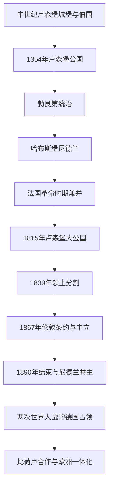

# 卢森堡

## 概括

卢森堡从中世纪城堡领地发展为伯国和公国，先后进入勃艮第与哈布斯堡尼德兰体系。1815年维也纳会议建立卢森堡大公国，并与尼德兰保持共主关系；1839年分割、1867年伦敦条约和1890年共主关系终止逐步确立现代国家。

## 演变关系

## 统治结构与政治阶段

| 阶段 | 时间 | 统治结构 |
|---|---|---|
| 伯国与公国 | 10世纪—15世纪 | 封建领地逐步升格，卢森堡王朝一度在神圣罗马帝国拥有广泛影响。 |
| 勃艮第—哈布斯堡时期 | 15世纪—1795年 | 作为低地国家南部领地的一部分，由勃艮第及哈布斯堡君主统治。 |
| 大公国与共主 | 1815—1890年 | 大公国加入德意志邦联，并由尼德兰国王兼任大公；1839年领土分割。 |
| 独立大公国 | 1890年至今 | 世袭君主立宪制，与尼德兰的共主关系结束。 |
| 战后欧洲国家 | 1945年至今 | 参与比荷卢、北约、欧洲煤钢共同体及欧洲联盟建设。 |

## 重要事件

- 1354年卢森堡伯国升格为公国，卢森堡王朝曾产生多位神圣罗马帝国皇帝。
- 1815年维也纳会议建立卢森堡大公国，同时形成与尼德兰的共主关系。
- 1839年卢森堡西部划入比利时，现代大公国的主要边界由此形成。
- 1867年伦敦条约确认卢森堡永久中立，并推动要塞拆除。
- 1890年尼德兰王位继承变化使两国共主关系结束。
- 两次世界大战中卢森堡遭德国占领，战后放弃传统中立并积极参与欧洲合作。

## 关键辨析

- 1815年后的卢森堡并非荷兰的一部分，而是与尼德兰国王保持共主关系的独立大公国和德意志邦联成员。
- 1839年以前的历史卢森堡范围大于现代大公国。
- 卢森堡的小国地位不等于历史边缘性，其要塞、王朝和欧洲机构具有跨区域意义。

## 上级

- [低地国家](/%E4%BA%BA%E6%96%87%E7%A7%91%E5%AD%A6/%E5%8E%86%E5%8F%B2/%E6%AC%A7%E6%B4%B2/%E4%BD%8E%E5%9C%B0%E5%9B%BD%E5%AE%B6/README.md)
