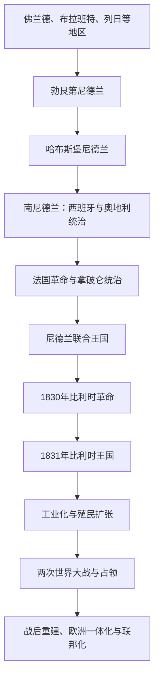

# 比利时

## 概括

现代比利时形成于1830年革命，但其历史背景包括中世纪佛兰德、布拉班特、列日等地区，勃艮第—哈布斯堡尼德兰、西属与奥属尼德兰、法国统治和尼德兰联合王国。独立后的工业化、殖民统治、两次世界大战和联邦化塑造现代国家。

## 演变关系

## 统治结构与政治阶段

| 阶段 | 时间 | 统治结构 |
|---|---|---|
| 南尼德兰 | 16世纪末—1795年 | 先后处于西班牙和奥地利哈布斯堡君主统治，地方省份与城市保留传统权利。 |
| 法国与联合王国时期 | 1795—1830年 | 法国行政整合后并入尼德兰联合王国。 |
| 单一制王国 | 1831年—20世纪后期 | 世袭君主立宪制，议会制度逐步民主化。 |
| 联邦国家 | 20世纪后期至今 | 佛兰德、瓦隆和布鲁塞尔等地区及语言社群分享权力；1993年宪法确认联邦结构。 |

## 重要事件

- 1830年革命源于宗教、语言、政治代表和经济利益等多重矛盾，1831年建立君主立宪国家。
- 比利时较早实现大陆工业化，煤炭、钢铁、铁路和城市工人社会迅速发展。
- 1885—1908年刚果自由邦由利奥波德二世个人控制，发生严重强迫劳动与暴力；1908年转为比利时殖民地，1960年刚果独立。
- 第一次和第二次世界大战期间，比利时均遭德国入侵和占领。
- 战后语言、经济和地区矛盾推动多轮国家改革，比利时逐渐转为联邦国家。
- 布鲁塞尔成为比利时首都，也是欧洲联盟和北约重要机构所在地。

## 关键辨析

- 比利时不是单纯由“法国文化”和“荷兰文化”拼合而成；各地区具有共同低地国家历史和不同地方传统。
- 佛兰德与瓦隆的现代政治分化不能直接倒推到中世纪固定民族边界。
- 殖民时期的经济收益与刚果的强制劳动、资源掠夺和暴力密切相关。

## 上级

- [低地国家](/%E4%BA%BA%E6%96%87%E7%A7%91%E5%AD%A6/%E5%8E%86%E5%8F%B2/%E6%AC%A7%E6%B4%B2/%E4%BD%8E%E5%9C%B0%E5%9B%BD%E5%AE%B6/README.md)
- [非洲中非历史](/%E4%BA%BA%E6%96%87%E7%A7%91%E5%AD%A6/%E5%8E%86%E5%8F%B2/%E9%9D%9E%E6%B4%B2/%E4%B8%AD%E9%9D%9E/README.md)
